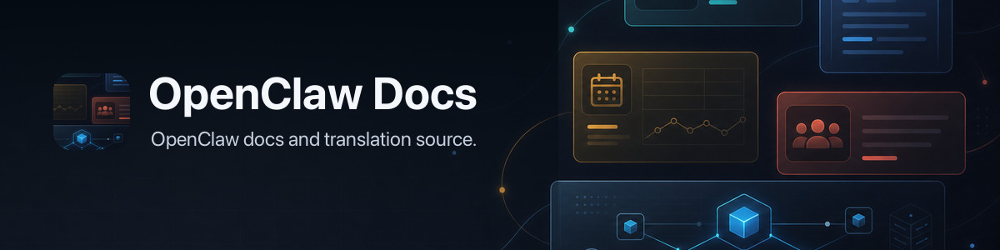

# openclaw-docs

Mirror repo for the published OpenClaw docs site.

Source of truth lives in [`openclaw/openclaw`](https://github.com/openclaw/openclaw), under `docs/`.

## How it works

1. English docs are authored in `openclaw/openclaw`.
2. `openclaw/openclaw/.github/workflows/docs-sync-publish.yml` mirrors the docs tree into this repo.
3. This repo stores the published docs tree plus generated locale output.
4. `openclaw/docs/.github/workflows/translate-incremental.yml` debounces normal docs changes, while `translate-all.yml` handles full reconciliation for glossary changes, weekly schedule, release dispatch, or manual dispatch.
5. `.github/workflows/r2-pages.yml` builds the full unpruned static site and uploads changed objects to Cloudflare R2.
6. `.github/workflows/pages.yml` deploys the small Cloudflare Worker router that preserves clean URLs and markdown negotiation while reading docs from R2.

## Translation behavior

- Locale pages under `docs/<locale>/**` are generated output.
- Each translated page stores `x-i18n.source_hash`.
- The translate workflow computes a pending file list before calling the model.
- If no English source hashes changed, the workflow skips the expensive translation step entirely.
- If files changed, only the pending files are translated.
- The workflow retries transient model-format failures.
- Locale outputs are uploaded as artifacts first, then committed together by the finalizer.
- Incremental and full translation use separate concurrency lanes, so small docs edits do not cancel weekly or glossary-triggered full reconciliation.
- The weekly scheduled run uses full reconciliation mode to repair missed or flaky locale updates.

## Editing rules

- Do not treat this repo as the primary place for English doc edits.
- Make English doc changes in `openclaw/openclaw`, then let sync copy them here.
- Locale pages under `docs/<locale>/**` are generated output.
- `.openclaw-sync/source.json` records which `openclaw/openclaw` commit this mirror was synced from.

## Static site build

- `npm run docs:build` renders the mirrored Mintlify-flavored docs into `dist/docs-site`.
- `npm run docs:build:cloudflare` is the legacy Worker Static Assets fallback build.
- `npm run docs:build:r2` renders the full unpruned site and prepares `dist/docs-r2-manifest.json` for R2 upload.
- `npm run docs:r2:upload` uploads only changed R2 objects, reports cache hits/misses, and refuses to turn a broken remote manifest read into a full-tree reupload.
- Manual R2 refreshes audit objects before upload; unchanged objects remain cache hits, and transient HEAD failures fall back to the signed manifest. `R2_UPLOAD_PUT_ALL=1` is the emergency escape hatch for intentionally rewriting every object.
- `npm run docs:smoke` checks representative English and locale pages plus the Pagefind search bundle.
- `npm run docs:check` runs both steps.
- The generated site includes the language picker and static full-text search via Pagefind.
- Cloudflare deploys `workers/docs-router.ts`, which serves slashless page URLs, English markdown responses for `.md` paths or `Accept: text/markdown`, and `/api/search` through the `DOCS_BUCKET` R2 binding.
- Cloudflare hosting details and limitations are documented in `CLOUDFLARE.md`.

## Secrets

- `OPENCLAW_DOCS_SYNC_TOKEN` lives in `openclaw/openclaw` and lets the source repo push into this repo.
- `OPENCLAW_DOCS_I18N_OPENAI_API_KEY` lives in this repo and powers locale translation refreshes.
- `CLOUDFLARE_API_TOKEN` lives in this repo and deploys the `docs.openclaw.ai` router.
- R2 uploads verify `CLOUDFLARE_API_TOKEN`, try temporary R2 credentials, and normally fall back to the token-derived direct S3 credential form. `OPENCLAW_R2_ACCESS_KEY_ID` / `OPENCLAW_R2_SECRET_ACCESS_KEY` are only fallback upload credentials when the Cloudflare token cannot be verified.
