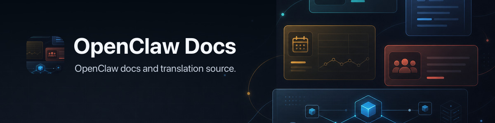

# openclaw-docs

<!-- Keep README-owned media outside docs/**; docs/** is mirror output and sync prunes files absent from upstream source. -->

Website UI, translations, and publishing for the OpenClaw docs site.

English content and navigation are authored in [`openclaw/openclaw`](https://github.com/openclaw/openclaw), under `docs/`, and synced here. This repository owns the current website renderer, design, search, and hosting.

## How it works

1. English docs are authored in `openclaw/openclaw`.
2. `openclaw/openclaw/.github/workflows/docs-sync-publish.yml` mirrors the docs tree into this repo.
3. This repo maintains the website UI and stores the synced docs tree plus generated locale output.
4. `openclaw/docs/.github/workflows/translate-incremental.yml` debounces normal docs changes, while `translate-all.yml` handles full reconciliation for glossary changes, weekly schedule, release dispatch, or manual dispatch.
5. `.github/workflows/r2-pages.yml` builds the full unpruned static site and uploads changed objects to Cloudflare R2.
6. `.github/workflows/pages.yml` deploys the small Cloudflare Worker router that preserves clean URLs and markdown negotiation while reading docs from R2.

## Translation behavior

- Locale pages under `docs/<locale>/**` are generated output.
- Each translated page stores `x-i18n.source_hash`.
- The translate workflow computes a pending file list before calling the model.
- If no English source hashes changed, the workflow skips the expensive translation step entirely.
- If files changed, only the pending files are translated.
- The workflow retries transient model-format failures.
- Locale outputs are uploaded as artifacts first, then committed together by the finalizer.
- Incremental and full translation use separate concurrency lanes, so small docs edits do not cancel weekly or glossary-triggered full reconciliation.
- The weekly scheduled run uses full reconciliation mode to repair missed or flaky locale updates.

## Editing rules

- Change the website UI, renderer, search, and hosting in this repo.
- Do not treat this repo as the primary place for English doc edits.
- Make English doc changes in `openclaw/openclaw`, then let sync copy them here.
- Locale pages under `docs/<locale>/**` are generated output.
- `.openclaw-sync/source.json` records which `openclaw/openclaw` commit this mirror was synced from.

## Static site build

- `scripts/docs-site/site-layout.css` adapts the community site's compact network header, ruled frame, connected panels, and footer to documentation. The full source section tree is available in the left sidebar, with native expandable groups. The landing page has a search-led hero and a 1060px two-column frame; articles retain a wider reading lane and TOC. `hero-art.mjs` owns the shared ASCII artwork with reduced-motion and route cleanup. Shared semantic tokens and component foundations remain in `site-css.mjs`; structural panels are square, while controls retain rounded corners.
- `npm run docs:build` renders the synced Markdown and MDX-style docs into `dist/docs-site`.
- English collection excludes top-level roots owned by published locales; each locale renders its own sources once, while nested or unrecognized directory names remain ordinary English paths.
- Search titles and summaries and LLM corpus headings follow the page renderer's YAML frontmatter rules. The English corpus excludes language directories at the docs root while retaining nested paths such as `guide/fr/topic`.
- Page-specific social preview images follow English navigation groups at every nesting depth.
- `npm run docs:build:r2` renders the full unpruned site and prepares `dist/docs-r2-manifest.json` for R2 upload.
- `npm run docs:r2:upload` uploads only changed R2 objects, reports cache hits/misses, and refuses to turn a broken remote manifest read into a full-tree reupload.
- Manual R2 refreshes audit objects before upload; unchanged objects remain cache hits, and transient HEAD failures fall back to the signed manifest. `R2_UPLOAD_PUT_ALL=1` is the emergency escape hatch for intentionally rewriting every object.
- `npm run docs:smoke` checks representative English and locale pages plus the Pagefind search bundle.
- `npm run docs:check` runs both steps.
- Source indexing writes completion metadata and reports success only after the output stream finishes and its file closes successfully; write or close errors fail the build before those completion signals.
- The generated site includes the language picker and static full-text search via Pagefind.
- Navigation groups can nest recursively; sidebar links, section metadata, and desktop/mobile tab targets resolve to descendant pages at every depth.
- Cloudflare deploys `workers/docs-router.ts`, which serves slashless page URLs, English markdown responses for `.md` paths or `Accept: text/markdown`, and `/api/search` through the `DOCS_BUCKET` R2 binding.
- Cloudflare hosting details and limitations are documented in `CLOUDFLARE.md`.

Signed R2 requests default to a 30-second per-request timeout. A stalled request
enters the existing retry loop. Set `R2_UPLOAD_FETCH_TIMEOUT_MS` to an integer
from 1 to 2147483647 milliseconds to raise that budget. The workflow job timeout
remains an outer limit.

## Local checks

CI uses Node 26. Install the locked dependencies with `npm ci`, then run
`npm test` for the renderer and Worker checks and `npm run test:i18n` for the
translation control plane. The lockfile includes the MDX checker and its `tsx`
loader; translation tests need no separate dependency install.

Translation checks exclude leading YAML frontmatter from MDX parsing while
preserving body validation and the original offsets needed for markup repairs.

Docs Code CI restores the production article and OG caches before its full shell
build. Each entry still validates its renderer, dependency and content identity;
a missing or stale cache renders normally. The complete build, smoke and visual
checks run in either case.

## Secrets

- `OPENCLAW_DOCS_SYNC_TOKEN` lives in `openclaw/openclaw` and lets the source repo push into this repo.
- `OPENCLAW_DOCS_I18N_OPENAI_API_KEY` lives in this repo and powers locale translation refreshes.
- `CLOUDFLARE_API_TOKEN` lives in this repo and deploys the `docs.openclaw.ai` router.
- R2 uploads verify `CLOUDFLARE_API_TOKEN`, try temporary R2 credentials, and normally fall back to the token-derived direct S3 credential form. `OPENCLAW_R2_ACCESS_KEY_ID` / `OPENCLAW_R2_SECRET_ACCESS_KEY` are only fallback upload credentials when the Cloudflare token cannot be verified.

## Anchor contract

The source-owned `.openclaw-sync/lib/docs-markdown.mjs` supplies Markdown/MDX-ish
preprocessing, tokens, IDs and links to both this renderer and the source
`docs:check-links:anchors` command. `docs-redirects.mjs` owns redirect resolution.
These files are generated by source sync; never edit their mirror copies.
Missing support files fail the build through their imports.

MarkdownIt Anchor 10.0.0 preserves the canonical heading-ID contract from 9.2.1,
including punctuation, percent bytes and duplicate suffixes. Each document gets a
fresh parser environment so duplicate suffixes stay local to that document.
TOC entries and copy controls use those IDs.
Published link aliases preserve existing section URLs. They are emitted only
when unambiguous. Markdown headings and authored HTML
or component IDs reserve their names first. A conflicting alias is omitted and
reported by the source audit; an alias never moves a published target. Existing
duplicate authored/canonical IDs remain visible as audit failures.

Titled Accordion/Expandable, Step and Tab components and named fields now emit
fragment targets. Explicit IDs take precedence. Generated component targets
allocate the next available numeric suffix after canonical/authored IDs and
heading aliases have been reserved. Components without a title/name or explicit
ID do not receive a synthetic target. A title that produces an empty published
slug also needs an explicit ID. The `{#custom}` heading syntax remains
unsupported; use explicit HTML IDs when authoring a distinct target.

Relative document links resolve from the final published page URL and render as
root-relative HTML page links, including directory index pages. Explicit root-relative
`.md` links still request raw Markdown and cannot carry HTML section fragments.

Fragment navigation checks literal percent-containing IDs first, then one URL
decode, and opens every containing `details` element before scrolling. Heading
aliases live inside their canonical heading; scrolling and TOC selection use that
owner. The same
behavior applies to initial loads, same-page links, PJAX and browser history.

Rollout order: land the source parser, dependencies and support-sync changes;
wait for their generated support files to reach this mirror; then roll out this
renderer and its lockfile; activate the source shared anchor audit only after the
deployed renderer emits the shared targets. Validate the combined tree with `npm test` and
`make docs-check` before publication. A support-file-only change must trigger a
full artifact build; scoped content refreshes include the complete sync closure.
