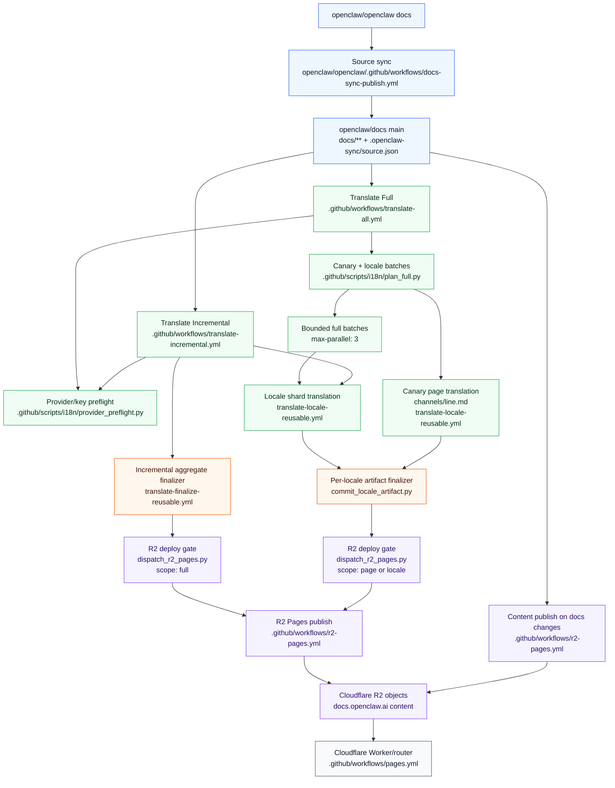

# Translation workflow

Internal note for the docs publish pipeline. This file is under `docs/.i18n`, which is ignored by the docs-site build and is not published.

## Goals

- English docs deploy quickly after every source docs sync.
- Incremental translation does not run for every hot `main` commit.
- Full reconciliation is a recovery path, not a release path.
- Full reconciliation runs automatically only on the weekly schedule, or manually when an operator starts it.
- A failed full run can be retried for one locale without rerunning every locale.
- Provider/key failures stop before locale fan-out.
- A fixed canary page must translate, commit, publish, and live-smoke before follow-up full batches start.
- Locale translation failures are visible as failed GitHub jobs, even when diagnostic artifacts were uploaded.

## Event Flow

1. `openclaw/openclaw` syncs English docs into `openclaw/docs`.
2. `.github/workflows/r2-pages.yml` builds docs content and uploads publishable objects to Cloudflare R2; `.github/workflows/pages.yml` deploys only the Worker/router that reads from R2.
3. `Translate Incremental` debounces source-doc pushes and translates stale locale pages.
4. `Translate Full` runs only from the weekly schedule or `workflow_dispatch`.
5. Both translation workflows read the current `origin/main` source metadata after debounce.
6. Both workflows run the shared OpenAI provider/key preflight before any locale job.
7. Full translation plans one canary locale sample and bounded follow-up batches of up to three locales.
8. If the canary fails translation, validation, commit, R2 upload, or live smoke, follow-up full batches do not start.
9. Full locale jobs validate, commit, and dispatch deploy independently after that locale succeeds.
10. Incremental locale jobs upload artifacts for the aggregate finalizer.
11. Failed locale jobs upload failure metadata before failing the job, so artifacts and CI status agree.

## Architecture Overview

The translation control plane is split between workflow orchestration, local scripts, the source translation engine, and the R2 publish gate. Start with this map before reading individual workflow files.



Key implementation entry points:

| Area | File |
| --- | --- |
| Full orchestration, canary gate, bounded batches | `.github/workflows/translate-all.yml` |
| Incremental orchestration and debounce | `.github/workflows/translate-incremental.yml` |
| Per-locale translation, artifact packaging, canary/final locale commit, scoped deploy dispatch | `.github/workflows/translate-locale-reusable.yml` |
| Incremental aggregate finalizer | `.github/workflows/translate-finalize-reusable.yml` |
| R2 publish workflow for `full`, `shell`, `locale`, and `page` scopes | `.github/workflows/r2-pages.yml` |
| R2 dispatch waiter, request id matching, stale scoped deploy retry, live h1 smoke | `.github/scripts/i18n/dispatch_r2_pages.py` |
| R2 object filtering and upload scope enforcement | `scripts/docs-site/r2-upload.mjs` |
| Source translation engine | `openclaw/openclaw/scripts/docs-i18n` |

## Control-Plane Script Pinning

Reusable translation workflows may need to apply artifacts against latest `main`, but PR and branch canaries must still execute the workflow control-plane scripts under test. `translate-locale-reusable.yml` and `translate-finalize-reusable.yml` therefore first check out `github.workflow_sha`, copy `.github/scripts/i18n/**` into `$RUNNER_TEMP`, export `I18N_SCRIPT_DIR`, and invoke every i18n control-plane helper from that staged directory.

Do not call `.github/scripts/i18n/...` from the publish checkout inside reusable workflows; after the job checks out latest `main`, that path may be missing or stale relative to the branch being validated.

## Trigger Policy

`Translate Full` deliberately does not listen to release dispatches or glossary pushes. Release and glossary changes converge through the weekly full run. For urgent recovery, manually run `Translate Full` with `target_locale=all` or a single locale slug.

`Translate Incremental` runs on source-doc pushes and `workflow_dispatch`. Its workflow concurrency uses `cancel-in-progress: true`, so newer incremental work can replace older pending/running incremental work.

Manual `target_locale` accepts `all` or one locale slug such as `fr`, `ja-jp`, or `zh-cn`. A single-locale rerun uses that locale for the canary sample, then schedules only that locale in the first full batch. Manual `canary_only=true` runs only the canary translation, R2 upload, and live smoke without starting follow-up full batches.

## Concurrency Policy

`Translate Full` uses the `docs-i18n-full` workflow concurrency group with `cancel-in-progress: false`, so only one full reconciliation runs at a time and newer full runs queue instead of cancelling the active run.

Full locale batches use matrix `max-parallel: 3`. Current full locale inputs use `shard_total: "1"` and `worker_parallel: "3"`, so each active locale has one shard and up to three internal translation workers. The explicit full budget check caps `max-parallel * worker_parallel` at 12 active workers.

Each reusable locale translate job also uses `translate-<locale_slug>-s<index>of<total>` with `cancel-in-progress: false`. That prevents the same locale shard from running concurrently across full and incremental workflows. A full run can therefore wait behind an already-running incremental job for the same locale shard.

Reusable locale translate jobs have `timeout-minutes: 120`. Reusable locale finalizers have `timeout-minutes: 60`. These timeouts make stalled provider, validation, or deploy waits fail visibly instead of pinning the full workflow indefinitely.

Full locale finalizers are not globally serialized by workflow concurrency. They apply artifacts to latest `main`, run `npm run docs:check`, and rely on `commit_locale_artifact.py` rebase/retry behavior plus stale artifact checks when multiple locale finalizers race to push.

Incremental translation keeps an aggregate finalizer with `docs-i18n-finalize` concurrency. Incremental commits successful locale artifacts together and then performs one full R2 publish.

`R2 Pages` uses the single `r2-pages` concurrency group with `cancel-in-progress: false`. Page, locale, shell, and full R2 publish runs therefore queue instead of cancelling each other. Workflow-dispatched scoped deploys carry a unique `request_id`, and `dispatch_r2_pages.py` waits for the matching R2 run, retries stale scoped uploads, and fails the caller if upload or live smoke fails.

## Debounce Policy

The coordinator waits after push-triggered incremental runs. The default cooldown is controlled by `OPENCLAW_DOCS_TRANSLATION_COOLDOWN_SECONDS`, which defaults to `3600`. Manual and weekly runs do not wait by default unless the manual input sets `cooldown_seconds`.

If `.openclaw-sync/source.json` changed during a wait, the workflow waits again from the newer state. If `main` keeps moving, the wait is capped by `OPENCLAW_DOCS_TRANSLATION_MAX_WAIT_SECONDS`, which defaults to the cooldown value.

## Incremental Translation

Each translated page stores `x-i18n.source_hash`. Locale jobs compare the current English page hash with the stored locale hash.

Normal incremental runs translate only:

- missing locale pages
- locale pages with stale `x-i18n.source_hash`
- pages affected by source deletion/pruning

Internal files under `docs/.i18n/**` are not translation inputs. Push-triggered runs that only change internal i18n files skip before the locale matrix.

Incremental translation uses the provider/key preflight before expanding the locale matrix. If the key is invalid, model access is denied, or quota is exhausted, the preflight job fails and locale jobs are not scheduled.

Incremental locale jobs do not commit directly. They upload artifacts, and `translate-finalize-reusable.yml` applies valid successful artifacts, rejects stale or failed artifacts, runs `npm run docs:check`, commits one aggregate i18n refresh, and dispatches `r2-pages.yml` with a full upload.

## Full Translation

Full mode forces every source page for the selected locale into the pending manifest instead of relying on changed source hashes.

The weekly all-locale plan is:

```text
provider/key preflight
  -> canary locale page
  -> batch 1, up to 3 locales
  -> batch 2, up to 3 locales
  -> ...
  -> status summary
```

The canary is a deterministic one-document sample from the first selected locale. It uses `channels/line.md` because that page is easy to inspect on the live site and exercises fixed glossary terms such as `LINE`; if that configured page is not pending in the canary shard, the canary fails instead of silently switching pages. The canary uploads a `canary` artifact, applies it through the same artifact validation path as locale commits, runs the aggregate docs check, commits that one-page locale refresh when there is a git diff, then dispatches and waits for an R2 Pages single-page upload. The R2 deploy is required even when the canary page already matches `main`, because `main` can be current while R2 is stale. After upload, the canary live-smokes `https://docs.openclaw.ai/<locale>/channels/line` and requires the page `<h1>` to be `LINE`.

Canary artifacts include only the sampled locale page and that locale translation memory; unrelated pruned locale pages are not published by the probe. Before writing `main`, canary commits are guarded again against the downloaded artifact contract so only the sampled page and translation memory can be committed.

If the canary succeeds, the selected locales, including the canary locale, run in normal full batches unless `canary_only=true` was requested. If a later locale fails, already successful locales remain committed and published, and the failed locale can be rerun manually.

## Weekly Reconciliation

The weekly run is the regular full-reconciliation repair pass. It uses full mode, so selected locale jobs force every current source page into the pending manifest instead of relying only on changed source hashes.

Weekly full reconciliation is the path that catches:

- missed or stale incremental translations
- source deletions that require locale pruning
- glossary or prompt improvements that should eventually apply even when source page hashes did not change
- flaky LLM/provider failures from earlier runs

Weekly runs follow the normal `Translate Full` canary, batching, per-locale commit, and scoped R2 publish path. The weekly-specific expectation is that each selected locale is regenerated or verified end to end: stale locale pages are pruned, translation memory is refreshed as needed, and missed work remains visible for manual rerun.

Glossary changes no longer trigger an immediate full run. They converge through the next weekly full run, or through a manual `Translate Full` run when an operator needs urgent propagation.

## Artifact Contract

Each locale job uploads one artifact named with role, locale, shard, and source SHA:

```text
i18n-zh-cn-s0of1-<source-sha>
i18n-canary-zh-cn-s0of1-<source-sha>
```

Artifact contents:

```text
metadata.json
changed-files.txt
deleted-files.txt
payload/docs/<locale>/**
payload/docs/.i18n/<locale>.tm.jsonl
```

`metadata.json` includes the artifact role, locale, locale slug, source SHA, pending count, changed count, deleted count, step outcomes, and failure reason. A failed translation writes an empty payload contract, uploads the artifact, then fails the job. Full status summaries count canary artifacts separately and do not treat a canary artifact as a successful locale refresh.

## Commit And Deploy Policy

Full locale jobs are the commit and publish unit. After a locale succeeds, the reusable `commit-locale` job downloads that locale artifact, applies it to latest `main`, runs `npm run docs:check`, commits only `docs/<locale>/**` and `docs/.i18n/<locale>.tm.jsonl`, pushes with rebase/retry, and dispatches `r2-pages.yml` with a locale-scoped upload. Locale-scoped upload includes that locale's page objects plus regenerated `pagefind/` search shards, because Pagefind is a shared index derived from translated page content. The dispatch step waits for the matching R2 Pages run and fails if the upload fails.

Canary deploys dispatch `r2-pages.yml` with `artifact_scope=page`, `locale=<locale>`, and `page_path=channels/line`. Full locale deploys dispatch `artifact_scope=locale` and `locale=<locale>`. Incremental aggregate finalization dispatches a full upload.

R2 scoped deploys still build the docs artifact before upload. Scope is enforced by `scripts/docs-site/r2-upload.mjs`, which filters the manifest for `page` or `locale` uploads. Because `r2-pages.yml` is serialized by the `r2-pages` concurrency group, R2 build/upload jobs do not race each other in the publish workflow.

Artifact application is intentionally conservative when source metadata has moved. The apply step uses latest `main`, copies only payload pages whose embedded `x-i18n.source_hash` still matches the current source page, and skips stale translation memory. If `main` moves again between apply/validation and push, the commit script skips that locale commit so the next manual or weekly run can re-evaluate from the new base.

`r2-pages.yml` checks whether docs `main` moved before upload. For workflow-dispatched `page` and `locale` uploads, a stale scoped deploy fails instead of silently succeeding. `dispatch_r2_pages.py` retries those stale scoped deploys with a new `request_id`.

## Known Remaining Work

Because failed artifacts currently carry no safe payload, a future reliability pass can add partial-success semantics in `openclaw/openclaw/scripts/docs-i18n`, preserving successfully translated pages from a shard while recording failed paths/chunks and still marking the overall run incomplete.

Until that exists, do not treat GitHub job success alone as proof of translation success. The artifact metadata, workflow summary, and finalizer checks are the contract.

## Automatic Verification

The script test suite validates the recovery controls:

- `Translate Full` has no release dispatch trigger.
- glossary pushes do not trigger `Translate Full`.
- weekly and manual triggers remain present.
- manual single-locale planning selects only that locale.
- full canary manifests keep the total pending count but translate only the fixed canary page.
- provider/key preflight classifies invalid key, model access, and quota failures.
- canary success gates follow-up full batches.
- full worker fan-out stays within the small-batch budget.
- failed artifact metadata produces visible GitHub output status.
- locale artifact application rejects missing, failed, stale, and invalid artifacts.
- reusable workflows run staged `I18N_SCRIPT_DIR` helpers from the workflow ref under test.
- R2 dispatches carry scoped inputs and unique request IDs.
- R2 scoped stale deploys fail and are retried by the dispatch waiter.

Run locally:

```bash
python .github/scripts/i18n/tests/test_i18n_scripts.py
python .github/scripts/i18n/workflow_shell_check.py --workflows-dir .github/workflows --check-bash
python .github/scripts/i18n/budget_check.py --workflow .github/workflows/translate-all.yml
```

## Manual Verification

Before changing the workflow control plane:

1. Trigger `Translate Full` with a deliberately invalid translation key in a test context and confirm the provider preflight fails before locale jobs start.
2. Trigger or simulate a canary failure and confirm follow-up full batches are skipped.
3. Trigger `Translate Full` with `target_locale=fr` and confirm only `fr` runs.
4. Trigger a manual `canary_only=true` run and confirm the canary waits for `r2-pages.yml` and live-smokes the LINE page.
5. Observe or simulate a later locale failure and confirm earlier successful locale commits remain published.
6. Rerun only the failed locale with `target_locale=<slug>` and confirm it commits independently.
7. Confirm release events do not start `Translate Full`.
8. Confirm glossary-only changes do not start `Translate Full`.
9. Check GitHub Actions summaries for selected locales, canary/batch status, artifact counts, and explicit failures.
10. Confirm the final diff from any full locale commit contains only `docs/<locale>/**` and `docs/.i18n/<locale>.tm.jsonl`.
11. Confirm canary and locale publish steps dispatch `R2 Pages`, not `Pages`, and that the R2 run uses the expected `page` or `locale` scope.
