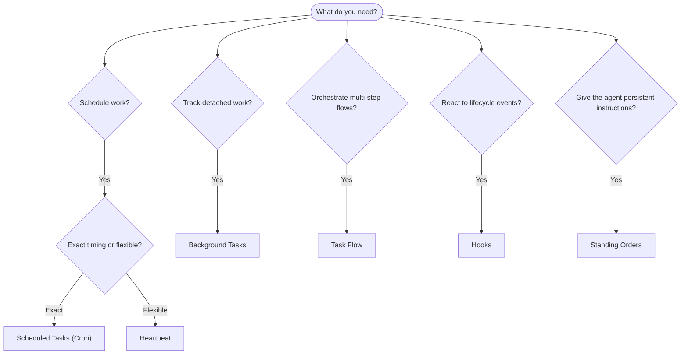

---
read_when:
    - اتخاذ قرار بشأن كيفية أتمتة العمل باستخدام OpenClaw
    - الاختيار بين Heartbeat وCron والخطافات والأوامر الدائمة
    - البحث عن نقطة الدخول المناسبة للأتمتة
summary: 'نظرة عامة على آليات الأتمتة: المهام، Cron، الخطافات، الأوامر الدائمة، وTaskFlow'
title: الأتمتة والمهام
x-i18n:
    generated_at: "2026-04-24T07:29:18Z"
    model: gpt-5.4
    provider: openai
    source_hash: 1b4615cc05a6d0ef7c92f44072d11a2541bc5e17b7acb88dc27ddf0c36b2dcab
    source_path: automation/index.md
    workflow: 15
---

يشغّل OpenClaw العمل في الخلفية عبر المهام، والوظائف المجدولة، وخطافات الأحداث، والتعليمات الدائمة. تساعدك هذه الصفحة على اختيار الآلية المناسبة وفهم كيفية تكاملها معًا.

## دليل اتخاذ قرار سريع

| حالة الاستخدام | الموصى به | السبب |
| -------------- | --------- | ------ |
| إرسال تقرير يومي في تمام الساعة 9 صباحًا | المهام المجدولة (Cron) | توقيت دقيق، وتنفيذ معزول |
| ذكّرني بعد 20 دقيقة | المهام المجدولة (Cron) | تشغيل لمرة واحدة مع توقيت دقيق (`--at`) |
| تشغيل تحليل عميق أسبوعي | المهام المجدولة (Cron) | مهمة مستقلة، ويمكنها استخدام نموذج مختلف |
| التحقق من البريد الوارد كل 30 دقيقة | Heartbeat | يجمّع مع عمليات تحقق أخرى، ومدرك للسياق |
| مراقبة التقويم للأحداث القادمة | Heartbeat | مناسب بطبيعته للوعي الدوري |
| فحص حالة subagent أو تشغيل ACP | مهام الخلفية | يسجل دفتر المهام كل الأعمال المنفصلة |
| تدقيق ما الذي تم تشغيله ومتى | مهام الخلفية | `openclaw tasks list` و`openclaw tasks audit` |
| بحث متعدد الخطوات ثم تلخيص | Task Flow | تنسيق دائم مع تتبع للمراجعات |
| تشغيل سكربت عند إعادة تعيين الجلسة | الخطافات | مدفوع بالأحداث، ويعمل عند أحداث دورة الحياة |
| تنفيذ كود عند كل استدعاء أداة | الخطافات | يمكن للخطافات التصفية حسب نوع الحدث |
| التحقق دائمًا من الامتثال قبل الرد | الأوامر الدائمة | تُحقن تلقائيًا في كل جلسة |

### المهام المجدولة (Cron) مقابل Heartbeat

| البعد | المهام المجدولة (Cron) | Heartbeat |
| ---- | ---------------------- | --------- |
| التوقيت | دقيق (تعبيرات cron، تشغيل لمرة واحدة) | تقريبي (الافتراضي كل 30 دقيقة) |
| سياق الجلسة | جديد (معزول) أو مشترك | سياق الجلسة الرئيسية الكامل |
| سجلات المهام | تُنشأ دائمًا | لا تُنشأ أبدًا |
| التسليم | قناة، أو Webhook، أو بصمت | مضمن داخل الجلسة الرئيسية |
| الأنسب لـ | التقارير، والتذكيرات، والوظائف الخلفية | فحص البريد الوارد، والتقويم، والإشعارات |

استخدم المهام المجدولة (Cron) عندما تحتاج إلى توقيت دقيق أو تنفيذ معزول. استخدم Heartbeat عندما يستفيد العمل من سياق الجلسة الكامل ويكون التوقيت التقريبي كافيًا.

## المفاهيم الأساسية

### المهام المجدولة (cron)

Cron هو المجدول المدمج في Gateway للتوقيت الدقيق. فهو يحتفظ بالوظائف، ويوقظ الوكيل في الوقت المناسب، ويمكنه تسليم المخرجات إلى قناة دردشة أو نقطة نهاية Webhook. يدعم التذكيرات التي تُنفذ مرة واحدة، والتعبيرات المتكررة، ومشغلات Webhook الواردة.

راجع [المهام المجدولة](/ar/automation/cron-jobs).

### المهام

يتتبع دفتر مهام الخلفية جميع الأعمال المنفصلة: تشغيلات ACP، وعمليات إطلاق subagent، وتنفيذات cron المعزولة، وعمليات CLI. المهام هي سجلات وليست مجدولات. استخدم `openclaw tasks list` و`openclaw tasks audit` لفحصها.

راجع [مهام الخلفية](/ar/automation/tasks).

### Task Flow

Task Flow هي الطبقة الأساسية لتنسيق التدفقات فوق مهام الخلفية. وهي تدير تدفقات متعددة الخطوات ودائمة مع أوضاع مزامنة مُدارة ومُعكوسة، وتتبع للمراجعات، وأوامر `openclaw tasks flow list|show|cancel` للفحص.

راجع [Task Flow](/ar/automation/taskflow).

### الأوامر الدائمة

تمنح الأوامر الدائمة الوكيل صلاحية تشغيل دائمة لبرامج محددة. وهي موجودة في ملفات مساحة العمل (عادةً `AGENTS.md`) وتُحقن في كل جلسة. ويمكن دمجها مع cron لفرض التنفيذ المستند إلى الوقت.

راجع [الأوامر الدائمة](/ar/automation/standing-orders).

### الخطافات

الخطافات هي سكربتات مدفوعة بالأحداث يتم تشغيلها بواسطة أحداث دورة حياة الوكيل (`/new` و`/reset` و`/stop`)، وCompaction الجلسة، وبدء تشغيل Gateway، وتدفق الرسائل، واستدعاءات الأدوات. يتم اكتشاف الخطافات تلقائيًا من الأدلة، ويمكن إدارتها باستخدام `openclaw hooks`.

راجع [الخطافات](/ar/automation/hooks).

### Heartbeat

Heartbeat هو دور دوري في الجلسة الرئيسية (الافتراضي كل 30 دقيقة). فهو يجمع عدة عمليات تحقق (البريد الوارد، والتقويم، والإشعارات) في دور وكيل واحد مع سياق الجلسة الكامل. لا تُنشئ أدوار Heartbeat سجلات مهام. استخدم `HEARTBEAT.md` لقائمة تحقق صغيرة، أو كتلة `tasks:` عندما تريد عمليات تحقق دورية تعتمد على الاستحقاق فقط داخل heartbeat نفسه. تتجاوز ملفات heartbeat الفارغة التنفيذ مع `empty-heartbeat-file`؛ ويتجاوز وضع المهام المعتمد على الاستحقاق فقط مع `no-tasks-due`.

راجع [Heartbeat](/ar/gateway/heartbeat).

## كيف تعمل معًا

- **Cron** يتولى الجداول الدقيقة (التقارير اليومية، والمراجعات الأسبوعية) والتذكيرات التي تُنفذ مرة واحدة. جميع تنفيذات cron تُنشئ سجلات مهام.
- **Heartbeat** يتولى المراقبة الروتينية (البريد الوارد، والتقويم، والإشعارات) في دور مجمّع واحد كل 30 دقيقة.
- **الخطافات** تستجيب لأحداث محددة (استدعاءات الأدوات، وإعادات تعيين الجلسة، وCompaction) باستخدام سكربتات مخصصة.
- **الأوامر الدائمة** تمنح الوكيل سياقًا دائمًا وحدودًا للصلاحيات.
- **Task Flow** ينسّق التدفقات متعددة الخطوات فوق المهام الفردية.
- **المهام** تتعقب تلقائيًا جميع الأعمال المنفصلة حتى تتمكن من فحصها وتدقيقها.

## ذو صلة

- [المهام المجدولة](/ar/automation/cron-jobs) — الجدولة الدقيقة والتذكيرات التي تُنفذ مرة واحدة
- [مهام الخلفية](/ar/automation/tasks) — دفتر المهام لجميع الأعمال المنفصلة
- [Task Flow](/ar/automation/taskflow) — تنسيق دائم للتدفقات متعددة الخطوات
- [الخطافات](/ar/automation/hooks) — سكربتات دورة حياة مدفوعة بالأحداث
- [الأوامر الدائمة](/ar/automation/standing-orders) — تعليمات وكيل دائمة
- [Heartbeat](/ar/gateway/heartbeat) — أدوار دورية في الجلسة الرئيسية
- [مرجع الإعدادات](/ar/gateway/configuration-reference) — جميع مفاتيح الإعدادات
