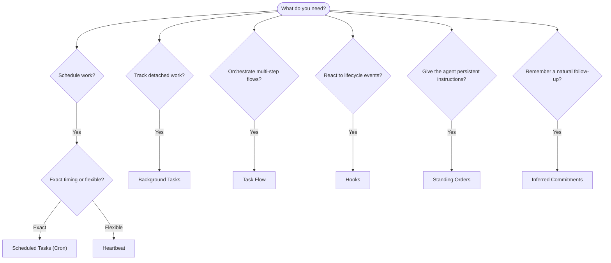

---
read_when:
    - تحديد كيفية أتمتة العمل باستخدام OpenClaw
    - الاختيار بين Heartbeat وCron والالتزامات والخطافات والأوامر الدائمة
    - البحث عن نقطة دخول الأتمتة المناسبة
summary: 'نظرة عامة على آليات الأتمتة: المهام، Cron، الخطافات، الأوامر الدائمة، وTaskFlow'
title: الأتمتة والمهام
x-i18n:
    generated_at: "2026-04-30T07:39:19Z"
    model: gpt-5.5
    provider: openai
    source_hash: a2465c39f21db8bcb98f980a2c4b2c03018dddd5f43de59d8bf6ce0d6e97d9ef
    source_path: automation/index.md
    workflow: 16
---

يشغّل OpenClaw العمل في الخلفية عبر المهام، والوظائف المجدولة، والالتزامات المستنتجة، وخطافات الأحداث، والتعليمات الدائمة. تساعدك هذه الصفحة على اختيار الآلية المناسبة وفهم كيفية تكاملها معًا.

## دليل اتخاذ القرار السريع

| حالة الاستخدام | الموصى به | السبب |
| --------------------------------------- | ---------------------- | ------------------------------------------------ |
| إرسال تقرير يومي في التاسعة صباحًا تمامًا | المهام المجدولة (Cron) | توقيت دقيق وتنفيذ معزول |
| ذكّرني بعد 20 دقيقة | المهام المجدولة (Cron) | تشغيل لمرة واحدة بتوقيت دقيق (`--at`) |
| تشغيل تحليل عميق أسبوعي | المهام المجدولة (Cron) | مهمة مستقلة، ويمكن أن تستخدم نموذجًا مختلفًا |
| فحص صندوق الوارد كل 30 دقيقة | Heartbeat | يجمعها مع فحوصات أخرى، وواعٍ بالسياق |
| مراقبة التقويم للأحداث القادمة | Heartbeat | ملاءمة طبيعية للوعي الدوري |
| المتابعة بعد مقابلة مذكورة | الالتزامات المستنتجة | متابعة شبيهة بالذاكرة، من دون طلب تذكير دقيق |
| تسجيل متابعة لطيف للرعاية بعد سياق المستخدم | الالتزامات المستنتجة | مقيّد بالوكيل والقناة نفسيهما |
| فحص حالة وكيل فرعي أو تشغيل ACP | مهام الخلفية | سجل المهام يتتبع كل الأعمال المنفصلة |
| تدقيق ما شُغّل ومتى | مهام الخلفية | `openclaw tasks list` و`openclaw tasks audit` |
| بحث متعدد الخطوات ثم تلخيص | Task Flow | تنسيق دائم مع تتبع المراجعات |
| تشغيل سكربت عند إعادة ضبط الجلسة | الخطافات | مدفوع بالأحداث، ويُطلق عند أحداث دورة الحياة |
| تنفيذ كود عند كل استدعاء أداة | خطافات Plugin | يمكن للخطافات داخل العملية اعتراض استدعاءات الأدوات |
| تحقق دائمًا من الامتثال قبل الرد | الأوامر الدائمة | تُحقن تلقائيًا في كل جلسة |

### المهام المجدولة (Cron) مقابل Heartbeat

| البعد | المهام المجدولة (Cron) | Heartbeat |
| --------------- | ----------------------------------- | ------------------------------------- |
| التوقيت | دقيق (تعبيرات cron، لمرة واحدة) | تقريبي (افتراضيًا كل 30 دقيقة) |
| سياق الجلسة | جديد (معزول) أو مشترك | سياق الجلسة الرئيسية كاملًا |
| سجلات المهام | تُنشأ دائمًا | لا تُنشأ أبدًا |
| التسليم | قناة أو Webhook أو صامت | ضمن الجلسة الرئيسية |
| الأفضل لـ | التقارير، التذكيرات، وظائف الخلفية | فحوصات صندوق الوارد، التقويم، الإشعارات |

استخدم المهام المجدولة (Cron) عندما تحتاج إلى توقيت دقيق أو تنفيذ معزول. استخدم Heartbeat عندما يستفيد العمل من سياق الجلسة الكامل ويكون التوقيت التقريبي مقبولًا.

## المفاهيم الأساسية

### المهام المجدولة (cron)

Cron هو المجدول المدمج في Gateway للتوقيت الدقيق. يستبقي الوظائف، ويوقظ الوكيل في الوقت المناسب، ويمكنه تسليم المخرجات إلى قناة دردشة أو نقطة نهاية Webhook. يدعم التذكيرات لمرة واحدة، والتعبيرات المتكررة، ومحفزات Webhook الواردة.

راجع [المهام المجدولة](/ar/automation/cron-jobs).

### المهام

يتتبع سجل مهام الخلفية كل الأعمال المنفصلة: تشغيلات ACP، وإنشاءات الوكلاء الفرعيين، وتنفيذات cron المعزولة، وعمليات CLI. المهام سجلات وليست مجدولات. استخدم `openclaw tasks list` و`openclaw tasks audit` لفحصها.

راجع [مهام الخلفية](/ar/automation/tasks).

### الالتزامات المستنتجة

الالتزامات هي ذكريات متابعة قصيرة العمر ومشروطة بالاشتراك. يستنتجها OpenClaw من المحادثات العادية، ويقيّدها بالوكيل والقناة نفسيهما، ويسلّم المتابعات المستحقة عبر Heartbeat. أما التذكيرات الدقيقة التي يطلبها المستخدم صراحةً فمكانها لا يزال cron.

راجع [الالتزامات المستنتجة](/ar/concepts/commitments).

### Task Flow

Task Flow هو طبقة تنسيق التدفقات فوق مهام الخلفية. يدير تدفقات متعددة الخطوات ودائمة مع أوضاع مزامنة مُدارة ومعكوسة، وتتبع المراجعات، و`openclaw tasks flow list|show|cancel` للفحص.

راجع [Task Flow](/ar/automation/taskflow).

### الأوامر الدائمة

تمنح الأوامر الدائمة الوكيل سلطة تشغيلية دائمة لبرامج محددة. تعيش في ملفات مساحة العمل (عادةً `AGENTS.md`) وتُحقن في كل جلسة. اجمعها مع cron للتنفيذ القائم على الوقت.

راجع [الأوامر الدائمة](/ar/automation/standing-orders).

### الخطافات

الخطافات الداخلية هي سكربتات مدفوعة بالأحداث تُشغّلها أحداث دورة حياة الوكيل (`/new`، و`/reset`، و`/stop`)، وCompaction الجلسة، وبدء تشغيل Gateway، وتدفق الرسائل. تُكتشف تلقائيًا من الأدلة ويمكن إدارتها باستخدام `openclaw hooks`. لاعتراض استدعاءات الأدوات داخل العملية، استخدم [خطافات Plugin](/ar/plugins/hooks).

راجع [الخطافات](/ar/automation/hooks).

### Heartbeat

Heartbeat هو دور دوري في الجلسة الرئيسية (افتراضيًا كل 30 دقيقة). يجمع عدة فحوصات (صندوق الوارد، التقويم، الإشعارات) في دور وكيل واحد مع سياق الجلسة الكامل. لا تُنشئ أدوار Heartbeat سجلات مهام ولا تمدد حداثة إعادة ضبط الجلسة اليومية/الخاملة. استخدم `HEARTBEAT.md` لقائمة تحقق صغيرة، أو كتلة `tasks:` عندما تريد فحوصات دورية مستحقة فقط داخل Heartbeat نفسه. تتجاوز ملفات Heartbeat الفارغة التنفيذ باسم `empty-heartbeat-file`؛ ويتجاوز وضع المهام المستحقة فقط التنفيذ باسم `no-tasks-due`. تؤجَّل Heartbeats أثناء نشاط عمل cron أو اصطفافه، ويمكن لـ`heartbeat.skipWhenBusy` أيضًا تأجيلها عندما تكون مسارات الوكيل الفرعي أو المسارات المتداخلة مشغولة.

راجع [Heartbeat](/ar/gateway/heartbeat).

## كيف تعمل معًا

- يتعامل **Cron** مع الجداول الدقيقة (التقارير اليومية، المراجعات الأسبوعية) والتذكيرات لمرة واحدة. كل تنفيذات cron تُنشئ سجلات مهام.
- يتعامل **Heartbeat** مع المراقبة الروتينية (صندوق الوارد، التقويم، الإشعارات) في دور مجمّع واحد كل 30 دقيقة.
- تتفاعل **الخطافات** مع أحداث محددة (إعادة ضبط الجلسة، وCompaction، وتدفق الرسائل) باستخدام سكربتات مخصصة. تغطي خطافات Plugin استدعاءات الأدوات.
- تمنح **الأوامر الدائمة** الوكيل سياقًا مستمرًا وحدودًا للسلطة.
- ينسق **Task Flow** التدفقات متعددة الخطوات فوق المهام الفردية.
- تتتبع **المهام** تلقائيًا كل الأعمال المنفصلة كي تتمكن من فحصها وتدقيقها.

## ذات صلة

- [المهام المجدولة](/ar/automation/cron-jobs) — الجدولة الدقيقة والتذكيرات لمرة واحدة
- [الالتزامات المستنتجة](/ar/concepts/commitments) — متابعات شبيهة بالذاكرة
- [مهام الخلفية](/ar/automation/tasks) — سجل المهام لكل الأعمال المنفصلة
- [Task Flow](/ar/automation/taskflow) — تنسيق تدفقات متعددة الخطوات ودائمة
- [الخطافات](/ar/automation/hooks) — سكربتات دورة حياة مدفوعة بالأحداث
- [خطافات Plugin](/ar/plugins/hooks) — خطافات الأدوات والمطالبات والرسائل ودورة الحياة داخل العملية
- [الأوامر الدائمة](/ar/automation/standing-orders) — تعليمات وكيل مستمرة
- [Heartbeat](/ar/gateway/heartbeat) — أدوار دورية في الجلسة الرئيسية
- [مرجع التهيئة](/ar/gateway/configuration-reference) — كل مفاتيح التهيئة
