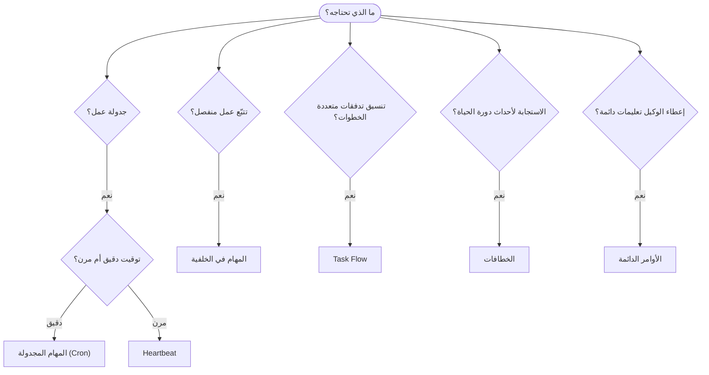

---
read_when:
    - اتخاذ قرار بشأن كيفية أتمتة العمل باستخدام OpenClaw
    - الاختيار بين Heartbeat وCron والخطافات والأوامر الدائمة
    - البحث عن نقطة الدخول المناسبة للأتمتة
summary: 'نظرة عامة على آليات الأتمتة: المهام، Cron، الخطافات، الأوامر الدائمة، وTaskFlow'
title: الأتمتة والمهام
x-i18n:
    generated_at: "2026-04-26T11:22:55Z"
    model: gpt-5.4
    provider: openai
    source_hash: 6d2a2d3ef58830133e07b34f33c611664fc1032247e9dd81005adf7fc0c43cdb
    source_path: automation/index.md
    workflow: 15
---

يشغّل OpenClaw العمل في الخلفية من خلال المهام، والوظائف المجدولة، وخطافات الأحداث، والتعليمات الدائمة. تساعدك هذه الصفحة على اختيار الآلية المناسبة وفهم كيفية ترابطها معًا.

## دليل اتخاذ القرار السريع

| حالة الاستخدام | الموصى به | السبب |
| --------------------------------------- | ---------------------- | ------------------------------------------------ |
| إرسال تقرير يومي الساعة 9 صباحًا بالضبط | المهام المجدولة (Cron) | توقيت دقيق، وتنفيذ معزول |
| ذكّرني بعد 20 دقيقة | المهام المجدولة (Cron) | تنفيذ لمرة واحدة مع توقيت دقيق (`--at`) |
| تشغيل تحليل عميق أسبوعي | المهام المجدولة (Cron) | مهمة مستقلة، ويمكنها استخدام نموذج مختلف |
| فحص صندوق الوارد كل 30 دقيقة | Heartbeat | يجمّع مع عمليات الفحص الأخرى، ومدرك للسياق |
| مراقبة التقويم للأحداث القادمة | Heartbeat | مناسب بطبيعته للوعي الدوري |
| فحص حالة وكيل فرعي أو تشغيل ACP | المهام في الخلفية | يسجّل دفتر المهام كل الأعمال المنفصلة |
| تدقيق ما الذي تم تشغيله ومتى | المهام في الخلفية | `openclaw tasks list` و `openclaw tasks audit` |
| بحث متعدد الخطوات ثم تلخيص | Task Flow | تنسيق دائم مع تتبّع للمراجعات |
| تشغيل سكربت عند إعادة تعيين الجلسة | الخطافات | قائم على الأحداث، ويُفعّل عند أحداث دورة الحياة |
| تنفيذ كود عند كل استدعاء أداة | Plugin hooks | يمكن للخطافات داخل العملية اعتراض استدعاءات الأدوات |
| التحقق دائمًا من الامتثال قبل الرد | الأوامر الدائمة | تُحقن تلقائيًا في كل جلسة |

### المهام المجدولة (Cron) مقابل Heartbeat

| البُعد | المهام المجدولة (Cron) | Heartbeat |
| --------------- | ----------------------------------- | ------------------------------------- |
| التوقيت | دقيق (تعبيرات cron، لمرة واحدة) | تقريبي (افتراضيًا كل 30 دقيقة) |
| سياق الجلسة | جديد (معزول) أو مشترك | السياق الكامل للجلسة الرئيسية |
| سجلات المهام | تُنشأ دائمًا | لا تُنشأ أبدًا |
| التسليم | قناة، أو Webhook، أو بصمت | ضمنيًا في الجلسة الرئيسية |
| الأنسب لـ | التقارير، والتذكيرات، والوظائف الخلفية | فحص البريد الوارد، والتقويم، والإشعارات |

استخدم المهام المجدولة (Cron) عندما تحتاج إلى توقيت دقيق أو تنفيذ معزول. استخدم Heartbeat عندما يستفيد العمل من سياق الجلسة الكامل ويكون التوقيت التقريبي كافيًا.

## المفاهيم الأساسية

### المهام المجدولة (cron)

Cron هو المجدول المدمج في Gateway للتوقيت الدقيق. يحتفظ بالوظائف، ويوقظ الوكيل في الوقت المناسب، ويمكنه إيصال المخرجات إلى قناة دردشة أو نقطة نهاية Webhook. يدعم التذكيرات لمرة واحدة، والتعبيرات المتكررة، ومشغلات Webhook الواردة.

راجع [Scheduled Tasks](/ar/automation/cron-jobs).

### المهام

يتتبّع دفتر المهام في الخلفية كل الأعمال المنفصلة: عمليات ACP، وتشغيل الوكلاء الفرعيين، وتنفيذات cron المعزولة، وعمليات CLI. المهام هي سجلات وليست مجدولات. استخدم `openclaw tasks list` و `openclaw tasks audit` لفحصها.

راجع [Background Tasks](/ar/automation/tasks).

### Task Flow

Task Flow هي طبقة تنسيق التدفقات فوق المهام في الخلفية. تدير تدفقات دائمة متعددة الخطوات مع أوضاع مزامنة مُدارة ومعكوسة، وتتبع المراجعات، و`openclaw tasks flow list|show|cancel` للفحص.

راجع [Task Flow](/ar/automation/taskflow).

### الأوامر الدائمة

تمنح الأوامر الدائمة الوكيل صلاحية تشغيل دائمة لبرامج محددة. تعيش في ملفات مساحة العمل (عادةً `AGENTS.md`) وتُحقن في كل جلسة. اجمع بينها وبين cron لفرض قائم على الوقت.

راجع [Standing Orders](/ar/automation/standing-orders).

### الخطافات

الخطافات الداخلية هي سكربتات قائمة على الأحداث تُفعَّل بواسطة أحداث دورة حياة الوكيل
(`/new` و `/reset` و `/stop`)، وCompaction الجلسة، وبدء تشغيل Gateway، وتدفّق
الرسائل. يتم اكتشافها تلقائيًا من الأدلة ويمكن إدارتها
باستخدام `openclaw hooks`. لاعتراض استدعاءات الأدوات داخل العملية، استخدم
[Plugin hooks](/ar/plugins/hooks).

راجع [Hooks](/ar/automation/hooks).

### Heartbeat

Heartbeat هو دورية للجلسة الرئيسية (افتراضيًا كل 30 دقيقة). يجمّع عدة عمليات فحص (صندوق الوارد، والتقويم، والإشعارات) في دور واحد للوكيل مع سياق الجلسة الكامل. لا تنشئ دورات Heartbeat سجلات مهام ولا تمدّ حداثة إعادة تعيين الجلسة اليومية/الخاملة. استخدم `HEARTBEAT.md` لقائمة تحقق صغيرة، أو كتلة `tasks:` عندما تريد عمليات فحص دورية مستحقة فقط داخل heartbeat نفسه. تتخطى ملفات heartbeat الفارغة باعتبارها `empty-heartbeat-file`؛ ويتخطى وضع المهام المستحقة فقط باعتباره `no-tasks-due`.

راجع [Heartbeat](/ar/gateway/heartbeat).

## كيف تعمل معًا

- **Cron** يتعامل مع الجداول الدقيقة (التقارير اليومية، والمراجعات الأسبوعية) والتذكيرات لمرة واحدة. جميع تنفيذات cron تنشئ سجلات مهام.
- **Heartbeat** يتعامل مع المراقبة الروتينية (صندوق الوارد، والتقويم، والإشعارات) في دور مجمّع واحد كل 30 دقيقة.
- **الخطافات** تستجيب لأحداث محددة (إعادة تعيين الجلسات، وCompaction، وتدفّق الرسائل) باستخدام سكربتات مخصصة. تغطي Plugin hooks استدعاءات الأدوات.
- **الأوامر الدائمة** تمنح الوكيل سياقًا دائمًا وحدودًا للسلطة.
- **Task Flow** ينسّق التدفقات متعددة الخطوات فوق المهام الفردية.
- **المهام** تتتبّع تلقائيًا كل الأعمال المنفصلة بحيث يمكنك فحصها وتدقيقها.

## ذو صلة

- [Scheduled Tasks](/ar/automation/cron-jobs) — جدولة دقيقة وتذكيرات لمرة واحدة
- [Background Tasks](/ar/automation/tasks) — دفتر مهام لجميع الأعمال المنفصلة
- [Task Flow](/ar/automation/taskflow) — تنسيق دائم للتدفقات متعددة الخطوات
- [Hooks](/ar/automation/hooks) — سكربتات دورة حياة قائمة على الأحداث
- [Plugin hooks](/ar/plugins/hooks) — خطافات داخل العملية للأدوات، والمطالبات، والرسائل، ودورة الحياة
- [Standing Orders](/ar/automation/standing-orders) — تعليمات وكيل دائمة
- [Heartbeat](/ar/gateway/heartbeat) — أدوار دورية للجلسة الرئيسية
- [Configuration Reference](/ar/gateway/configuration-reference) — جميع مفاتيح الإعدادات
