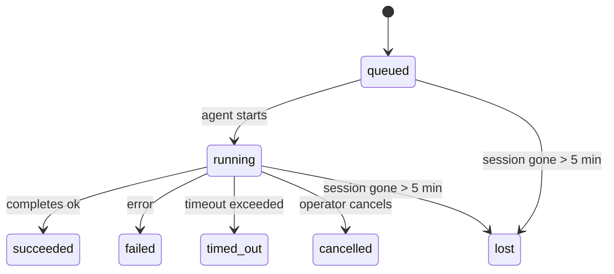

---
read_when:
    - فحص أعمال الخلفية قيد التنفيذ أو المكتملة مؤخرًا
    - تصحيح أخطاء فشل التسليم لتشغيلات الوكلاء المنفصلة
    - فهم كيفية ارتباط التشغيلات في الخلفية بالجلسات وCron وHeartbeat
summary: تتبّع المهام في الخلفية لتشغيلات ACP والوكلاء الفرعيين ووظائف Cron المعزولة وعمليات CLI
title: المهام في الخلفية
x-i18n:
    generated_at: "2026-04-24T07:29:25Z"
    model: gpt-5.4
    provider: openai
    source_hash: 10f16268ab5cce8c3dfd26c54d8d913c0ac0f9bfb4856ed1bb28b085ddb78528
    source_path: automation/tasks.md
    workflow: 15
---

> **هل تبحث عن الجدولة؟** راجع [الأتمتة والمهام](/ar/automation) لاختيار الآلية المناسبة. تغطي هذه الصفحة **تتبّع** الأعمال في الخلفية، وليس جدولتها.

تتتبّع المهام في الخلفية الأعمال التي تعمل **خارج جلسة المحادثة الرئيسية**:
تشغيلات ACP، وعمليات إنشاء الوكلاء الفرعيين، وتنفيذات وظائف Cron المعزولة، والعمليات التي يبدأها CLI.

لا تحلّ المهام محل الجلسات أو وظائف Cron أو Heartbeat — بل هي **سجل النشاط** الذي يسجّل ما هي الأعمال المنفصلة التي حدثت، ومتى حدثت، وما إذا كانت قد نجحت.

<Note>
لا تؤدي كل عملية تشغيل للوكيل إلى إنشاء مهمة. لا تفعل ذلك دورات Heartbeat ولا الدردشة التفاعلية العادية. أما جميع تنفيذات Cron، وعمليات إنشاء ACP، وعمليات إنشاء الوكلاء الفرعيين، وأوامر الوكيل عبر CLI فتنشئ مهام.
</Note>

## ملخص سريع

- المهام هي **سجلات** وليست مجدولات — يحدد Cron وHeartbeat _متى_ يتم تشغيل العمل، بينما تتتبّع المهام _ما الذي حدث_.
- تنشئ ACP، والوكلاء الفرعيون، وجميع وظائف Cron، وعمليات CLI مهام. لا تنشئ دورات Heartbeat مهام.
- تنتقل كل مهمة عبر `queued → running → terminal` (succeeded أو failed أو timed_out أو cancelled أو lost).
- تبقى مهام Cron نشطة ما دام وقت تشغيل Cron لا يزال يملك الوظيفة؛ وتبقى مهام CLI المدعومة بالدردشة نشطة فقط ما دام سياق التشغيل المالك لها لا يزال فعالًا.
- يعتمد الإكمال على الدفع: يمكن للأعمال المنفصلة الإخطار مباشرة أو إيقاظ جلسة الطالب/Heartbeat عند انتهائها، لذلك تكون حلقات استطلاع الحالة عادةً هي الأسلوب غير المناسب.
- تعمل تنفيذات Cron المعزولة وعمليات إكمال الوكلاء الفرعيين، على أساس أفضل جهد، على تنظيف علامات تبويب/عمليات المتصفح المتتبعة الخاصة بجلسة الطفل قبل إنهاء سجلات التنظيف النهائي.
- يعمل تسليم Cron المعزول على كبت ردود الأصل المرحلية القديمة بينما لا يزال عمل الوكيل الفرعي المنحدر قيد الاستنزاف، ويفضل المخرجات النهائية المنحدرة عندما تصل قبل التسليم.
- يتم تسليم إشعارات الإكمال مباشرة إلى قناة أو تُصفّ في انتظار Heartbeat التالية.
- يعرض `openclaw tasks list` جميع المهام؛ ويُظهر `openclaw tasks audit` المشكلات.
- تُحتفَظ السجلات النهائية لمدة 7 أيام، ثم تُزال تلقائيًا.

## البدء السريع

```bash
# List all tasks (newest first)
openclaw tasks list

# Filter by runtime or status
openclaw tasks list --runtime acp
openclaw tasks list --status running

# Show details for a specific task (by ID, run ID, or session key)
openclaw tasks show <lookup>

# Cancel a running task (kills the child session)
openclaw tasks cancel <lookup>

# Change notification policy for a task
openclaw tasks notify <lookup> state_changes

# Run a health audit
openclaw tasks audit

# Preview or apply maintenance
openclaw tasks maintenance
openclaw tasks maintenance --apply

# Inspect TaskFlow state
openclaw tasks flow list
openclaw tasks flow show <lookup>
openclaw tasks flow cancel <lookup>
```

## ما الذي ينشئ مهمة

| المصدر                 | نوع وقت التشغيل | متى يُنشأ سجل المهمة                                  | سياسة الإشعار الافتراضية |
| ---------------------- | --------------- | ----------------------------------------------------- | ------------------------ |
| تشغيلات ACP في الخلفية | `acp`           | عند إنشاء جلسة ACP فرعية                              | `done_only`              |
| تنسيق الوكلاء الفرعيين | `subagent`      | عند إنشاء وكيل فرعي عبر `sessions_spawn`              | `done_only`              |
| وظائف Cron (كل الأنواع) | `cron`         | كل تنفيذ لـ Cron (الجلسة الرئيسية والمعزولة)          | `silent`                 |
| عمليات CLI             | `cli`           | أوامر `openclaw agent` التي تعمل عبر Gateway          | `silent`                 |
| مهام وسائط الوكيل      | `cli`           | تشغيلات `video_generate` المدعومة بالجلسة             | `silent`                 |

تستخدم مهام Cron الخاصة بالجلسة الرئيسية سياسة الإشعار `silent` افتراضيًا — فهي تنشئ سجلات لأغراض التتبّع لكنها لا تولّد إشعارات. كما تستخدم مهام Cron المعزولة أيضًا `silent` افتراضيًا لكنها تكون أكثر وضوحًا لأنها تعمل في جلستها الخاصة.

تستخدم تشغيلات `video_generate` المدعومة بالجلسة أيضًا سياسة الإشعار `silent`. فهي لا تزال تنشئ سجلات مهام، لكن الإكمال يُعاد إلى جلسة الوكيل الأصلية كعملية إيقاظ داخلية حتى يتمكن الوكيل من كتابة رسالة المتابعة وإرفاق الفيديو المكتمل بنفسه. إذا اخترت `tools.media.asyncCompletion.directSend`، فستحاول عمليات الإكمال غير المتزامنة لـ `music_generate` و`video_generate` التسليم المباشر إلى القناة أولًا قبل الرجوع إلى مسار إيقاظ جلسة الطالب.

وأثناء بقاء مهمة `video_generate` مدعومة بالجلسة نشطة، تعمل الأداة أيضًا كوسيلة حماية: فإن تكررت استدعاءات `video_generate` في الجلسة نفسها، فستُرجِع حالة المهمة النشطة بدلًا من بدء عملية توليد متزامنة ثانية. استخدم `action: "status"` عندما تريد بحثًا صريحًا عن التقدم/الحالة من جهة الوكيل.

**ما الذي لا ينشئ مهام:**

- دورات Heartbeat — الجلسة الرئيسية؛ راجع [Heartbeat](/ar/gateway/heartbeat)
- دورات الدردشة التفاعلية العادية
- استجابات `/command` المباشرة

## دورة حياة المهمة



| الحالة      | ما الذي تعنيه                                                              |
| ----------- | -------------------------------------------------------------------------- |
| `queued`    | أُنشئت وتنتظر بدء الوكيل                                                    |
| `running`   | يتم تنفيذ دورة الوكيل بنشاط                                                 |
| `succeeded` | اكتملت بنجاح                                                               |
| `failed`    | اكتملت مع خطأ                                                              |
| `timed_out` | تجاوزت المهلة المُعدّة                                                     |
| `cancelled` | أوقفها المشغّل عبر `openclaw tasks cancel`                                 |
| `lost`      | فقد وقت التشغيل حالة الدعم الرسمية بعد فترة سماح مدتها 5 دقائق            |

تحدث الانتقالات تلقائيًا — فعندما ينتهي تشغيل الوكيل المرتبط، تتحدّث حالة المهمة لتطابق ذلك.

تكون `lost` مدركة لوقت التشغيل:

- مهام ACP: اختفت البيانات الوصفية الخاصة بجلسة ACP الفرعية الداعمة.
- مهام الوكيل الفرعي: اختفت الجلسة الفرعية الداعمة من مخزن الوكيل المستهدف.
- مهام Cron: لم يعد وقت تشغيل Cron يتتبّع الوظيفة على أنها نشطة.
- مهام CLI: تستخدم المهام المعزولة الخاصة بالجلسات الفرعية الجلسة الفرعية؛ أما مهام CLI المدعومة بالدردشة فتستخدم سياق التشغيل الحي المالك بدلًا من ذلك، لذلك فإن صفوف جلسات القناة/المجموعة/الرسائل المباشرة المتبقية لا تُبقيها نشطة.

## التسليم والإشعارات

عندما تصل المهمة إلى حالة نهائية، يقوم OpenClaw بإخطارك. وهناك مساران للتسليم:

**التسليم المباشر** — إذا كان للمهمة هدف قناة (`requesterOrigin`)، تنتقل رسالة الإكمال مباشرة إلى تلك القناة (Telegram أو Discord أو Slack، إلخ). وبالنسبة إلى عمليات إكمال الوكلاء الفرعيين، يحافظ OpenClaw أيضًا على توجيه الخيط/الموضوع المرتبط عند توفره، ويمكنه ملء قيمة `to` / الحساب المفقودة من المسار المخزن في جلسة الطالب (`lastChannel` / `lastTo` / `lastAccountId`) قبل التخلي عن التسليم المباشر.

**التسليم المصطفّ في الجلسة** — إذا فشل التسليم المباشر أو لم يتم تعيين أصل، يُصفّ التحديث كحدث نظام في جلسة الطالب ويظهر في Heartbeat التالية.

<Tip>
يؤدي إكمال المهمة إلى تشغيل إيقاظ Heartbeat فوري حتى ترى النتيجة بسرعة — ولا يلزمك الانتظار حتى نبضة Heartbeat المجدولة التالية.
</Tip>

وهذا يعني أن سير العمل المعتاد يعتمد على الدفع: ابدأ العمل المنفصل مرة واحدة، ثم دع وقت التشغيل يوقظك أو يخطرك عند الإكمال. لا تستطلع حالة المهمة إلا عندما تحتاج إلى تصحيح الأخطاء، أو التدخل، أو تدقيق صريح.

### سياسات الإشعار

تحكّم في مقدار ما تتلقاه من معلومات عن كل مهمة:

| السياسة               | ما الذي يتم تسليمه                                                        |
| --------------------- | ------------------------------------------------------------------------- |
| `done_only` (افتراضي) | الحالة النهائية فقط (succeeded أو failed، إلخ) — **وهذا هو الافتراضي** |
| `state_changes`       | كل انتقال في الحالة وكل تحديث للتقدم                                     |
| `silent`              | لا شيء على الإطلاق                                                        |

غيّر السياسة بينما تكون المهمة قيد التشغيل:

```bash
openclaw tasks notify <lookup> state_changes
```

## مرجع CLI

### `tasks list`

```bash
openclaw tasks list [--runtime <acp|subagent|cron|cli>] [--status <status>] [--json]
```

أعمدة المخرجات: معرّف المهمة، النوع، الحالة، التسليم، معرّف التشغيل، الجلسة الفرعية، الملخص.

### `tasks show`

```bash
openclaw tasks show <lookup>
```

يقبل رمز البحث معرّف المهمة أو معرّف التشغيل أو مفتاح الجلسة. ويعرض السجل الكامل بما في ذلك التوقيت، وحالة التسليم، والخطأ، والملخص النهائي.

### `tasks cancel`

```bash
openclaw tasks cancel <lookup>
```

بالنسبة إلى مهام ACP ومهام الوكيل الفرعي، يؤدي هذا إلى إنهاء الجلسة الفرعية. أما بالنسبة إلى المهام المتتبعة عبر CLI، فيُسجَّل الإلغاء في سجل المهام (ولا يوجد مقبض منفصل لوقت تشغيل فرعي). تنتقل الحالة إلى `cancelled` ويُرسل إشعار تسليم عند الاقتضاء.

### `tasks notify`

```bash
openclaw tasks notify <lookup> <done_only|state_changes|silent>
```

### `tasks audit`

```bash
openclaw tasks audit [--json]
```

يُظهر المشكلات التشغيلية. كما تظهر النتائج أيضًا في `openclaw status` عند اكتشاف مشكلات.

| النتيجة                  | الشدة  | المُشغّل                                               |
| ------------------------ | ------ | ------------------------------------------------------ |
| `stale_queued`           | warn   | بقيت في حالة الانتظار لأكثر من 10 دقائق                |
| `stale_running`          | error  | بقيت قيد التشغيل لأكثر من 30 دقيقة                     |
| `lost`                   | error  | اختفت ملكية المهمة المدعومة بوقت التشغيل               |
| `delivery_failed`        | warn   | فشل التسليم وسياسة الإشعار ليست `silent`               |
| `missing_cleanup`        | warn   | مهمة نهائية بلا طابع زمني للتنظيف                      |
| `inconsistent_timestamps`| warn   | مخالفة في التسلسل الزمني (مثلًا انتهت قبل أن تبدأ)     |

### `tasks maintenance`

```bash
openclaw tasks maintenance [--json]
openclaw tasks maintenance --apply [--json]
```

استخدم هذا لمعاينة أو تطبيق التسوية، ووضع طوابع التنظيف، وإزالة السجلات القديمة للمهام وحالة TaskFlow.

تكون التسوية مدركة لوقت التشغيل:

- تتحقق مهام ACP/الوكيل الفرعي من الجلسة الفرعية الداعمة لها.
- تتحقق مهام Cron مما إذا كان وقت تشغيل Cron لا يزال يملك الوظيفة.
- تتحقق مهام CLI المدعومة بالدردشة من سياق التشغيل الحي المالك، وليس فقط من صف جلسة الدردشة.

كما أن تنظيف الإكمال مدرك لوقت التشغيل أيضًا:

- يعمل إكمال الوكيل الفرعي، على أساس أفضل جهد، على إغلاق علامات تبويب/عمليات المتصفح المتتبعة الخاصة بالجلسة الفرعية قبل استمرار تنظيف الإعلان.
- يعمل إكمال Cron المعزول، على أساس أفضل جهد، على إغلاق علامات تبويب/عمليات المتصفح المتتبعة الخاصة بجلسة Cron قبل أن ينهار التشغيل بالكامل.
- ينتظر تسليم Cron المعزول متابعة الوكيل الفرعي المنحدر عند الحاجة، ويكبت نص الإقرار القديم الخاص بالأصل بدلًا من إعلانه.
- يفضّل تسليم إكمال الوكيل الفرعي أحدث نص مرئي للمساعد؛ وإذا كان فارغًا فإنه يعود إلى أحدث نص منقّى من tool/toolResult، ويمكن أن تختزل تشغيلات استدعاء الأداة المعتمدة فقط على انتهاء المهلة إلى ملخص قصير عن التقدم الجزئي. وتعلن التشغيلات النهائية الفاشلة حالة الفشل من دون إعادة تشغيل نص الرد الملتقط.
- لا تُخفي إخفاقات التنظيف النتيجة الحقيقية للمهمة.

### `tasks flow list|show|cancel`

```bash
openclaw tasks flow list [--status <status>] [--json]
openclaw tasks flow show <lookup> [--json]
openclaw tasks flow cancel <lookup>
```

استخدم هذه الأوامر عندما يكون TaskFlow المنسّق هو الشيء الذي يهمك بدلًا من سجل مهمة خلفية فردية.

## لوحة مهام الدردشة (`/tasks`)

استخدم `/tasks` في أي جلسة دردشة لرؤية المهام في الخلفية المرتبطة بتلك الجلسة. تعرض اللوحة المهام النشطة والمكتملة مؤخرًا مع وقت التشغيل، والحالة، والتوقيت، وتفاصيل التقدم أو الخطأ.

عندما لا تحتوي الجلسة الحالية على مهام مرتبطة مرئية، يعود `/tasks` إلى أعداد المهام المحلية الخاصة بالوكيل
حتى تظل تحصل على نظرة عامة من دون كشف تفاصيل الجلسات الأخرى.

للحصول على سجل المشغّل الكامل، استخدم CLI: `openclaw tasks list`.

## التكامل مع الحالة (ضغط المهام)

يتضمن `openclaw status` ملخصًا سريعًا للمهام:

```
Tasks: 3 queued · 2 running · 1 issues
```

يعرض الملخص ما يلي:

- **active** — عدد `queued` + `running`
- **failures** — عدد `failed` + `timed_out` + `lost`
- **byRuntime** — تفصيل حسب `acp` و`subagent` و`cron` و`cli`

يستخدم كل من `/status` وأداة `session_status` لقطة مهام مدركة للتنظيف: تُفضَّل المهام النشطة،
وتُخفى الصفوف المكتملة القديمة، ولا تظهر الإخفاقات الحديثة إلا عندما لا يبقى أي عمل نشط.
وهذا يُبقي بطاقة الحالة مركزة على ما يهم الآن.

## التخزين والصيانة

### مكان وجود المهام

تُحفَظ سجلات المهام في SQLite في:

```
$OPENCLAW_STATE_DIR/tasks/runs.sqlite
```

يُحمَّل السجل إلى الذاكرة عند بدء Gateway وتُزامَن الكتابات إلى SQLite لضمان الاستمرارية عبر عمليات إعادة التشغيل.

### الصيانة التلقائية

تعمل عملية تنظيف كل **60 ثانية** وتتعامل مع ثلاثة أمور:

1. **التسوية** — تتحقق مما إذا كانت المهام النشطة لا تزال تملك دعمًا موثوقًا من وقت التشغيل. تستخدم مهام ACP/الوكلاء الفرعيين حالة الجلسة الفرعية، وتستخدم مهام Cron ملكية الوظيفة النشطة، وتستخدم مهام CLI المدعومة بالدردشة سياق التشغيل المالك. وإذا اختفت حالة الدعم هذه لأكثر من 5 دقائق، تُعلَّم المهمة على أنها `lost`.
2. **وضع طابع التنظيف** — يعيّن طابعًا زمنيًا `cleanupAfter` على المهام النهائية (`endedAt + 7 days`).
3. **الإزالة** — يحذف السجلات التي تجاوزت تاريخ `cleanupAfter` الخاص بها.

**الاحتفاظ**: تُحفَظ سجلات المهام النهائية لمدة **7 أيام**، ثم تُزال تلقائيًا. لا حاجة إلى أي إعداد.

## كيف ترتبط المهام بالأنظمة الأخرى

### المهام وTask Flow

تمثل [Task Flow](/ar/automation/taskflow) طبقة تنسيق التدفقات فوق المهام في الخلفية. قد ينسق تدفق واحد عدة مهام خلال عمره باستخدام أوضاع مزامنة مُدارة أو معكوسة. استخدم `openclaw tasks` لفحص سجلات المهام الفردية، واستخدم `openclaw tasks flow` لفحص التدفق المنسِّق.

راجع [Task Flow](/ar/automation/taskflow) لمزيد من التفاصيل.

### المهام وCron

يوجد **تعريف** وظيفة Cron في `~/.openclaw/cron/jobs.json`؛ وتوجد حالة التنفيذ أثناء التشغيل بجانبه في `~/.openclaw/cron/jobs-state.json`. ينشئ **كل** تنفيذ لـ Cron سجل مهمة — سواء في الجلسة الرئيسية أو الجلسة المعزولة. تستخدم مهام Cron الخاصة بالجلسة الرئيسية سياسة الإشعار `silent` افتراضيًا بحيث تتتبّع من دون توليد إشعارات.

راجع [وظائف Cron](/ar/automation/cron-jobs).

### المهام وHeartbeat

تشغيلات Heartbeat هي دورات في الجلسة الرئيسية — ولا تنشئ سجلات مهام. وعندما تكتمل مهمة، يمكنها تشغيل إيقاظ Heartbeat حتى ترى النتيجة بسرعة.

راجع [Heartbeat](/ar/gateway/heartbeat).

### المهام والجلسات

قد تشير المهمة إلى `childSessionKey` (حيث يعمل التنفيذ) و`requesterSessionKey` (من بدأها). الجلسات هي سياق المحادثة؛ أما المهام فهي تتبّع للنشاط فوق ذلك.

### المهام وتشغيلات الوكيل

يرتبط `runId` الخاص بالمهمة بتشغيل الوكيل الذي ينفذ العمل. وتقوم أحداث دورة حياة الوكيل (البدء، والانتهاء، والخطأ) بتحديث حالة المهمة تلقائيًا — ولا تحتاج إلى إدارة دورة الحياة يدويًا.

## ذو صلة

- [الأتمتة والمهام](/ar/automation) — نظرة سريعة على جميع آليات الأتمتة
- [Task Flow](/ar/automation/taskflow) — تنسيق التدفقات فوق المهام
- [المهام المجدولة](/ar/automation/cron-jobs) — جدولة الأعمال في الخلفية
- [Heartbeat](/ar/gateway/heartbeat) — دورات دورية في الجلسة الرئيسية
- [CLI: المهام](/ar/cli/tasks) — مرجع أوامر CLI
