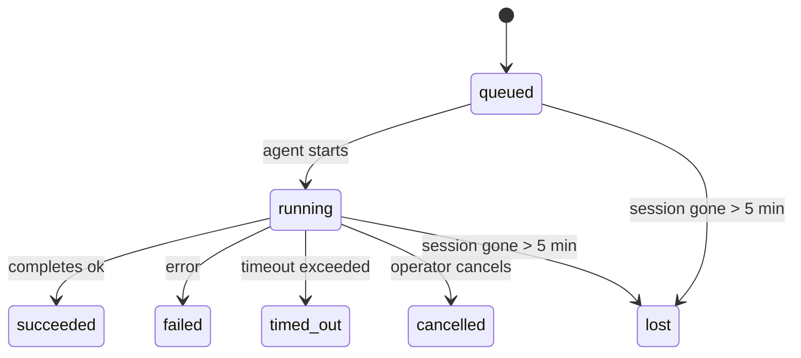

---
read_when:
    - فحص العمل في الخلفية قيد التنفيذ أو المكتمل مؤخرًا
    - تصحيح أخطاء حالات فشل التسليم في تشغيلات الوكيل المنفصلة
    - فهم كيفية ارتباط عمليات التشغيل في الخلفية بالجلسات وCron وHeartbeat
sidebarTitle: Background tasks
summary: تتبع المهام في الخلفية لعمليات تشغيل ACP، والوكلاء الفرعيين، ومهام Cron المعزولة، وعمليات CLI
title: مهام الخلفية
x-i18n:
    generated_at: "2026-05-06T07:42:36Z"
    model: gpt-5.5
    provider: openai
    source_hash: 055e16b4f53dbd089cc72eea7fe80bdaee5451dc56fa6e88a742f98e566bb57a
    source_path: automation/tasks.md
    workflow: 16
---

<Note>
تبحث عن الجدولة؟ راجع [الأتمتة والمهام](/ar/automation) لاختيار الآلية المناسبة. هذه الصفحة هي سجل النشاط للعمل في الخلفية، وليست المجدول.
</Note>

تتتبع مهام الخلفية العمل الذي يعمل **خارج جلسة المحادثة الرئيسية**: تشغيلات ACP، وإنشاءات الوكلاء الفرعيين، وتنفيذات مهام cron المعزولة، والعمليات التي تبدأها CLI.

لا تستبدل المهام الجلسات أو مهام cron أو heartbeats - فهي **سجل النشاط** الذي يسجل العمل المنفصل الذي حدث، ومتى حدث، وما إذا كان قد نجح.

<Note>
لا ينشئ كل تشغيل وكيل مهمة. لا تفعل ذلك دورات Heartbeat والمحادثات التفاعلية العادية. تفعل ذلك جميع تنفيذات cron، وإنشاءات ACP، وإنشاءات الوكلاء الفرعيين، وأوامر وكيل CLI.
</Note>

## المختصر

- المهام **سجلات** وليست مجدولات - يحدد cron وheartbeat _متى_ يعمل العمل، وتتتبع المهام _ما حدث_.
- ينشئ ACP والوكلاء الفرعيون وجميع مهام cron وعمليات CLI مهام. لا تفعل دورات Heartbeat ذلك.
- تنتقل كل مهمة عبر `queued → running → terminal` (succeeded أو failed أو timed_out أو cancelled أو lost).
- تبقى مهام Cron حية ما دام وقت تشغيل cron لا يزال يملك المهمة؛ إذا اختفت حالة وقت التشغيل داخل الذاكرة، تتحقق صيانة المهام أولا من سجل تشغيل cron الدائم قبل وسم مهمة بأنها مفقودة.
- الاكتمال مدفوع بالدفع: يمكن للعمل المنفصل الإشعار مباشرة أو إيقاظ جلسة/heartbeat الطالب عند انتهائه، لذلك تكون حلقات استطلاع الحالة غالبا الشكل غير المناسب.
- تحاول تشغيلات cron المعزولة واكتمالات الوكلاء الفرعيين، بأفضل جهد، تنظيف علامات تبويب/عمليات المتصفح المتتبعة لجلسة الطفل قبل مسك دفاتر التنظيف النهائي.
- يمنع تسليم cron المعزول ردود الوالد المؤقتة القديمة بينما لا يزال عمل الوكيل الفرعي التابع ينتهي، ويفضل مخرجات التابع النهائية عندما تصل قبل التسليم.
- يتم تسليم إشعارات الاكتمال مباشرة إلى قناة أو وضعها في قائمة انتظار حتى heartbeat التالي.
- يعرض `openclaw tasks list` كل المهام؛ ويكشف `openclaw tasks audit` المشكلات.
- تحفظ السجلات النهائية لمدة 7 أيام، ثم يتم حذفها تلقائيا.

## البدء السريع

<Tabs>
  <Tab title="اعرض وصف">
    ```bash
    # List all tasks (newest first)
    openclaw tasks list

    # Filter by runtime or status
    openclaw tasks list --runtime acp
    openclaw tasks list --status running
    ```

  </Tab>
  <Tab title="افحص">
    ```bash
    # Show details for a specific task (by ID, run ID, or session key)
    openclaw tasks show <lookup>
    ```
  </Tab>
  <Tab title="ألغ وأشعر">
    ```bash
    # Cancel a running task (kills the child session)
    openclaw tasks cancel <lookup>

    # Change notification policy for a task
    openclaw tasks notify <lookup> state_changes
    ```

  </Tab>
  <Tab title="التدقيق والصيانة">
    ```bash
    # Run a health audit
    openclaw tasks audit

    # Preview or apply maintenance
    openclaw tasks maintenance
    openclaw tasks maintenance --apply
    ```

  </Tab>
  <Tab title="تدفق المهمة">
    ```bash
    # Inspect TaskFlow state
    openclaw tasks flow list
    openclaw tasks flow show <lookup>
    openclaw tasks flow cancel <lookup>
    ```
  </Tab>
</Tabs>

## ما الذي ينشئ مهمة

| المصدر                 | نوع وقت التشغيل | متى يتم إنشاء سجل مهمة                          | سياسة الإشعار الافتراضية |
| ---------------------- | ------------ | ------------------------------------------------------ | --------------------- |
| تشغيلات ACP في الخلفية    | `acp`        | إنشاء جلسة ACP فرعية                           | `done_only`           |
| تنسيق الوكلاء الفرعيين | `subagent`   | إنشاء وكيل فرعي عبر `sessions_spawn`               | `done_only`           |
| مهام Cron (كل الأنواع)  | `cron`       | كل تنفيذ cron (الجلسة الرئيسية والمعزول)       | `silent`              |
| عمليات CLI         | `cli`        | أوامر `openclaw agent` التي تعمل عبر Gateway | `silent`              |
| مهام وسائط الوكيل       | `cli`        | تشغيلات `music_generate`/`video_generate` المدعومة بجلسة  | `silent`              |

<AccordionGroup>
  <Accordion title="افتراضيات الإشعار لـ cron والوسائط">
    تستخدم مهام cron في الجلسة الرئيسية سياسة إشعار `silent` افتراضيا - فهي تنشئ سجلات للتتبع لكنها لا تولد إشعارات. تستخدم مهام cron المعزولة أيضا `silent` افتراضيا لكنها أكثر وضوحا لأنها تعمل في جلستها الخاصة.

    تستخدم تشغيلات `music_generate` و`video_generate` المدعومة بجلسة أيضا سياسة إشعار `silent`. لا تزال تنشئ سجلات مهام، لكن الاكتمال يعاد إلى جلسة الوكيل الأصلية كإيقاظ داخلي حتى يتمكن الوكيل من كتابة رسالة المتابعة وإرفاق الوسائط المنتهية بنفسه. تتبع اكتمالات المجموعة/القناة سياسة الرد المرئي العادية، لذلك يستخدم الوكيل أداة الرسائل عندما يتطلب تسليم المصدر ذلك. إذا فشل وكيل الاكتمال في إنتاج دليل تسليم أداة الرسائل في مسار الأدوات فقط، يرسل OpenClaw بديل الاكتمال مباشرة إلى القناة الأصلية بدلا من ترك الوسائط خاصة.

  </Accordion>
  <Accordion title="حاجز حماية video_generate المتزامن">
    بينما تكون مهمة `video_generate` المدعومة بجلسة لا تزال نشطة، تعمل الأداة أيضا كحاجز حماية: تعيد استدعاءات `video_generate` المتكررة في الجلسة نفسها حالة المهمة النشطة بدلا من بدء توليد ثان متزامن. استخدم `action: "status"` عندما تريد بحثا صريحا عن التقدم/الحالة من جهة الوكيل.
  </Accordion>
  <Accordion title="ما لا ينشئ مهام">
    - دورات Heartbeat - الجلسة الرئيسية؛ راجع [Heartbeat](/ar/gateway/heartbeat)
    - دورات المحادثة التفاعلية العادية
    - ردود `/command` المباشرة

  </Accordion>
</AccordionGroup>

## دورة حياة المهمة



| الحالة      | ما تعنيه                                                              |
| ----------- | -------------------------------------------------------------------------- |
| `queued`    | تم إنشاؤها، وتنتظر بدء الوكيل                                    |
| `running`   | دور الوكيل ينفذ بنشاط                                           |
| `succeeded` | اكتملت بنجاح                                                     |
| `failed`    | اكتملت مع خطأ                                                    |
| `timed_out` | تجاوزت المهلة المكونة                                            |
| `cancelled` | أوقفها المشغل عبر `openclaw tasks cancel`                        |
| `lost`      | فقد وقت التشغيل حالة الدعم الموثوقة بعد فترة سماح قدرها 5 دقائق |

تحدث الانتقالات تلقائيا - عندما ينتهي تشغيل الوكيل المرتبط، يتم تحديث حالة المهمة لتطابقه.

اكتمال تشغيل الوكيل هو المرجع الموثوق لسجلات المهام النشطة. ينتهي التشغيل المنفصل الناجح كـ `succeeded`، وتنتهي أخطاء التشغيل العادية كـ `failed`، وتنتهي نتائج المهلة أو الإيقاف كـ `timed_out`. إذا كان المشغل قد ألغى المهمة بالفعل، أو كان وقت التشغيل قد سجل بالفعل حالة نهائية أقوى مثل `failed` أو `timed_out` أو `lost`، فلا تخفض إشارة نجاح لاحقة تلك الحالة النهائية.

`lost` واعية بوقت التشغيل:

- مهام ACP: اختفت بيانات تعريف جلسة ACP الفرعية الداعمة.
- مهام الوكيل الفرعي: اختفت الجلسة الفرعية الداعمة من مخزن الوكيل الهدف.
- مهام Cron: لم يعد وقت تشغيل cron يتتبع المهمة كنشطة ولا يظهر سجل تشغيل cron الدائم نتيجة نهائية لذلك التشغيل. لا يعامل تدقيق CLI دون اتصال حالة وقت تشغيل cron الفارغة داخل العملية الخاصة به كمرجع.
- مهام CLI: تستخدم مهام الجلسة الفرعية المعزولة الجلسة الفرعية؛ أما مهام CLI المدعومة بالمحادثة فتستخدم سياق التشغيل الحي بدلا من ذلك، لذلك لا تبقي صفوف جلسات القناة/المجموعة/المباشر العالقة هذه المهام حية. كذلك تنتهي تشغيلات `openclaw agent` المدعومة بـ Gateway من نتيجة تشغيلها، لذلك لا تبقى التشغيلات المكتملة نشطة حتى يضعها الكانس كـ `lost`.

## التسليم والإشعارات

عندما تصل مهمة إلى حالة نهائية، يخطرك OpenClaw. توجد مسارا تسليم:

**التسليم المباشر** - إذا كان للمهمة هدف قناة (`requesterOrigin`)، تنتقل رسالة الاكتمال مباشرة إلى تلك القناة (Telegram وDiscord وSlack وما إلى ذلك). بالنسبة لاكتمالات الوكلاء الفرعيين، يحافظ OpenClaw أيضا على توجيه الخيط/الموضوع المرتبط عندما يكون متاحا، ويمكنه ملء `to` / الحساب المفقود من المسار المخزن لجلسة الطالب (`lastChannel` / `lastTo` / `lastAccountId`) قبل التخلي عن التسليم المباشر.

**التسليم في قائمة انتظار الجلسة** - إذا فشل التسليم المباشر أو لم يتم تعيين أصل، يتم وضع التحديث في قائمة الانتظار كحدث نظام في جلسة الطالب ويظهر عند heartbeat التالي.

<Tip>
يؤدي اكتمال المهمة إلى إيقاظ heartbeat فوري حتى ترى النتيجة بسرعة - لا يلزمك انتظار نبضة heartbeat المجدولة التالية.
</Tip>

يعني ذلك أن سير العمل المعتاد قائم على الدفع: ابدأ العمل المنفصل مرة واحدة، ثم دع وقت التشغيل يوقظك أو يخطرك عند الاكتمال. استطلع حالة المهمة فقط عندما تحتاج إلى تصحيح أخطاء أو تدخل أو تدقيق صريح.

### سياسات الإشعار

تحكم في مقدار ما تسمعه عن كل مهمة:

| السياسة                | ما يتم تسليمه                                                       |
| --------------------- | ----------------------------------------------------------------------- |
| `done_only` (افتراضي) | الحالة النهائية فقط (succeeded وfailed وما إلى ذلك) - **هذا هو الافتراضي** |
| `state_changes`       | كل انتقال حالة وتحديث تقدم                              |
| `silent`              | لا شيء مطلقا                                                          |

غيّر السياسة أثناء تشغيل مهمة:

```bash
openclaw tasks notify <lookup> state_changes
```

## مرجع CLI

<AccordionGroup>
  <Accordion title="tasks list">
    ```bash
    openclaw tasks list [--runtime <acp|subagent|cron|cli>] [--status <status>] [--json]
    ```

    أعمدة المخرجات: معرف المهمة، النوع، الحالة، التسليم، معرف التشغيل، الجلسة الفرعية، الملخص.

  </Accordion>
  <Accordion title="tasks show">
    ```bash
    openclaw tasks show <lookup>
    ```

    يقبل رمز البحث معرف مهمة أو معرف تشغيل أو مفتاح جلسة. يعرض السجل الكامل بما في ذلك التوقيت وحالة التسليم والخطأ والملخص النهائي.

  </Accordion>
  <Accordion title="tasks cancel">
    ```bash
    openclaw tasks cancel <lookup>
    ```

    بالنسبة لمهام ACP والوكلاء الفرعيين، يقتل هذا الجلسة الفرعية. بالنسبة للمهام المتتبعة عبر CLI، يسجل الإلغاء في سجل المهام (لا يوجد مقبض وقت تشغيل فرعي منفصل). تنتقل الحالة إلى `cancelled` ويرسل إشعار تسليم عند الاقتضاء.

  </Accordion>
  <Accordion title="tasks notify">
    ```bash
    openclaw tasks notify <lookup> <done_only|state_changes|silent>
    ```
  </Accordion>
  <Accordion title="tasks audit">
    ```bash
    openclaw tasks audit [--json]
    ```

    يكشف المشكلات التشغيلية. تظهر النتائج أيضا في `openclaw status` عند اكتشاف مشكلات.

    | النتيجة                 | الشدة      | المشغّل                                                                                                         |
    | ------------------------- | ---------- | ---------------------------------------------------------------------------------------------------------------- |
    | `stale_queued`            | warn       | في قائمة الانتظار لأكثر من 10 دقائق                                                                              |
    | `stale_running`           | error      | قيد التشغيل لأكثر من 30 دقيقة                                                                                    |
    | `lost`                    | warn/error | اختفت ملكية المهمة المدعومة بوقت التشغيل؛ تبقى المهام المفقودة المحتفظ بها كتحذيرات حتى `cleanupAfter`، ثم تصبح أخطاء |
    | `delivery_failed`         | warn       | فشل التسليم وسياسة الإشعار ليست `silent`                                                                          |
    | `missing_cleanup`         | warn       | مهمة نهائية بلا طابع زمني للتنظيف                                                                                |
    | `inconsistent_timestamps` | warn       | انتهاك في الخط الزمني (على سبيل المثال انتهت قبل أن تبدأ)                                                        |

  </Accordion>
  <Accordion title="tasks maintenance">
    ```bash
    openclaw tasks maintenance [--json]
    openclaw tasks maintenance --apply [--json]
    ```

    استخدم هذا لمعاينة أو تطبيق المطابقة، وختم التنظيف، والتقليم للمهام وحالة Task Flow.

    المطابقة واعية بوقت التشغيل:

    - تتحقق مهام ACP/الوكيل الفرعي من جلسة الطفل الداعمة لها.
    - تُعلَّم مهام الوكيل الفرعي التي تحتوي جلسة الطفل الخاصة بها على شاهدة استرداد بعد إعادة التشغيل كمفقودة بدلاً من التعامل معها كجلسات داعمة قابلة للاسترداد.
    - تتحقق مهام Cron مما إذا كان وقت تشغيل cron لا يزال يملك المهمة، ثم تستعيد الحالة النهائية من سجلات تشغيل cron/حالة المهمة المحفوظة قبل الرجوع إلى `lost`. عملية Gateway فقط هي المرجع الموثوق لمجموعة المهام النشطة في الذاكرة الخاصة بـ cron؛ يستخدم تدقيق CLI دون اتصال السجل الدائم لكنه لا يعلّم مهمة cron كمفقودة لمجرد أن تلك المجموعة المحلية فارغة.
    - تتحقق مهام CLI المدعومة بالمحادثة من سياق التشغيل الحي المالك، وليس فقط صف جلسة المحادثة.

    تنظيف الإكمال واعٍ أيضاً بوقت التشغيل:

    - يحاول إكمال الوكيل الفرعي بأفضل جهد إغلاق ألسنة المتصفح/العمليات المتتبعة لجلسة الطفل قبل متابعة تنظيف الإعلان.
    - يحاول إكمال cron المعزول بأفضل جهد إغلاق ألسنة المتصفح/العمليات المتتبعة لجلسة cron قبل تفكيك التشغيل بالكامل.
    - ينتظر تسليم cron المعزول متابعة الوكيل الفرعي السليل عند الحاجة ويكبت نص إقرار الأصل القديم بدلاً من إعلانه.
    - يفضّل تسليم إكمال الوكيل الفرعي أحدث نص مساعد مرئي؛ وإذا كان فارغاً يعود إلى أحدث نص أداة/toolResult بعد تنقيحه، ويمكن لعمليات تشغيل استدعاء الأدوات التي انتهت بمهلة فقط أن تُختصر إلى ملخص قصير للتقدم الجزئي. تعلن عمليات التشغيل النهائية الفاشلة حالة الفشل دون إعادة عرض نص الرد الملتقط.
    - لا تحجب حالات فشل التنظيف نتيجة المهمة الحقيقية.

  </Accordion>
  <Accordion title="tasks flow list | show | cancel">
    ```bash
    openclaw tasks flow list [--status <status>] [--json]
    openclaw tasks flow show <lookup> [--json]
    openclaw tasks flow cancel <lookup>
    ```

    استخدم هذه عندما يكون Task Flow المنسّق هو ما يهمك بدلاً من سجل مهمة خلفية فردي واحد.

  </Accordion>
</AccordionGroup>

## لوحة مهام المحادثة (`/tasks`)

استخدم `/tasks` في أي جلسة محادثة لرؤية المهام الخلفية المرتبطة بتلك الجلسة. تعرض اللوحة المهام النشطة والمكتملة حديثاً مع وقت التشغيل والحالة والتوقيت والتقدم أو تفاصيل الخطأ.

عندما لا تحتوي الجلسة الحالية على مهام مرتبطة مرئية، يعود `/tasks` إلى أعداد المهام المحلية للوكيل حتى تحصل على نظرة عامة دون كشف تفاصيل جلسات أخرى.

للسجل التشغيلي الكامل، استخدم CLI: `openclaw tasks list`.

## تكامل الحالة (ضغط المهام)

يتضمن `openclaw status` ملخصاً سريعاً للمهام:

```
Tasks: 3 queued · 2 running · 1 issues
```

يعرض الملخص:

- **نشطة** - عدد `queued` + `running`
- **الإخفاقات** - عدد `failed` + `timed_out` + `lost`
- **حسب وقت التشغيل** - تفصيل حسب `acp` و`subagent` و`cron` و`cli`

يستخدم كل من `/status` وأداة `session_status` لقطة مهام واعية بالتنظيف: تُفضَّل المهام النشطة، وتُخفى الصفوف المكتملة القديمة، ولا تظهر الإخفاقات الحديثة إلا عندما لا يبقى أي عمل نشط. هذا يبقي بطاقة الحالة مركّزة على ما يهم الآن.

## التخزين والصيانة

### أين توجد المهام

تستمر سجلات المهام في SQLite عند:

```
$OPENCLAW_STATE_DIR/tasks/runs.sqlite
```

يُحمَّل السجل في الذاكرة عند بدء Gateway ويزامن عمليات الكتابة إلى SQLite لضمان المتانة عبر عمليات إعادة التشغيل.
يبقي Gateway سجل الكتابة المسبقة في SQLite محدوداً باستخدام عتبة
autocheckpoint الافتراضية في SQLite مع نقاط فحص دورية وعند الإيقاف من نوع `TRUNCATE`.

### الصيانة التلقائية

يعمل ماسح كل **60 ثانية** ويتولى أربعة أمور:

<Steps>
  <Step title="المطابقة">
    يتحقق مما إذا كانت المهام النشطة لا تزال تمتلك دعماً موثوقاً من وقت التشغيل. تستخدم مهام ACP/الوكيل الفرعي حالة جلسة الطفل، وتستخدم مهام cron ملكية المهمة النشطة، وتستخدم مهام CLI المدعومة بالمحادثة سياق التشغيل المالك. إذا اختفت تلك الحالة الداعمة لأكثر من 5 دقائق، تُعلَّم المهمة كـ `lost`.
  </Step>
  <Step title="إصلاح جلسة ACP">
    يغلق جلسات ACP أحادية التشغيل النهائية أو اليتيمة المملوكة للأصل، ويغلق جلسات ACP المستمرة النهائية القديمة أو اليتيمة فقط عندما لا يبقى أي ربط محادثة نشط.
  </Step>
  <Step title="ختم التنظيف">
    يعيّن طابعاً زمنياً `cleanupAfter` على المهام النهائية (endedAt + 7 أيام). أثناء الاحتفاظ، تظل المهام المفقودة ظاهرة في التدقيق كتحذيرات؛ وبعد انتهاء `cleanupAfter` أو عندما تكون بيانات التنظيف الوصفية مفقودة، تصبح أخطاء.
  </Step>
  <Step title="التقليم">
    يحذف السجلات التي تجاوزت تاريخ `cleanupAfter`.
  </Step>
</Steps>

<Note>
**الاحتفاظ:** تُحفظ سجلات المهام النهائية لمدة **7 أيام**، ثم تُقلَّم تلقائياً. لا يلزم أي إعداد.
</Note>

## كيف ترتبط المهام بالأنظمة الأخرى

<AccordionGroup>
  <Accordion title="المهام وTask Flow">
    [Task Flow](/ar/automation/taskflow) هو طبقة تنسيق التدفق فوق المهام الخلفية. قد ينسّق تدفق واحد عدة مهام طوال عمره باستخدام أوضاع مزامنة مُدارة أو معكوسة. استخدم `openclaw tasks` لفحص سجلات المهام الفردية و`openclaw tasks flow` لفحص التدفق المنسّق.

    راجع [Task Flow](/ar/automation/taskflow) للتفاصيل.

  </Accordion>
  <Accordion title="المهام وcron">
    يوجد **تعريف** مهمة cron في `~/.openclaw/cron/jobs.json`؛ وتوجد حالة تنفيذ وقت التشغيل بجانبه في `~/.openclaw/cron/jobs-state.json`. ينشئ **كل** تنفيذ cron سجل مهمة، سواء كان في الجلسة الرئيسية أو معزولاً. تعتمد مهام cron في الجلسة الرئيسية افتراضياً سياسة إشعار `silent` بحيث تتتبع دون إنشاء إشعارات.

    راجع [مهام Cron](/ar/automation/cron-jobs).

  </Accordion>
  <Accordion title="المهام وHeartbeat">
    عمليات تشغيل Heartbeat هي أدوار في الجلسة الرئيسية، ولا تنشئ سجلات مهام. عندما تكتمل مهمة، يمكنها تشغيل إيقاظ Heartbeat حتى ترى النتيجة بسرعة.

    راجع [Heartbeat](/ar/gateway/heartbeat).

  </Accordion>
  <Accordion title="المهام والجلسات">
    قد تشير المهمة إلى `childSessionKey` (حيث يعمل التنفيذ) و`requesterSessionKey` (من بدأها). الجلسات هي سياق المحادثة؛ أما المهام فهي تتبع للنشاط فوق ذلك.
  </Accordion>
  <Accordion title="المهام وعمليات تشغيل الوكيل">
    يربط `runId` الخاص بالمهمة بعملية تشغيل الوكيل التي تنجز العمل. تحدّث أحداث دورة حياة الوكيل (البدء، الانتهاء، الخطأ) حالة المهمة تلقائياً، ولا تحتاج إلى إدارة دورة الحياة يدوياً.
  </Accordion>
</AccordionGroup>

## ذو صلة

- [الأتمتة والمهام](/ar/automation) - كل آليات الأتمتة في لمحة
- [CLI: المهام](/ar/cli/tasks) - مرجع أوامر CLI
- [Heartbeat](/ar/gateway/heartbeat) - أدوار دورية في الجلسة الرئيسية
- [المهام المجدولة](/ar/automation/cron-jobs) - جدولة العمل في الخلفية
- [Task Flow](/ar/automation/taskflow) - تنسيق التدفق فوق المهام
