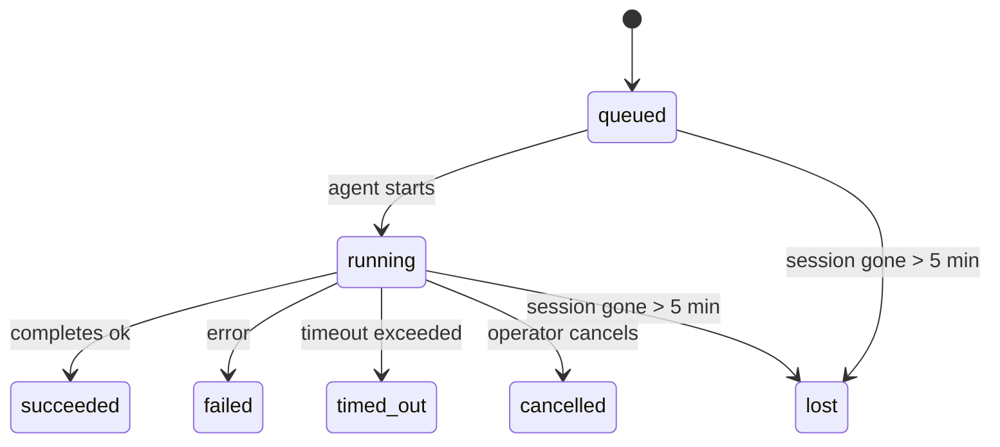

---
read_when:
    - فحص العمل في الخلفية الجاري أو المكتمل حديثًا
    - تصحيح أخطاء فشل التسليم لعمليات تشغيل الوكيل المنفصلة
    - فهم كيفية ارتباط عمليات التشغيل في الخلفية بالجلسات وCron وHeartbeat
sidebarTitle: Background tasks
summary: تتبع المهام الخلفية لتشغيلات ACP والوكلاء الفرعيين ووظائف Cron المعزولة وعمليات CLI
title: مهام الخلفية
x-i18n:
    generated_at: "2026-05-01T07:38:06Z"
    model: gpt-5.5
    provider: openai
    source_hash: 8782987a79989264ae3bd1ca4b16755bdfb7e295e4f77933bf3a38c136d837f4
    source_path: automation/tasks.md
    workflow: 16
---

<Note>
هل تبحث عن الجدولة؟ راجع [الأتمتة والمهام](/ar/automation) لاختيار الآلية المناسبة. هذه الصفحة هي سجل النشاط لأعمال الخلفية، وليست المجدول.
</Note>

تتتبع مهام الخلفية الأعمال التي تعمل **خارج جلسة محادثتك الرئيسية**: تشغيلات ACP، وإنشاءات الوكلاء الفرعيين، وتنفيذات مهام Cron المعزولة، والعمليات التي يبدأها CLI.

لا تستبدل المهام الجلسات أو مهام Cron أو Heartbeat — بل هي **سجل النشاط** الذي يسجل العمل المنفصل الذي حدث، ومتى حدث، وما إذا كان قد نجح.

<Note>
لا ينشئ كل تشغيل للوكيل مهمة. دورات Heartbeat والدردشة التفاعلية العادية لا تفعل ذلك. كل تنفيذات Cron، وإنشاءات ACP، وإنشاءات الوكلاء الفرعيين، وأوامر وكيل CLI تفعل ذلك.
</Note>

## باختصار

- المهام هي **سجلات**، وليست مجدولات — يقرر Cron وHeartbeat _متى_ يعمل العمل، وتتتبع المهام _ما حدث_.
- ينشئ ACP والوكلاء الفرعيون وكل مهام Cron وعمليات CLI مهام. دورات Heartbeat لا تفعل ذلك.
- تنتقل كل مهمة عبر `queued → running → terminal` (succeeded أو failed أو timed_out أو cancelled أو lost).
- تبقى مهام Cron نشطة ما دام وقت تشغيل Cron لا يزال يملك المهمة؛ إذا اختفت
  حالة وقت التشغيل في الذاكرة، تتحقق صيانة المهام أولا من سجل تشغيلات Cron
  الدائم قبل وسم المهمة بأنها مفقودة.
- الإكمال مدفوع بالدفع: يمكن للعمل المنفصل أن يرسل إشعارا مباشرة أو يوقظ
  جلسة الطالب/Heartbeat عند الانتهاء، لذلك تكون حلقات استطلاع الحالة
  عادة بالشكل غير المناسب.
- تحاول تشغيلات Cron المعزولة وإكمالات الوكلاء الفرعيين، قدر الإمكان، تنظيف علامات تبويب/عمليات المتصفح المتتبعة لجلساتها الفرعية قبل محاسبة التنظيف النهائية.
- يمنع تسليم Cron المعزول الردود المرحلية القديمة من الأصل بينما لا يزال عمل الوكلاء الفرعيين اللاحقين قيد التصريف، ويفضل خرج اللاحق النهائي عندما يصل قبل التسليم.
- يتم تسليم إشعارات الإكمال مباشرة إلى قناة أو وضعها في قائمة الانتظار حتى Heartbeat التالية.
- يعرض `openclaw tasks list` كل المهام؛ ويكشف `openclaw tasks audit` المشكلات.
- يتم الاحتفاظ بالسجلات النهائية لمدة 7 أيام، ثم تزال تلقائيا.

## بداية سريعة

<Tabs>
  <Tab title="List and filter">
    ```bash
    # List all tasks (newest first)
    openclaw tasks list

    # Filter by runtime or status
    openclaw tasks list --runtime acp
    openclaw tasks list --status running
    ```

  </Tab>
  <Tab title="Inspect">
    ```bash
    # Show details for a specific task (by ID, run ID, or session key)
    openclaw tasks show <lookup>
    ```
  </Tab>
  <Tab title="Cancel and notify">
    ```bash
    # Cancel a running task (kills the child session)
    openclaw tasks cancel <lookup>

    # Change notification policy for a task
    openclaw tasks notify <lookup> state_changes
    ```

  </Tab>
  <Tab title="Audit and maintenance">
    ```bash
    # Run a health audit
    openclaw tasks audit

    # Preview or apply maintenance
    openclaw tasks maintenance
    openclaw tasks maintenance --apply
    ```

  </Tab>
  <Tab title="Task flow">
    ```bash
    # Inspect TaskFlow state
    openclaw tasks flow list
    openclaw tasks flow show <lookup>
    openclaw tasks flow cancel <lookup>
    ```
  </Tab>
</Tabs>

## ما الذي ينشئ مهمة

| المصدر                 | نوع وقت التشغيل | متى يتم إنشاء سجل مهمة                          | سياسة الإشعار الافتراضية |
| ---------------------- | ------------ | ------------------------------------------------------ | --------------------- |
| تشغيلات ACP في الخلفية    | `acp`        | إنشاء جلسة ACP فرعية                           | `done_only`           |
| تنسيق الوكلاء الفرعيين | `subagent`   | إنشاء وكيل فرعي عبر `sessions_spawn`               | `done_only`           |
| مهام Cron (كل الأنواع)  | `cron`       | كل تنفيذ Cron (الجلسة الرئيسية والمعزول)       | `silent`              |
| عمليات CLI         | `cli`        | أوامر `openclaw agent` التي تعمل عبر Gateway | `silent`              |
| مهام وسائط الوكيل       | `cli`        | تشغيلات `music_generate`/`video_generate` المدعومة بجلسة  | `silent`              |

<AccordionGroup>
  <Accordion title="Notify defaults for cron and media">
    تستخدم مهام Cron في الجلسة الرئيسية سياسة إشعار `silent` افتراضيا — فهي تنشئ سجلات للتتبع لكنها لا تولد إشعارات. تستخدم مهام Cron المعزولة أيضا `silent` افتراضيا لكنها أوضح لأنها تعمل في جلستها الخاصة.

    تستخدم تشغيلات `music_generate` و`video_generate` المدعومة بجلسة أيضا سياسة إشعار `silent`. لا تزال تنشئ سجلات مهام، لكن الإكمال يعاد إلى جلسة الوكيل الأصلية كإيقاظ داخلي كي يتمكن الوكيل من كتابة رسالة المتابعة وإرفاق الوسائط المكتملة بنفسه. إذا اخترت `tools.media.asyncCompletion.directSend`، يمكن لإكمالات `video_generate` غير المتزامنة أن تحاول التسليم المباشر إلى القناة أولا؛ تبقى إكمالات `music_generate` غير المتزامنة على مسار إيقاظ جلسة الطالب.

  </Accordion>
  <Accordion title="Concurrent video_generate guardrail">
    بينما لا تزال مهمة `video_generate` المدعومة بجلسة نشطة، تعمل الأداة أيضا كحاجز حماية: ترجع استدعاءات `video_generate` المتكررة في الجلسة نفسها حالة المهمة النشطة بدلا من بدء توليد ثان متزامن. استخدم `action: "status"` عندما تريد بحث تقدم/حالة صريحا من جهة الوكيل.
  </Accordion>
  <Accordion title="What does not create tasks">
    - دورات Heartbeat — الجلسة الرئيسية؛ راجع [Heartbeat](/ar/gateway/heartbeat)
    - دورات الدردشة التفاعلية العادية
    - ردود `/command` المباشرة

  </Accordion>
</AccordionGroup>

## دورة حياة المهمة



| الحالة      | ما تعنيه                                                              |
| ----------- | -------------------------------------------------------------------------- |
| `queued`    | تم إنشاؤها، وتنتظر بدء الوكيل                                    |
| `running`   | دورة الوكيل قيد التنفيذ النشط                                           |
| `succeeded` | اكتملت بنجاح                                                     |
| `failed`    | اكتملت مع خطأ                                                    |
| `timed_out` | تجاوزت المهلة المضبوطة                                            |
| `cancelled` | أوقفها المشغل عبر `openclaw tasks cancel`                        |
| `lost`      | فقد وقت التشغيل حالة الإسناد الموثوقة بعد فترة سماح قدرها 5 دقائق |

تحدث الانتقالات تلقائيا — عندما ينتهي تشغيل الوكيل المرتبط، تحدث حالة المهمة لتطابقه.

إكمال تشغيل الوكيل هو المرجع الموثوق لسجلات المهام النشطة. ينهي التشغيل المنفصل الناجح بالحالة `succeeded`، وتنهي أخطاء التشغيل العادية بالحالة `failed`، وتنهي نتائج انتهاء المهلة أو الإجهاض بالحالة `timed_out`. إذا كان المشغل قد ألغى المهمة بالفعل، أو كان وقت التشغيل قد سجل بالفعل حالة نهائية أقوى مثل `failed` أو `timed_out` أو `lost`، فلن تخفض إشارة نجاح لاحقة تلك الحالة النهائية.

`lost` واعية بوقت التشغيل:

- مهام ACP: اختفت بيانات وصف جلسة ACP الفرعية الداعمة.
- مهام الوكلاء الفرعيين: اختفت الجلسة الفرعية الداعمة من مخزن الوكيل الهدف.
- مهام Cron: لم يعد وقت تشغيل Cron يتتبع المهمة على أنها نشطة ولا يظهر
  سجل تشغيلات Cron الدائم نتيجة نهائية لذلك التشغيل. لا يتعامل تدقيق CLI
  غير المتصل مع حالة وقت تشغيل Cron الفارغة داخل عمليته على أنها مرجعية.
- مهام CLI: تستخدم مهام الجلسات الفرعية المعزولة الجلسة الفرعية؛ أما مهام CLI
  المدعومة بالدردشة فتستخدم سياق التشغيل الحي بدلا من ذلك، لذلك لا تبقي
  صفوف جلسات القناة/المجموعة/المباشر العالقة هذه المهام حية. تنهي أيضا
  تشغيلات `openclaw agent` المدعومة بـ Gateway من نتيجة تشغيلها، لذلك لا تبقى
  التشغيلات المكتملة نشطة حتى يوسمها المنظف بأنها `lost`.

## التسليم والإشعارات

عندما تصل مهمة إلى حالة نهائية، يخطرك OpenClaw. هناك مسارا تسليم:

**التسليم المباشر** — إذا كان للمهمة هدف قناة (`requesterOrigin`)، تنتقل رسالة الإكمال مباشرة إلى تلك القناة (Telegram وDiscord وSlack وما إلى ذلك). بالنسبة لإكمالات الوكلاء الفرعيين، يحافظ OpenClaw أيضا على توجيه الخيط/الموضوع المرتبط عند توفره ويمكنه ملء `to` / الحساب المفقود من المسار المخزن لجلسة الطالب (`lastChannel` / `lastTo` / `lastAccountId`) قبل التخلي عن التسليم المباشر.

**التسليم في قائمة انتظار الجلسة** — إذا فشل التسليم المباشر أو لم يتم تعيين أصل، يوضع التحديث في قائمة الانتظار كحدث نظام في جلسة الطالب ويظهر في Heartbeat التالية.

<Tip>
يحفز إكمال المهمة إيقاظ Heartbeat فوريا حتى ترى النتيجة بسرعة — لا يلزمك انتظار نبضة Heartbeat المجدولة التالية.
</Tip>

يعني ذلك أن سير العمل المعتاد قائم على الدفع: ابدأ العمل المنفصل مرة واحدة، ثم دع وقت التشغيل يوقظك أو يخطرك عند الإكمال. استطلع حالة المهمة فقط عندما تحتاج إلى التصحيح أو التدخل أو تدقيق صريح.

### سياسات الإشعار

تحكم في مقدار ما تسمعه عن كل مهمة:

| السياسة                | ما يتم تسليمه                                                       |
| --------------------- | ----------------------------------------------------------------------- |
| `done_only` (افتراضي) | الحالة النهائية فقط (succeeded وfailed وما إلى ذلك) — **هذا هو الافتراضي** |
| `state_changes`       | كل انتقال حالة وتحديث تقدم                              |
| `silent`              | لا شيء إطلاقا                                                          |

غير السياسة أثناء تشغيل مهمة:

```bash
openclaw tasks notify <lookup> state_changes
```

## مرجع CLI

<AccordionGroup>
  <Accordion title="tasks list">
    ```bash
    openclaw tasks list [--runtime <acp|subagent|cron|cli>] [--status <status>] [--json]
    ```

    أعمدة الخرج: معرف المهمة، النوع، الحالة، التسليم، معرف التشغيل، الجلسة الفرعية، الملخص.

  </Accordion>
  <Accordion title="tasks show">
    ```bash
    openclaw tasks show <lookup>
    ```

    يقبل رمز البحث معرف مهمة أو معرف تشغيل أو مفتاح جلسة. يعرض السجل الكامل بما في ذلك التوقيت وحالة التسليم والخطأ والملخص النهائي.

  </Accordion>
  <Accordion title="tasks cancel">
    ```bash
    openclaw tasks cancel <lookup>
    ```

    بالنسبة لمهام ACP والوكلاء الفرعيين، يقتل هذا الجلسة الفرعية. بالنسبة للمهام التي يتتبعها CLI، يسجل الإلغاء في سجل المهام (لا يوجد مقبض وقت تشغيل فرعي منفصل). تنتقل الحالة إلى `cancelled` ويتم إرسال إشعار تسليم عند الاقتضاء.

  </Accordion>
  <Accordion title="tasks notify">
    ```bash
    openclaw tasks notify <lookup> <done_only|state_changes|silent>
    ```
  </Accordion>
  <Accordion title="tasks audit">
    ```bash
    openclaw tasks audit [--json]
    ```

    يكشف المشكلات التشغيلية. تظهر النتائج أيضا في `openclaw status` عند اكتشاف مشكلات.

    | النتيجة                   | الخطورة   | المحفز                                                                                                      |
    | ------------------------- | ---------- | ------------------------------------------------------------------------------------------------------------ |
    | `stale_queued`            | warn       | في قائمة الانتظار لأكثر من 10 دقائق                                                                              |
    | `stale_running`           | error      | قيد التشغيل لأكثر من 30 دقيقة                                                                             |
    | `lost`                    | warn/error | اختفت ملكية المهمة المدعومة بوقت التشغيل؛ تبقى المهام المفقودة المحتفَظ بها كتحذيرات حتى `cleanupAfter`، ثم تصبح أخطاء |
    | `delivery_failed`         | warn       | فشل التسليم وسياسة الإشعار ليست `silent`                                                            |
    | `missing_cleanup`         | warn       | مهمة نهائية بلا طابع زمني للتنظيف                                                                      |
    | `inconsistent_timestamps` | warn       | مخالفة في المخطط الزمني (مثلًا انتهت قبل أن تبدأ)                                                        |

  </Accordion>
  <Accordion title="صيانة المهام">
    ```bash
    openclaw tasks maintenance [--json]
    openclaw tasks maintenance --apply [--json]
    ```

    استخدم هذا لمعاينة أو تطبيق التسوية، وختم التنظيف، والتقليم للمهام وحالة تدفق المهام.

    التسوية واعية بوقت التشغيل:

    - تتحقق مهام ACP/الوكيل الفرعي من جلسة الطفل الداعمة لها.
    - تُوسم مهام الوكيل الفرعي التي تحتوي جلسة الطفل الخاصة بها على شاهد قبر لاسترداد إعادة التشغيل كمفقودة بدلًا من معاملتها كجلسات داعمة قابلة للاسترداد.
    - تتحقق مهام Cron مما إذا كان وقت تشغيل cron ما زال يملك المهمة، ثم تستعيد الحالة النهائية من سجلات تشغيل cron المستمرة/حالة المهمة قبل الرجوع إلى `lost`. تكون عملية Gateway فقط هي المرجع الموثوق لمجموعة مهام cron النشطة داخل الذاكرة؛ يستخدم تدقيق CLI دون اتصال السجل الدائم لكنه لا يوسم مهمة cron كمفقودة لمجرد أن تلك المجموعة المحلية Set فارغة.
    - تتحقق مهام CLI المدعومة بالمحادثة من سياق التشغيل الحي المالك، وليس فقط من صف جلسة المحادثة.

    تنظيف الإكمال واعٍ أيضًا بوقت التشغيل:

    - يحاول إكمال الوكيل الفرعي، بأفضل جهد، إغلاق تبويبات/عمليات المتصفح المتتبعة لجلسة الطفل قبل متابعة تنظيف الإعلان.
    - يحاول إكمال cron المعزول، بأفضل جهد، إغلاق تبويبات/عمليات المتصفح المتتبعة لجلسة cron قبل تفكيك التشغيل بالكامل.
    - ينتظر تسليم cron المعزول متابعة الوكيل الفرعي المنحدر عند الحاجة ويمنع نص إقرار الأصل المتقادم بدلًا من إعلانه.
    - يفضل تسليم إكمال الوكيل الفرعي أحدث نص مساعد ظاهر؛ إذا كان ذلك فارغًا، فإنه يرجع إلى أحدث نص أداة/نتيجة أداة مُنقّى، ويمكن لتشغيلات استدعاء الأدوات التي انتهت بالمهلة فقط أن تختصر إلى ملخص تقدم جزئي قصير. تعلن التشغيلات النهائية الفاشلة حالة الفشل دون إعادة عرض نص الرد الملتقط.
    - لا تحجب إخفاقات التنظيف النتيجة الحقيقية للمهمة.

  </Accordion>
  <Accordion title="قائمة | عرض | إلغاء تدفق المهام">
    ```bash
    openclaw tasks flow list [--status <status>] [--json]
    openclaw tasks flow show <lookup> [--json]
    openclaw tasks flow cancel <lookup>
    ```

    استخدم هذه عندما يكون تدفق المهام المنسق هو ما يهمك بدلًا من سجل مهمة خلفية فردي.

  </Accordion>
</AccordionGroup>

## لوحة مهام المحادثة (`/tasks`)

استخدم `/tasks` في أي جلسة محادثة لرؤية المهام الخلفية المرتبطة بتلك الجلسة. تعرض اللوحة المهام النشطة والمكتملة حديثًا مع وقت التشغيل، والحالة، والتوقيت، وتفاصيل التقدم أو الخطأ.

عندما لا تكون للجلسة الحالية مهام مرتبطة مرئية، يرجع `/tasks` إلى أعداد المهام المحلية للوكيل حتى تحصل على نظرة عامة دون كشف تفاصيل جلسات أخرى.

للسجل الكامل للمشغل، استخدم CLI: `openclaw tasks list`.

## تكامل الحالة (ضغط المهام)

يتضمن `openclaw status` ملخصًا سريعًا للمهام:

```
Tasks: 3 queued · 2 running · 1 issues
```

يعرض الملخص:

- **نشطة** — عدد `queued` + `running`
- **إخفاقات** — عدد `failed` + `timed_out` + `lost`
- **حسب وقت التشغيل** — تفصيل حسب `acp`، و`subagent`، و`cron`، و`cli`

يستخدم كل من `/status` وأداة `session_status` لقطة مهام واعية بالتنظيف: تُفضّل المهام النشطة، وتُخفى الصفوف المكتملة المتقادمة، ولا تظهر الإخفاقات الحديثة إلا عندما لا يبقى عمل نشط. هذا يبقي بطاقة الحالة مركزة على ما يهم الآن.

## التخزين والصيانة

### أين تعيش المهام

تستمر سجلات المهام في SQLite عند:

```
$OPENCLAW_STATE_DIR/tasks/runs.sqlite
```

يُحمّل السجل في الذاكرة عند بدء Gateway ويزامن الكتابات إلى SQLite لضمان الاستمرارية عبر عمليات إعادة التشغيل.
يبقي Gateway سجل الكتابة المسبقة في SQLite محدودًا باستخدام عتبة
autocheckpoint الافتراضية في SQLite بالإضافة إلى نقاط تحقق `TRUNCATE` الدورية وعند إيقاف التشغيل.

### الصيانة التلقائية

يعمل ماسح كل **60 ثانية** ويتولى أربعة أمور:

<Steps>
  <Step title="التسوية">
    يتحقق مما إذا كانت المهام النشطة لا تزال تملك دعمًا موثوقًا من وقت التشغيل. تستخدم مهام ACP/الوكيل الفرعي حالة جلسة الطفل، وتستخدم مهام cron ملكية المهمة النشطة، وتستخدم مهام CLI المدعومة بالمحادثة سياق التشغيل المالك. إذا اختفت حالة الدعم تلك لأكثر من 5 دقائق، تُوسم المهمة كـ `lost`.
  </Step>
  <Step title="إصلاح جلسة ACP">
    يغلق جلسات ACP النهائية أو اليتيمة ذات اللقطة الواحدة المملوكة للأصل، ويغلق جلسات ACP المستمرة النهائية المتقادمة أو اليتيمة فقط عندما لا يبقى أي ربط محادثة نشط.
  </Step>
  <Step title="ختم التنظيف">
    يعيّن طابعًا زمنيًا `cleanupAfter` على المهام النهائية (endedAt + 7 أيام). أثناء الاحتفاظ، تستمر المهام المفقودة في الظهور في التدقيق كتحذيرات؛ وبعد انتهاء `cleanupAfter` أو عند غياب بيانات التنظيف الوصفية، تصبح أخطاء.
  </Step>
  <Step title="التقليم">
    يحذف السجلات التي تجاوزت تاريخ `cleanupAfter` الخاص بها.
  </Step>
</Steps>

<Note>
**الاحتفاظ:** تُحفظ سجلات المهام النهائية لمدة **7 أيام**، ثم تُقلم تلقائيًا. لا حاجة إلى أي إعداد.
</Note>

## كيف ترتبط المهام بالأنظمة الأخرى

<AccordionGroup>
  <Accordion title="المهام وتدفق المهام">
    [تدفق المهام](/ar/automation/taskflow) هو طبقة تنسيق التدفق فوق المهام الخلفية. يمكن لتدفق واحد أن ينسق عدة مهام طوال عمره باستخدام أوضاع مزامنة مُدارة أو معكوسة. استخدم `openclaw tasks` لفحص سجلات المهام الفردية و`openclaw tasks flow` لفحص التدفق المنسق.

    راجع [تدفق المهام](/ar/automation/taskflow) للتفاصيل.

  </Accordion>
  <Accordion title="المهام وcron">
    يعيش **تعريف** مهمة cron في `~/.openclaw/cron/jobs.json`؛ وتعيش حالة تنفيذ وقت التشغيل بجانبه في `~/.openclaw/cron/jobs-state.json`. ينشئ **كل** تنفيذ cron سجل مهمة، سواء كان من الجلسة الرئيسية أو معزولًا. تضبط مهام cron في الجلسة الرئيسية افتراضيًا سياسة الإشعار إلى `silent` حتى تتتبع دون إنشاء إشعارات.

    راجع [مهام Cron](/ar/automation/cron-jobs).

  </Accordion>
  <Accordion title="المهام وHeartbeat">
    تشغيلات Heartbeat هي أدوار في الجلسة الرئيسية، ولا تنشئ سجلات مهام. عندما تكتمل مهمة، يمكنها تشغيل إيقاظ Heartbeat حتى ترى النتيجة فورًا.

    راجع [Heartbeat](/ar/gateway/heartbeat).

  </Accordion>
  <Accordion title="المهام والجلسات">
    قد تشير المهمة إلى `childSessionKey` (حيث يجري العمل) و`requesterSessionKey` (من بدأها). الجلسات هي سياق المحادثة؛ والمهام هي تتبع النشاط فوق ذلك.
  </Accordion>
  <Accordion title="المهام وتشغيلات الوكيل">
    يربط `runId` الخاص بالمهمة بتشغيل الوكيل الذي ينجز العمل. تُحدّث أحداث دورة حياة الوكيل (البدء، والانتهاء، والخطأ) حالة المهمة تلقائيًا، ولا تحتاج إلى إدارة دورة الحياة يدويًا.
  </Accordion>
</AccordionGroup>

## ذات صلة

- [الأتمتة والمهام](/ar/automation) — كل آليات الأتمتة في لمحة
- [CLI: المهام](/ar/cli/tasks) — مرجع أوامر CLI
- [Heartbeat](/ar/gateway/heartbeat) — أدوار دورية في الجلسة الرئيسية
- [المهام المجدولة](/ar/automation/cron-jobs) — جدولة العمل الخلفي
- [تدفق المهام](/ar/automation/taskflow) — تنسيق التدفق فوق المهام
