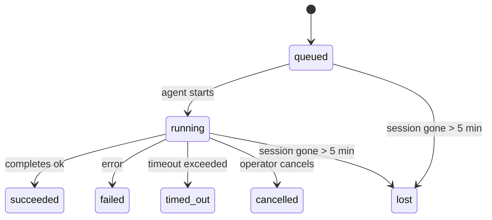

---
read_when:
    - فحص العمل في الخلفية الجاري أو المكتمل حديثًا
    - استكشاف أخطاء إخفاقات التسليم في عمليات تشغيل الوكيل المنفصلة وإصلاحها
    - فهم كيفية ارتباط عمليات التشغيل في الخلفية بالجلسات وCron وHeartbeat
sidebarTitle: Background tasks
summary: تتبّع مهام الخلفية لتشغيلات ACP، والوكلاء الفرعيين، ومهام Cron المعزولة، وعمليات CLI
title: مهام الخلفية
x-i18n:
    generated_at: "2026-05-07T13:13:35Z"
    model: gpt-5.5
    provider: openai
    source_hash: a91a04ef6142e488d2fbc459d2c663afb93816a58fe9f52e0a51420703ea2d4d
    source_path: automation/tasks.md
    workflow: 16
---

<Note>
تبحث عن الجدولة؟ راجع [الأتمتة والمهام](/ar/automation) لاختيار الآلية المناسبة. هذه الصفحة هي سجل النشاط للأعمال الخلفية، وليست المجدول.
</Note>

تتعقب المهام الخلفية الأعمال التي تعمل **خارج جلسة محادثتك الرئيسية**: عمليات ACP، وإنشاء الوكلاء الفرعيين، وتنفيذ مهام cron المعزولة، والعمليات التي يبدأها CLI.

لا تستبدل المهام الجلسات أو مهام cron أو Heartbeat - فهي **سجل النشاط** الذي يسجل العمل المنفصل الذي حدث، ومتى حدث، وما إذا كان قد نجح.

<Note>
لا تنشئ كل عملية تشغيل للوكيل مهمة. منعطفات Heartbeat والدردشة التفاعلية العادية لا تفعل ذلك. كل عمليات تنفيذ cron، وإنشاءات ACP، وإنشاءات الوكلاء الفرعيين، وأوامر وكيل CLI تفعل ذلك.
</Note>

## باختصار

- المهام **سجلات** وليست مجدولات - تحدد cron وHeartbeat _متى_ يعمل العمل، بينما تتعقب المهام _ما حدث_.
- تنشئ ACP والوكلاء الفرعيون وكل مهام cron وعمليات CLI مهام. منعطفات Heartbeat لا تفعل ذلك.
- تنتقل كل مهمة عبر `queued → running → terminal` (succeeded أو failed أو timed_out أو cancelled أو lost).
- تبقى مهام cron نشطة ما دام وقت تشغيل cron لا يزال يملك المهمة؛ إذا اختفت
  حالة وقت التشغيل في الذاكرة، تتحقق صيانة المهام أولا من سجل تشغيل cron
  الدائم قبل وسم مهمة بأنها مفقودة.
- يعتمد الاكتمال على الدفع: يمكن للعمل المنفصل الإخطار مباشرة أو إيقاظ
  جلسة الطالب/Heartbeat عند انتهائه، لذلك تكون حلقات استطلاع الحالة
  غالبا بالشكل غير المناسب.
- تنظف عمليات cron المعزولة واكتمالات الوكلاء الفرعيين بأفضل جهد علامات تبويب/عمليات المتصفح المتتبعة لجلسة الطفل قبل مسك دفاتر التنظيف النهائي.
- يمنع تسليم cron المعزول ردود الأصل المرحلية القديمة بينما لا يزال عمل الوكيل الفرعي التابع قيد التصريف، ويفضل المخرج النهائي للتابع عندما يصل قبل التسليم.
- تسلم إشعارات الاكتمال مباشرة إلى قناة أو توضع في قائمة انتظار Heartbeat التالي.
- يعرض `openclaw tasks list` كل المهام؛ ويظهر `openclaw tasks audit` المشكلات.
- تبقى السجلات النهائية لمدة 7 أيام، ثم تشذب تلقائيا.

## البدء السريع

<Tabs>
  <Tab title="السرد والتصفية">
    ```bash
    # List all tasks (newest first)
    openclaw tasks list

    # Filter by runtime or status
    openclaw tasks list --runtime acp
    openclaw tasks list --status running
    ```

  </Tab>
  <Tab title="الفحص">
    ```bash
    # Show details for a specific task (by ID, run ID, or session key)
    openclaw tasks show <lookup>
    ```
  </Tab>
  <Tab title="الإلغاء والإخطار">
    ```bash
    # Cancel a running task (kills the child session)
    openclaw tasks cancel <lookup>

    # Change notification policy for a task
    openclaw tasks notify <lookup> state_changes
    ```

  </Tab>
  <Tab title="التدقيق والصيانة">
    ```bash
    # Run a health audit
    openclaw tasks audit

    # Preview or apply maintenance
    openclaw tasks maintenance
    openclaw tasks maintenance --apply
    ```

  </Tab>
  <Tab title="تدفق المهمة">
    ```bash
    # Inspect TaskFlow state
    openclaw tasks flow list
    openclaw tasks flow show <lookup>
    openclaw tasks flow cancel <lookup>
    ```
  </Tab>
</Tabs>

## ما الذي ينشئ مهمة

| المصدر                 | نوع وقت التشغيل | متى ينشأ سجل مهمة                                      | سياسة الإخطار الافتراضية |
| ---------------------- | ------------ | ------------------------------------------------------ | --------------------- |
| عمليات ACP الخلفية    | `acp`        | إنشاء جلسة ACP طفل                                     | `done_only`           |
| تنسيق الوكلاء الفرعيين | `subagent`   | إنشاء وكيل فرعي عبر `sessions_spawn`                  | `done_only`           |
| مهام cron (كل الأنواع) | `cron`       | كل تنفيذ cron (الجلسة الرئيسية والمعزولة)              | `silent`              |
| عمليات CLI            | `cli`        | أوامر `openclaw agent` التي تعمل عبر Gateway           | `silent`              |
| مهام وسائط الوكيل     | `cli`        | عمليات `music_generate`/`video_generate` المدعومة بجلسة | `silent`              |

<AccordionGroup>
  <Accordion title="افتراضيات الإخطار لـ cron والوسائط">
    تستخدم مهام cron في الجلسة الرئيسية سياسة الإخطار `silent` افتراضيا - فهي تنشئ سجلات للتتبع لكنها لا تولد إشعارات. تستخدم مهام cron المعزولة أيضا `silent` افتراضيا، لكنها أوضح لأنها تعمل في جلستها الخاصة.

    تستخدم عمليات `music_generate` و`video_generate` المدعومة بجلسة أيضا سياسة الإخطار `silent`. لا تزال تنشئ سجلات مهام، لكن الاكتمال يعاد إلى جلسة الوكيل الأصلية كإيقاظ داخلي حتى يتمكن الوكيل من كتابة رسالة المتابعة وإرفاق الوسائط المكتملة بنفسه. تتبع اكتمالات المجموعة/القناة سياسة الرد المرئي العادية، لذلك يستخدم الوكيل أداة الرسائل عندما يتطلب تسليم المصدر ذلك. إذا فشل وكيل الاكتمال في إنتاج دليل تسليم بأداة الرسائل في مسار مخصص للأدوات فقط، يرسل OpenClaw احتياط الاكتمال مباشرة إلى القناة الأصلية بدلا من ترك الوسائط خاصة.

  </Accordion>
  <Accordion title="حاجز حماية video_generate المتزامن">
    أثناء بقاء مهمة `video_generate` المدعومة بجلسة نشطة، تعمل الأداة أيضا كحاجز حماية: تعيد استدعاءات `video_generate` المتكررة في الجلسة نفسها حالة المهمة النشطة بدلا من بدء توليد متزامن ثان. استخدم `action: "status"` عندما تريد بحث تقدم/حالة صريحا من جانب الوكيل.
  </Accordion>
  <Accordion title="ما لا ينشئ مهاما">
    - منعطفات Heartbeat - الجلسة الرئيسية؛ راجع [Heartbeat](/ar/gateway/heartbeat)
    - منعطفات الدردشة التفاعلية العادية
    - ردود `/command` المباشرة

  </Accordion>
</AccordionGroup>

## دورة حياة المهمة



| الحالة      | ما تعنيه                                                                  |
| ----------- | -------------------------------------------------------------------------- |
| `queued`    | أنشئت، وتنتظر بدء الوكيل                                                  |
| `running`   | منعطف الوكيل قيد التنفيذ بنشاط                                            |
| `succeeded` | اكتملت بنجاح                                                              |
| `failed`    | اكتملت مع خطأ                                                             |
| `timed_out` | تجاوزت المهلة المهيأة                                                     |
| `cancelled` | أوقفها المشغل عبر `openclaw tasks cancel`                                  |
| `lost`      | فقد وقت التشغيل حالة الإسناد الموثوقة بعد فترة سماح مدتها 5 دقائق         |

تحدث الانتقالات تلقائيا - عندما تنتهي عملية تشغيل الوكيل المرتبطة، تحدث حالة المهمة لتطابقها.

اكتمال تشغيل الوكيل هو المرجع لسجلات المهام النشطة. تنهي عملية التشغيل المنفصلة الناجحة كـ `succeeded`، وتنهي أخطاء التشغيل العادية كـ `failed`، وتنهي نتائج المهلة أو الإجهاض كـ `timed_out`. إذا كان مشغل قد ألغى المهمة بالفعل، أو كان وقت التشغيل قد سجل بالفعل حالة نهائية أقوى مثل `failed` أو `timed_out` أو `lost`، فإن إشارة نجاح لاحقة لا تخفض تلك الحالة النهائية.

`lost` واعية بوقت التشغيل:

- مهام ACP: اختفت بيانات تعريف جلسة ACP الطفل الداعمة.
- مهام الوكلاء الفرعيين: اختفت جلسة الطفل الداعمة من مخزن الوكيل الهدف.
- مهام cron: لم يعد وقت تشغيل cron يتتبع المهمة كنشطة ولا يظهر سجل
  تشغيل cron الدائم نتيجة نهائية لذلك التشغيل. لا يعد تدقيق CLI
  غير المتصل حالة وقت تشغيل cron الفارغة داخل العملية الخاصة به مرجعا.
- مهام CLI: تستخدم المهام التي لها معرف تشغيل/معرف مصدر سياق التشغيل الحي، لذلك
  لا تبقي صفوف جلسة الطفل أو جلسة الدردشة العالقة نشطة بعد اختفاء التشغيل
  المملوك لـ Gateway. لا تزال مهام CLI القديمة دون هوية تشغيل تعود
  إلى جلسة الطفل. تنتهي أيضا عمليات `openclaw agent` المدعومة بـ Gateway
  من نتيجة تشغيلها، لذلك لا تبقى عمليات التشغيل المكتملة نشطة حتى يوسمها الكناس
  بأنها `lost`.

## التسليم والإشعارات

عندما تصل مهمة إلى حالة نهائية، يخطرك OpenClaw. يوجد مسارا تسليم:

**التسليم المباشر** - إذا كان للمهمة هدف قناة (`requesterOrigin`)، تذهب رسالة الاكتمال مباشرة إلى تلك القناة (Telegram أو Discord أو Slack، إلخ). بالنسبة لاكتمالات الوكلاء الفرعيين، يحافظ OpenClaw أيضا على توجيه الخيط/الموضوع المربوط عند توفره ويمكنه ملء `to` / حساب مفقود من مسار جلسة الطالب المخزن (`lastChannel` / `lastTo` / `lastAccountId`) قبل التخلي عن التسليم المباشر.

**التسليم في قائمة انتظار الجلسة** - إذا فشل التسليم المباشر أو لم يضبط أصل، يوضع التحديث في قائمة الانتظار كحدث نظام في جلسة الطالب ويظهر في Heartbeat التالي.

<Tip>
يحفز اكتمال المهمة إيقاظ Heartbeat فوريا حتى ترى النتيجة بسرعة - لا تحتاج إلى انتظار نبضة Heartbeat المجدولة التالية.
</Tip>

يعني ذلك أن سير العمل المعتاد قائم على الدفع: ابدأ العمل المنفصل مرة واحدة، ثم دع وقت التشغيل يوقظك أو يخطرك عند الاكتمال. لا تستطلع حالة المهمة إلا عندما تحتاج إلى تصحيح أخطاء أو تدخل أو تدقيق صريح.

### سياسات الإشعارات

تحكم في مقدار ما تسمعه عن كل مهمة:

| السياسة               | ما يتم تسليمه                                                         |
| --------------------- | ----------------------------------------------------------------------- |
| `done_only` (افتراضي) | الحالة النهائية فقط (succeeded، failed، إلخ) - **هذا هو الافتراضي** |
| `state_changes`       | كل انتقال حالة وتحديث تقدم                                             |
| `silent`              | لا شيء مطلقا                                                           |

غيّر السياسة أثناء تشغيل مهمة:

```bash
openclaw tasks notify <lookup> state_changes
```

## مرجع CLI

<AccordionGroup>
  <Accordion title="tasks list">
    ```bash
    openclaw tasks list [--runtime <acp|subagent|cron|cli>] [--status <status>] [--json]
    ```

    أعمدة المخرج: معرف المهمة، النوع، الحالة، التسليم، معرف التشغيل، جلسة الطفل، الملخص.

  </Accordion>
  <Accordion title="tasks show">
    ```bash
    openclaw tasks show <lookup>
    ```

    يقبل رمز البحث معرف مهمة أو معرف تشغيل أو مفتاح جلسة. يعرض السجل الكامل بما في ذلك التوقيت، وحالة التسليم، والخطأ، والملخص النهائي.

  </Accordion>
  <Accordion title="tasks cancel">
    ```bash
    openclaw tasks cancel <lookup>
    ```

    بالنسبة لمهام ACP والوكلاء الفرعيين، يقتل هذا جلسة الطفل. بالنسبة للمهام المتتبعة عبر CLI، يسجل الإلغاء في سجل المهام (لا يوجد مقبض وقت تشغيل طفل منفصل). تنتقل الحالة إلى `cancelled` ويرسل إشعار تسليم عند انطباق ذلك.

  </Accordion>
  <Accordion title="tasks notify">
    ```bash
    openclaw tasks notify <lookup> <done_only|state_changes|silent>
    ```
  </Accordion>
  <Accordion title="tasks audit">
    ```bash
    openclaw tasks audit [--json]
    ```

    يظهر المشكلات التشغيلية. تظهر النتائج أيضا في `openclaw status` عند اكتشاف مشكلات.

    | النتيجة                  | الخطورة   | المشغّل                                                                                                      |
    | ------------------------- | ---------- | ------------------------------------------------------------------------------------------------------------ |
    | `stale_queued`            | warn       | في قائمة الانتظار لأكثر من 10 دقائق                                                                              |
    | `stale_running`           | error      | قيد التشغيل لأكثر من 30 دقيقة                                                                             |
    | `lost`                    | warn/error | اختفت ملكية المهمة المدعومة بوقت التشغيل؛ تبقى المهام المفقودة المحتفَظ بها كتحذيرات حتى `cleanupAfter`، ثم تصبح أخطاء |
    | `delivery_failed`         | warn       | فشل التسليم وسياسة الإشعار ليست `silent`                                                            |
    | `missing_cleanup`         | warn       | مهمة نهائية بلا طابع زمني للتنظيف                                                                      |
    | `inconsistent_timestamps` | warn       | انتهاك في المخطط الزمني (على سبيل المثال انتهت قبل أن تبدأ)                                                        |

  </Accordion>
  <Accordion title="صيانة المهام">
    ```bash
    openclaw tasks maintenance [--json]
    openclaw tasks maintenance --apply [--json]
    ```

    استخدم هذا لمعاينة أو تطبيق المطابقة، وختم التنظيف، والتقليم للمهام وحالة Task Flow.

    المطابقة واعية بوقت التشغيل:

    - تتحقق مهام ACP/الوكيل الفرعي من جلسة الابن الداعمة لها.
    - تُعلَّم مهام الوكيل الفرعي التي تحتوي جلسة الابن الخاصة بها على شاهد قبر لاسترداد إعادة التشغيل كمفقودة بدلاً من التعامل معها كجلسات داعمة قابلة للاسترداد.
    - تتحقق مهام Cron مما إذا كان وقت تشغيل cron لا يزال يملك المهمة، ثم تسترد الحالة النهائية من سجلات تشغيل cron/حالة المهمة المحفوظة قبل الرجوع إلى `lost`. تُعد عملية Gateway فقط مرجعية لمجموعة مهام cron النشطة داخل الذاكرة؛ يستخدم تدقيق CLI دون اتصال السجل الدائم لكنه لا يعلّم مهمة cron كمفقودة لمجرد أن تلك المجموعة المحلية Set فارغة.
    - تتحقق مهام CLI ذات هوية التشغيل من سياق التشغيل الحي المالك، وليس فقط صفوف جلسة الابن أو جلسة الدردشة.

    التنظيف بعد الاكتمال واع بوقت التشغيل أيضاً:

    - يبذل اكتمال الوكيل الفرعي أفضل جهد لإغلاق علامات تبويب/عمليات المتصفح المتتبعة لجلسة الابن قبل متابعة تنظيف الإعلان.
    - يبذل اكتمال cron المعزول أفضل جهد لإغلاق علامات تبويب/عمليات المتصفح المتتبعة لجلسة cron قبل تفكيك التشغيل بالكامل.
    - ينتظر تسليم cron المعزول متابعة الوكيل الفرعي التابع عند الحاجة ويكتم نص إقرار الأصل القديم بدلاً من إعلانه.
    - يفضّل تسليم اكتمال الوكيل الفرعي أحدث نص مساعد ظاهر؛ وإذا كان فارغاً، يرجع إلى أحدث نص أداة/toolResult منظّف، ويمكن لتشغيلات استدعاء الأدوات التي انتهت بالمهلة فقط أن تنضغط إلى ملخص قصير للتقدم الجزئي. تعلن التشغيلات النهائية الفاشلة حالة الفشل دون إعادة تشغيل نص الرد الملتقط.
    - لا تحجب إخفاقات التنظيف نتيجة المهمة الحقيقية.

  </Accordion>
  <Accordion title="tasks flow list | show | cancel">
    ```bash
    openclaw tasks flow list [--status <status>] [--json]
    openclaw tasks flow show <lookup> [--json]
    openclaw tasks flow cancel <lookup>
    ```

    استخدم هذه عندما يكون Task Flow المنسّق هو ما يهمك بدلاً من سجل مهمة خلفية فردي واحد.

  </Accordion>
</AccordionGroup>

## لوحة مهام الدردشة (`/tasks`)

استخدم `/tasks` في أي جلسة دردشة لرؤية المهام الخلفية المرتبطة بتلك الجلسة. تعرض اللوحة المهام النشطة والمكتملة حديثاً مع وقت التشغيل، والحالة، والتوقيت، والتقدم أو تفاصيل الخطأ.

عندما لا تكون للجلسة الحالية مهام مرتبطة مرئية، يرجع `/tasks` إلى أعداد المهام المحلية للوكيل بحيث تحصل على نظرة عامة من دون كشف تفاصيل جلسات أخرى.

للسجل الكامل للمشغّل، استخدم CLI: `openclaw tasks list`.

## تكامل الحالة (ضغط المهام)

يتضمن `openclaw status` ملخصاً سريعاً للمهام:

```
Tasks: 3 queued · 2 running · 1 issues
```

يعرض الملخص:

- **active** - عدد `queued` + `running`
- **failures** - عدد `failed` + `timed_out` + `lost`
- **byRuntime** - تفصيل حسب `acp`، و`subagent`، و`cron`، و`cli`

يستخدم كل من `/status` وأداة `session_status` لقطة مهام واعية بالتنظيف: تُفضّل المهام النشطة، وتُخفى الصفوف المكتملة القديمة، ولا تظهر الإخفاقات الحديثة إلا عندما لا يبقى عمل نشط. هذا يبقي بطاقة الحالة مركزة على ما يهم الآن.

## التخزين والصيانة

### أين توجد المهام

تستمر سجلات المهام في SQLite عند:

```
$OPENCLAW_STATE_DIR/tasks/runs.sqlite
```

يحمّل السجل في الذاكرة عند بدء Gateway ويزامن عمليات الكتابة إلى SQLite لضمان الديمومة عبر عمليات إعادة التشغيل.
يبقي Gateway سجل الكتابة المسبقة في SQLite محدود الحجم باستخدام عتبة
autocheckpoint الافتراضية في SQLite إضافة إلى نقاط تحقق `TRUNCATE` الدورية وعند الإيقاف.

### الصيانة التلقائية

يعمل ماسح كل **60 ثانية** ويتولى أربعة أشياء:

<Steps>
  <Step title="المطابقة">
    يتحقق مما إذا كانت المهام النشطة لا تزال تملك دعماً مرجعياً من وقت التشغيل. تستخدم مهام ACP/الوكيل الفرعي حالة جلسة الابن، وتستخدم مهام cron ملكية المهمة النشطة، وتستخدم مهام CLI ذات هوية التشغيل سياق التشغيل المالك. إذا اختفت تلك الحالة الداعمة لأكثر من 5 دقائق، تُعلَّم المهمة كـ `lost`.
  </Step>
  <Step title="إصلاح جلسة ACP">
    يغلق جلسات ACP النهائية أو اليتيمة ذات اللقطة الواحدة والمملوكة للأصل، ويغلق جلسات ACP المستمرة النهائية القديمة أو اليتيمة فقط عندما لا يبقى أي ربط محادثة نشط.
  </Step>
  <Step title="ختم التنظيف">
    يضبط طابعاً زمنياً `cleanupAfter` على المهام النهائية (endedAt + 7 أيام). أثناء الاحتفاظ، تبقى المهام المفقودة ظاهرة في التدقيق كتحذيرات؛ بعد انتهاء `cleanupAfter` أو عندما تكون بيانات التنظيف الوصفية مفقودة، تصبح أخطاء.
  </Step>
  <Step title="التقليم">
    يحذف السجلات التي تجاوزت تاريخ `cleanupAfter` الخاص بها.
  </Step>
</Steps>

<Note>
**الاحتفاظ:** تُحفظ سجلات المهام النهائية لمدة **7 أيام**، ثم تُقلَّم تلقائياً. لا يلزم أي ضبط.
</Note>

## كيف ترتبط المهام بالأنظمة الأخرى

<AccordionGroup>
  <Accordion title="المهام وTask Flow">
    [Task Flow](/ar/automation/taskflow) هو طبقة تنسيق التدفق فوق المهام الخلفية. قد ينسق تدفق واحد عدة مهام خلال عمره باستخدام أوضاع مزامنة مُدارة أو معكوسة. استخدم `openclaw tasks` لفحص سجلات المهام الفردية و`openclaw tasks flow` لفحص التدفق المنسق.

    راجع [Task Flow](/ar/automation/taskflow) للتفاصيل.

  </Accordion>
  <Accordion title="المهام وcron">
    يوجد **تعريف** مهمة cron في `~/.openclaw/cron/jobs.json`؛ وتوجد حالة تنفيذ وقت التشغيل بجانبه في `~/.openclaw/cron/jobs-state.json`. ينشئ **كل** تنفيذ cron سجل مهمة - سواء للجلسة الرئيسية أو المعزولة. تضبط مهام cron للجلسة الرئيسية افتراضياً سياسة الإشعار على `silent` بحيث تتتبع دون إنشاء إشعارات.

    راجع [مهام Cron](/ar/automation/cron-jobs).

  </Accordion>
  <Accordion title="المهام وHeartbeat">
    تشغيلات Heartbeat هي أدوار جلسة رئيسية - لا تنشئ سجلات مهام. عندما تكتمل مهمة، يمكن أن تطلق إيقاظ Heartbeat كي ترى النتيجة بسرعة.

    راجع [Heartbeat](/ar/gateway/heartbeat).

  </Accordion>
  <Accordion title="المهام والجلسات">
    قد تشير المهمة إلى `childSessionKey` (حيث يُنفذ العمل) و`requesterSessionKey` (من بدأها). الجلسات هي سياق المحادثة؛ أما المهام فهي تتبع النشاط فوق ذلك.
  </Accordion>
  <Accordion title="المهام وتشغيلات الوكيل">
    يربط `runId` الخاص بالمهمة بتشغيل الوكيل الذي ينفذ العمل. تحدّث أحداث دورة حياة الوكيل (البدء، الانتهاء، الخطأ) حالة المهمة تلقائياً - لا تحتاج إلى إدارة دورة الحياة يدوياً.
  </Accordion>
</AccordionGroup>

## ذات صلة

- [الأتمتة والمهام](/ar/automation) - لمحة سريعة عن كل آليات الأتمتة
- [CLI: المهام](/ar/cli/tasks) - مرجع أوامر CLI
- [Heartbeat](/ar/gateway/heartbeat) - أدوار دورية للجلسة الرئيسية
- [المهام المجدولة](/ar/automation/cron-jobs) - جدولة العمل في الخلفية
- [Task Flow](/ar/automation/taskflow) - تنسيق التدفق فوق المهام
