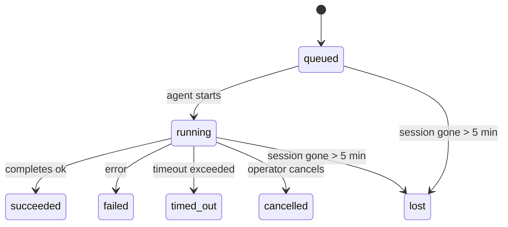

---
read_when:
    - فحص العمل الجاري في الخلفية أو المكتمل مؤخرًا
    - استكشاف أخطاء إخفاقات التسليم وإصلاحها لعمليات تشغيل الوكيل المنفصلة
    - فهم كيفية ارتباط عمليات التشغيل في الخلفية بالجلسات وCron وHeartbeat
sidebarTitle: Background tasks
summary: تتبّع المهام في الخلفية لعمليات تشغيل ACP والوكلاء الفرعيين ووظائف Cron المعزولة وعمليات CLI
title: مهام الخلفية
x-i18n:
    generated_at: "2026-04-30T07:39:41Z"
    model: gpt-5.5
    provider: openai
    source_hash: 4bbf74f3aeea532738b56b83cd2e1a0a3734bfd453da6636b8be985a28ccc027
    source_path: automation/tasks.md
    workflow: 16
---

<Note>
هل تبحث عن الجدولة؟ راجع [الأتمتة والمهام](/ar/automation) لاختيار الآلية المناسبة. هذه الصفحة هي سجل النشاط للعمل في الخلفية، وليست المجدول.
</Note>

تتتبّع مهام الخلفية العمل الذي يعمل **خارج جلسة محادثتك الرئيسية**: تشغيلات ACP، وإنشاءات الوكلاء الفرعيين، وتنفيذات مهام cron المعزولة، والعمليات التي يبدأها CLI.

لا تستبدل المهام الجلسات أو مهام cron أو Heartbeat — بل هي **سجل النشاط** الذي يسجل العمل المنفصل الذي حدث، ومتى حدث، وما إذا كان قد نجح.

<Note>
لا ينشئ كل تشغيل وكيل مهمة. لا تفعل ذلك دورات Heartbeat ولا الدردشة التفاعلية العادية. كل تنفيذات cron، وإنشاءات ACP، وإنشاءات الوكلاء الفرعيين، وأوامر وكيل CLI تفعل ذلك.
</Note>

## باختصار

- المهام **سجلات** وليست مجدولات — يقرر cron وHeartbeat _متى_ يعمل العمل، بينما تتتبّع المهام _ما حدث_.
- ينشئ ACP والوكلاء الفرعيون وكل مهام cron وعمليات CLI مهامًا. لا تفعل ذلك دورات Heartbeat.
- تنتقل كل مهمة عبر `queued → running → terminal` (succeeded أو failed أو timed_out أو cancelled أو lost).
- تبقى مهام cron نشطة ما دام وقت تشغيل cron لا يزال يملك المهمة؛ إذا اختفت
  حالة وقت التشغيل في الذاكرة، تتحقق صيانة المهام أولًا من سجل تشغيل cron
  الدائم قبل وسم مهمة بأنها مفقودة.
- الاكتمال مدفوع بالدفع: يمكن للعمل المنفصل الإخطار مباشرة أو إيقاظ
  جلسة/Heartbeat الطالب عند الانتهاء، لذلك تكون حلقات استطلاع الحالة
  عادةً بالشكل غير المناسب.
- تبذل تشغيلات cron المعزولة واكتمالات الوكلاء الفرعيين أفضل جهد لتنظيف ألسنة المتصفح/العمليات المتتبعة لجلسة الطفل قبل مسك دفاتر التنظيف النهائي.
- يمنع تسليم cron المعزول ردود الوالد المؤقتة القديمة بينما لا يزال عمل الوكيل الفرعي السليل قيد التصريف، ويفضل إخراج السليل النهائي عندما يصل قبل التسليم.
- تُسلَّم إشعارات الاكتمال مباشرة إلى قناة أو توضع في الصف من أجل Heartbeat التالي.
- يعرض `openclaw tasks list` كل المهام؛ ويكشف `openclaw tasks audit` المشكلات.
- تُحفظ السجلات النهائية لمدة 7 أيام، ثم تُزال تلقائيًا.

## البدء السريع

<Tabs>
  <Tab title="السرد والتصفية">
    ```bash
    # List all tasks (newest first)
    openclaw tasks list

    # Filter by runtime or status
    openclaw tasks list --runtime acp
    openclaw tasks list --status running
    ```

  </Tab>
  <Tab title="الفحص">
    ```bash
    # Show details for a specific task (by ID, run ID, or session key)
    openclaw tasks show <lookup>
    ```
  </Tab>
  <Tab title="الإلغاء والإخطار">
    ```bash
    # Cancel a running task (kills the child session)
    openclaw tasks cancel <lookup>

    # Change notification policy for a task
    openclaw tasks notify <lookup> state_changes
    ```

  </Tab>
  <Tab title="التدقيق والصيانة">
    ```bash
    # Run a health audit
    openclaw tasks audit

    # Preview or apply maintenance
    openclaw tasks maintenance
    openclaw tasks maintenance --apply
    ```

  </Tab>
  <Tab title="تدفق المهام">
    ```bash
    # Inspect TaskFlow state
    openclaw tasks flow list
    openclaw tasks flow show <lookup>
    openclaw tasks flow cancel <lookup>
    ```
  </Tab>
</Tabs>

## ما الذي ينشئ مهمة

| المصدر                 | نوع وقت التشغيل | متى يُنشأ سجل مهمة                                      | سياسة الإخطار الافتراضية |
| ---------------------- | ------------ | ------------------------------------------------------ | --------------------- |
| تشغيلات ACP في الخلفية | `acp`        | إنشاء جلسة ACP طفلة                                    | `done_only`           |
| تنسيق الوكلاء الفرعيين | `subagent`   | إنشاء وكيل فرعي عبر `sessions_spawn`                   | `done_only`           |
| مهام cron (كل الأنواع) | `cron`       | كل تنفيذ cron (الجلسة الرئيسية والمعزول)               | `silent`              |
| عمليات CLI             | `cli`        | أوامر `openclaw agent` التي تعمل عبر Gateway           | `silent`              |
| مهام وسائط الوكيل      | `cli`        | تشغيلات `video_generate` المدعومة بجلسة                | `silent`              |

<AccordionGroup>
  <Accordion title="افتراضيات الإخطار لـ cron والوسائط">
    تستخدم مهام cron للجلسة الرئيسية سياسة إخطار `silent` افتراضيًا — فهي تنشئ سجلات للتتبع لكنها لا تولّد إشعارات. تستخدم مهام cron المعزولة أيضًا `silent` افتراضيًا لكنها أكثر ظهورًا لأنها تعمل في جلستها الخاصة.

    تستخدم تشغيلات `video_generate` المدعومة بجلسة أيضًا سياسة إخطار `silent`. لا تزال تنشئ سجلات مهام، لكن الاكتمال يُعاد إلى جلسة الوكيل الأصلية كإيقاظ داخلي حتى يتمكن الوكيل من كتابة رسالة المتابعة وإرفاق الفيديو المنتهي بنفسه. إذا اخترت تفعيل `tools.media.asyncCompletion.directSend`، فإن اكتمالات `music_generate` و`video_generate` غير المتزامنة تحاول التسليم المباشر إلى القناة أولًا قبل الرجوع إلى مسار إيقاظ جلسة الطالب.

  </Accordion>
  <Accordion title="حاجز الحماية لـ video_generate المتزامن">
    أثناء بقاء مهمة `video_generate` المدعومة بجلسة نشطة، تعمل الأداة أيضًا كحاجز حماية: تُرجع استدعاءات `video_generate` المتكررة في الجلسة نفسها حالة المهمة النشطة بدلًا من بدء توليد ثانٍ متزامن. استخدم `action: "status"` عندما تريد بحثًا صريحًا عن التقدم/الحالة من جانب الوكيل.
  </Accordion>
  <Accordion title="ما لا ينشئ مهامًا">
    - دورات Heartbeat — الجلسة الرئيسية؛ راجع [Heartbeat](/ar/gateway/heartbeat)
    - دورات الدردشة التفاعلية العادية
    - ردود `/command` المباشرة

  </Accordion>
</AccordionGroup>

## دورة حياة المهمة



| الحالة      | معناها                                                                     |
| ----------- | -------------------------------------------------------------------------- |
| `queued`    | أُنشئت، وتنتظر بدء الوكيل                                                  |
| `running`   | دور الوكيل قيد التنفيذ النشط                                               |
| `succeeded` | اكتملت بنجاح                                                               |
| `failed`    | اكتملت مع خطأ                                                              |
| `timed_out` | تجاوزت المهلة المكوّنة                                                     |
| `cancelled` | أوقفها المشغّل عبر `openclaw tasks cancel`                                 |
| `lost`      | فقد وقت التشغيل حالة الدعم الموثوقة بعد فترة سماح مدتها 5 دقائق           |

تحدث الانتقالات تلقائيًا — عندما ينتهي تشغيل الوكيل المرتبط، تُحدّث حالة المهمة لتطابق ذلك.

اكتمال تشغيل الوكيل هو المرجع الموثوق لسجلات المهام النشطة. يُنهى التشغيل المنفصل الناجح كـ `succeeded`، وتُنهى أخطاء التشغيل العادية كـ `failed`، وتُنهى نتائج المهلة أو الإلغاء كـ `timed_out`. إذا كان مشغّل قد ألغى المهمة بالفعل، أو كان وقت التشغيل قد سجل بالفعل حالة نهائية أقوى مثل `failed` أو `timed_out` أو `lost`، فلا تخفض إشارة نجاح لاحقة تلك الحالة النهائية.

`lost` واعٍ بوقت التشغيل:

- مهام ACP: اختفت بيانات تعريف جلسة ACP الطفلة الداعمة.
- مهام الوكلاء الفرعيين: اختفت الجلسة الطفلة الداعمة من مخزن الوكيل الهدف.
- مهام cron: لم يعد وقت تشغيل cron يتتبع المهمة كنشطة ولا يُظهر سجل
  تشغيل cron الدائم نتيجة نهائية لذلك التشغيل. لا يعامل تدقيق CLI
  دون اتصال حالة وقت تشغيل cron الفارغة داخل عمليته كمرجع موثوق.
- مهام CLI: تستخدم مهام الجلسة الطفلة المعزولة الجلسة الطفلة؛ أما مهام CLI
  المدعومة بالدردشة فتستخدم سياق التشغيل الحي بدلًا من ذلك، لذلك لا تُبقي
  صفوف جلسات القناة/المجموعة/المباشر العالقة هذه المهام حية. كما تُنهى
  تشغيلات `openclaw agent` المدعومة بـ Gateway من نتيجة تشغيلها، لذلك لا تبقى
  التشغيلات المكتملة نشطة إلى أن يوسمها المنظف كـ `lost`.

## التسليم والإشعارات

عندما تصل مهمة إلى حالة نهائية، يخطرك OpenClaw. هناك مساران للتسليم:

**التسليم المباشر** — إذا كانت للمهمة وجهة قناة (`requesterOrigin`)، تذهب رسالة الاكتمال مباشرة إلى تلك القناة (Telegram وDiscord وSlack وغير ذلك). بالنسبة لاكتمالات الوكلاء الفرعيين، يحافظ OpenClaw أيضًا على توجيه الخيط/الموضوع المرتبط عند توفره ويمكنه ملء `to` / الحساب المفقود من مسار جلسة الطالب المخزن (`lastChannel` / `lastTo` / `lastAccountId`) قبل التخلي عن التسليم المباشر.

**التسليم الموضوع في صف الجلسة** — إذا فشل التسليم المباشر أو لم يُعيَّن أصل، يُوضع التحديث في الصف كحدث نظام في جلسة الطالب ويظهر عند Heartbeat التالي.

<Tip>
يؤدي اكتمال المهمة إلى إيقاظ Heartbeat فوري حتى ترى النتيجة بسرعة — لست مضطرًا إلى انتظار نبضة Heartbeat المجدولة التالية.
</Tip>

هذا يعني أن سير العمل المعتاد قائم على الدفع: ابدأ العمل المنفصل مرة واحدة، ثم دع وقت التشغيل يوقظك أو يخطرك عند الاكتمال. لا تستطلع حالة المهمة إلا عندما تحتاج إلى تصحيح أخطاء أو تدخل أو تدقيق صريح.

### سياسات الإخطار

تحكم في مقدار ما تسمعه عن كل مهمة:

| السياسة                | ما يُسلَّم                                                                  |
| --------------------- | ----------------------------------------------------------------------- |
| `done_only` (الافتراضي) | الحالة النهائية فقط (succeeded وfailed وغير ذلك) — **هذا هو الافتراضي** |
| `state_changes`       | كل انتقال حالة وتحديث تقدم                                               |
| `silent`              | لا شيء على الإطلاق                                                       |

غيّر السياسة أثناء تشغيل مهمة:

```bash
openclaw tasks notify <lookup> state_changes
```

## مرجع CLI

<AccordionGroup>
  <Accordion title="tasks list">
    ```bash
    openclaw tasks list [--runtime <acp|subagent|cron|cli>] [--status <status>] [--json]
    ```

    أعمدة الإخراج: معرف المهمة، النوع، الحالة، التسليم، معرف التشغيل، الجلسة الطفلة، الملخص.

  </Accordion>
  <Accordion title="tasks show">
    ```bash
    openclaw tasks show <lookup>
    ```

    يقبل رمز البحث معرف مهمة أو معرف تشغيل أو مفتاح جلسة. يعرض السجل الكامل بما في ذلك التوقيت، وحالة التسليم، والخطأ، والملخص النهائي.

  </Accordion>
  <Accordion title="tasks cancel">
    ```bash
    openclaw tasks cancel <lookup>
    ```

    بالنسبة لمهام ACP والوكلاء الفرعيين، يقتل هذا الجلسة الطفلة. بالنسبة للمهام المتتبعة عبر CLI، يُسجل الإلغاء في سجل المهام (لا يوجد مقبض وقت تشغيل طفل منفصل). تنتقل الحالة إلى `cancelled` ويُرسل إشعار تسليم عند الاقتضاء.

  </Accordion>
  <Accordion title="tasks notify">
    ```bash
    openclaw tasks notify <lookup> <done_only|state_changes|silent>
    ```
  </Accordion>
  <Accordion title="tasks audit">
    ```bash
    openclaw tasks audit [--json]
    ```

    يكشف المشكلات التشغيلية. تظهر النتائج أيضًا في `openclaw status` عند اكتشاف مشكلات.

    | النتيجة                   | الخطورة   | المحفّز                                                                                                      |
    | ------------------------- | ---------- | ------------------------------------------------------------------------------------------------------------ |
    | `stale_queued`            | تحذير       | في قائمة الانتظار لأكثر من 10 دقائق                                                                              |
    | `stale_running`           | خطأ      | قيد التشغيل لأكثر من 30 دقيقة                                                                             |
    | `lost`                    | تحذير/خطأ | اختفت ملكية المهمة المدعومة بوقت التشغيل؛ تبقى المهام المفقودة المحتفَظ بها كتحذيرات حتى `cleanupAfter`، ثم تصبح أخطاء |
    | `delivery_failed`         | تحذير       | فشل التسليم وسياسة الإشعار ليست `silent`                                                            |
    | `missing_cleanup`         | تحذير       | مهمة نهائية بلا طابع زمني للتنظيف                                                                      |
    | `inconsistent_timestamps` | تحذير       | انتهاك في المخطط الزمني (مثلاً انتهت قبل أن تبدأ)                                                        |

  </Accordion>
  <Accordion title="صيانة المهام">
    ```bash
    openclaw tasks maintenance [--json]
    openclaw tasks maintenance --apply [--json]
    ```

    استخدم هذا لمعاينة أو تطبيق المطابقة، وختم التنظيف، والتقليم للمهام وحالة تدفق المهام.

    المطابقة واعية بوقت التشغيل:

    - تتحقق مهام ACP/الوكيل الفرعي من الجلسة الفرعية الداعمة لها.
    - تتحقق مهام Cron مما إذا كان وقت تشغيل Cron لا يزال يملك المهمة، ثم تستعيد الحالة النهائية من سجلات تشغيل Cron/حالة المهمة المحفوظة قبل الرجوع إلى `lost`. عملية Gateway وحدها هي المرجع المعتمد لمجموعة مهام Cron النشطة الموجودة في الذاكرة؛ يستخدم تدقيق CLI غير المتصل السجل الدائم لكنه لا يضع علامة فقدان على مهمة Cron لمجرد أن تلك المجموعة المحلية فارغة.
    - تتحقق مهام CLI المدعومة بالمحادثة من سياق التشغيل الحي المالك، وليس فقط من صف جلسة المحادثة.

    تنظيف الإكمال واع بوقت التشغيل أيضاً:

    - إكمال الوكيل الفرعي يغلق، بأفضل جهد، ألسنة المتصفح/العمليات المتتبعة للجلسة الفرعية قبل أن يستمر تنظيف الإعلان.
    - إكمال Cron المعزول يغلق، بأفضل جهد، ألسنة المتصفح/العمليات المتتبعة لجلسة Cron قبل أن ينتهي تفكيك التشغيل بالكامل.
    - ينتظر تسليم Cron المعزول متابعة الوكيل الفرعي اللاحقة عند الحاجة ويمنع نص إقرار الأصل المتقادم بدلاً من إعلانه.
    - يفضل تسليم إكمال الوكيل الفرعي أحدث نص مساعد مرئي؛ إذا كان فارغاً، يرجع إلى أحدث نص أداة/toolResult منقح، ويمكن أن تنطوي عمليات استدعاء الأداة التي انتهت بمهلة فقط إلى ملخص قصير للتقدم الجزئي. تعلن عمليات التشغيل النهائية الفاشلة حالة الفشل دون إعادة عرض نص الرد الملتقط.
    - لا تحجب إخفاقات التنظيف نتيجة المهمة الحقيقية.

  </Accordion>
  <Accordion title="قائمة تدفق المهام | عرض | إلغاء">
    ```bash
    openclaw tasks flow list [--status <status>] [--json]
    openclaw tasks flow show <lookup> [--json]
    openclaw tasks flow cancel <lookup>
    ```

    استخدم هذه عندما يكون تدفق المهام المنسق هو ما تهتم به بدلاً من سجل مهمة خلفية فردي واحد.

  </Accordion>
</AccordionGroup>

## لوحة مهام المحادثة (`/tasks`)

استخدم `/tasks` في أي جلسة محادثة لرؤية المهام الخلفية المرتبطة بتلك الجلسة. تعرض اللوحة المهام النشطة والمكتملة مؤخراً مع وقت التشغيل، والحالة، والتوقيت، وتفاصيل التقدم أو الخطأ.

عندما لا تحتوي الجلسة الحالية على مهام مرتبطة مرئية، يعود `/tasks` إلى أعداد المهام المحلية للوكيل بحيث تحصل مع ذلك على نظرة عامة دون تسريب تفاصيل جلسات أخرى.

للسجل الكامل للمشغل، استخدم CLI: `openclaw tasks list`.

## تكامل الحالة (ضغط المهام)

يتضمن `openclaw status` ملخصاً سريعاً للمهام:

```
Tasks: 3 queued · 2 running · 1 issues
```

يعرض الملخص:

- **نشطة** — عدد `queued` + `running`
- **إخفاقات** — عدد `failed` + `timed_out` + `lost`
- **حسب وقت التشغيل** — تفصيل حسب `acp` و`subagent` و`cron` و`cli`

يستخدم كل من `/status` وأداة `session_status` لقطة مهام واعية بالتنظيف: تُفضّل المهام النشطة، وتُخفى الصفوف المكتملة المتقادمة، ولا تظهر الإخفاقات الحديثة إلا عندما لا يبقى عمل نشط. يحافظ هذا على تركيز بطاقة الحالة على ما يهم الآن.

## التخزين والصيانة

### أين تعيش المهام

تستمر سجلات المهام في SQLite عند:

```
$OPENCLAW_STATE_DIR/tasks/runs.sqlite
```

يُحمّل السجل إلى الذاكرة عند بدء Gateway ويزامن عمليات الكتابة إلى SQLite لضمان الديمومة عبر عمليات إعادة التشغيل.
يحافظ Gateway على سجل الكتابة المسبقة في SQLite ضمن حدوده باستخدام عتبة
الفحص التلقائي الافتراضية في SQLite إضافة إلى نقاط فحص دورية وعند الإيقاف من نوع `TRUNCATE`.

### الصيانة التلقائية

يعمل ماسح كل **60 ثانية** ويتعامل مع أربعة أشياء:

<Steps>
  <Step title="المطابقة">
    يتحقق مما إذا كانت المهام النشطة لا تزال تملك دعماً موثوقاً من وقت التشغيل. تستخدم مهام ACP/الوكيل الفرعي حالة الجلسة الفرعية، وتستخدم مهام Cron ملكية المهمة النشطة، وتستخدم مهام CLI المدعومة بالمحادثة سياق التشغيل المالك. إذا اختفت حالة الدعم تلك لأكثر من 5 دقائق، تُوسم المهمة بأنها `lost`.
  </Step>
  <Step title="إصلاح جلسة ACP">
    يغلق جلسات ACP أحادية التنفيذ النهائية أو اليتيمة المملوكة للأصل، ويغلق جلسات ACP الدائمة النهائية المتقادمة أو اليتيمة فقط عندما لا يبقى ربط محادثة نشط.
  </Step>
  <Step title="ختم التنظيف">
    يعيّن طابعاً زمنياً `cleanupAfter` على المهام النهائية (endedAt + 7 أيام). أثناء فترة الاحتفاظ، لا تزال المهام المفقودة تظهر في التدقيق كتحذيرات؛ بعد انتهاء `cleanupAfter` أو عند غياب بيانات التنظيف الوصفية، تصبح أخطاء.
  </Step>
  <Step title="التقليم">
    يحذف السجلات التي تجاوزت تاريخ `cleanupAfter` الخاص بها.
  </Step>
</Steps>

<Note>
**الاحتفاظ:** تُحفظ سجلات المهام النهائية لمدة **7 أيام**، ثم تُقلّم تلقائياً. لا حاجة إلى أي إعداد.
</Note>

## كيف ترتبط المهام بالأنظمة الأخرى

<AccordionGroup>
  <Accordion title="المهام وتدفق المهام">
    [تدفق المهام](/ar/automation/taskflow) هو طبقة تنسيق التدفق فوق المهام الخلفية. قد ينسق تدفق واحد مهام متعددة طوال عمره باستخدام أوضاع مزامنة مُدارة أو معكوسة. استخدم `openclaw tasks` لفحص سجلات المهام الفردية و`openclaw tasks flow` لفحص التدفق المنسق.

    راجع [تدفق المهام](/ar/automation/taskflow) للتفاصيل.

  </Accordion>
  <Accordion title="المهام وCron">
    يعيش **تعريف** مهمة Cron في `~/.openclaw/cron/jobs.json`؛ وتعيش حالة تنفيذ وقت التشغيل بجانبه في `~/.openclaw/cron/jobs-state.json`. **كل** تنفيذ Cron ينشئ سجل مهمة — سواء في الجلسة الرئيسية أو المعزولة. تستخدم مهام Cron في الجلسة الرئيسية سياسة إشعار افتراضية `silent` بحيث تتتبع دون إنشاء إشعارات.

    راجع [مهام Cron](/ar/automation/cron-jobs).

  </Accordion>
  <Accordion title="المهام وHeartbeat">
    عمليات تشغيل Heartbeat هي أدوار ضمن الجلسة الرئيسية — لا تنشئ سجلات مهام. عندما تكتمل مهمة، يمكنها تشغيل تنبيه Heartbeat كي ترى النتيجة بسرعة.

    راجع [Heartbeat](/ar/gateway/heartbeat).

  </Accordion>
  <Accordion title="المهام والجلسات">
    قد تشير مهمة إلى `childSessionKey` (حيث يتم العمل) و`requesterSessionKey` (من بدأها). الجلسات هي سياق المحادثة؛ والمهام هي تتبع النشاط فوق ذلك.
  </Accordion>
  <Accordion title="المهام وعمليات تشغيل الوكيل">
    يربط `runId` الخاص بالمهمة بتشغيل الوكيل الذي ينجز العمل. تحدّث أحداث دورة حياة الوكيل (البدء، الانتهاء، الخطأ) حالة المهمة تلقائياً — لا تحتاج إلى إدارة دورة الحياة يدوياً.
  </Accordion>
</AccordionGroup>

## ذو صلة

- [الأتمتة والمهام](/ar/automation) — كل آليات الأتمتة في لمحة
- [CLI: المهام](/ar/cli/tasks) — مرجع أوامر CLI
- [Heartbeat](/ar/gateway/heartbeat) — أدوار دورية في الجلسة الرئيسية
- [المهام المجدولة](/ar/automation/cron-jobs) — جدولة العمل الخلفي
- [تدفق المهام](/ar/automation/taskflow) — تنسيق التدفق فوق المهام
