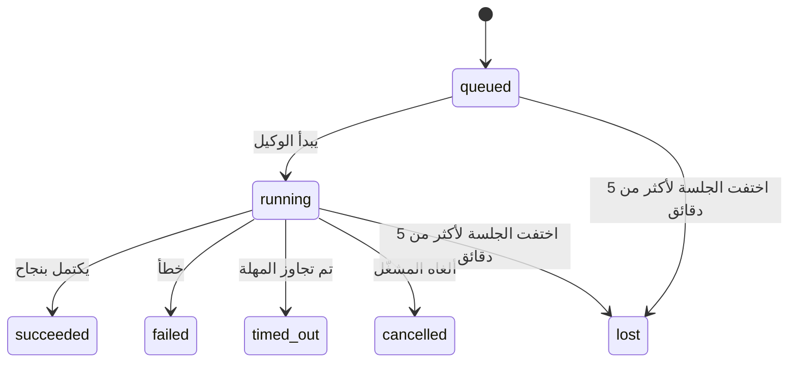

---
read_when:
    - فحص العمل الجاري في الخلفية أو المكتمل مؤخرًا
    - تصحيح أخطاء فشل التسليم لعمليات تشغيل الوكيل المنفصلة
    - فهم كيفية ارتباط عمليات التشغيل في الخلفية بالجلسات وCron وHeartbeat
sidebarTitle: Background tasks
summary: تتبّع المهام في الخلفية لتشغيلات ACP، والوكلاء الفرعيين، ووظائف Cron المعزولة، وعمليات CLI
title: المهام في الخلفية
x-i18n:
    generated_at: "2026-04-26T11:22:51Z"
    model: gpt-5.4
    provider: openai
    source_hash: 46952a378babdee9f43102bfa71dbd35b6ca7ecb142ffce3785eeb479e19d6b6
    source_path: automation/tasks.md
    workflow: 15
---

<Note>
هل تبحث عن الجدولة؟ راجع [الأتمتة والمهام](/ar/automation) لاختيار الآلية المناسبة. تغطي هذه الصفحة **تتبّع** العمل في الخلفية، وليس جدولته.
</Note>

تتتبّع المهام في الخلفية العمل الذي يعمل **خارج جلسة المحادثة الرئيسية**: تشغيلات ACP، وإنشاء الوكلاء الفرعيين، وتنفيذات وظائف Cron المعزولة، والعمليات التي تبدأ عبر CLI.

لا **تحل** المهام محل الجلسات أو وظائف Cron أو Heartbeat — بل هي **سجل النشاط** الذي يوثّق ما حدث من عمل منفصل، ومتى حدث، وما إذا كان قد نجح.

<Note>
ليست كل عملية تشغيل للوكيل تنشئ مهمة. أدوار Heartbeat والدردشة التفاعلية العادية لا تفعل ذلك. جميع تنفيذات Cron، وعمليات إنشاء ACP، وعمليات إنشاء الوكلاء الفرعيين، وأوامر الوكيل عبر CLI تفعل ذلك.
</Note>

## باختصار

- المهام هي **سجلات** وليست أدوات جدولة — يحدّد Cron وHeartbeat _متى_ يُشغَّل العمل، بينما تتتبّع المهام _ما الذي حدث_.
- تنشئ ACP، والوكلاء الفرعيون، وجميع وظائف Cron، وعمليات CLI مهام. أدوار Heartbeat لا تفعل ذلك.
- تنتقل كل مهمة عبر `queued → running → terminal` (`succeeded` أو `failed` أو `timed_out` أو `cancelled` أو `lost`).
- تبقى مهام Cron نشطة ما دام وقت تشغيل Cron لا يزال يملك الوظيفة؛ وإذا اختفت
  حالة وقت التشغيل الموجودة في الذاكرة، تتحقق صيانة المهام أولًا من سجل تشغيل
  Cron الدائم قبل وضع علامة على المهمة بأنها `lost`.
- يعتمد الإكمال على الدفع: يمكن للعمل المنفصل أن يخطر مباشرة أو يوقظ
  جلسة/Heartbeat الخاصة بالطالب عند انتهائه، لذلك تكون حلقات استطلاع الحالة عادةً
  نهجًا غير مناسب.
- تحاول تشغيلات Cron المعزولة وعمليات إكمال الوكلاء الفرعيين، بأفضل جهد، تنظيف علامات تبويب/عمليات المتصفح المتتبعة الخاصة بجلسة الابن قبل تسجيل التنظيف النهائي.
- يمنع تسليم Cron المعزول الردود المرحلية القديمة من الأصل أثناء استمرار استنزاف عمل الوكيل الفرعي المتحدر، ويفضّل مخرجات المتحدر النهائية عندما تصل قبل التسليم.
- تُسلَّم إشعارات الإكمال مباشرة إلى قناة أو تُدرج في قائمة انتظار Heartbeat التالي.
- يعرض `openclaw tasks list` جميع المهام؛ ويُظهر `openclaw tasks audit` المشكلات.
- تُحتفظ بالسجلات النهائية لمدة 7 أيام، ثم تُحذف تلقائيًا.

## بداية سريعة

<Tabs>
  <Tab title="إدراج وتصفية">
    ```bash
    # إدراج جميع المهام (الأحدث أولًا)
    openclaw tasks list

    # التصفية حسب وقت التشغيل أو الحالة
    openclaw tasks list --runtime acp
    openclaw tasks list --status running
    ```

  </Tab>
  <Tab title="فحص">
    ```bash
    # عرض تفاصيل مهمة محددة (بالمعرّف أو معرّف التشغيل أو مفتاح الجلسة)
    openclaw tasks show <lookup>
    ```
  </Tab>
  <Tab title="إلغاء وإشعار">
    ```bash
    # إلغاء مهمة قيد التشغيل (يُنهي الجلسة الفرعية)
    openclaw tasks cancel <lookup>

    # تغيير سياسة الإشعار لمهمة
    openclaw tasks notify <lookup> state_changes
    ```

  </Tab>
  <Tab title="التدقيق والصيانة">
    ```bash
    # تشغيل تدقيق صحي
    openclaw tasks audit

    # معاينة الصيانة أو تطبيقها
    openclaw tasks maintenance
    openclaw tasks maintenance --apply
    ```

  </Tab>
  <Tab title="تدفّق المهام">
    ```bash
    # فحص حالة TaskFlow
    openclaw tasks flow list
    openclaw tasks flow show <lookup>
    openclaw tasks flow cancel <lookup>
    ```
  </Tab>
</Tabs>

## ما الذي ينشئ مهمة

| المصدر                 | نوع وقت التشغيل | متى يُنشأ سجل مهمة                                 | سياسة الإشعار الافتراضية |
| ---------------------- | --------------- | -------------------------------------------------- | ------------------------ |
| تشغيلات ACP في الخلفية | `acp`           | عند إنشاء جلسة ACP فرعية                           | `done_only`              |
| تنسيق الوكيل الفرعي    | `subagent`      | عند إنشاء وكيل فرعي عبر `sessions_spawn`           | `done_only`              |
| وظائف Cron (كل الأنواع) | `cron`         | كل تنفيذ لوظيفة Cron (الجلسة الرئيسية والمعزولة)   | `silent`                 |
| عمليات CLI             | `cli`           | أوامر `openclaw agent` التي تعمل عبر Gateway       | `silent`                 |
| وظائف وسائط الوكيل     | `cli`           | تشغيلات `video_generate` المدعومة بالجلسة          | `silent`                 |

<AccordionGroup>
  <Accordion title="إعدادات الإشعار الافتراضية لـ Cron والوسائط">
    تستخدم مهام Cron الخاصة بالجلسة الرئيسية سياسة الإشعار `silent` افتراضيًا — فهي تنشئ سجلات للتتبّع ولكن لا تولّد إشعارات. كما تستخدم مهام Cron المعزولة أيضًا `silent` افتراضيًا، لكنها تكون أكثر وضوحًا لأنها تعمل ضمن جلستها الخاصة.

    تستخدم أيضًا تشغيلات `video_generate` المدعومة بالجلسة سياسة الإشعار `silent`. فهي لا تزال تنشئ سجلات مهام، لكن الإكمال يُعاد إلى جلسة الوكيل الأصلية على شكل إيقاظ داخلي حتى يتمكن الوكيل من كتابة رسالة المتابعة وإرفاق الفيديو المكتمل بنفسه. إذا فعّلت `tools.media.asyncCompletion.directSend`، فإن عمليات الإكمال غير المتزامنة لـ `music_generate` و`video_generate` تحاول أولًا التسليم المباشر إلى القناة قبل الرجوع إلى مسار إيقاظ جلسة الطالب.

  </Accordion>
  <Accordion title="حاجز الحماية للتشغيل المتزامن لـ video_generate">
    بينما لا تزال مهمة `video_generate` المدعومة بالجلسة نشطة، تعمل الأداة أيضًا كحاجز حماية: تعيد استدعاءات `video_generate` المتكررة في الجلسة نفسها حالة المهمة النشطة بدلًا من بدء عملية توليد ثانية متزامنة. استخدم `action: "status"` عندما تريد استعلامًا صريحًا عن التقدّم/الحالة من جهة الوكيل.
  </Accordion>
  <Accordion title="ما الذي لا ينشئ مهام">
    - أدوار Heartbeat — الجلسة الرئيسية؛ راجع [Heartbeat](/ar/gateway/heartbeat)
    - أدوار الدردشة التفاعلية العادية
    - استجابات `/command` المباشرة
  </Accordion>
</AccordionGroup>

## دورة حياة المهمة



| الحالة      | ما الذي تعنيه                                                              |
| ----------- | -------------------------------------------------------------------------- |
| `queued`    | أُنشئت وتنتظر بدء الوكيل                                                    |
| `running`   | دور الوكيل قيد التنفيذ النشط                                                |
| `succeeded` | اكتملت بنجاح                                                               |
| `failed`    | اكتملت مع وجود خطأ                                                          |
| `timed_out` | تجاوزت المهلة المُعدّة                                                     |
| `cancelled` | أوقفها المشغّل عبر `openclaw tasks cancel`                                  |
| `lost`      | فقد وقت التشغيل حالة الدعم الموثوقة بعد فترة سماح مدتها 5 دقائق            |

تحدث الانتقالات تلقائيًا — عند انتهاء تشغيل الوكيل المرتبط، تُحدَّث حالة المهمة لتطابقه.

يُعدّ إكمال تشغيل الوكيل مرجعًا موثوقًا لسجلات المهام النشطة. تُنهى عملية التشغيل المنفصلة الناجحة على أنها `succeeded`، وتُنهى أخطاء التشغيل العادية على أنها `failed`، وتُنهى نتائج انتهاء المهلة أو الإيقاف على أنها `timed_out`. إذا كان المشغّل قد ألغى المهمة بالفعل، أو كان وقت التشغيل قد سجّل بالفعل حالة نهائية أقوى مثل `failed` أو `timed_out` أو `lost`، فلن تؤدي إشارة نجاح لاحقة إلى خفض تلك الحالة النهائية.

الحالة `lost` تراعي نوع وقت التشغيل:

- مهام ACP: اختفت بيانات تعريف جلسة ACP الفرعية الداعمة.
- مهام الوكيل الفرعي: اختفت الجلسة الفرعية الداعمة من مخزن الوكيل المستهدف.
- مهام Cron: لم يعد وقت تشغيل Cron يتتبع الوظيفة على أنها نشطة، كما أن سجل تشغيل
  Cron الدائم لا يُظهر نتيجة نهائية لهذا التشغيل. لا يتعامل تدقيق CLI غير المتصل
  بالإنترنت مع حالة وقت تشغيل Cron الفارغة داخل العملية الخاصة به على أنها مرجع موثوق.
- مهام CLI: تستخدم المهام المعزولة ذات الجلسة الفرعية الجلسة الفرعية؛ أما
  مهام CLI المدعومة بالدردشة فتستخدم بدلًا من ذلك سياق التشغيل الحي، لذلك لا
  تُبقي صفوف الجلسات العالقة للقناة/المجموعة/المباشرة هذه المهام نشطة. كما أن
  تشغيلات `openclaw agent` المدعومة بـ Gateway تُنهى أيضًا من نتيجة تشغيلها، لذلك لا
  تبقى التشغيلات المكتملة نشطة حتى يضع المنظّف عليها علامة `lost`.

## التسليم والإشعارات

عندما تصل المهمة إلى حالة نهائية، يخطرك OpenClaw. توجد طريقتا تسليم:

**التسليم المباشر** — إذا كانت للمهمة وجهة قناة (وهي `requesterOrigin`)، فستذهب رسالة الإكمال مباشرة إلى تلك القناة (Telegram أو Discord أو Slack، وغير ذلك). وبالنسبة إلى عمليات إكمال الوكلاء الفرعيين، يحافظ OpenClaw أيضًا على توجيه الخيط/الموضوع المرتبط عند توفره، ويمكنه ملء قيمة `to` / الحساب المفقودة من المسار المخزن في جلسة الطالب (`lastChannel` / `lastTo` / `lastAccountId`) قبل التخلي عن التسليم المباشر.

**التسليم المدرج في قائمة انتظار الجلسة** — إذا فشل التسليم المباشر أو لم يتم تعيين أصل، يُدرَج التحديث في قائمة الانتظار كحدث نظام في جلسة الطالب ويظهر في Heartbeat التالي.

<Tip>
يحفّز إكمال المهمة عملية إيقاظ فورية لـ Heartbeat حتى ترى النتيجة بسرعة — لا تحتاج إلى انتظار نبضة Heartbeat المجدولة التالية.
</Tip>

وهذا يعني أن سير العمل المعتاد قائم على الدفع: ابدأ العمل المنفصل مرة واحدة، ثم دع وقت التشغيل يوقظك أو يخطرك عند الإكمال. لا تستطلع حالة المهمة إلا عندما تحتاج إلى تصحيح الأخطاء أو التدخل أو إجراء تدقيق صريح.

### سياسات الإشعار

تحكّم في مقدار ما تريد سماعه عن كل مهمة:

| السياسة              | ما الذي يُسلَّم                                                              |
| -------------------- | ---------------------------------------------------------------------------- |
| `done_only` (افتراضي) | الحالة النهائية فقط (`succeeded` أو `failed` أو غير ذلك) — **وهذا هو الافتراضي** |
| `state_changes`      | كل انتقال في الحالة وتحديث في التقدّم                                       |
| `silent`             | لا شيء على الإطلاق                                                           |

غيّر السياسة أثناء تشغيل المهمة:

```bash
openclaw tasks notify <lookup> state_changes
```

## مرجع CLI

<AccordionGroup>
  <Accordion title="tasks list">
    ```bash
    openclaw tasks list [--runtime <acp|subagent|cron|cli>] [--status <status>] [--json]
    ```

    أعمدة المخرجات: معرّف المهمة، النوع، الحالة، التسليم، معرّف التشغيل، الجلسة الفرعية، الملخّص.

  </Accordion>
  <Accordion title="tasks show">
    ```bash
    openclaw tasks show <lookup>
    ```

    تقبل قيمة البحث معرّف مهمة أو معرّف تشغيل أو مفتاح جلسة. وتعرض السجل الكامل بما في ذلك التوقيت، وحالة التسليم، والخطأ، والملخّص النهائي.

  </Accordion>
  <Accordion title="tasks cancel">
    ```bash
    openclaw tasks cancel <lookup>
    ```

    بالنسبة إلى مهام ACP ومهام الوكيل الفرعي، يؤدي هذا إلى إنهاء الجلسة الفرعية. أما بالنسبة إلى المهام المتتبعة عبر CLI، فيُسجَّل الإلغاء في سجل المهام (ولا يوجد مقبض مستقل لوقت تشغيل فرعي). تنتقل الحالة إلى `cancelled` ويُرسل إشعار بالتسليم عند الاقتضاء.

  </Accordion>
  <Accordion title="tasks notify">
    ```bash
    openclaw tasks notify <lookup> <done_only|state_changes|silent>
    ```
  </Accordion>
  <Accordion title="tasks audit">
    ```bash
    openclaw tasks audit [--json]
    ```

    يُظهر المشكلات التشغيلية. كما تظهر النتائج في `openclaw status` عند اكتشاف مشكلات.

    | النتيجة                  | الخطورة     | المُشغِّل                                                                                                    |
| ------------------------ | ----------- | ------------------------------------------------------------------------------------------------------------ |
| `stale_queued`           | تحذير       | في حالة الانتظار لأكثر من 10 دقائق                                                                           |
| `stale_running`          | خطأ         | في حالة التشغيل لأكثر من 30 دقيقة                                                                            |
| `lost`                   | تحذير/خطأ   | اختفت ملكية المهمة المدعومة من وقت التشغيل؛ تُظهر المهام المفقودة المحتفَظ بها تحذيرات حتى `cleanupAfter` ثم تصبح أخطاء |
| `delivery_failed`        | تحذير       | فشل التسليم وكانت سياسة الإشعار ليست `silent`                                                                |
| `missing_cleanup`        | تحذير       | مهمة نهائية بدون طابع زمني للتنظيف                                                                           |
| `inconsistent_timestamps`| تحذير       | انتهاك في التسلسل الزمني (مثلًا انتهت قبل أن تبدأ)                                                           |

  </Accordion>
  <Accordion title="tasks maintenance">
    ```bash
    openclaw tasks maintenance [--json]
    openclaw tasks maintenance --apply [--json]
    ```

    استخدم هذا لمعاينة أو تطبيق المطابقة، ووضع طابع التنظيف، والتقليم للمهام وحالة Task Flow.

    المطابقة تراعي وقت التشغيل:

    - تتحقق مهام ACP/الوكلاء الفرعيين من الجلسة الفرعية الداعمة لها.
    - تتحقق مهام Cron مما إذا كان وقت تشغيل Cron لا يزال يملك الوظيفة، ثم تستعيد الحالة النهائية من سجلات تشغيل Cron/حالة الوظيفة المحفوظة قبل الرجوع إلى `lost`. وتُعد عملية Gateway فقط المرجع الموثوق لمجموعة الوظائف النشطة داخل الذاكرة الخاصة بـ Cron؛ ويستخدم تدقيق CLI غير المتصل السجل الدائم، لكنه لا يضع علامة `lost` على مهمة Cron لمجرد أن تلك المجموعة المحلية فارغة.
    - تتحقق مهام CLI المدعومة بالدردشة من سياق التشغيل الحي المالك، وليس فقط من صف جلسة الدردشة.

    كما أن تنظيف الإكمال يراعي وقت التشغيل:

    - يحاول إكمال الوكيل الفرعي، بأفضل جهد، إغلاق علامات تبويب/عمليات المتصفح المتتبعة للجلسة الفرعية قبل متابعة تنظيف الإعلان.
    - يحاول إكمال Cron المعزول، بأفضل جهد، إغلاق علامات تبويب/عمليات المتصفح المتتبعة لجلسة Cron قبل الإزالة الكاملة للتشغيل.
    - ينتظر تسليم Cron المعزول متابعة الوكيل الفرعي المتحدر عند الحاجة ويمنع نص تأكيد الأصل القديم بدلًا من إعلانه.
    - يفضّل تسليم إكمال الوكيل الفرعي أحدث نص مرئي من المساعد؛ وإذا كان فارغًا يعود إلى أحدث نص معقّم من `tool`/`toolResult`، ويمكن أن تُختزل تشغيلات استدعاء الأدوات التي تنتهي بمهلة فقط إلى ملخّص قصير للتقدّم الجزئي. وتعلن التشغيلات النهائية الفاشلة حالة الفشل بدون إعادة تشغيل نص الرد الملتقط.
    - لا تحجب حالات فشل التنظيف النتيجة الحقيقية للمهمة.

  </Accordion>
  <Accordion title="tasks flow list | show | cancel">
    ```bash
    openclaw tasks flow list [--status <status>] [--json]
    openclaw tasks flow show <lookup> [--json]
    openclaw tasks flow cancel <lookup>
    ```

    استخدم هذه الأوامر عندما يكون Task Flow المنسِّق هو ما يهمك بدلًا من سجل مهمة خلفية فردية.

  </Accordion>
</AccordionGroup>

## لوحة مهام الدردشة (`/tasks`)

استخدم `/tasks` في أي جلسة دردشة لرؤية المهام في الخلفية المرتبطة بتلك الجلسة. تعرض اللوحة المهام النشطة والمكتملة مؤخرًا مع وقت التشغيل، والحالة، والتوقيت، وتفاصيل التقدّم أو الخطأ.

عندما لا تحتوي الجلسة الحالية على مهام مرتبطة مرئية، يعود `/tasks` إلى أعداد المهام المحلية للوكيل حتى تظل لديك نظرة عامة من دون كشف تفاصيل الجلسات الأخرى.

للاطلاع على السجل التشغيلي الكامل، استخدم CLI: `openclaw tasks list`.

## التكامل مع الحالة (ضغط المهام)

يتضمن `openclaw status` ملخصًا سريعًا للمهام:

```
Tasks: 3 queued · 2 running · 1 issues
```

يبلّغ الملخص عن:

- **النشطة** — عدد `queued` + `running`
- **الإخفاقات** — عدد `failed` + `timed_out` + `lost`
- **حسب وقت التشغيل** — تفصيل بحسب `acp` و`subagent` و`cron` و`cli`

يستخدم كل من `/status` وأداة `session_status` لقطة مهام تراعي التنظيف: تُفضَّل المهام النشطة، وتُخفى الصفوف المكتملة القديمة، ولا تظهر الإخفاقات الأخيرة إلا عندما لا يبقى أي عمل نشط. وهذا يبقي بطاقة الحالة مركزة على ما يهم الآن.

## التخزين والصيانة

### مكان وجود المهام

تُحفَظ سجلات المهام في SQLite في:

```
$OPENCLAW_STATE_DIR/tasks/runs.sqlite
```

يُحمَّل السجل إلى الذاكرة عند بدء Gateway ويزامن عمليات الكتابة إلى SQLite لضمان الاستمرارية عبر عمليات إعادة التشغيل.

### الصيانة التلقائية

يعمل منظّف كل **60 ثانية** ويتعامل مع ثلاثة أمور:

<Steps>
  <Step title="المطابقة">
    يتحقق مما إذا كانت المهام النشطة لا تزال تملك دعمًا موثوقًا من وقت التشغيل. تستخدم مهام ACP/الوكلاء الفرعيين حالة الجلسة الفرعية، وتستخدم مهام Cron ملكية الوظيفة النشطة، وتستخدم مهام CLI المدعومة بالدردشة سياق التشغيل المالك. وإذا اختفت تلك الحالة الداعمة لأكثر من 5 دقائق، توضع علامة `lost` على المهمة.
  </Step>
  <Step title="وضع طابع التنظيف">
    يعيّن طابعًا زمنيًا `cleanupAfter` على المهام النهائية (`endedAt + 7 أيام`). وأثناء فترة الاحتفاظ، تظل المهام المفقودة تظهر في التدقيق كتحذيرات؛ وبعد انتهاء `cleanupAfter` أو عند غياب بيانات التنظيف الوصفية، تصبح أخطاء.
  </Step>
  <Step title="التقليم">
    يحذف السجلات التي تجاوزت تاريخ `cleanupAfter` الخاص بها.
  </Step>
</Steps>

<Note>
**الاحتفاظ:** تُحتفَظ سجلات المهام النهائية لمدة **7 أيام**، ثم تُقلَّم تلقائيًا. لا حاجة إلى أي إعداد.
</Note>

## كيف ترتبط المهام بالأنظمة الأخرى

<AccordionGroup>
  <Accordion title="المهام وTask Flow">
    [Task Flow](/ar/automation/taskflow) هي طبقة تنسيق التدفقات فوق المهام في الخلفية. قد ينسّق تدفّق واحد عدة مهام على مدى عمره باستخدام أوضاع مزامنة مُدارة أو معكوسة. استخدم `openclaw tasks` لفحص سجلات المهام الفردية و`openclaw tasks flow` لفحص التدفّق المنسِّق.

    راجع [Task Flow](/ar/automation/taskflow) للتفاصيل.

  </Accordion>
  <Accordion title="المهام وCron">
    يوجد **تعريف** وظيفة Cron في `~/.openclaw/cron/jobs.json`؛ وتوجد حالة تنفيذ وقت التشغيل بجواره في `~/.openclaw/cron/jobs-state.json`. ينشئ **كل** تنفيذ لـ Cron سجل مهمة — سواء للجلسة الرئيسية أو المعزولة. وتستخدم مهام Cron الخاصة بالجلسة الرئيسية سياسة الإشعار `silent` افتراضيًا حتى تتمكن من التتبّع دون توليد إشعارات.

    راجع [وظائف Cron](/ar/automation/cron-jobs).

  </Accordion>
  <Accordion title="المهام وHeartbeat">
    تشغيلات Heartbeat هي أدوار جلسة رئيسية — ولا تنشئ سجلات مهام. وعندما تكتمل مهمة، يمكنها تحفيز إيقاظ Heartbeat حتى ترى النتيجة بسرعة.

    راجع [Heartbeat](/ar/gateway/heartbeat).

  </Accordion>
  <Accordion title="المهام والجلسات">
    قد تشير المهمة إلى `childSessionKey` (حيث يُنفَّذ العمل) و`requesterSessionKey` (من بدأها). الجلسات هي سياق المحادثة؛ أما المهام فهي تتبّع للنشاط فوق ذلك.
  </Accordion>
  <Accordion title="المهام وتشغيلات الوكيل">
    يربط `runId` الخاص بالمهمة بتشغيل الوكيل الذي ينفّذ العمل. وتقوم أحداث دورة حياة الوكيل (البدء، الانتهاء، الخطأ) بتحديث حالة المهمة تلقائيًا — ولا تحتاج إلى إدارة دورة الحياة يدويًا.
  </Accordion>
</AccordionGroup>

## ذو صلة

- [الأتمتة والمهام](/ar/automation) — نظرة عامة على جميع آليات الأتمتة
- [CLI: المهام](/ar/cli/tasks) — مرجع أوامر CLI
- [Heartbeat](/ar/gateway/heartbeat) — أدوار الجلسة الرئيسية الدورية
- [المهام المجدولة](/ar/automation/cron-jobs) — جدولة العمل في الخلفية
- [Task Flow](/ar/automation/taskflow) — تنسيق التدفقات فوق المهام
