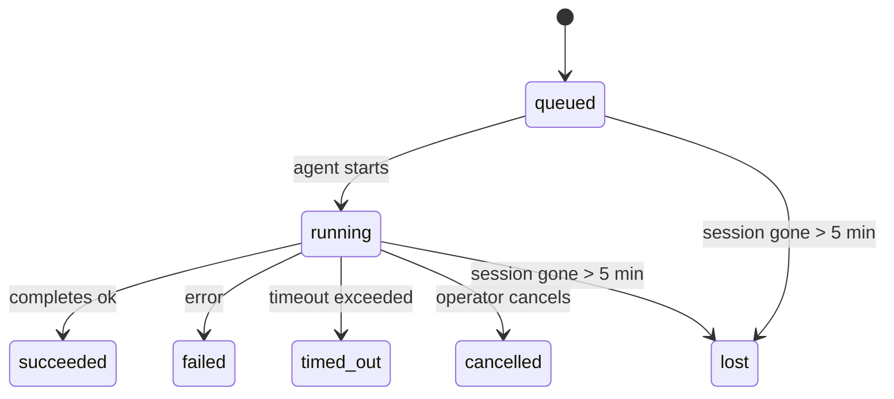

---
read_when:
    - فحص العمل في الخلفية الجاري أو المكتمل مؤخرًا
    - تصحيح أخطاء فشل التسليم لتشغيلات الوكيل المنفصلة
    - فهم كيفية ارتباط عمليات التشغيل في الخلفية بالجلسات وCron وHeartbeat
sidebarTitle: Background tasks
summary: تتبّع مهام الخلفية لتشغيلات ACP، والوكلاء الفرعيين، ومهام Cron المعزولة، وعمليات CLI
title: المهام الخلفية
x-i18n:
    generated_at: "2026-05-12T00:56:25Z"
    model: gpt-5.5
    provider: openai
    source_hash: 31cbf09df48bab0686a1350f91aefffffef899c86704bb97b68320fc47e78021
    source_path: automation/tasks.md
    workflow: 16
---

<Note>
تبحث عن الجدولة؟ راجع [الأتمتة](/ar/automation) لاختيار الآلية المناسبة. هذه الصفحة هي سجل النشاط للعمل في الخلفية، وليست المُجدول.
</Note>

تتعقب مهام الخلفية العمل الذي يعمل **خارج جلسة محادثتك الرئيسية**: تشغيلات ACP، وإنشاءات الوكلاء الفرعيين، وتنفيذات مهام cron المعزولة، والعمليات التي يبدأها CLI.

لا تستبدل المهام الجلسات أو مهام cron أو Heartbeat - فهي **سجل النشاط** الذي يسجل العمل المنفصل الذي حدث، ومتى حدث، وما إذا كان قد نجح.

<Note>
لا ينشئ كل تشغيل للوكيل مهمة. دورات Heartbeat والمحادثة التفاعلية العادية لا تفعل ذلك. كل تنفيذات cron، وإنشاءات ACP، وإنشاءات الوكلاء الفرعيين، وأوامر وكيل CLI تفعل ذلك.
</Note>

## الملخص

- المهام **سجلات** وليست مجدولات - يحدد cron وHeartbeat _متى_ يعمل العمل، وتتتبع المهام _ما حدث_.
- تنشئ ACP، والوكلاء الفرعيون، وكل مهام cron، وعمليات CLI مهام. دورات Heartbeat لا تفعل ذلك.
- تنتقل كل مهمة عبر `queued → running → terminal` (succeeded أو failed أو timed_out أو cancelled أو lost).
- تظل مهام cron نشطة ما دام وقت تشغيل cron لا يزال يملك المهمة؛ وإذا اختفت
  حالة وقت التشغيل داخل الذاكرة، تتحقق صيانة المهام أولا من سجل تشغيلات cron
  الدائم قبل تعليم المهمة كمفقودة.
- الإكمال مدفوع بالدفع: يمكن للعمل المنفصل أن يرسل إشعارا مباشرا أو يوقظ
  جلسة/Heartbeat الطالب عند الانتهاء، لذلك تكون حلقات استطلاع الحالة
  غالبا الشكل غير المناسب.
- تعمل تشغيلات cron المعزولة وإكمالات الوكلاء الفرعيين بأفضل جهد على تنظيف ألسنة المتصفح/العمليات المتتبعة لجلسة الابن قبل مسك دفاتر التنظيف النهائي.
- يمنع تسليم cron المعزول ردود الوالد المؤقتة القديمة بينما لا يزال عمل الوكيل الفرعي السليل قيد التفريغ، ويفضل مخرجات السليل النهائية عندما تصل قبل التسليم.
- تُسلم إشعارات الإكمال مباشرة إلى قناة أو توضع في قائمة الانتظار حتى Heartbeat التالية.
- يعرض `openclaw tasks list` كل المهام؛ ويكشف `openclaw tasks audit` المشكلات.
- تُحتفظ بالسجلات النهائية لمدة 7 أيام، ثم تُزال تلقائيا.

## البدء السريع

<Tabs>
  <Tab title="السرد والتصفية">
    ```bash
    # List all tasks (newest first)
    openclaw tasks list

    # Filter by runtime or status
    openclaw tasks list --runtime acp
    openclaw tasks list --status running
    ```

  </Tab>
  <Tab title="الفحص">
    ```bash
    # Show details for a specific task (by ID, run ID, or session key)
    openclaw tasks show <lookup>
    ```
  </Tab>
  <Tab title="الإلغاء والإشعار">
    ```bash
    # Cancel a running task (kills the child session)
    openclaw tasks cancel <lookup>

    # Change notification policy for a task
    openclaw tasks notify <lookup> state_changes
    ```

  </Tab>
  <Tab title="التدقيق والصيانة">
    ```bash
    # Run a health audit
    openclaw tasks audit

    # Preview or apply maintenance
    openclaw tasks maintenance
    openclaw tasks maintenance --apply
    ```

  </Tab>
  <Tab title="تدفق المهام">
    ```bash
    # Inspect TaskFlow state
    openclaw tasks flow list
    openclaw tasks flow show <lookup>
    openclaw tasks flow cancel <lookup>
    ```
  </Tab>
</Tabs>

## ما الذي ينشئ مهمة

| المصدر                 | نوع وقت التشغيل | متى يُنشأ سجل مهمة                                      | سياسة الإشعار الافتراضية |
| ---------------------- | ------------ | ------------------------------------------------------ | --------------------- |
| تشغيلات ACP الخلفية    | `acp`        | إنشاء جلسة ACP ابنة                                    | `done_only`           |
| تنسيق الوكلاء الفرعيين | `subagent`   | إنشاء وكيل فرعي عبر `sessions_spawn`                   | `done_only`           |
| مهام Cron (كل الأنواع) | `cron`       | كل تنفيذ لـ cron (الجلسة الرئيسية والمعزولة)           | `silent`              |
| عمليات CLI             | `cli`        | أوامر `openclaw agent` التي تعمل عبر Gateway           | `silent`              |
| مهام وسائط الوكيل      | `cli`        | تشغيلات `music_generate`/`video_generate` المدعومة بجلسة | `silent`              |

<AccordionGroup>
  <Accordion title="افتراضيات الإشعار لـ cron والوسائط">
    تستخدم مهام cron في الجلسة الرئيسية سياسة إشعار `silent` افتراضيا - فهي تنشئ سجلات للتتبع لكنها لا تولد إشعارات. كما تعتمد مهام cron المعزولة افتراضيا على `silent` لكنها أوضح لأنها تعمل في جلستها الخاصة.

    تستخدم تشغيلات `music_generate` و`video_generate` المدعومة بجلسة أيضا سياسة إشعار `silent`. ما زالت تنشئ سجلات مهام، لكن الإكمال يُعاد إلى جلسة الوكيل الأصلية كإيقاظ داخلي حتى يتمكن الوكيل من كتابة رسالة المتابعة وإرفاق الوسائط المكتملة بنفسه. تتبع إكمالات المجموعة/القناة سياسة الرد المرئي العادية، لذلك يستخدم الوكيل أداة الرسائل عندما يتطلب تسليم المصدر ذلك. إذا فشل وكيل الإكمال في إنتاج دليل تسليم بأداة الرسائل في مسار أدوات فقط، يرسل OpenClaw بديل الإكمال مباشرة إلى القناة الأصلية بدلا من ترك الوسائط خاصة.

  </Accordion>
  <Accordion title="حاجز أمان video_generate المتزامن">
    بينما لا تزال مهمة `video_generate` المدعومة بجلسة نشطة، تعمل الأداة أيضا كحاجز أمان: تعيد استدعاءات `video_generate` المتكررة في الجلسة نفسها حالة المهمة النشطة بدلا من بدء توليد ثان متزامن. استخدم `action: "status"` عندما تريد استعلام تقدم/حالة صريحا من جهة الوكيل.
  </Accordion>
  <Accordion title="ما الذي لا ينشئ مهام">
    - دورات Heartbeat - الجلسة الرئيسية؛ راجع [Heartbeat](/ar/gateway/heartbeat)
    - دورات المحادثة التفاعلية العادية
    - ردود `/command` المباشرة

  </Accordion>
</AccordionGroup>

## دورة حياة المهمة



| الحالة      | ما تعنيه                                                                   |
| ----------- | -------------------------------------------------------------------------- |
| `queued`    | أُنشئت، وتنتظر بدء الوكيل                                                  |
| `running`   | دورة الوكيل قيد التنفيذ بنشاط                                              |
| `succeeded` | اكتملت بنجاح                                                               |
| `failed`    | اكتملت مع خطأ                                                              |
| `timed_out` | تجاوزت المهلة المكوّنة                                                     |
| `cancelled` | أوقفها المشغل عبر `openclaw tasks cancel`                                  |
| `lost`      | فقد وقت التشغيل حالة الدعم السلطوية بعد فترة سماح مدتها 5 دقائق           |

تحدث الانتقالات تلقائيا - عندما ينتهي تشغيل الوكيل المرتبط، تتحدث حالة المهمة لتطابق ذلك.

إكمال تشغيل الوكيل هو المرجع السلطوي لسجلات المهام النشطة. ينهي التشغيل المنفصل الناجح كـ `succeeded`، وتنتهي أخطاء التشغيل العادية كـ `failed`، وتنتهي نتائج المهلة أو الإجهاض كـ `timed_out`. إذا كان المشغل قد ألغى المهمة بالفعل، أو كان وقت التشغيل قد سجل بالفعل حالة نهائية أقوى مثل `failed` أو `timed_out` أو `lost`، فلا تؤدي إشارة نجاح لاحقة إلى تخفيض تلك الحالة النهائية.

`lost` واعية بوقت التشغيل:

- مهام ACP: اختفت بيانات جلسة ACP الابنة الداعمة.
- مهام الوكيل الفرعي: اختفت الجلسة الابنة الداعمة من مخزن الوكيل الهدف.
- مهام Cron: لم يعد وقت تشغيل cron يتتبع المهمة كنشطة ولا يظهر سجل
  تشغيلات cron الدائم نتيجة نهائية لذلك التشغيل. لا يتعامل تدقيق CLI
  غير المتصل مع حالة وقت تشغيل cron الفارغة داخل عمليته كسلطة.
- مهام CLI: تستخدم المهام ذات معرف تشغيل/معرف مصدر سياق التشغيل المباشر، لذلك
  لا تبقي صفوف الجلسات الابنة أو جلسات المحادثة العالقة هذه المهام حية بعد
  اختفاء التشغيل المملوك لـ Gateway. ما زالت مهام CLI القديمة بلا هوية تشغيل
  ترجع إلى الجلسة الابنة. كما تنتهي تشغيلات `openclaw agent` المدعومة بـ Gateway
  من نتيجة تشغيلها، لذلك لا تبقى التشغيلات المكتملة نشطة حتى يعلّمها الكانس
  كـ `lost`.

## التسليم والإشعارات

عندما تصل مهمة إلى حالة نهائية، يخطرك OpenClaw. يوجد مسارا تسليم:

**التسليم المباشر** - إذا كان للمهمة هدف قناة (`requesterOrigin`)، تذهب رسالة الإكمال مباشرة إلى تلك القناة (Telegram وDiscord وSlack وما إلى ذلك). بدلا من ذلك، تُوجه إكمالات مهام المجموعة والقناة عبر جلسة الطالب حتى يتمكن الوكيل الوالد من كتابة الرد المرئي. بالنسبة إلى إكمالات الوكيل الفرعي، يحافظ OpenClaw أيضا على توجيه الخيط/الموضوع المرتبط عندما يكون متاحا، ويمكنه ملء `to` / الحساب المفقود من مسار جلسة الطالب المخزن (`lastChannel` / `lastTo` / `lastAccountId`) قبل التخلي عن التسليم المباشر.

**التسليم الموضوع في قائمة انتظار الجلسة** - إذا فشل التسليم المباشر أو لم يُضبط أصل، يوضع التحديث في قائمة الانتظار كحدث نظام في جلسة الطالب ويظهر عند Heartbeat التالية.

<Tip>
يفعّل إكمال المهمة إيقاظ Heartbeat فوريا حتى ترى النتيجة بسرعة - لا تحتاج إلى انتظار دقة Heartbeat المجدولة التالية.
</Tip>

يعني ذلك أن سير العمل المعتاد قائم على الدفع: ابدأ العمل المنفصل مرة واحدة، ثم دع وقت التشغيل يوقظك أو يخطرك عند الإكمال. لا تستطلع حالة المهمة إلا عندما تحتاج إلى تصحيح، أو تدخل، أو تدقيق صريح.

### سياسات الإشعار

تحكم في مقدار ما تسمعه عن كل مهمة:

| السياسة                | ما يُسلم                                                                 |
| --------------------- | ----------------------------------------------------------------------- |
| `done_only` (الافتراضي) | الحالة النهائية فقط (succeeded وfailed وما إلى ذلك) - **هذا هو الافتراضي** |
| `state_changes`       | كل انتقال حالة وتحديث تقدم                                               |
| `silent`              | لا شيء إطلاقا                                                            |

غيّر السياسة أثناء تشغيل مهمة:

```bash
openclaw tasks notify <lookup> state_changes
```

## مرجع CLI

<AccordionGroup>
  <Accordion title="tasks list">
    ```bash
    openclaw tasks list [--runtime <acp|subagent|cron|cli>] [--status <status>] [--json]
    ```

    أعمدة المخرجات: معرف المهمة، النوع، الحالة، التسليم، معرف التشغيل، الجلسة الابنة، الملخص.

  </Accordion>
  <Accordion title="tasks show">
    ```bash
    openclaw tasks show <lookup>
    ```

    يقبل رمز البحث معرف مهمة أو معرف تشغيل أو مفتاح جلسة. يعرض السجل الكامل بما في ذلك التوقيت، وحالة التسليم، والخطأ، والملخص النهائي.

  </Accordion>
  <Accordion title="tasks cancel">
    ```bash
    openclaw tasks cancel <lookup>
    ```

    بالنسبة إلى مهام ACP والوكيل الفرعي، يقتل هذا الجلسة الابنة. بالنسبة إلى المهام المتتبعة بواسطة CLI، يُسجل الإلغاء في سجل المهام (لا يوجد مقبض وقت تشغيل ابن منفصل). تنتقل الحالة إلى `cancelled` ويُرسل إشعار تسليم عند انطباق ذلك.

  </Accordion>
  <Accordion title="tasks notify">
    ```bash
    openclaw tasks notify <lookup> <done_only|state_changes|silent>
    ```
  </Accordion>
  <Accordion title="tasks audit">
    ```bash
    openclaw tasks audit [--json]
    ```

    يكشف المشكلات التشغيلية. تظهر النتائج أيضا في `openclaw status` عند اكتشاف مشكلات.

    | النتيجة                  | الخطورة       | المشغّل                                                                                                      |
    | ------------------------- | ------------- | ------------------------------------------------------------------------------------------------------------ |
    | `stale_queued`            | تحذير         | في قائمة الانتظار لأكثر من 10 دقائق                                                                         |
    | `stale_running`           | خطأ           | قيد التشغيل لأكثر من 30 دقيقة                                                                               |
    | `lost`                    | تحذير/خطأ     | اختفت ملكية المهمة المدعومة بوقت التشغيل؛ تظل المهام المفقودة المحتفظ بها تحذيرات حتى `cleanupAfter`، ثم تصبح أخطاء |
    | `delivery_failed`         | تحذير         | فشل التسليم وسياسة الإشعار ليست `silent`                                                                    |
    | `missing_cleanup`         | تحذير         | مهمة نهائية بدون طابع زمني للتنظيف                                                                          |
    | `inconsistent_timestamps` | تحذير         | مخالفة في الخط الزمني (على سبيل المثال انتهت قبل أن تبدأ)                                                   |

  </Accordion>
  <Accordion title="صيانة المهام">
    ```bash
    openclaw tasks maintenance [--json]
    openclaw tasks maintenance --apply [--json]
    ```

    استخدم هذا لمعاينة أو تطبيق التسوية، وختم التنظيف، والتقليم للمهام، وحالة Task Flow، وصفوف سجل جلسات تشغيل cron القديمة.

    التسوية واعية بوقت التشغيل:

    - تتحقق مهام ACP/العامل الفرعي من جلسة الطفل الداعمة لها.
    - تُعلَّم مهام العامل الفرعي التي تحتوي جلسة الطفل الخاصة بها على شاهدة استرداد بعد إعادة التشغيل على أنها مفقودة بدلا من معاملتها كجلسات داعمة قابلة للاسترداد.
    - تتحقق مهام Cron مما إذا كان وقت تشغيل Cron لا يزال يملك المهمة، ثم تستعيد الحالة النهائية من سجلات تشغيل Cron المستمرة/حالة المهمة قبل الرجوع إلى `lost`. عملية Gateway فقط هي المرجع الموثوق لمجموعة مهام Cron النشطة في الذاكرة؛ يستخدم تدقيق CLI غير المتصل التاريخ الدائم لكنه لا يعلّم مهمة Cron كمفقودة لمجرد أن تلك المجموعة المحلية فارغة.
    - تتحقق مهام CLI ذات هوية التشغيل من سياق التشغيل الحي المالك، وليس فقط من صفوف جلسات الطفل أو جلسات الدردشة.

    التنظيف بعد الاكتمال واع بوقت التشغيل أيضا:

    - إكمال العامل الفرعي يغلق، بأفضل جهد، تبويبات/عمليات المتصفح المتتبعة لجلسة الطفل قبل أن يستمر تنظيف الإعلان.
    - إكمال Cron المعزول يغلق، بأفضل جهد، تبويبات/عمليات المتصفح المتتبعة لجلسة Cron قبل أن ينتهي التشغيل بالكامل.
    - ينتظر تسليم Cron المعزول متابعة العامل الفرعي السليل عند الحاجة ويمنع نص إقرار الأصل القديم بدلا من إعلانه.
    - يفضّل تسليم إكمال العامل الفرعي أحدث نص مساعد مرئي؛ إذا كان ذلك فارغا فإنه يرجع إلى أحدث نص أداة/toolResult منقّى، ويمكن لتشغيلات استدعاء الأدوات التي انتهت بالمهلة فقط أن تُختصر إلى ملخص موجز للتقدم الجزئي. تعلن التشغيلات الفاشلة النهائية حالة الفشل دون إعادة عرض نص الرد الملتقط.
    - لا تخفي إخفاقات التنظيف نتيجة المهمة الحقيقية.

    عند تطبيق الصيانة، يزيل OpenClaw أيضا صفوف سجل الجلسات القديمة `cron:<jobId>:run:<uuid>` التي يزيد عمرها عن 7 أيام، مع الحفاظ على الصفوف الخاصة بمهام Cron قيد التشغيل حاليا وترك صفوف الجلسات غير التابعة لـCron دون تغيير.

  </Accordion>
  <Accordion title="tasks flow list | show | cancel">
    ```bash
    openclaw tasks flow list [--status <status>] [--json]
    openclaw tasks flow show <lookup> [--json]
    openclaw tasks flow cancel <lookup>
    ```

    استخدم هذه عندما يكون Task Flow المنسّق هو ما تهتم به بدلا من سجل مهمة خلفية فردية واحد.

  </Accordion>
</AccordionGroup>

## لوحة مهام الدردشة (`/tasks`)

استخدم `/tasks` في أي جلسة دردشة لرؤية المهام الخلفية المرتبطة بتلك الجلسة. تعرض اللوحة المهام النشطة والمكتملة مؤخرا مع وقت التشغيل، والحالة، والتوقيت، وتفاصيل التقدم أو الخطأ.

عندما لا تحتوي الجلسة الحالية على مهام مرتبطة مرئية، يرجع `/tasks` إلى أعداد المهام المحلية للعامل حتى تحصل مع ذلك على نظرة عامة دون تسريب تفاصيل جلسات أخرى.

لسجل المشغل الكامل، استخدم CLI: `openclaw tasks list`.

## تكامل الحالة (ضغط المهام)

يتضمن `openclaw status` ملخصا سريعا للمهام:

```
Tasks: 3 queued · 2 running · 1 issues
```

يعرض الملخص:

- **نشطة** - عدد `queued` + `running`
- **الإخفاقات** - عدد `failed` + `timed_out` + `lost`
- **حسب وقت التشغيل** - تفصيل حسب `acp`، و`subagent`، و`cron`، و`cli`

يستخدم كل من `/status` وأداة `session_status` لقطة مهام واعية بالتنظيف: تُفضّل المهام النشطة، وتُخفى الصفوف المكتملة القديمة، ولا تظهر الإخفاقات الحديثة إلا عندما لا يبقى أي عمل نشط. هذا يبقي بطاقة الحالة مركزة على ما يهم الآن.

## التخزين والصيانة

### أين توجد المهام

تستمر سجلات المهام في SQLite عند:

```
$OPENCLAW_STATE_DIR/tasks/runs.sqlite
```

يُحمّل السجل إلى الذاكرة عند بدء Gateway وتُزامن عمليات الكتابة إلى SQLite لضمان الديمومة عبر عمليات إعادة التشغيل.
يبقي Gateway سجل الكتابة المسبقة في SQLite ضمن حدود محددة باستخدام عتبة نقطة التحقق التلقائية الافتراضية في SQLite بالإضافة إلى نقاط تحقق `TRUNCATE` دورية وعند الإيقاف.

### الصيانة التلقائية

يعمل منظّف كل **60 ثانية** ويتولى أربعة أمور:

<Steps>
  <Step title="التسوية">
    يتحقق مما إذا كانت المهام النشطة لا تزال لديها دعامة موثوقة من وقت التشغيل. تستخدم مهام ACP/العامل الفرعي حالة جلسة الطفل، وتستخدم مهام Cron ملكية المهمة النشطة، وتستخدم مهام CLI ذات هوية التشغيل سياق التشغيل المالك. إذا اختفت تلك الحالة الداعمة لأكثر من 5 دقائق، تُعلّم المهمة كـ`lost`.
  </Step>
  <Step title="إصلاح جلسات ACP">
    يغلق جلسات ACP النهائية أو اليتيمة أحادية التشغيل المملوكة للأصل، ويغلق جلسات ACP الدائمة النهائية القديمة أو اليتيمة فقط عندما لا يبقى أي ربط محادثة نشط.
  </Step>
  <Step title="ختم التنظيف">
    يعيّن طابعا زمنيا `cleanupAfter` على المهام النهائية (endedAt + 7 أيام). أثناء الاحتفاظ، تظل المهام المفقودة تظهر في التدقيق كتحذيرات؛ بعد انتهاء `cleanupAfter` أو عند فقدان بيانات التنظيف الوصفية، تصبح أخطاء.
  </Step>
  <Step title="التقليم">
    يحذف السجلات التي تجاوزت تاريخ `cleanupAfter` الخاص بها.
  </Step>
</Steps>

<Note>
**الاحتفاظ:** تُحفظ سجلات المهام النهائية لمدة **7 أيام**، ثم تُقلّم تلقائيا. لا حاجة إلى ضبط.
</Note>

## كيف ترتبط المهام بالأنظمة الأخرى

<AccordionGroup>
  <Accordion title="المهام وTask Flow">
    [Task Flow](/ar/automation/taskflow) هو طبقة تنسيق التدفقات فوق المهام الخلفية. قد ينسق تدفق واحد عدة مهام خلال عمره باستخدام أوضاع مزامنة مُدارة أو معكوسة. استخدم `openclaw tasks` لفحص سجلات المهام الفردية و`openclaw tasks flow` لفحص التدفق المنسّق.

    راجع [Task Flow](/ar/automation/taskflow) للتفاصيل.

  </Accordion>
  <Accordion title="المهام وCron">
    يوجد **تعريف** مهمة Cron في `~/.openclaw/cron/jobs.json`؛ وتوجد حالة التنفيذ وقت التشغيل بجانبه في `~/.openclaw/cron/jobs-state.json`. ينشئ **كل** تنفيذ Cron سجل مهمة، سواء كان في الجلسة الرئيسية أو معزولا. تستخدم مهام Cron في الجلسة الرئيسية سياسة إشعار `silent` افتراضيا كي تتتبع دون إنشاء إشعارات.

    راجع [مهام Cron](/ar/automation/cron-jobs).

  </Accordion>
  <Accordion title="المهام وHeartbeat">
    تشغيلات Heartbeat هي دورات في الجلسة الرئيسية؛ إنها لا تنشئ سجلات مهام. عند اكتمال مهمة، يمكنها تشغيل تنبيه Heartbeat حتى ترى النتيجة بسرعة.

    راجع [Heartbeat](/ar/gateway/heartbeat).

  </Accordion>
  <Accordion title="المهام والجلسات">
    قد تشير المهمة إلى `childSessionKey` (حيث يجري العمل) و`requesterSessionKey` (من بدأها). الجلسات هي سياق المحادثة؛ أما المهام فهي تتبع النشاط فوق ذلك.
  </Accordion>
  <Accordion title="المهام وتشغيلات العامل">
    يربط `runId` الخاص بالمهمة بتشغيل العامل الذي ينجز العمل. تحدّث أحداث دورة حياة العامل (البدء، والانتهاء، والخطأ) حالة المهمة تلقائيا؛ لست بحاجة إلى إدارة دورة الحياة يدويا.
  </Accordion>
</AccordionGroup>

## ذو صلة

- [الأتمتة](/ar/automation) - كل آليات الأتمتة بلمحة واحدة
- [CLI: المهام](/ar/cli/tasks) - مرجع أوامر CLI
- [Heartbeat](/ar/gateway/heartbeat) - دورات الجلسة الرئيسية الدورية
- [المهام المجدولة](/ar/automation/cron-jobs) - جدولة العمل الخلفي
- [Task Flow](/ar/automation/taskflow) - تنسيق التدفقات فوق المهام
