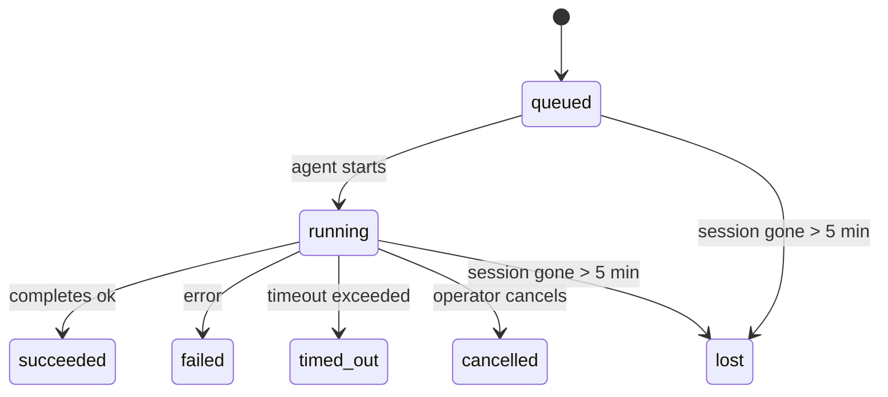

---
read_when:
    - فحص العمل في الخلفية الجاري أو المكتمل حديثًا
    - تصحيح أخطاء فشل التسليم لتشغيلات الوكيل المنفصلة
    - فهم كيفية ارتباط عمليات التشغيل في الخلفية بالجلسات وCron وHeartbeat
sidebarTitle: Background tasks
summary: تتبّع المهام الخلفية لعمليات تشغيل ACP، والوكلاء الفرعيين، ومهام Cron المعزولة، وعمليات CLI
title: مهام الخلفية
x-i18n:
    generated_at: "2026-06-27T17:08:57Z"
    model: gpt-5.5
    postprocess_version: locale-links-v1
    provider: openai
    source_hash: 4a630a52d0d6bfd387a37415dd63fc4bfbce23f99eaa8cb780c3d6f8913675fd
    source_path: automation/tasks.md
    workflow: 16
---

<Note>
هل تبحث عن الجدولة؟ راجع [الأتمتة](/ar/automation) لاختيار الآلية المناسبة. هذه الصفحة هي سجل النشاط للعمل في الخلفية، وليست المجدول.
</Note>

تتعقب المهام الخلفية العمل الذي يعمل **خارج جلسة محادثتك الرئيسية**: تشغيلات ACP، وإنشاء الوكلاء الفرعيين، وتنفيذات مهام cron المعزولة، والعمليات التي يبدأها CLI.

لا تستبدل المهام الجلسات أو مهام cron أو Heartbeat - فهي **سجل النشاط** الذي يسجل العمل المنفصل الذي حدث، ومتى حدث، وما إذا كان قد نجح.

<Note>
لا ينشئ كل تشغيل وكيل مهمة. دورات Heartbeat والدردشة التفاعلية العادية لا تفعل ذلك. كل تنفيذات cron، وإنشاءات ACP، وإنشاءات الوكلاء الفرعيين، وأوامر وكيل CLI تفعل ذلك.
</Note>

## باختصار

- المهام **سجلات** وليست مجدولات - يقرر cron وHeartbeat _متى_ يعمل العمل، وتتتبع المهام _ما حدث_.
- ينشئ ACP والوكلاء الفرعيون وكل مهام cron وعمليات CLI مهام. دورات Heartbeat لا تفعل ذلك.
- تنتقل كل مهمة عبر `queued → running → terminal` (succeeded، أو failed، أو timed_out، أو cancelled، أو lost).
- تبقى مهام Cron حية ما دام وقت تشغيل cron لا يزال يملك المهمة؛ إذا اختفت
  حالة وقت التشغيل الموجودة في الذاكرة، تتحقق صيانة المهام أولا من سجل تشغيلات cron
  الدائم قبل وسم المهمة بأنها مفقودة.
- الاكتمال مدفوع بالدفع: يمكن للعمل المنفصل أن يخطر مباشرة أو يوقظ
  جلسة الطالب/Heartbeat عند انتهائه، لذلك تكون حلقات استطلاع الحالة
  غالبا بالشكل الخطأ.
- تنظف تشغيلات cron المعزولة واكتمالات الوكلاء الفرعيين علامات تبويب/عمليات المتصفح المتتبعة لجلسة الابن بأفضل جهد قبل مسك دفاتر التنظيف النهائي.
- يمنع تسليم cron المعزول ردودا وسيطة قديمة من الوالد بينما لا يزال عمل الوكيل الفرعي التابع قيد التصريف، ويفضل مخرجات التابع النهائية عندما تصل قبل التسليم.
- تسلم إشعارات الاكتمال مباشرة إلى قناة أو توضع في قائمة انتظار Heartbeat التالية.
- يعرض `openclaw tasks list` كل المهام؛ ويكشف `openclaw tasks audit` المشكلات.
- تحفظ السجلات النهائية لمدة 7 أيام، ثم تشذب تلقائيا.

## بدء سريع

<Tabs>
  <Tab title="List and filter">
    ```bash
    # List all tasks (newest first)
    openclaw tasks list

    # Filter by runtime or status
    openclaw tasks list --runtime acp
    openclaw tasks list --status running
    ```

  </Tab>
  <Tab title="Inspect">
    ```bash
    # Show details for a specific task (by ID, run ID, or session key)
    openclaw tasks show <lookup>
    ```
  </Tab>
  <Tab title="Cancel and notify">
    ```bash
    # Cancel a running task (kills the child session)
    openclaw tasks cancel <lookup>

    # Change notification policy for a task
    openclaw tasks notify <lookup> state_changes
    ```

  </Tab>
  <Tab title="Audit and maintenance">
    ```bash
    # Run a health audit
    openclaw tasks audit

    # Preview or apply maintenance
    openclaw tasks maintenance
    openclaw tasks maintenance --apply
    ```

  </Tab>
  <Tab title="Task flow">
    ```bash
    # Inspect TaskFlow state
    openclaw tasks flow list
    openclaw tasks flow show <lookup>
    openclaw tasks flow cancel <lookup>
    ```
  </Tab>
</Tabs>

## ما الذي ينشئ مهمة

| المصدر                 | نوع وقت التشغيل | متى ينشأ سجل المهمة                                          | سياسة الإشعار الافتراضية |
| ---------------------- | ------------ | ---------------------------------------------------------------------- | --------------------- |
| تشغيلات ACP الخلفية    | `acp`        | إنشاء جلسة ACP ابن                                           | `done_only`           |
| تنسيق الوكلاء الفرعيين | `subagent`   | إنشاء وكيل فرعي عبر `sessions_spawn`                               | `done_only`           |
| مهام Cron (كل الأنواع)  | `cron`       | كل تنفيذ cron (في الجلسة الرئيسية والمعزول)                       | `silent`              |
| عمليات CLI         | `cli`        | أوامر `openclaw agent` التي تعمل عبر Gateway                 | `silent`              |
| مهام وسائط الوكيل       | `cli`        | تشغيلات `image_generate`/`music_generate`/`video_generate` المدعومة بجلسة | `silent`              |

<AccordionGroup>
  <Accordion title="Notify defaults for cron and media">
    تستخدم مهام cron في الجلسة الرئيسية سياسة إشعار `silent` افتراضيا - فهي تنشئ سجلات للتتبع لكنها لا تنشئ إشعارات. مهام cron المعزولة تستخدم أيضا `silent` افتراضيا لكنها أكثر وضوحا لأنها تعمل في جلستها الخاصة.

    تستخدم تشغيلات `image_generate` و`music_generate` و`video_generate` المدعومة بجلسة أيضا سياسة إشعار `silent`. لا تزال تنشئ سجلات مهام، لكن الاكتمال يعاد إلى جلسة الوكيل الأصلية كإيقاظ داخلي حتى يتمكن الوكيل من كتابة رسالة المتابعة وإرفاق الوسائط المنتهية بنفسه. يتبع الوكيل الطالب عقد الرد المرئي العادي الخاص به: رد نهائي تلقائي عند تهيئته، أو `message(action="send")` مع `NO_REPLY` عندما تتطلب الجلسة ردود أداة الرسائل. إذا لم تعد جلسة الطالب نشطة أو فشل إيقاظها النشط، وفات وكيل الاكتمال بعض الوسائط المولدة أو كلها، يرسل OpenClaw بديلا مباشرا عديم التكرار يحتوي فقط على الوسائط الناقصة إلى هدف القناة الأصلي.

  </Accordion>
  <Accordion title="Concurrent media-generation guardrail">
    بينما لا تزال مهمة توليد وسائط مدعومة بجلسة نشطة، تعمل أدوات الوسائط أيضا كحواجز حماية لإعادات المحاولة العرضية. تعيد استدعاءات `image_generate` المتكررة للموجه نفسه حالة المهمة النشطة المطابقة، بينما يمكن لموجه صورة مختلف بدء مهمته الخاصة. لا تزال استدعاءات `music_generate` و`video_generate` تعيد حالة المهمة النشطة لتلك الجلسة بدلا من بدء توليد ثان متزامن. استخدم `action: "status"` عندما تريد بحث تقدم/حالة صريحا من جهة الوكيل.
  </Accordion>
  <Accordion title="What does not create tasks">
    - دورات Heartbeat - الجلسة الرئيسية؛ راجع [Heartbeat](/ar/gateway/heartbeat)
    - دورات الدردشة التفاعلية العادية
    - ردود `/command` المباشرة

  </Accordion>
</AccordionGroup>

## دورة حياة المهمة



| الحالة      | معناها                                                              |
| ----------- | -------------------------------------------------------------------------- |
| `queued`    | أنشئت، وتنتظر بدء الوكيل                                    |
| `running`   | دورة الوكيل تنفذ بنشاط                                           |
| `succeeded` | اكتملت بنجاح                                                     |
| `failed`    | اكتملت مع خطأ                                                    |
| `timed_out` | تجاوزت المهلة المهيأة                                            |
| `cancelled` | أوقفها المشغل عبر `openclaw tasks cancel`                        |
| `lost`      | فقد وقت التشغيل حالة الدعم الموثوقة بعد فترة سماح مدتها 5 دقائق |

تحدث الانتقالات تلقائيا - عندما ينتهي تشغيل الوكيل المرتبط، تحدث حالة المهمة لتطابقه.

اكتمال تشغيل الوكيل هو المرجع الموثوق لسجلات المهام النشطة. ينهي التشغيل المنفصل الناجح كـ `succeeded`، وتنهي أخطاء التشغيل العادية كـ `failed`، وتنهي نتائج المهلة أو الإجهاض كـ `timed_out`. إذا كان المشغل قد ألغى المهمة بالفعل، أو كان وقت التشغيل قد سجل بالفعل حالة نهائية أقوى مثل `failed` أو `timed_out` أو `lost`، فلا تؤدي إشارة نجاح لاحقة إلى خفض تلك الحالة النهائية.

`lost` واعية بوقت التشغيل:

- مهام ACP: اختفت بيانات جلسة ACP الابنة الداعمة.
- مهام الوكلاء الفرعيين: اختفت الجلسة الابنة الداعمة من مخزن الوكيل الهدف.
- مهام Cron: لم يعد وقت تشغيل cron يتتبع المهمة كنشطة، ولا يظهر سجل تشغيلات
  cron الدائم نتيجة نهائية لذلك التشغيل. لا يتعامل تدقيق CLI غير المتصل
  مع حالة وقت تشغيل cron الفارغة داخل العملية الخاصة به كمرجع موثوق.
- مهام CLI: تستخدم المهام التي لديها معرف تشغيل/معرف مصدر سياق التشغيل الحي، لذلك
  لا تبقي صفوف الجلسة الابنة أو جلسة الدردشة العالقة هذه المهام حية بعد
  اختفاء التشغيل المملوك لـ Gateway. لا تزال مهام CLI القديمة التي لا تملك هوية تشغيل
  تعود إلى الجلسة الابنة. كما تنتهي تشغيلات `openclaw agent` المدعومة بـ Gateway
  من نتيجة تشغيلها، لذلك لا تبقى التشغيلات المكتملة نشطة حتى يوسمها المنظف
  بأنها `lost`.

## التسليم والإشعارات

عندما تصل مهمة إلى حالة نهائية، يخطرك OpenClaw. هناك مسارا تسليم:

**التسليم المباشر** - إذا كان للمهمة هدف قناة (`requesterOrigin`)، تذهب رسالة الاكتمال مباشرة إلى تلك القناة (Telegram وDiscord وSlack وما إلى ذلك). أما اكتمالات مهام المجموعات والقنوات فتوجه عبر جلسة الطالب حتى يتمكن الوكيل الوالد من كتابة الرد المرئي. بالنسبة لاكتمالات الوكلاء الفرعيين، يحافظ OpenClaw أيضا على توجيه الخيط/الموضوع المرتبط عند توفره، ويمكنه ملء `to` / حساب مفقود من مسار جلسة الطالب المخزن (`lastChannel` / `lastTo` / `lastAccountId`) قبل التخلي عن التسليم المباشر.

**التسليم الموضوع في قائمة انتظار الجلسة** - إذا فشل التسليم المباشر أو لم يضبط أصل، يوضع التحديث كحدث نظام في جلسة الطالب ويظهر في Heartbeat التالية.

<Tip>
يشغل اكتمال المهمة إيقاظ Heartbeat فوريا حتى ترى النتيجة بسرعة - لا تحتاج إلى انتظار نبضة Heartbeat المجدولة التالية.
</Tip>

هذا يعني أن سير العمل المعتاد قائم على الدفع: ابدأ العمل المنفصل مرة واحدة، ثم اترك وقت التشغيل يوقظك أو يخطرك عند الاكتمال. لا تستطلع حالة المهمة إلا عندما تحتاج إلى تصحيح، أو تدخل، أو تدقيق صريح.

### سياسات الإشعار

تحكم في مقدار ما تسمعه عن كل مهمة:

| السياسة                | ما يتم تسليمه                                                       |
| --------------------- | ----------------------------------------------------------------------- |
| `done_only` (افتراضي) | الحالة النهائية فقط (succeeded، failed، وما إلى ذلك) - **هذا هو الافتراضي** |
| `state_changes`       | كل انتقال حالة وتحديث تقدم                              |
| `silent`              | لا شيء إطلاقا                                                          |

غيّر السياسة أثناء تشغيل مهمة:

```bash
openclaw tasks notify <lookup> state_changes
```

## مرجع CLI

<AccordionGroup>
  <Accordion title="tasks list">
    ```bash
    openclaw tasks list [--runtime <acp|subagent|cron|cli>] [--status <status>] [--json]
    ```

    أعمدة الإخراج: معرف المهمة، النوع، الحالة، التسليم، معرف التشغيل، الجلسة الابنة، الملخص.

  </Accordion>
  <Accordion title="tasks show">
    ```bash
    openclaw tasks show <lookup>
    ```

    يقبل رمز البحث معرف مهمة أو معرف تشغيل أو مفتاح جلسة. يعرض السجل الكامل بما في ذلك التوقيت، وحالة التسليم، والخطأ، والملخص النهائي.

  </Accordion>
  <Accordion title="tasks cancel">
    ```bash
    openclaw tasks cancel <lookup>
    ```

    بالنسبة لمهام ACP والوكلاء الفرعيين، يقتل هذا الجلسة الابنة. بالنسبة للمهام المتتبعة عبر CLI، يسجل الإلغاء في سجل المهام (لا يوجد مقبض وقت تشغيل ابن منفصل). تنتقل الحالة إلى `cancelled` ويرسل إشعار تسليم عند انطباق ذلك.

  </Accordion>
  <Accordion title="tasks notify">
    ```bash
    openclaw tasks notify <lookup> <done_only|state_changes|silent>
    ```
  </Accordion>
  <Accordion title="tasks audit">
    ```bash
    openclaw tasks audit [--json]
    ```

    يكشف المشكلات التشغيلية. تظهر النتائج أيضا في `openclaw status` عند اكتشاف مشكلات.

    | النتيجة                  | الخطورة     | المحفز                                                                                                      |
    | ------------------------- | ---------- | ------------------------------------------------------------------------------------------------------------ |
    | `stale_queued`            | تحذير      | في قائمة الانتظار لأكثر من 10 دقائق                                                                         |
    | `stale_running`           | خطأ        | قيد التشغيل لأكثر من 30 دقيقة                                                                               |
    | `lost`                    | تحذير/خطأ | اختفت ملكية المهمة المدعومة بوقت التشغيل؛ تبقى المهام المفقودة المحتفَظ بها كتحذيرات حتى `cleanupAfter`، ثم تصبح أخطاء |
    | `delivery_failed`         | تحذير      | فشل التسليم وسياسة الإشعار ليست `silent`                                                                    |
    | `missing_cleanup`         | تحذير      | مهمة نهائية من دون طابع زمني للتنظيف                                                                        |
    | `inconsistent_timestamps` | تحذير      | انتهاك في الخط الزمني (على سبيل المثال انتهت قبل أن تبدأ)                                                   |

  </Accordion>
  <Accordion title="tasks maintenance">
    ```bash
    openclaw tasks maintenance [--json]
    openclaw tasks maintenance --apply [--json]
    ```

    استخدم هذا لمعاينة أو تطبيق التسوية، ووضع طوابع التنظيف، والتقليم للمهام، وحالة Task Flow، وصفوف سجل جلسات تشغيل cron القديمة.

    التسوية مدركة لوقت التشغيل:

    - تتحقق مهام ACP/الوكيل الفرعي من جلسة الطفل الداعمة لها.
    - يتم وسم مهام الوكيل الفرعي التي تملك جلسة طفل لها علامة حذف لاسترداد إعادة التشغيل بأنها مفقودة بدلًا من التعامل معها كجلسات داعمة قابلة للاسترداد.
    - تتحقق مهام Cron مما إذا كان وقت تشغيل cron لا يزال يملك المهمة، ثم تستعيد الحالة النهائية من سجلات تشغيل cron/حالة المهمة المستمرة قبل الرجوع إلى `lost`. تكون عملية Gateway وحدها مرجعية لمجموعة مهام cron النشطة داخل الذاكرة؛ يستخدم تدقيق CLI دون اتصال التاريخ الدائم لكنه لا يسم مهمة cron بأنها مفقودة فقط لأن تلك المجموعة المحلية فارغة.
    - تتحقق مهام CLI ذات هوية التشغيل من سياق التشغيل الحي المالك، وليس فقط من صفوف جلسة الطفل أو جلسة الدردشة.

    التنظيف بعد الإكمال مدرك أيضًا لوقت التشغيل:

    - يحاول إكمال الوكيل الفرعي، بأفضل جهد، إغلاق ألسنة/عمليات المتصفح المتتبعة لجلسة الطفل قبل متابعة تنظيف الإعلان.
    - يحاول إكمال cron المعزول، بأفضل جهد، إغلاق ألسنة/عمليات المتصفح المتتبعة لجلسة cron قبل تفكيك التشغيل بالكامل.
    - ينتظر تسليم cron المعزول متابعة الوكلاء الفرعيين المتحدرين عند الحاجة، ويكبت نص إقرار الأصل القديم بدلًا من إعلانه.
    - يستخدم تسليم إكمال الوكيل الفرعي أحدث نص مساعد مرئي للطفل فقط. لا تتم ترقية مخرجات الأداة/toolResult إلى نص نتيجة الطفل. تعلن التشغيلات النهائية الفاشلة حالة الفشل من دون إعادة عرض نص الرد الملتقط.
    - لا تحجب إخفاقات التنظيف نتيجة المهمة الحقيقية.

    عند تطبيق الصيانة، يزيل OpenClaw أيضًا صفوف سجل الجلسات القديمة `cron:<jobId>:run:<uuid>` التي يزيد عمرها على 7 أيام، مع الحفاظ على صفوف مهام cron قيد التشغيل حاليًا وترك صفوف الجلسات غير الخاصة بـ cron دون تغيير.

  </Accordion>
  <Accordion title="tasks flow list | show | cancel">
    ```bash
    openclaw tasks flow list [--status <status>] [--json]
    openclaw tasks flow show <lookup> [--json]
    openclaw tasks flow cancel <lookup>
    ```

    استخدم هذه عندما يكون Task Flow المنسق هو ما تهتم به بدلًا من سجل مهمة خلفية فردية واحد.

  </Accordion>
</AccordionGroup>

## لوحة مهام الدردشة (`/tasks`)

استخدم `/tasks` في أي جلسة دردشة لرؤية المهام الخلفية المرتبطة بتلك الجلسة. تعرض اللوحة المهام النشطة والمكتملة حديثًا مع وقت التشغيل، والحالة، والتوقيت، وتفاصيل التقدم أو الخطأ.

عندما لا تحتوي الجلسة الحالية على مهام مرتبطة مرئية، يرجع `/tasks` إلى أعداد المهام المحلية للوكيل حتى تحصل على نظرة عامة من دون تسريب تفاصيل جلسات أخرى.

لسجل المشغل الكامل، استخدم CLI: `openclaw tasks list`.

## تكامل الحالة (ضغط المهام)

يتضمن `openclaw status` ملخصًا سريعًا للمهام:

```
Tasks: 3 queued · 2 running · 1 issues
```

يعرض الملخص:

- **active** - عدد `queued` + `running`
- **failures** - عدد `failed` + `timed_out` + `lost`
- **byRuntime** - تفصيل حسب `acp`، و`subagent`، و`cron`، و`cli`

يستخدم كل من `/status` وأداة `session_status` لقطة مهام مدركة للتنظيف: تُفضَّل المهام النشطة، وتُخفى الصفوف المكتملة القديمة، ولا تظهر الإخفاقات الحديثة إلا عندما لا يبقى عمل نشط. هذا يبقي بطاقة الحالة مركزة على ما يهم الآن.

## التخزين والصيانة

### أين توجد المهام

تستمر سجلات المهام في SQLite عند:

```
$OPENCLAW_STATE_DIR/tasks/runs.sqlite
```

يتم تحميل السجل في الذاكرة عند بدء Gateway وتتم مزامنة الكتابات إلى SQLite لضمان المتانة عبر عمليات إعادة التشغيل.
يبقي Gateway سجل الكتابة المسبقة في SQLite محدودًا باستخدام عتبة
نقطة التحقق التلقائية الافتراضية في SQLite بالإضافة إلى نقاط تحقق دورية `PASSIVE`. لا تزال نقاط تحقق الإيقاف والصيانة
الصريحة تستخدم `TRUNCATE` حتى تتمكن عمليات الإغلاق العادية من
استعادة مساحة WAL من دون جعل الكناس الخلفي ينتظر القراء النشطين.

### الصيانة التلقائية

يعمل كناس كل **60 ثانية** ويتعامل مع أربعة أشياء:

<Steps>
  <Step title="Reconciliation">
    يتحقق مما إذا كانت المهام النشطة لا تزال تملك دعمًا مرجعيًا من وقت التشغيل. تستخدم مهام ACP/الوكيل الفرعي حالة جلسة الطفل، وتستخدم مهام cron ملكية المهمة النشطة، وتستخدم مهام CLI ذات هوية التشغيل سياق التشغيل المالك. إذا اختفت تلك الحالة الداعمة لأكثر من 5 دقائق، تُوسم المهمة بأنها `lost`.
  </Step>
  <Step title="ACP session repair">
    يغلق جلسات ACP النهائية أو اليتيمة ذات الاستخدام الواحد المملوكة للأصل، ويغلق جلسات ACP المستمرة النهائية القديمة أو اليتيمة فقط عندما لا يبقى أي ربط محادثة نشط.
  </Step>
  <Step title="Cleanup stamping">
    يضع طابعًا زمنيًا `cleanupAfter` على المهام النهائية (endedAt + 7 أيام). أثناء الاحتفاظ، لا تزال المهام المفقودة تظهر في التدقيق كتحذيرات؛ وبعد انتهاء `cleanupAfter` أو عند غياب بيانات التنظيف الوصفية، تصبح أخطاء.
  </Step>
  <Step title="Pruning">
    يحذف السجلات التي تجاوزت تاريخ `cleanupAfter` الخاص بها.
  </Step>
</Steps>

<Note>
**الاحتفاظ:** يتم الاحتفاظ بسجلات المهام النهائية لمدة **7 أيام**، ثم تُقلَّم تلقائيًا. لا حاجة إلى إعدادات.
</Note>

## كيف ترتبط المهام بالأنظمة الأخرى

<AccordionGroup>
  <Accordion title="Tasks and Task Flow">
    [Task Flow](/ar/automation/taskflow) هي طبقة تنسيق التدفقات فوق المهام الخلفية. قد ينسق تدفق واحد عدة مهام طوال عمره باستخدام أوضاع مزامنة مُدارة أو معكوسة. استخدم `openclaw tasks` لفحص سجلات المهام الفردية و`openclaw tasks flow` لفحص التدفق المنسق.

    راجع [Task Flow](/ar/automation/taskflow) للتفاصيل.

  </Accordion>
  <Accordion title="Tasks and cron">
    توجد تعريفات مهام Cron، وحالة التنفيذ في وقت التشغيل، وسجل التشغيل في قاعدة بيانات حالة SQLite المشتركة في OpenClaw. ينشئ **كل** تنفيذ cron سجل مهمة، سواء كان في الجلسة الرئيسية أو معزولًا. تستخدم مهام cron في الجلسة الرئيسية سياسة إشعار `silent` افتراضيًا حتى تتتبع من دون توليد إشعارات.

    راجع [Cron Jobs](/ar/automation/cron-jobs).

  </Accordion>
  <Accordion title="Tasks and heartbeat">
    تشغيلات Heartbeat هي دورات جلسة رئيسية، ولا تنشئ سجلات مهام. عندما تكتمل مهمة، يمكنها تشغيل إيقاظ Heartbeat حتى ترى النتيجة سريعًا.

    راجع [Heartbeat](/ar/gateway/heartbeat).

  </Accordion>
  <Accordion title="Tasks and sessions">
    قد تشير المهمة إلى `childSessionKey` (حيث يعمل العمل) و`requesterSessionKey` (من بدأه). يحدد `agentId` الوكيل الذي ينفذ العمل، بينما تحفظ حقول الطالب والمالك سياق الإطلاق والتحكم. الجلسات هي سياق المحادثة؛ أما المهام فهي تتبع النشاط فوق ذلك.
  </Accordion>
  <Accordion title="Tasks and agent runs">
    يربط `runId` الخاص بالمهمة بتشغيل الوكيل الذي ينفذ العمل. تقوم أحداث دورة حياة الوكيل (البدء، الانتهاء، الخطأ) بتحديث حالة المهمة تلقائيًا، ولا تحتاج إلى إدارة دورة الحياة يدويًا.
  </Accordion>
</AccordionGroup>

## ذات صلة

- [الأتمتة](/ar/automation) - كل آليات الأتمتة في لمحة
- [CLI: المهام](/ar/cli/tasks) - مرجع أوامر CLI
- [Heartbeat](/ar/gateway/heartbeat) - دورات الجلسة الرئيسية الدورية
- [المهام المجدولة](/ar/automation/cron-jobs) - جدولة العمل الخلفي
- [Task Flow](/ar/automation/taskflow) - تنسيق التدفق فوق المهام
