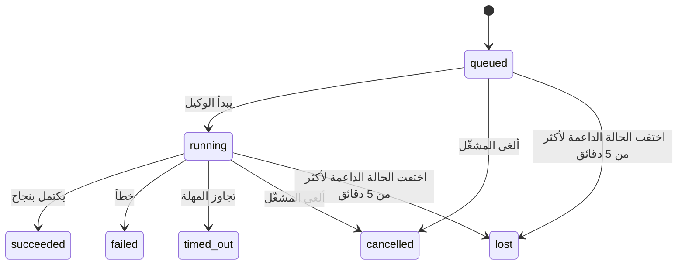

---
read_when:
    - فحص الأعمال الخلفية الجارية أو المكتملة مؤخرًا
    - تصحيح أخطاء فشل التسليم في عمليات الوكيل المنفصلة
    - فهم كيفية ارتباط عمليات التشغيل في الخلفية بالجلسات وCron وHeartbeat
sidebarTitle: Background tasks
summary: تتبّع المهام في الخلفية لعمليات تشغيل ACP والوكلاء الفرعيين وتنفيذات Cron وعمليات CLI
title: المهام في الخلفية
x-i18n:
    generated_at: "2026-07-12T05:32:23Z"
    model: gpt-5.6
    postprocess_version: locale-links-v1
    provider: openai
    source_hash: 0a945e8103c5df5a64785f326a9d0b08784ac32a2ca6fa3d4c399d75fc54be2b
    source_path: automation/tasks.md
    workflow: 16
---

<Note>
هل تبحث عن الجدولة؟ راجع [الأتمتة](/ar/automation) لاختيار الآلية المناسبة. هذه الصفحة هي سجل النشاط للأعمال التي تجري في الخلفية، وليست أداة الجدولة.
</Note>

تتتبّع مهام الخلفية الأعمال التي تُنفَّذ **خارج جلسة محادثتك الرئيسية**: عمليات تشغيل ACP، وإنشاء الوكلاء الفرعيين، وتنفيذ مهام cron، والعمليات التي يبدأها CLI.

لا تحل المهام محل الجلسات أو مهام cron أو Heartbeat، بل هي **سجل النشاط** الذي يسجّل الأعمال المنفصلة التي حدثت، ووقت حدوثها، وما إذا كانت قد نجحت.

<Note>
لا تنشئ كل عملية تشغيل للوكيل مهمة. لا تنشئ دورات Heartbeat والمحادثات التفاعلية العادية مهامًا. بينما تنشئ جميع عمليات تنفيذ cron، وإنشاءات ACP، وإنشاءات الوكلاء الفرعيين، وأوامر وكيل CLI المرسلة عبر Gateway مهامًا.
</Note>

## الخلاصة

- المهام **سجلات** وليست أدوات جدولة؛ يحدّد cron وHeartbeat _متى_ يُنفَّذ العمل، بينما تتتبّع المهام _ما حدث_.
- تنشئ عمليات ACP والوكلاء الفرعيون وجميع مهام cron وعمليات CLI مهامًا. ولا تنشئ دورات Heartbeat مهامًا.
- تنتقل كل مهمة عبر `queued → running → terminal` (ناجحة أو فاشلة أو انتهت مهلتها أو أُلغيت أو فُقدت).
- تظل مهام cron نشطة ما دام وقت تشغيل cron يملك المهمة؛ وإذا اختفت حالة وقت التشغيل المحفوظة في الذاكرة، تتحقق صيانة المهام أولًا من سجل تشغيل cron الدائم قبل وضع علامة الفقد على المهمة.
- يعتمد الإكمال على الدفع: يمكن للعمل المنفصل إرسال إشعار مباشرة أو إيقاظ جلسة الطالب/Heartbeat عند انتهائه، لذلك تكون حلقات الاستقصاء عن الحالة عادةً تصميمًا غير مناسب.
- تحاول عمليات cron المعزولة وإكمالات الوكلاء الفرعيين، قدر الإمكان، تنظيف علامات تبويب المتصفح والعمليات المتتبَّعة لجلساتها الفرعية قبل تسجيل التنظيف النهائي.
- يمنع تسليم cron المعزول الردود المرحلية القديمة من الوالد بينما لا يزال عمل الوكيل الفرعي التابع قيد التصريف، ويفضّل المخرجات النهائية للتابع إذا وصلت قبل التسليم.
- تُسلَّم إشعارات الإكمال مباشرةً إلى قناة أو توضع في قائمة انتظار حتى Heartbeat التالية.
- يعرض `openclaw tasks list` جميع المهام، بينما يكشف `openclaw tasks audit` المشكلات.
- يُحتفظ بالسجلات النهائية لمدة 7 أيام (وبسجلات `lost` لمدة 24 ساعة)، ثم تُحذف تلقائيًا.

## البدء السريع

<Tabs>
  <Tab title="السرد والتصفية">
    ```bash
    # سرد جميع المهام (الأحدث أولًا)
    openclaw tasks list

    # التصفية حسب وقت التشغيل أو الحالة
    openclaw tasks list --runtime acp
    openclaw tasks list --status running
    ```

  </Tab>
  <Tab title="الفحص">
    ```bash
    # عرض تفاصيل مهمة محددة (بحسب معرّف المهمة أو معرّف التشغيل أو مفتاح الجلسة)
    openclaw tasks show <lookup>
    ```
  </Tab>
  <Tab title="الإلغاء والإشعار">
    ```bash
    # إلغاء مهمة قيد التشغيل (ينهي الجلسة الفرعية)
    openclaw tasks cancel <lookup>

    # تغيير سياسة الإشعارات لمهمة
    openclaw tasks notify <lookup> state_changes
    ```

  </Tab>
  <Tab title="التدقيق والصيانة">
    ```bash
    # إجراء تدقيق للحالة
    openclaw tasks audit

    # معاينة الصيانة أو تطبيقها
    openclaw tasks maintenance
    openclaw tasks maintenance --apply
    ```

  </Tab>
  <Tab title="تدفق المهام">
    ```bash
    # فحص حالة TaskFlow
    openclaw tasks flow list
    openclaw tasks flow show <lookup>
    openclaw tasks flow cancel <lookup>
    ```
  </Tab>
</Tabs>

## ما الذي ينشئ مهمة

| المصدر                 | نوع وقت التشغيل | وقت إنشاء سجل المهمة                                          | سياسة الإشعارات الافتراضية |
| ---------------------- | ------------ | ---------------------------------------------------------------------- | --------------------- |
| عمليات ACP في الخلفية    | `acp`        | إنشاء جلسة ACP فرعية                                           | `done_only`           |
| تنسيق الوكلاء الفرعيين | `subagent`   | إنشاء وكيل فرعي عبر `sessions_spawn`                               | `done_only`           |
| مهام cron (بجميع أنواعها)  | `cron`       | كل عملية تنفيذ لـ cron (في الجلسة الرئيسية أو معزولة)                       | `silent`              |
| عمليات CLI         | `cli`        | أوامر `openclaw agent` التي تُنفَّذ عبر Gateway                 | `silent`              |
| مهام وسائط الوكيل       | `cli`        | عمليات تشغيل `image_generate`/`music_generate`/`video_generate` المدعومة بجلسة | `silent`              |

<AccordionGroup>
  <Accordion title="الإعدادات الافتراضية لإشعارات cron والوسائط">
    تستخدم مهام cron (في الجلسة الرئيسية والمعزولة) سياسة الإشعارات `silent`؛ فهي تنشئ سجلات للتتبّع، لكنها لا تنشئ إشعارات مهام خاصة بها، لأن cron يملك مسار التسليم.

    تستخدم عمليات تشغيل `image_generate` و`music_generate` و`video_generate` المدعومة بجلسة أيضًا سياسة الإشعارات `silent`. ولا تزال تنشئ سجلات مهام، لكن الإكمال يُعاد إلى جلسة الوكيل الأصلية بوصفه إيقاظًا داخليًا، لكي يتمكن الوكيل من كتابة رسالة المتابعة وإرفاق الوسائط المكتملة بنفسه. يتبع الوكيل الطالب عقد الرد المرئي المعتاد: رد نهائي تلقائي عند ضبطه، أو `message(action="send")` مع `NO_REPLY` عندما تتطلب الجلسة الردود عبر أداة الرسائل. إذا لم تعد جلسة الطالب نشطة أو فشل إيقاظها النشط، وفات وكيل الإكمال بعض الوسائط المنشأة أو كلها، يرسل OpenClaw إجراءً احتياطيًا مباشرًا ومتكرر التنفيذ بأمان، لا يحتوي إلا على الوسائط المفقودة، إلى هدف القناة الأصلي.

  </Accordion>
  <Accordion title="آلية حماية إنشاء الوسائط المتزامن">
    بينما تظل مهمة إنشاء وسائط مدعومة بجلسة نشطة، تحمي `image_generate` و`music_generate` و`video_generate` من المحاولات المتكررة غير المقصودة: تؤدي إعادة الاستدعاء للموجّه/الطلب نفسه إلى إرجاع حالة المهمة النشطة المطابقة بدلًا من بدء نسخة مكررة، بينما يمكن لموجّه مختلف بدء مهمته الخاصة. استخدم `action: "status"` عندما تريد استعلامًا صريحًا عن التقدم/الحالة من جانب الوكيل.
  </Accordion>
  <Accordion title="ما لا ينشئ مهامًا">
    - دورات Heartbeat في الجلسة الرئيسية؛ راجع [Heartbeat](/ar/gateway/heartbeat)
    - دورات المحادثة التفاعلية العادية
    - الاستجابات المباشرة لـ `/command`

  </Accordion>
</AccordionGroup>

## دورة حياة المهمة



| الحالة      | معناها                                                               |
| ----------- | --------------------------------------------------------------------------- |
| `queued`    | أُنشئت وتنتظر بدء الوكيل                                     |
| `running`   | دور الوكيل قيد التنفيذ حاليًا                                            |
| `succeeded` | اكتملت بنجاح                                                      |
| `failed`    | اكتملت مع حدوث خطأ                                                     |
| `timed_out` | تجاوزت المهلة المضبوطة                                             |
| `cancelled` | أوقفها المشغّل عبر `openclaw tasks cancel`، أو أُجهض التشغيل |
| `lost`      | فقد وقت التشغيل الحالة الداعمة الموثوقة بعد فترة سماح مدتها 5 دقائق  |

تحدث الانتقالات تلقائيًا؛ تحدّث أحداث دورة حياة تشغيل الوكيل (البدء والانتهاء والخطأ) حالة المهمة، ولا تديرها يدويًا.

يُعد اكتمال تشغيل الوكيل المرجع الموثوق لسجلات المهام النشطة. تنتهي عملية التشغيل المنفصلة الناجحة بالحالة `succeeded`، وتنتهي أخطاء التشغيل العادية بالحالة `failed`، وتنتهي حالات انتهاء المهلة بالحالة `timed_out`، وتنتهي نتائج الإلغاء/الإجهاض بالحالة `cancelled`. بمجرد وصول المهمة إلى حالة نهائية، لا تخفّض إشارات دورة الحياة اللاحقة حالتها؛ فالمهمة التي ألغاها المشغّل أو التي أصبحت بالفعل `failed` أو `timed_out` أو `lost` تظل كذلك حتى إذا وصلت إشارة نجاح لاحقًا.

تعتمد `lost` على وقت التشغيل:

- مهام ACP: لا يثبت أن التشغيل ما زال نشطًا إلا دور ACP حي داخل عملية Gateway؛ ولا تكفي بيانات الجلسة الوصفية الدائمة وحدها. يظل تدقيق CLI دون اتصال متحفظًا ولا يسترد مهام ACP مطلقًا.
- مهام الوكلاء الفرعيين: اختفت الجلسة الفرعية الداعمة من مخزن الوكيل المستهدف (أو تحمل علامة حذف لاسترداد ما بعد إعادة التشغيل).
- مهام cron: لم يعد وقت تشغيل cron يتتبّع المهمة على أنها نشطة، ولا يعرض سجل تشغيل cron الدائم نتيجة نهائية لذلك التشغيل. لا يعتبر تدقيق CLI دون اتصال حالة وقت تشغيل cron الفارغة الخاصة به داخل العملية مرجعًا موثوقًا.
- مهام CLI: تستخدم المهام التي لها معرّف تشغيل/معرّف مصدر سياق التشغيل الحي، لذلك لا تُبقي صفوف الجلسة الفرعية أو جلسة المحادثة العالقة هذه المهام نشطة بعد اختفاء التشغيل المملوك لـ Gateway. وتعود مهام CLI القديمة التي لا تحمل هوية تشغيل إلى الجلسة الفرعية. كما تنتهي عمليات `openclaw agent` المدعومة بـ Gateway استنادًا إلى نتيجة تشغيلها، فلا تظل عمليات التشغيل المكتملة نشطة حتى تضع أداة التنظيف علامة `lost` عليها.

## التسليم والإشعارات

عندما تصل مهمة إلى حالة نهائية، يرسل OpenClaw إشعارًا إليك. يوجد مساران للتسليم:

**التسليم المباشر** — إذا كان للمهمة هدف قناة (`requesterOrigin`)، تنتقل رسالة الإكمال مباشرة إلى تلك القناة (Discord أو Slack أو Telegram، وما إلى ذلك). أما إكمالات مهام المجموعات والقنوات فتُوجَّه عبر جلسة الطالب، لكي يتمكن الوكيل الوالد من كتابة الرد المرئي. وفي إكمالات الوكلاء الفرعيين، يحافظ OpenClaw أيضًا على توجيه سلسلة المحادثة/الموضوع المرتبط عند توفره، ويمكنه ملء قيمة `to` / الحساب المفقودة من المسار المخزّن لجلسة الطالب (`lastChannel` / `lastTo` / `lastAccountId`) قبل التخلي عن التسليم المباشر.

**التسليم الموضوع في قائمة انتظار الجلسة** — إذا فشل التسليم المباشر أو لم يُحدَّد أصل، يُوضَع التحديث في قائمة الانتظار بوصفه حدث نظام في جلسة الطالب، ويظهر عند Heartbeat التالية.

<Tip>
تؤدي إكمالات المهام الموضوعة في قائمة انتظار الجلسة إلى إيقاظ Heartbeat فورًا، لذلك ترى النتيجة بسرعة، ولا يتعين عليك انتظار نبضة Heartbeat المجدولة التالية.
</Tip>

وهذا يعني أن سير العمل المعتاد يعتمد على الدفع: ابدأ العمل المنفصل مرة واحدة، ثم دع وقت التشغيل يوقظك أو يرسل إليك إشعارًا عند الإكمال. لا تستقصِ حالة المهمة إلا عندما تحتاج إلى تصحيح الأخطاء أو التدخل أو إجراء تدقيق صريح.

### سياسات الإشعارات

تحكّم في مقدار ما يصلك عن كل مهمة:

| السياسة                | ما يُسلَّم                                       |
| --------------------- | ------------------------------------------------------- |
| `done_only` (الافتراضية) | الحالة النهائية فقط (ناجحة، فاشلة، وما إلى ذلك)           |
| `state_changes`       | كل انتقال للحالة وتحديث للتقدم              |
| `silent`              | لا شيء مطلقًا (الافتراضية لمهام cron وCLI والوسائط) |

غيّر السياسة بينما تكون المهمة قيد التشغيل:

```bash
openclaw tasks notify <lookup> state_changes
```

## مرجع CLI

<AccordionGroup>
  <Accordion title="tasks list">
    ```bash
    openclaw tasks list [--runtime <acp|subagent|cron|cli>] [--status <status>] [--json]
    ```

    أعمدة المخرجات: المهمة، والنوع، والحالة، والتسليم، والتشغيل، والجلسة الفرعية، والملخص. يعمل الأمر `openclaw tasks` المجرّد مثل `openclaw tasks list`.

  </Accordion>
  <Accordion title="tasks show">
    ```bash
    openclaw tasks show <lookup> [--json]
    ```

    تقبل رموز البحث معرّف مهمة أو معرّف تشغيل أو مفتاح جلسة. يعرض السجل الكامل، بما في ذلك التوقيت وحالة التسليم والخطأ والملخص النهائي.

  </Accordion>
  <Accordion title="tasks cancel">
    ```bash
    openclaw tasks cancel <lookup>
    ```

    بالنسبة إلى مهام ACP والوكلاء الفرعيين، ينهي هذا الأمر الجلسة الفرعية؛ وتُوجَّه عمليات إلغاء ACP وcron عبر Gateway قيد التشغيل (`tasks.cancel`). أما مهام CLI المتتبَّعة، فيُسجَّل الإلغاء في سجل المهام (ولا يوجد معالج منفصل لوقت التشغيل الفرعي). تنتقل الحالة إلى `cancelled` ويُرسل إشعار تسليم عند انطباق ذلك.

  </Accordion>
  <Accordion title="tasks notify">
    ```bash
    openclaw tasks notify <lookup> <done_only|state_changes|silent>
    ```
  </Accordion>
  <Accordion title="tasks audit">
    ```bash
    openclaw tasks audit [--severity <warn|error>] [--code <name>] [--limit <n>] [--json]
    ```

    يكشف المشكلات التشغيلية للمهام **و**TaskFlows في تقرير واحد. وتظهر النتائج أيضًا في `openclaw status` عند اكتشاف مشكلات.

    نتائج المهام:

    | النتيجة                   | الخطورة   | المُحفِّز                                                                                                      |
    | ------------------------- | ---------- | ------------------------------------------------------------------------------------------------------------ |
    | `stale_queued`            | تحذير       | في قائمة الانتظار لأكثر من 10 دقائق                                                                              |
    | `stale_running`           | خطأ      | قيد التشغيل لأكثر من 30 دقيقة                                                                             |
    | `lost`                    | تحذير/خطأ | اختفت ملكية المهمة المدعومة بوقت التشغيل؛ تُصدر المهام المفقودة المحتفَظ بها تحذيرًا حتى `cleanupAfter`، ثم تصبح أخطاء |
    | `delivery_failed`         | تحذير       | فشل التسليم وسياسة الإشعار ليست `silent`                                                            |
    | `missing_cleanup`         | تحذير       | مهمة نهائية بلا طابع زمني للتنظيف                                                                      |
    | `inconsistent_timestamps` | تحذير       | انتهاك للخط الزمني (مثلًا، انتهت قبل أن تبدأ)                                                        |

    نتائج TaskFlow:

    | النتيجة                | الخطورة   | المُحفِّز                                                                    |
    | ---------------------- | ---------- | --------------------------------------------------------------------------- |
    | `restore_failed`       | خطأ      | فشلت استعادة سجل التدفقات من SQLite                                    |
    | `stale_running`        | خطأ      | لم يتقدم التدفق قيد التشغيل لأكثر من 30 دقيقة                      |
    | `stale_waiting`        | تحذير       | لم يتقدم التدفق المنتظر لأكثر من 30 دقيقة                      |
    | `stale_blocked`        | تحذير       | لم يتقدم التدفق المحظور لأكثر من 30 دقيقة                      |
    | `cancel_stuck`         | تحذير       | طُلب الإلغاء منذ أكثر من 5 دقائق، ولا توجد مهام فرعية نشطة، وما زال غير نهائي |
    | `missing_linked_tasks` | تحذير/خطأ | تدفق مُدار متقادم بلا مهام مرتبطة أو حالة انتظار                       |
    | `blocked_task_missing` | تحذير       | يشير التدفق المحظور إلى معرّف مهمة لم يعد موجودًا                      |

  </Accordion>
  <Accordion title="صيانة المهام">
    ```bash
    openclaw tasks maintenance [--json]
    openclaw tasks maintenance --apply [--json]
    ```

    استخدم هذا لمعاينة أو تطبيق التسوية، ووضع طوابع التنظيف، والتقليم للمهام وحالة TaskFlow وصفوف سجل جلسات تشغيل cron المتقادمة.

    تراعي التسوية وقت التشغيل:

    - تتطلب مهام ACP دورة مباشرة داخل العملية في Gateway؛ وتتحقق مهام الوكيل الفرعي من جلستها الفرعية الداعمة.
    - تُعلَّم مهام الوكيل الفرعي التي تحتوي جلستها الفرعية على شاهد قبر لاسترداد إعادة التشغيل بأنها مفقودة بدلًا من معاملتها كجلسات داعمة قابلة للاسترداد.
    - تتحقق مهام Cron مما إذا كان وقت تشغيل cron لا يزال يملك المهمة، ثم تسترد الحالة النهائية من سجلات تشغيل cron أو حالة المهمة المحفوظة قبل الرجوع إلى `lost`. عملية Gateway وحدها هي المرجع الموثوق لمجموعة مهام cron النشطة في الذاكرة؛ ويستخدم تدقيق CLI غير المتصل السجل الدائم، لكنه لا يعلّم مهمة cron بأنها مفقودة لمجرد أن تلك المجموعة المحلية فارغة.
    - تتحقق مهام CLI ذات هوية التشغيل من سياق التشغيل المباشر المالك، وليس فقط من صفوف الجلسة الفرعية أو جلسة المحادثة.

    يراعي تنظيف الإكمال وقت التشغيل أيضًا:

    - يحاول إكمال الوكيل الفرعي، بأفضل جهد، إغلاق علامات تبويب المتصفح والعمليات المتعقبة للجلسة الفرعية قبل متابعة تنظيف الإعلان.
    - يحاول إكمال cron المعزول، بأفضل جهد، إغلاق علامات تبويب المتصفح والعمليات المتعقبة لجلسة cron قبل إنهاء التشغيل بالكامل.
    - ينتظر تسليم cron المعزول انتهاء متابعة الوكلاء الفرعيين المتحدرين عند الحاجة، ويمنع نص إقرار الأصل المتقادم بدلًا من إعلانه.
    - يستخدم تسليم إكمال الوكيل الفرعي أحدث نص مساعد مرئي للتابع فقط. لا تُرقّى مخرجات tool/toolResult إلى نص نتيجة التابع. تعلن عمليات التشغيل النهائية الفاشلة حالة الفشل من دون إعادة تشغيل نص الرد الملتقط.
    - لا تحجب إخفاقات التنظيف النتيجة الحقيقية للمهمة.

    عند تطبيق الصيانة، يزيل OpenClaw أيضًا صفوف سجل الجلسات `cron:<jobId>:run:<runId>` المتقادمة الأقدم من 7 أيام، مع الحفاظ على صفوف مهام cron قيد التشغيل حاليًا وترك صفوف الجلسات غير التابعة لـ cron من دون تغيير.

  </Accordion>
  <Accordion title="قائمة تدفقات المهام | العرض | الإلغاء">
    ```bash
    openclaw tasks flow list [--status <status>] [--json]
    openclaw tasks flow show <lookup> [--json]
    openclaw tasks flow cancel <lookup>
    ```

    تقبل رموز البحث عن التدفق معرّف تدفق أو مفتاح مالك. استخدم هذه الأوامر عندما يكون [Task Flow](/ar/automation/taskflow) المنسِّق هو ما يهمك بدلًا من سجل مهمة خلفية فردي.

  </Accordion>
</AccordionGroup>

## لوحة مهام المحادثة (`/tasks`)

استخدم `/tasks` في أي جلسة محادثة لرؤية المهام الخلفية المرتبطة بتلك الجلسة. تعرض اللوحة ما يصل إلى خمس مهام نشطة ومكتملة حديثًا، مع وقت التشغيل والحالة والتوقيت وتفاصيل التقدم أو الخطأ.

عندما لا تحتوي الجلسة الحالية على مهام مرتبطة مرئية، يرجع `/tasks` إلى أعداد المهام المحلية للوكيل، بحيث تظل تحصل على نظرة عامة من دون تسريب تفاصيل الجلسات الأخرى.

للاطلاع على سجل المشغّل الكامل، استخدم CLI: `openclaw tasks list`.

### واجهة التحكم

تحتوي واجهة التحكم على الويب على صفحة **المهام** في الشريط الجانبي، تضم المهام الخلفية النشطة والحديثة مباشرةً. استخدمها لفحص التقدم، وفتح الجلسات المرتبطة، وتحديث السجل، أو إلغاء المهام الموجودة في قائمة الانتظار والمهام قيد التشغيل.

تحتوي أجزاء المحادثة أيضًا على شريط **المهام الخلفية** قابل للطي ومحدد النطاق لوكيل الجزء: مهام ووكلاء فرعيون قيد التشغيل مع عنصر تحكم للإيقاف، وقسم للمهام المنتهية، وروابط لعرض النص المنقول داخل الجلسة الفرعية لكل مهمة. افتحه من زر تبديل النشاط في رأس الجزء (أو زر النشاط العائم في محادثة الجزء الواحد).

## تكامل الحالة (ضغط المهام)

يتضمن `openclaw status` سطرًا موجزًا للمهام:

```
المهام    2 نشطة · 1 في قائمة الانتظار · 1 قيد التشغيل · 1 مشكلة · التدقيق سليم · 6 متعقبة
```

يحسب الملخص العمل النشط (`queued` + `running`)، والإخفاقات (`failed` + `timed_out` + `lost`)، ونتائج التدقيق، وإجمالي السجلات المتعقبة؛ كما تقسم حمولة JSON الأعداد حسب وقت التشغيل (`acp` و`subagent` و`cron` و`cli`).

يستخدم كل من `/status` وأداة `session_status` لقطة مهام تراعي التنظيف: تُفضّل المهام النشطة، وتُخفى الصفوف منتهية الصلاحية، ولا تظهر المهام النهائية إلا خلال نافذة زمنية حديثة قصيرة (5 دقائق)، مع التركيز على الإخفاقات عند عدم بقاء عمل نشط. يحافظ هذا على تركيز بطاقة الحالة على ما يهم الآن.

## التخزين والصيانة

### مكان وجود المهام

تُحفَظ سجلات المهام وحالة التسليم في قاعدة بيانات حالة SQLite المشتركة لـ OpenClaw:

```
~/.openclaw/state/openclaw.sqlite   (الجداول: task_runs, task_delivery_state, flow_runs)
```

اضبط `OPENCLAW_STATE_DIR` لنقل جذر الحالة بالكامل (الافتراضي `~/.openclaw`) إلى مكان آخر؛ وينتقل معه مسار قاعدة البيانات المشتركة.

يُحمَّل السجل في الذاكرة عند أول استخدام، ويُحفَظ كل تغيير في SQLite، لذا تبقى السجلات بعد إعادة تشغيل Gateway. يظل نمو WAL محدودًا من خلال عتبة نقاط التحقق التلقائية الافتراضية في SQLite، إلى جانب نقاط تحقق `PASSIVE` دورية؛ وتستخدم نقاط التحقق عند إيقاف التشغيل والصيانة الصريحة `TRUNCATE`، بحيث تستعيد عمليات الإغلاق العادية مساحة WAL من دون جعل أداة التنظيف الخلفية تنتظر القرّاء النشطين.

يستورد `openclaw doctor` مخازن الملفات الجانبية القديمة من عمليات التثبيت السابقة (`tasks/runs.sqlite` و`flows/registry.sqlite`) إلى قاعدة البيانات المشتركة.

### الصيانة التلقائية

تعمل أداة تنظيف كل **60 ثانية** (وتبدأ الدورة الأولى بعد نحو 5 ثوانٍ من بدء Gateway)، وتعالج أربعة أمور:

<Steps>
  <Step title="التسوية">
    تتحقق مما إذا كانت المهام النشطة لا تزال تحظى بدعم موثوق من وقت التشغيل. تتطلب مهام ACP دورة مباشرة داخل العملية، وتستخدم مهام الوكيل الفرعي حالة الجلسة الفرعية، وتستخدم مهام cron ملكية المهمة النشطة إلى جانب سجل التشغيل الدائم، وتستخدم مهام CLI ذات هوية التشغيل سياق التشغيل المالك. إذا اختفت حالة الدعم لأكثر من 5 دقائق (30 دقيقة لمهام الوكيل الفرعي الأصلية التي لا تحتوي على تابع)، تُعلَّم المهمة بأنها `lost`.
  </Step>
  <Step title="إصلاح جلسة ACP">
    تُغلق جلسات ACP النهائية أو اليتيمة ذات الدورة الواحدة والمملوكة للأصل، ولا تُغلق جلسات ACP الدائمة النهائية المتقادمة أو اليتيمة إلا عند عدم بقاء ارتباط محادثة نشط.
  </Step>
  <Step title="وضع طوابع التنظيف">
    يضبط طابعًا زمنيًا باسم `cleanupAfter` على المهام النهائية (وقت الانتهاء + نافذة الاحتفاظ). خلال فترة الاحتفاظ، تظل المهام المفقودة تظهر في التدقيق كتحذيرات؛ وبعد انتهاء `cleanupAfter` أو عند غياب بيانات التنظيف الوصفية، تصبح أخطاء.
  </Step>
  <Step title="التقليم">
    يحذف السجلات التي تجاوزت تاريخ `cleanupAfter`.
  </Step>
</Steps>

<Note>
**الاحتفاظ:** يُحتفظ بسجلات المهام النهائية لمدة **7 أيام** (وسجلات `lost` لمدة **24 ساعة**)، ثم تُقلَّم تلقائيًا. لا يلزم أي إعداد.
</Note>

## علاقة المهام بالأنظمة الأخرى

<AccordionGroup>
  <Accordion title="المهام وTask Flow">
    يُعد [Task Flow](/ar/automation/taskflow) طبقة تنسيق التدفقات فوق المهام الخلفية. يمكن لتدفق واحد تنسيق مهام متعددة خلال دورة حياته باستخدام أوضاع المزامنة المُدارة أو المنعكسة. استخدم `openclaw tasks` لفحص سجلات المهام الفردية، و`openclaw tasks flow` لفحص التدفق المنسِّق.

  </Accordion>
  <Accordion title="المهام وcron">
    توجد تعريفات مهام Cron وحالة التنفيذ أثناء التشغيل وسجل التشغيل في قاعدة بيانات حالة SQLite المشتركة لـ OpenClaw. ينشئ **كل** تنفيذ لـ cron سجل مهمة، سواء في الجلسة الرئيسية أو في جلسة معزولة، مع سياسة إشعار `silent`، لذلك تُتعقَّب عمليات cron من دون إنشاء إشعارات مهام خاصة بها.

    راجع [مهام Cron](/ar/automation/cron-jobs).

  </Accordion>
  <Accordion title="المهام وHeartbeat">
    عمليات Heartbeat هي دورات في الجلسة الرئيسية، ولا تنشئ سجلات مهام. عندما تكتمل مهمة، يمكنها تشغيل إيقاظ Heartbeat لكي ترى النتيجة بسرعة.

    راجع [Heartbeat](/ar/gateway/heartbeat).

  </Accordion>
  <Accordion title="المهام والجلسات">
    قد تشير المهمة إلى `childSessionKey` (حيث يُنفَّذ العمل) و`requesterSessionKey` (من بدأه). يحدد `agentId` الوكيل الذي ينفذ العمل، بينما تحافظ حقول الطالب والمالك على سياق التشغيل والتحكم. الجلسات هي سياق المحادثة؛ أما المهام فهي تتبع للنشاط فوق ذلك.
  </Accordion>
  <Accordion title="المهام وعمليات تشغيل الوكيل">
    يربط `runId` الخاص بالمهمة بعملية تشغيل الوكيل التي تنفذ العمل. تُحدّث أحداث دورة حياة الوكيل (البدء والانتهاء والخطأ) حالة المهمة تلقائيًا، ولا تحتاج إلى إدارة دورة الحياة يدويًا.
  </Accordion>
</AccordionGroup>

## ذو صلة

- [الأتمتة](/ar/automation) - جميع آليات الأتمتة في لمحة
- [CLI: المهام](/ar/cli/tasks) - مرجع أوامر CLI
- [Heartbeat](/ar/gateway/heartbeat) - دورات الجلسة الرئيسية الدورية
- [المهام المجدولة](/ar/automation/cron-jobs) - جدولة العمل في الخلفية
- [Task Flow](/ar/automation/taskflow) - تنسيق التدفقات فوق المهام
