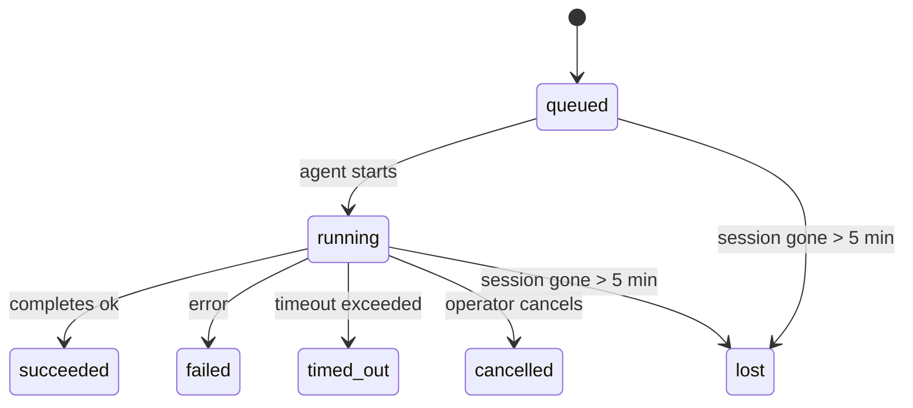

---
read_when:
    - فحص العمل الجاري في الخلفية أو المكتمل مؤخرًا
    - استكشاف أخطاء فشل تسليم تشغيلات الوكيل المنفصلة وإصلاحها
    - فهم كيفية ارتباط عمليات التشغيل في الخلفية بالجلسات وCron وHeartbeat
sidebarTitle: Background tasks
summary: تتبّع المهام الخلفية لعمليات تشغيل ACP والوكلاء الفرعيين ومهام Cron المعزولة وعمليات CLI
title: مهام الخلفية
x-i18n:
    generated_at: "2026-04-30T16:28:02Z"
    model: gpt-5.5
    provider: openai
    source_hash: 999653c9360323d5135e33193c76458cba8c288227de46a6217f1ccbed2a6d34
    source_path: automation/tasks.md
    workflow: 16
---

<Note>
هل تبحث عن الجدولة؟ راجع [الأتمتة والمهام](/ar/automation) لاختيار الآلية المناسبة. هذه الصفحة هي سجل الأنشطة لعمل الخلفية، وليست المجدول.
</Note>

تتعقب مهام الخلفية العمل الذي يجري **خارج جلسة محادثتك الرئيسية**: تشغيلات ACP، وإنشاء الوكلاء الفرعيين، وتنفيذات مهام cron المعزولة، والعمليات التي يبدأها CLI.

لا تستبدل المهام الجلسات أو مهام cron أو Heartbeat — بل هي **سجل الأنشطة** الذي يسجل العمل المنفصل الذي حدث، ومتى حدث، وما إذا كان قد نجح.

<Note>
لا ينشئ كل تشغيل لوكيل مهمة. دورات Heartbeat والدردشة التفاعلية العادية لا تفعل ذلك. كل تنفيذات cron، وإنشاءات ACP، وإنشاءات الوكلاء الفرعيين، وأوامر وكيل CLI تفعل ذلك.
</Note>

## ملخص سريع

- المهام **سجلات**، وليست مجدولات — يقرر cron وHeartbeat _متى_ يجري العمل، وتتتبع المهام _ما حدث_.
- ينشئ ACP والوكلاء الفرعيون وكل مهام cron وعمليات CLI مهام. لا تنشئ دورات Heartbeat مهام.
- تنتقل كل مهمة عبر `queued → running → terminal` (succeeded أو failed أو timed_out أو cancelled أو lost).
- تبقى مهام cron نشطة ما دام وقت تشغيل cron لا يزال يملك المهمة؛ وإذا اختفت
  حالة وقت التشغيل في الذاكرة، تفحص صيانة المهام أولاً سجل تشغيل cron الدائم
  قبل تعليم المهمة بأنها مفقودة.
- يعتمد الإكمال على الدفع: يمكن للعمل المنفصل أن يرسل إشعاراً مباشراً أو يوقظ
  جلسة/Heartbeat مقدم الطلب عند انتهائه، لذلك تكون حلقات استطلاع الحالة
  غالباً بالشكل غير المناسب.
- تنظف تشغيلات cron المعزولة وإكمالات الوكلاء الفرعيين، بأفضل جهد، علامات تبويب/عمليات المتصفح المتعقبة لجلساتها الفرعية قبل مسك دفاتر التنظيف النهائي.
- يمنع تسليم cron المعزول ردود الأصل المرحلية القديمة بينما لا يزال عمل الوكيل الفرعي التابع يجري تفريغه، ويفضل مخرجات التابع النهائية عندما تصل قبل التسليم.
- تُسلَّم إشعارات الإكمال مباشرة إلى قناة أو تُدرج في الصف لعملية Heartbeat التالية.
- يعرض `openclaw tasks list` كل المهام؛ ويكشف `openclaw tasks audit` المشكلات.
- تُحتفظ بالسجلات النهائية لمدة 7 أيام، ثم تُزال تلقائياً.

## البدء السريع

<Tabs>
  <Tab title="السرد والتصفية">
    ```bash
    # List all tasks (newest first)
    openclaw tasks list

    # Filter by runtime or status
    openclaw tasks list --runtime acp
    openclaw tasks list --status running
    ```

  </Tab>
  <Tab title="الفحص">
    ```bash
    # Show details for a specific task (by ID, run ID, or session key)
    openclaw tasks show <lookup>
    ```
  </Tab>
  <Tab title="الإلغاء والإشعار">
    ```bash
    # Cancel a running task (kills the child session)
    openclaw tasks cancel <lookup>

    # Change notification policy for a task
    openclaw tasks notify <lookup> state_changes
    ```

  </Tab>
  <Tab title="التدقيق والصيانة">
    ```bash
    # Run a health audit
    openclaw tasks audit

    # Preview or apply maintenance
    openclaw tasks maintenance
    openclaw tasks maintenance --apply
    ```

  </Tab>
  <Tab title="تدفق المهام">
    ```bash
    # Inspect TaskFlow state
    openclaw tasks flow list
    openclaw tasks flow show <lookup>
    openclaw tasks flow cancel <lookup>
    ```
  </Tab>
</Tabs>

## ما الذي ينشئ مهمة

| المصدر                 | نوع وقت التشغيل | متى يُنشأ سجل مهمة                                      | سياسة الإشعار الافتراضية |
| ---------------------- | ------------ | ------------------------------------------------------ | --------------------- |
| تشغيلات ACP في الخلفية | `acp`        | إنشاء جلسة ACP فرعية                                   | `done_only`           |
| تنسيق الوكلاء الفرعيين | `subagent`   | إنشاء وكيل فرعي عبر `sessions_spawn`                   | `done_only`           |
| مهام cron (كل الأنواع) | `cron`       | كل تنفيذ cron (في الجلسة الرئيسية ومعزول)              | `silent`              |
| عمليات CLI             | `cli`        | أوامر `openclaw agent` التي تعمل عبر Gateway           | `silent`              |
| مهام وسائط الوكيل      | `cli`        | تشغيلات `video_generate` المدعومة بجلسة                | `silent`              |

<AccordionGroup>
  <Accordion title="إعدادات الإشعار الافتراضية لـ cron والوسائط">
    تستخدم مهام cron في الجلسة الرئيسية سياسة إشعار `silent` افتراضياً — فهي تنشئ سجلات للتتبع لكنها لا تولد إشعارات. تستخدم مهام cron المعزولة أيضاً `silent` افتراضياً، لكنها أكثر ظهوراً لأنها تعمل في جلستها الخاصة.

    تستخدم تشغيلات `video_generate` المدعومة بجلسة أيضاً سياسة إشعار `silent`. لا تزال تنشئ سجلات مهام، لكن الإكمال يُعاد إلى جلسة الوكيل الأصلية كإيقاظ داخلي كي يتمكن الوكيل من كتابة رسالة المتابعة وإرفاق الفيديو المكتمل بنفسه. إذا اخترت تفعيل `tools.media.asyncCompletion.directSend`، فستحاول إكمالات `music_generate` و`video_generate` غير المتزامنة التسليم المباشر إلى القناة أولاً قبل الرجوع إلى مسار إيقاظ جلسة مقدم الطلب.

  </Accordion>
  <Accordion title="حاجز حماية video_generate المتزامن">
    عندما تكون مهمة `video_generate` مدعومة بجلسة لا تزال نشطة، تعمل الأداة أيضاً كحاجز حماية: تعيد استدعاءات `video_generate` المتكررة في الجلسة نفسها حالة المهمة النشطة بدلاً من بدء توليد متزامن ثان. استخدم `action: "status"` عندما تريد بحثاً صريحاً عن التقدم/الحالة من جهة الوكيل.
  </Accordion>
  <Accordion title="ما الذي لا ينشئ مهام">
    - دورات Heartbeat — في الجلسة الرئيسية؛ راجع [Heartbeat](/ar/gateway/heartbeat)
    - دورات الدردشة التفاعلية العادية
    - ردود `/command` المباشرة

  </Accordion>
</AccordionGroup>

## دورة حياة المهمة



| الحالة      | معناها                                                                      |
| ----------- | -------------------------------------------------------------------------- |
| `queued`    | أُنشئت، وتنتظر بدء الوكيل                                                  |
| `running`   | دورة الوكيل قيد التنفيذ النشط                                              |
| `succeeded` | اكتملت بنجاح                                                               |
| `failed`    | اكتملت بخطأ                                                                |
| `timed_out` | تجاوزت المهلة المكونة                                                      |
| `cancelled` | أوقفها المشغل عبر `openclaw tasks cancel`                                  |
| `lost`      | فقد وقت التشغيل حالة الدعم الموثوقة بعد فترة سماح قدرها 5 دقائق           |

تحدث الانتقالات تلقائياً — عندما ينتهي تشغيل الوكيل المرتبط، تتحدث حالة المهمة لتطابقه.

إكمال تشغيل الوكيل هو المرجع الموثوق لسجلات المهام النشطة. يُنهى التشغيل المنفصل الناجح كـ `succeeded`، وتُنهى أخطاء التشغيل العادية كـ `failed`، وتُنهى نتائج انتهاء المهلة أو الإجهاض كـ `timed_out`. إذا كان المشغل قد ألغى المهمة بالفعل، أو كان وقت التشغيل قد سجل بالفعل حالة نهائية أقوى مثل `failed` أو `timed_out` أو `lost`، فلا تؤدي إشارة نجاح لاحقة إلى خفض رتبة تلك الحالة النهائية.

`lost` مدرك لوقت التشغيل:

- مهام ACP: اختفت بيانات جلسة ACP الفرعية الداعمة.
- مهام الوكلاء الفرعيين: اختفت الجلسة الفرعية الداعمة من مخزن الوكيل الهدف.
- مهام cron: لم يعد وقت تشغيل cron يتتبع المهمة كنشطة، ولا يُظهر
  سجل تشغيل cron الدائم نتيجة نهائية لذلك التشغيل. لا يتعامل تدقيق CLI
  غير المتصل مع حالة وقت تشغيل cron الفارغة داخل العملية الخاصة به كمرجع موثوق.
- مهام CLI: تستخدم مهام الجلسة الفرعية المعزولة الجلسة الفرعية؛ أما مهام CLI
  المدعومة بالدردشة فتستخدم سياق التشغيل المباشر بدلاً من ذلك، لذلك لا تبقي
  صفوف جلسات القناة/المجموعة/المباشر العالقة تلك المهام حية. كما تُنهى تشغيلات
  `openclaw agent` المدعومة بـ Gateway من نتيجة تشغيلها، لذلك لا تبقى التشغيلات
  المكتملة نشطة حتى يعلمها الماسح بأنها `lost`.

## التسليم والإشعارات

عندما تصل مهمة إلى حالة نهائية، يُعلمك OpenClaw. هناك مسارا تسليم:

**التسليم المباشر** — إذا كان للمهمة هدف قناة (`requesterOrigin`)، تذهب رسالة الإكمال مباشرة إلى تلك القناة (Telegram وDiscord وSlack وما إلى ذلك). بالنسبة إلى إكمالات الوكلاء الفرعيين، يحافظ OpenClaw أيضاً على توجيه الخيط/الموضوع المرتبط عند توفره، ويمكنه ملء قيمة `to` / الحساب المفقودة من المسار المخزن لجلسة مقدم الطلب (`lastChannel` / `lastTo` / `lastAccountId`) قبل التخلي عن التسليم المباشر.

**التسليم المدرج في صف الجلسة** — إذا فشل التسليم المباشر أو لم يُعيَّن أصل، يُدرج التحديث في الصف كحدث نظام في جلسة مقدم الطلب ويظهر في Heartbeat التالية.

<Tip>
يؤدي إكمال المهمة إلى إيقاظ Heartbeat فورياً كي ترى النتيجة بسرعة — لا تحتاج إلى انتظار نبضة Heartbeat المجدولة التالية.
</Tip>

يعني ذلك أن سير العمل المعتاد يعتمد على الدفع: ابدأ العمل المنفصل مرة واحدة، ثم دع وقت التشغيل يوقظك أو يخطرك عند الإكمال. استطلع حالة المهمة فقط عندما تحتاج إلى تصحيح الأخطاء أو التدخل أو تدقيق صريح.

### سياسات الإشعار

تحكم في مقدار ما تسمعه عن كل مهمة:

| السياسة                | ما يُسلَّم                                                               |
| --------------------- | ----------------------------------------------------------------------- |
| `done_only` (default) | الحالة النهائية فقط (succeeded وfailed وما إلى ذلك) — **هذا هو الافتراضي** |
| `state_changes`       | كل انتقال حالة وتحديث تقدم                                               |
| `silent`              | لا شيء إطلاقاً                                                           |

غيّر السياسة أثناء تشغيل مهمة:

```bash
openclaw tasks notify <lookup> state_changes
```

## مرجع CLI

<AccordionGroup>
  <Accordion title="tasks list">
    ```bash
    openclaw tasks list [--runtime <acp|subagent|cron|cli>] [--status <status>] [--json]
    ```

    أعمدة الإخراج: معرف المهمة، النوع، الحالة، التسليم، معرف التشغيل، الجلسة الفرعية، الملخص.

  </Accordion>
  <Accordion title="tasks show">
    ```bash
    openclaw tasks show <lookup>
    ```

    يقبل رمز البحث معرف مهمة أو معرف تشغيل أو مفتاح جلسة. يعرض السجل الكامل بما في ذلك التوقيت وحالة التسليم والخطأ والملخص النهائي.

  </Accordion>
  <Accordion title="tasks cancel">
    ```bash
    openclaw tasks cancel <lookup>
    ```

    بالنسبة إلى مهام ACP ومهام الوكلاء الفرعيين، يقتل هذا الجلسة الفرعية. بالنسبة إلى المهام المتعقبة بواسطة CLI، يُسجل الإلغاء في سجل المهام (لا يوجد مقبض منفصل لوقت تشغيل فرعي). تنتقل الحالة إلى `cancelled` ويُرسل إشعار تسليم عند الانطباق.

  </Accordion>
  <Accordion title="tasks notify">
    ```bash
    openclaw tasks notify <lookup> <done_only|state_changes|silent>
    ```
  </Accordion>
  <Accordion title="tasks audit">
    ```bash
    openclaw tasks audit [--json]
    ```

    يكشف المشكلات التشغيلية. تظهر النتائج أيضاً في `openclaw status` عند اكتشاف مشكلات.

    | الاكتشاف                   | الخطورة   | المشغّل                                                                                                      |
    | ------------------------- | ---------- | ------------------------------------------------------------------------------------------------------------ |
    | `stale_queued`            | warn       | في قائمة الانتظار لأكثر من 10 دقائق                                                                              |
    | `stale_running`           | error      | قيد التشغيل لأكثر من 30 دقيقة                                                                             |
    | `lost`                    | warn/error | اختفت ملكية المهمة المدعومة بوقت التشغيل؛ تظل المهام المفقودة المحتفَظ بها تحذر حتى `cleanupAfter`، ثم تصبح أخطاء |
    | `delivery_failed`         | warn       | فشل التسليم وسياسة الإشعار ليست `silent`                                                            |
    | `missing_cleanup`         | warn       | مهمة نهائية بلا طابع زمني للتنظيف                                                                      |
    | `inconsistent_timestamps` | warn       | انتهاك في المخطط الزمني (على سبيل المثال انتهت قبل أن تبدأ)                                                        |

  </Accordion>
  <Accordion title="صيانة المهام">
    ```bash
    openclaw tasks maintenance [--json]
    openclaw tasks maintenance --apply [--json]
    ```

    استخدم هذا لمعاينة أو تطبيق المطابقة، ووضع طوابع التنظيف، والتقليم للمهام وحالة تدفق المهام.

    المطابقة واعية بوقت التشغيل:

    - تتحقق مهام ACP/الوكيل الفرعي من جلسة الطفل الداعمة لها.
    - تُعلَّم مهام الوكيل الفرعي التي تملك جلسة الطفل فيها شاهدة قبر لاسترداد إعادة التشغيل كمفقودة بدلًا من معاملتها كجلسات داعمة قابلة للاسترداد.
    - تتحقق مهام Cron مما إذا كان وقت تشغيل cron لا يزال يملك المهمة، ثم تسترد الحالة النهائية من سجلات تشغيل cron/حالة المهمة المستمرة قبل الرجوع إلى `lost`. عملية Gateway وحدها هي المرجع الموثوق لمجموعة مهام cron النشطة في الذاكرة؛ يستخدم تدقيق CLI غير المتصل السجل الدائم، لكنه لا يعلّم مهمة cron كمفقودة لمجرد أن تلك المجموعة المحلية فارغة.
    - تتحقق مهام CLI المدعومة بالمحادثة من سياق التشغيل الحي المالك، وليس من صف جلسة المحادثة فقط.

    التنظيف عند الإكمال واعٍ أيضًا بوقت التشغيل:

    - يحاول إكمال الوكيل الفرعي، بأفضل جهد، إغلاق ألسنة المتصفح/العمليات المتتبعة لجلسة الطفل قبل متابعة تنظيف الإعلان.
    - يحاول إكمال cron المعزول، بأفضل جهد، إغلاق ألسنة المتصفح/العمليات المتتبعة لجلسة cron قبل أن يتفكك التشغيل بالكامل.
    - ينتظر تسليم cron المعزول متابعة الوكيل الفرعي المنحدر عند الحاجة، ويكتم نص إقرار الأصل القديم بدلًا من إعلانه.
    - يفضّل تسليم إكمال الوكيل الفرعي أحدث نص مساعد مرئي؛ وإذا كان فارغًا، يرجع إلى أحدث نص أداة/toolResult بعد تنظيفه، ويمكن لتشغيلات استدعاء الأدوات ذات المهلة فقط أن تُختصر إلى ملخص قصير للتقدم الجزئي. تعلن التشغيلات النهائية الفاشلة حالة الفشل من دون إعادة تشغيل نص الرد الملتقط.
    - لا تحجب إخفاقات التنظيف نتيجة المهمة الحقيقية.

  </Accordion>
  <Accordion title="قائمة تدفق المهام | عرض | إلغاء">
    ```bash
    openclaw tasks flow list [--status <status>] [--json]
    openclaw tasks flow show <lookup> [--json]
    openclaw tasks flow cancel <lookup>
    ```

    استخدم هذه عندما يكون تدفق المهام المنسِّق هو ما يهمك بدلًا من سجل مهمة خلفية فردية واحدة.

  </Accordion>
</AccordionGroup>

## لوحة مهام المحادثة (`/tasks`)

استخدم `/tasks` في أي جلسة محادثة لرؤية مهام الخلفية المرتبطة بتلك الجلسة. تعرض اللوحة المهام النشطة والمكتملة حديثًا مع وقت التشغيل، والحالة، والتوقيت، والتقدم أو تفاصيل الخطأ.

عندما لا تحتوي الجلسة الحالية على مهام مرتبطة مرئية، يرجع `/tasks` إلى أعداد المهام المحلية للوكيل كي تحصل على نظرة عامة من دون تسريب تفاصيل جلسات أخرى.

لسجل المشغّل الكامل، استخدم CLI: `openclaw tasks list`.

## تكامل الحالة (ضغط المهام)

يتضمن `openclaw status` ملخصًا سريعًا للمهام:

```
Tasks: 3 queued · 2 running · 1 issues
```

يعرض الملخص:

- **نشطة** — عدد `queued` + `running`
- **إخفاقات** — عدد `failed` + `timed_out` + `lost`
- **حسب وقت التشغيل** — تفصيل حسب `acp`، و`subagent`، و`cron`، و`cli`

يستخدم كل من `/status` وأداة `session_status` لقطة مهام واعية بالتنظيف: تُفضَّل المهام النشطة، وتُخفى الصفوف المكتملة القديمة، ولا تظهر الإخفاقات الحديثة إلا عندما لا يبقى عمل نشط. يبقي هذا بطاقة الحالة مركّزة على ما يهم الآن.

## التخزين والصيانة

### أين تعيش المهام

تستمر سجلات المهام في SQLite عند:

```
$OPENCLAW_STATE_DIR/tasks/runs.sqlite
```

يُحمَّل السجل إلى الذاكرة عند بدء Gateway وتُزامَن الكتابات إلى SQLite لضمان المتانة عبر عمليات إعادة التشغيل.
يبقي Gateway سجل الكتابة المسبقة في SQLite محدودًا باستخدام عتبة
الفحص التلقائي الافتراضية في SQLite بالإضافة إلى نقاط فحص `TRUNCATE` الدورية وعند الإيقاف.

### الصيانة التلقائية

يعمل ماسح كل **60 ثانية** ويتولى أربعة أشياء:

<Steps>
  <Step title="المطابقة">
    يتحقق مما إذا كانت المهام النشطة لا تزال تملك دعم وقت التشغيل الموثوق. تستخدم مهام ACP/الوكيل الفرعي حالة جلسة الطفل، وتستخدم مهام cron ملكية المهمة النشطة، وتستخدم مهام CLI المدعومة بالمحادثة سياق التشغيل المالك. إذا اختفت حالة الدعم تلك لأكثر من 5 دقائق، تُعلَّم المهمة كـ `lost`.
  </Step>
  <Step title="إصلاح جلسة ACP">
    يغلق جلسات ACP النهائية أو اليتيمة ذات الاستخدام الواحد المملوكة للأصل، ويغلق جلسات ACP المستمرة النهائية القديمة أو اليتيمة فقط عندما لا يبقى أي ارتباط محادثة نشط.
  </Step>
  <Step title="وضع طوابع التنظيف">
    يعيّن طابعًا زمنيًا `cleanupAfter` على المهام النهائية (endedAt + 7 أيام). أثناء مدة الاحتفاظ، تظل المهام المفقودة تظهر في التدقيق كتحذيرات؛ وبعد انتهاء `cleanupAfter` أو عند غياب بيانات التنظيف الوصفية، تصبح أخطاء.
  </Step>
  <Step title="التقليم">
    يحذف السجلات التي تجاوزت تاريخ `cleanupAfter` الخاص بها.
  </Step>
</Steps>

<Note>
**الاحتفاظ:** تُحفظ سجلات المهام النهائية لمدة **7 أيام**، ثم تُقلَّم تلقائيًا. لا حاجة إلى أي تهيئة.
</Note>

## كيف ترتبط المهام بالأنظمة الأخرى

<AccordionGroup>
  <Accordion title="المهام وتدفق المهام">
    [تدفق المهام](/ar/automation/taskflow) هو طبقة تنسيق التدفق فوق مهام الخلفية. قد ينسّق تدفق واحد عدة مهام خلال عمره باستخدام أوضاع مزامنة مُدارة أو معكوسة. استخدم `openclaw tasks` لفحص سجلات المهام الفردية و`openclaw tasks flow` لفحص التدفق المنسِّق.

    راجع [تدفق المهام](/ar/automation/taskflow) للتفاصيل.

  </Accordion>
  <Accordion title="المهام وcron">
    يعيش **تعريف** مهمة cron في `~/.openclaw/cron/jobs.json`؛ وتعيش حالة التنفيذ في وقت التشغيل بجانبه في `~/.openclaw/cron/jobs-state.json`. ينشئ **كل** تنفيذ cron سجل مهمة، سواء كان في الجلسة الرئيسية أو معزولًا. تكون مهام cron في الجلسة الرئيسية افتراضيًا على سياسة إشعار `silent` حتى تتتبع من دون إنشاء إشعارات.

    راجع [مهام Cron](/ar/automation/cron-jobs).

  </Accordion>
  <Accordion title="المهام وheartbeat">
    تشغيلات Heartbeat هي أدوار في الجلسة الرئيسية، وهي لا تنشئ سجلات مهام. عند اكتمال مهمة، يمكنها تشغيل إيقاظ Heartbeat كي ترى النتيجة بسرعة.

    راجع [Heartbeat](/ar/gateway/heartbeat).

  </Accordion>
  <Accordion title="المهام والجلسات">
    قد تشير مهمة إلى `childSessionKey` (حيث يُنفَّذ العمل) و`requesterSessionKey` (من بدأها). الجلسات هي سياق المحادثة؛ أما المهام فهي تتبع النشاط فوق ذلك.
  </Accordion>
  <Accordion title="المهام وتشغيلات الوكيل">
    يربط `runId` الخاص بالمهمة بتشغيل الوكيل الذي ينفذ العمل. تحدّث أحداث دورة حياة الوكيل (البدء، والانتهاء، والخطأ) حالة المهمة تلقائيًا، ولا تحتاج إلى إدارة دورة الحياة يدويًا.
  </Accordion>
</AccordionGroup>

## ذو صلة

- [الأتمتة والمهام](/ar/automation) — جميع آليات الأتمتة في لمحة
- [CLI: المهام](/ar/cli/tasks) — مرجع أوامر CLI
- [Heartbeat](/ar/gateway/heartbeat) — أدوار دورية في الجلسة الرئيسية
- [المهام المجدولة](/ar/automation/cron-jobs) — جدولة العمل في الخلفية
- [تدفق المهام](/ar/automation/taskflow) — تنسيق التدفق فوق المهام
