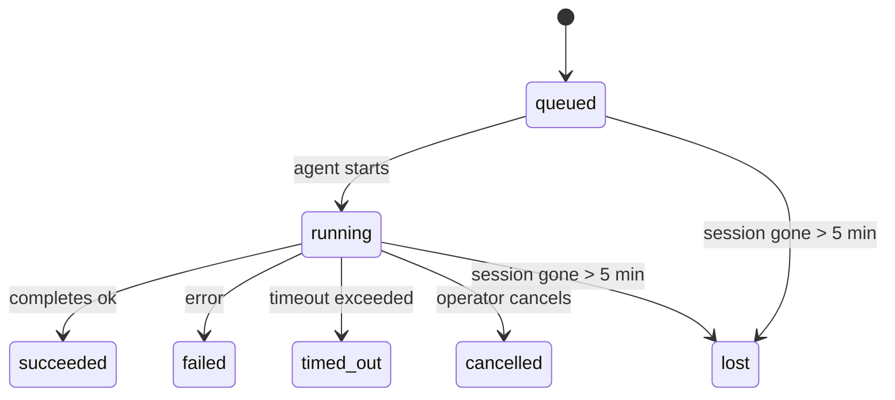

---
read_when:
    - فحص العمل في الخلفية قيد التنفيذ أو المكتمل مؤخرًا
    - تصحيح أخطاء إخفاقات التسليم في عمليات تشغيل الوكيل المنفصلة
    - فهم كيفية ارتباط عمليات التشغيل في الخلفية بالجلسات وCron وHeartbeat
sidebarTitle: Background tasks
summary: تتبّع المهام في الخلفية لتشغيلات ACP والوكلاء الفرعيين ومهام Cron المعزولة وعمليات CLI
title: مهام الخلفية
x-i18n:
    generated_at: "2026-05-05T06:16:23Z"
    model: gpt-5.5
    provider: openai
    source_hash: bafd959feaf2e220820ec56bf1ef144207d05757418e9971ebf427844cf30c46
    source_path: automation/tasks.md
    workflow: 16
---

<Note>
هل تبحث عن الجدولة؟ راجع [الأتمتة والمهام](/ar/automation) لاختيار الآلية المناسبة. هذه الصفحة هي سجل النشاط للعمل في الخلفية، وليست المجدول.
</Note>

تتتبع المهام الخلفية العمل الذي يعمل **خارج جلسة المحادثة الرئيسية** لديك: تشغيلات ACP، إنشاءات الوكلاء الفرعيين، تنفيذات مهام Cron المعزولة، والعمليات التي تبدأها CLI.

لا تستبدل المهام الجلسات أو مهام Cron أو Heartbeat — فهي **سجل النشاط** الذي يسجل العمل المنفصل الذي حدث، ووقت حدوثه، وما إذا كان قد نجح.

<Note>
لا ينشئ كل تشغيل وكيل مهمة. دورات Heartbeat والدردشة التفاعلية العادية لا تفعل ذلك. كل تنفيذات Cron، وإنشاءات ACP، وإنشاءات الوكلاء الفرعيين، وأوامر وكيل CLI تفعل ذلك.
</Note>

## الخلاصة

- المهام **سجلات** وليست مجدولات — يقرر Cron وHeartbeat _متى_ يعمل العمل، وتتتبع المهام _ما حدث_.
- ينشئ ACP والوكلاء الفرعيون وكل مهام Cron وعمليات CLI مهام. أما دورات Heartbeat فلا تفعل ذلك.
- تنتقل كل مهمة عبر `queued → running → terminal` (succeeded أو failed أو timed_out أو cancelled أو lost).
- تبقى مهام Cron نشطة بينما لا يزال وقت تشغيل Cron يملك المهمة؛ إذا اختفت
  حالة وقت التشغيل داخل الذاكرة، تتحقق صيانة المهام أولا من سجل تشغيل Cron
  الدائم قبل وسم مهمة بأنها مفقودة.
- يعتمد الإكمال على الدفع: يمكن للعمل المنفصل أن يرسل إشعارا مباشرة أو يوقظ
  جلسة الطالب/Heartbeat عند انتهائه، لذلك تكون حلقات استطلاع الحالة عادة
  بالشكل غير المناسب.
- تحاول تشغيلات Cron المعزولة وإكمالات الوكلاء الفرعيين، بأفضل جهد، تنظيف علامات تبويب/عمليات المتصفح المتتبعة لجلسة الابن قبل سجل التنظيف النهائي.
- يمنع تسليم Cron المعزول ردود الوالد المؤقتة القديمة بينما لا يزال عمل الوكيل الفرعي السليل قيد التصريف، ويفضل مخرجات السليل النهائية عندما تصل قبل التسليم.
- تسلم إشعارات الإكمال مباشرة إلى قناة أو تصف في انتظار Heartbeat التالي.
- يعرض `openclaw tasks list` كل المهام؛ ويكشف `openclaw tasks audit` المشكلات.
- تحتفظ السجلات النهائية لمدة 7 أيام، ثم تنظف تلقائيا.

## البدء السريع

<Tabs>
  <Tab title="السرد والتصفية">
    ```bash
    # List all tasks (newest first)
    openclaw tasks list

    # Filter by runtime or status
    openclaw tasks list --runtime acp
    openclaw tasks list --status running
    ```

  </Tab>
  <Tab title="الفحص">
    ```bash
    # Show details for a specific task (by ID, run ID, or session key)
    openclaw tasks show <lookup>
    ```
  </Tab>
  <Tab title="الإلغاء والإشعار">
    ```bash
    # Cancel a running task (kills the child session)
    openclaw tasks cancel <lookup>

    # Change notification policy for a task
    openclaw tasks notify <lookup> state_changes
    ```

  </Tab>
  <Tab title="التدقيق والصيانة">
    ```bash
    # Run a health audit
    openclaw tasks audit

    # Preview or apply maintenance
    openclaw tasks maintenance
    openclaw tasks maintenance --apply
    ```

  </Tab>
  <Tab title="تدفق المهام">
    ```bash
    # Inspect TaskFlow state
    openclaw tasks flow list
    openclaw tasks flow show <lookup>
    openclaw tasks flow cancel <lookup>
    ```
  </Tab>
</Tabs>

## ما الذي ينشئ مهمة

| المصدر                 | نوع وقت التشغيل | متى ينشأ سجل مهمة                          | سياسة الإشعار الافتراضية |
| ---------------------- | ------------ | ------------------------------------------------------ | --------------------- |
| تشغيلات ACP الخلفية    | `acp`        | إنشاء جلسة ACP ابن                           | `done_only`           |
| تنسيق الوكلاء الفرعيين | `subagent`   | إنشاء وكيل فرعي عبر `sessions_spawn`               | `done_only`           |
| مهام Cron (كل الأنواع)  | `cron`       | كل تنفيذ Cron (الجلسة الرئيسية والمعزول)       | `silent`              |
| عمليات CLI         | `cli`        | أوامر `openclaw agent` التي تعمل عبر Gateway | `silent`              |
| مهام وسائط الوكيل       | `cli`        | تشغيلات `music_generate`/`video_generate` المدعومة بجلسة  | `silent`              |

<AccordionGroup>
  <Accordion title="افتراضيات الإشعار لـ Cron والوسائط">
    تستخدم مهام Cron في الجلسة الرئيسية سياسة الإشعار `silent` افتراضيا — فهي تنشئ سجلات للتتبع لكنها لا تولد إشعارات. تستخدم مهام Cron المعزولة أيضا `silent` افتراضيا، لكنها أوضح لأنها تعمل في جلستها الخاصة.

    تستخدم تشغيلات `music_generate` و`video_generate` المدعومة بجلسة أيضا سياسة الإشعار `silent`. ما زالت تنشئ سجلات مهام، لكن الإكمال يعاد إلى جلسة الوكيل الأصلية كإيقاظ داخلي كي يستطيع الوكيل كتابة رسالة المتابعة وإرفاق الوسائط المكتملة بنفسه. تتبع إكمالات المجموعة/القناة سياسة الرد المرئي العادية، لذلك يستخدم الوكيل أداة الرسائل عندما يتطلب التسليم المصدر ذلك. إذا فشل وكيل الإكمال في إنتاج دليل تسليم عبر أداة الرسائل في مسار الأدوات فقط، يرسل OpenClaw احتياطي الإكمال مباشرة إلى القناة الأصلية بدلا من ترك الوسائط خاصة.

  </Accordion>
  <Accordion title="حاجز الحماية لتزامن video_generate">
    بينما لا تزال مهمة `video_generate` المدعومة بجلسة نشطة، تعمل الأداة أيضا كحاجز حماية: تعيد استدعاءات `video_generate` المتكررة في الجلسة نفسها حالة المهمة النشطة بدلا من بدء توليد ثان متزامن. استخدم `action: "status"` عندما تريد بحث تقدم/حالة صريحا من جهة الوكيل.
  </Accordion>
  <Accordion title="ما لا ينشئ مهاما">
    - دورات Heartbeat — الجلسة الرئيسية؛ راجع [Heartbeat](/ar/gateway/heartbeat)
    - دورات الدردشة التفاعلية العادية
    - ردود `/command` المباشرة

  </Accordion>
</AccordionGroup>

## دورة حياة المهمة



| الحالة      | ما تعنيه                                                              |
| ----------- | -------------------------------------------------------------------------- |
| `queued`    | أنشئت، وتنتظر بدء الوكيل                                    |
| `running`   | دور الوكيل قيد التنفيذ النشط                                           |
| `succeeded` | اكتملت بنجاح                                                     |
| `failed`    | اكتملت مع خطأ                                                    |
| `timed_out` | تجاوزت المهلة المضبوطة                                            |
| `cancelled` | أوقفها المشغل عبر `openclaw tasks cancel`                        |
| `lost`      | فقد وقت التشغيل حالة الدعم الموثوقة بعد فترة سماح مدتها 5 دقائق |

تحدث الانتقالات تلقائيا — عندما ينتهي تشغيل الوكيل المرتبط، تحدث حالة المهمة لتطابقه.

إكمال تشغيل الوكيل هو المصدر الموثوق لسجلات المهام النشطة. ينهي التشغيل المنفصل الناجح حالته كـ `succeeded`، وتنهي أخطاء التشغيل العادية حالتها كـ `failed`، وتنهي نتائج المهلة أو الإجهاض حالتها كـ `timed_out`. إذا كان مشغل قد ألغى المهمة بالفعل، أو كان وقت التشغيل قد سجل بالفعل حالة نهائية أقوى مثل `failed` أو `timed_out` أو `lost`، فلا تخفض إشارة نجاح لاحقة تلك الحالة النهائية.

`lost` واعية بوقت التشغيل:

- مهام ACP: اختفت بيانات تعريف جلسة ACP الابن الداعمة.
- مهام الوكلاء الفرعيين: اختفت الجلسة الابن الداعمة من مخزن الوكيل الهدف.
- مهام Cron: لم يعد وقت تشغيل Cron يتتبع المهمة كنشطة، ولا يعرض
  سجل تشغيل Cron الدائم نتيجة نهائية لذلك التشغيل. لا يتعامل تدقيق CLI
  غير المتصل مع حالة وقت تشغيل Cron الفارغة داخل عمليته الخاصة كمصدر موثوق.
- مهام CLI: تستخدم مهام الجلسة الابن المعزولة الجلسة الابن؛ أما مهام CLI
  المدعومة بالدردشة فتستخدم سياق التشغيل الحي بدلا من ذلك، لذلك لا تبقي
  صفوف جلسات القناة/المجموعة/المباشر العالقة هذه المهام نشطة. تنتهي أيضا
  تشغيلات `openclaw agent` المدعومة بـ Gateway من نتيجة تشغيلها، لذلك لا
  تبقى التشغيلات المكتملة نشطة حتى يوسمها الماسح بأنها `lost`.

## التسليم والإشعارات

عندما تصل مهمة إلى حالة نهائية، يخطرك OpenClaw. يوجد مسارا تسليم:

**التسليم المباشر** — إذا كان للمهمة هدف قناة (`requesterOrigin`)، تذهب رسالة الإكمال مباشرة إلى تلك القناة (Telegram وDiscord وSlack وما إلى ذلك). في إكمالات الوكلاء الفرعيين، يحافظ OpenClaw أيضا على توجيه الخيط/الموضوع المرتبط عند توفره، ويمكنه ملء `to` / الحساب المفقود من مسار جلسة الطالب المخزن (`lastChannel` / `lastTo` / `lastAccountId`) قبل التخلي عن التسليم المباشر.

**التسليم المصفوف في الجلسة** — إذا فشل التسليم المباشر أو لم يضبط أصل، تصف التحديثات كحدث نظام في جلسة الطالب وتظهر في Heartbeat التالي.

<Tip>
يؤدي إكمال المهمة إلى إيقاظ Heartbeat فوري حتى ترى النتيجة بسرعة — لا تحتاج إلى انتظار نبضة Heartbeat المجدولة التالية.
</Tip>

يعني ذلك أن سير العمل المعتاد قائم على الدفع: ابدأ العمل المنفصل مرة واحدة، ثم دع وقت التشغيل يوقظك أو يخطرك عند الإكمال. لا تستطلع حالة المهمة إلا عندما تحتاج إلى تصحيح، أو تدخل، أو تدقيق صريح.

### سياسات الإشعار

تحكم في مقدار ما تسمعه عن كل مهمة:

| السياسة                | ما يتم تسليمه                                                       |
| --------------------- | ----------------------------------------------------------------------- |
| `done_only` (الافتراضي) | الحالة النهائية فقط (succeeded وfailed وما إلى ذلك) — **هذا هو الافتراضي** |
| `state_changes`       | كل انتقال حالة وتحديث تقدم                              |
| `silent`              | لا شيء إطلاقا                                                          |

غير السياسة أثناء تشغيل مهمة:

```bash
openclaw tasks notify <lookup> state_changes
```

## مرجع CLI

<AccordionGroup>
  <Accordion title="tasks list">
    ```bash
    openclaw tasks list [--runtime <acp|subagent|cron|cli>] [--status <status>] [--json]
    ```

    أعمدة الإخراج: معرف المهمة، النوع، الحالة، التسليم، معرف التشغيل، الجلسة الابن، الملخص.

  </Accordion>
  <Accordion title="tasks show">
    ```bash
    openclaw tasks show <lookup>
    ```

    يقبل رمز البحث معرف مهمة، أو معرف تشغيل، أو مفتاح جلسة. يعرض السجل الكامل بما في ذلك التوقيت، وحالة التسليم، والخطأ، والملخص النهائي.

  </Accordion>
  <Accordion title="tasks cancel">
    ```bash
    openclaw tasks cancel <lookup>
    ```

    في مهام ACP والوكيل الفرعي، يقتل هذا الجلسة الابن. في المهام المتتبعة عبر CLI، يسجل الإلغاء في سجل المهام (لا يوجد مقبض وقت تشغيل ابن منفصل). تنتقل الحالة إلى `cancelled` ويرسل إشعار تسليم عند الانطباق.

  </Accordion>
  <Accordion title="tasks notify">
    ```bash
    openclaw tasks notify <lookup> <done_only|state_changes|silent>
    ```
  </Accordion>
  <Accordion title="tasks audit">
    ```bash
    openclaw tasks audit [--json]
    ```

    يكشف المشكلات التشغيلية. تظهر النتائج أيضا في `openclaw status` عند اكتشاف مشكلات.

    | النتيجة                  | الخطورة   | المشغّل                                                                                                      |
    | ------------------------- | ---------- | ------------------------------------------------------------------------------------------------------------ |
    | `stale_queued`            | warn       | في قائمة الانتظار لأكثر من 10 دقائق                                                                         |
    | `stale_running`           | error      | قيد التشغيل لأكثر من 30 دقيقة                                                                               |
    | `lost`                    | warn/error | اختفت ملكية المهمة المدعومة بوقت التشغيل؛ تُبقي المهام المفقودة المحتفَظ بها تحذيرات حتى `cleanupAfter`، ثم تصبح أخطاء |
    | `delivery_failed`         | warn       | فشل التسليم وسياسة الإشعار ليست `silent`                                                                    |
    | `missing_cleanup`         | warn       | مهمة نهائية بلا طابع زمني للتنظيف                                                                           |
    | `inconsistent_timestamps` | warn       | انتهاك في الخط الزمني (على سبيل المثال انتهت قبل أن تبدأ)                                                   |

  </Accordion>
  <Accordion title="tasks maintenance">
    ```bash
    openclaw tasks maintenance [--json]
    openclaw tasks maintenance --apply [--json]
    ```

    استخدم هذا لمعاينة أو تطبيق التسوية، وختم التنظيف، والتقليم للمهام وحالة Task Flow.

    التسوية واعية بوقت التشغيل:

    - تتحقق مهام ACP/الوكيل الفرعي من جلسة الطفل الداعمة لها.
    - تُوسم مهام الوكيل الفرعي التي تحتوي جلسة الطفل فيها على شاهد قبر لاسترداد إعادة التشغيل بأنها مفقودة بدلا من معاملتها كجلسات داعمة قابلة للاسترداد.
    - تتحقق مهام Cron مما إذا كان وقت تشغيل cron لا يزال يملك المهمة، ثم تسترد الحالة النهائية من سجلات تشغيل cron المحفوظة/حالة المهمة قبل الرجوع إلى `lost`. عملية Gateway وحدها هي المرجع الموثوق لمجموعة المهام النشطة داخل الذاكرة في cron؛ يستخدم تدقيق CLI غير المتصل التاريخ الدائم لكنه لا يوسم مهمة cron بأنها مفقودة لمجرد أن تلك المجموعة المحلية فارغة.
    - تتحقق مهام CLI المدعومة بالمحادثة من سياق التشغيل الحي المالك، لا من صف جلسة المحادثة فقط.

    التنظيف بعد الاكتمال واع بوقت التشغيل أيضا:

    - يحاول اكتمال الوكيل الفرعي إغلاق علامات تبويب/عمليات المتصفح المتتبعة لجلسة الطفل بأفضل جهد قبل متابعة تنظيف الإعلان.
    - يحاول اكتمال cron المعزول إغلاق علامات تبويب/عمليات المتصفح المتتبعة لجلسة cron بأفضل جهد قبل تفكيك التشغيل بالكامل.
    - ينتظر تسليم cron المعزول متابعة الوكيل الفرعي التابع عند الحاجة، ويكتم نص إقرار الأصل القديم بدلا من إعلانه.
    - يفضل تسليم اكتمال الوكيل الفرعي أحدث نص مرئي للمساعد؛ وإذا كان فارغا، يرجع إلى أحدث نص أداة/toolResult بعد تنقيحه، ويمكن لعمليات تشغيل استدعاء الأدوات التي انتهت بالمهلة فقط أن تنكمش إلى ملخص قصير للتقدم الجزئي. تعلن عمليات التشغيل النهائية الفاشلة حالة الفشل دون إعادة تشغيل نص الرد الملتقط.
    - لا تحجب إخفاقات التنظيف نتيجة المهمة الحقيقية.

  </Accordion>
  <Accordion title="tasks flow list | show | cancel">
    ```bash
    openclaw tasks flow list [--status <status>] [--json]
    openclaw tasks flow show <lookup> [--json]
    openclaw tasks flow cancel <lookup>
    ```

    استخدم هذه عندما يكون Task Flow المنسق هو ما يهمك بدلا من سجل مهمة خلفية فردي.

  </Accordion>
</AccordionGroup>

## لوحة مهام المحادثة (`/tasks`)

استخدم `/tasks` في أي جلسة محادثة لرؤية المهام الخلفية المرتبطة بتلك الجلسة. تعرض اللوحة المهام النشطة والمكتملة حديثا مع وقت التشغيل والحالة والتوقيت وتفاصيل التقدم أو الخطأ.

عندما لا تحتوي الجلسة الحالية على مهام مرتبطة مرئية، يرجع `/tasks` إلى أعداد المهام المحلية للوكيل لكي تحصل على نظرة عامة دون تسريب تفاصيل الجلسات الأخرى.

للسجل التشغيلي الكامل، استخدم CLI: `openclaw tasks list`.

## تكامل الحالة (ضغط المهام)

يتضمن `openclaw status` ملخصا سريعا للمهام:

```
Tasks: 3 queued · 2 running · 1 issues
```

يبلغ الملخص عن:

- **النشطة** — عدد `queued` + `running`
- **الإخفاقات** — عدد `failed` + `timed_out` + `lost`
- **حسب وقت التشغيل** — تفصيل حسب `acp` و`subagent` و`cron` و`cli`

يستخدم كل من `/status` وأداة `session_status` لقطة مهام واعية بالتنظيف: تُفضّل المهام النشطة، وتُخفى الصفوف المكتملة القديمة، ولا تظهر الإخفاقات الحديثة إلا عندما لا يبقى عمل نشط. هذا يحافظ على تركيز بطاقة الحالة على ما يهم الآن.

## التخزين والصيانة

### أين تعيش المهام

تستمر سجلات المهام في SQLite عند:

```
$OPENCLAW_STATE_DIR/tasks/runs.sqlite
```

يُحمّل السجل إلى الذاكرة عند بدء Gateway ويزامن عمليات الكتابة إلى SQLite لضمان الديمومة عبر عمليات إعادة التشغيل.
يحافظ Gateway على سجل الكتابة المسبقة في SQLite ضمن حدود باستخدام عتبة نقطة الفحص التلقائي الافتراضية في SQLite إضافة إلى نقاط فحص `TRUNCATE` الدورية وعند إيقاف التشغيل.

### الصيانة التلقائية

يعمل ماسح كل **60 ثانية** ويتعامل مع أربعة أشياء:

<Steps>
  <Step title="Reconciliation">
    يتحقق مما إذا كانت المهام النشطة لا تزال تملك دعما موثوقا من وقت التشغيل. تستخدم مهام ACP/الوكيل الفرعي حالة جلسة الطفل، وتستخدم مهام cron ملكية المهمة النشطة، وتستخدم مهام CLI المدعومة بالمحادثة سياق التشغيل المالك. إذا اختفت حالة الدعم هذه لأكثر من 5 دقائق، تُوسم المهمة بأنها `lost`.
  </Step>
  <Step title="ACP session repair">
    يغلق جلسات ACP الأحادية المملوكة للأصل والنهائية أو اليتيمة، ويغلق جلسات ACP الدائمة النهائية القديمة أو اليتيمة فقط عندما لا يبقى أي ربط محادثة نشط.
  </Step>
  <Step title="Cleanup stamping">
    يضبط طابعا زمنيا `cleanupAfter` على المهام النهائية (endedAt + 7 أيام). أثناء الاحتفاظ، لا تزال المهام المفقودة تظهر في التدقيق كتحذيرات؛ وبعد انتهاء `cleanupAfter` أو عند غياب بيانات تعريف التنظيف، تصبح أخطاء.
  </Step>
  <Step title="Pruning">
    يحذف السجلات التي تجاوزت تاريخ `cleanupAfter` الخاص بها.
  </Step>
</Steps>

<Note>
**الاحتفاظ:** تُحفظ سجلات المهام النهائية لمدة **7 أيام**، ثم تُقلّم تلقائيا. لا حاجة إلى إعدادات.
</Note>

## كيف ترتبط المهام بالأنظمة الأخرى

<AccordionGroup>
  <Accordion title="Tasks and Task Flow">
    [Task Flow](/ar/automation/taskflow) هي طبقة تنسيق التدفق فوق المهام الخلفية. قد ينسق تدفق واحد عدة مهام طوال عمره باستخدام أوضاع المزامنة المدارة أو المعكوسة. استخدم `openclaw tasks` لفحص سجلات المهام الفردية و`openclaw tasks flow` لفحص التدفق المنسق.

    راجع [Task Flow](/ar/automation/taskflow) للتفاصيل.

  </Accordion>
  <Accordion title="Tasks and cron">
    يعيش **تعريف** مهمة cron في `~/.openclaw/cron/jobs.json`؛ وتعيش حالة التنفيذ في وقت التشغيل بجانبه في `~/.openclaw/cron/jobs-state.json`. ينشئ **كل** تنفيذ cron سجل مهمة، سواء كان في الجلسة الرئيسية أو معزولا. تستخدم مهام cron في الجلسة الرئيسية سياسة إشعار `silent` افتراضيا، لكي تتتبع دون إنشاء إشعارات.

    راجع [مهام Cron](/ar/automation/cron-jobs).

  </Accordion>
  <Accordion title="Tasks and heartbeat">
    تشغيلات Heartbeat هي دورات في الجلسة الرئيسية؛ فهي لا تنشئ سجلات مهام. عندما تكتمل مهمة، يمكنها تشغيل إيقاظ Heartbeat لكي ترى النتيجة بسرعة.

    راجع [Heartbeat](/ar/gateway/heartbeat).

  </Accordion>
  <Accordion title="Tasks and sessions">
    قد تشير المهمة إلى `childSessionKey` (حيث يجري العمل) و`requesterSessionKey` (من بدأها). الجلسات هي سياق المحادثة؛ أما المهام فهي تتبع النشاط فوق ذلك.
  </Accordion>
  <Accordion title="Tasks and agent runs">
    يربط `runId` الخاص بالمهمة بتشغيل الوكيل الذي ينجز العمل. تحدّث أحداث دورة حياة الوكيل (البدء، الانتهاء، الخطأ) حالة المهمة تلقائيا؛ لا تحتاج إلى إدارة دورة الحياة يدويا.
  </Accordion>
</AccordionGroup>

## ذات صلة

- [الأتمتة والمهام](/ar/automation) — جميع آليات الأتمتة في لمحة
- [CLI: المهام](/ar/cli/tasks) — مرجع أوامر CLI
- [Heartbeat](/ar/gateway/heartbeat) — دورات دورية في الجلسة الرئيسية
- [المهام المجدولة](/ar/automation/cron-jobs) — جدولة العمل الخلفي
- [Task Flow](/ar/automation/taskflow) — تنسيق التدفق فوق المهام
