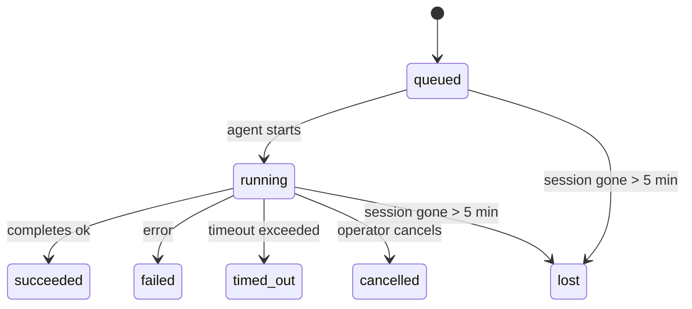

---
read_when:
    - فحص العمل الجاري في الخلفية أو المكتمل مؤخرًا
    - استكشاف أخطاء إخفاقات التسليم في تشغيلات الوكيل المنفصلة وإصلاحها
    - فهم كيفية ارتباط عمليات التشغيل في الخلفية بالجلسات وCron وHeartbeat
sidebarTitle: Background tasks
summary: تتبّع مهام الخلفية لتشغيلات ACP، والوكلاء الفرعيين، ومهام Cron المعزولة، وعمليات CLI
title: المهام الخلفية
x-i18n:
    generated_at: "2026-05-10T19:21:08Z"
    model: gpt-5.5
    provider: openai
    source_hash: 5764a89634f90181d826ff3990ec8dac9538239074934d30fd446c1eb4564869
    source_path: automation/tasks.md
    workflow: 16
---

<Note>
تبحث عن الجدولة؟ راجع [الأتمتة والمهام](/ar/automation) لاختيار الآلية المناسبة. هذه الصفحة هي سجل النشاط للعمل في الخلفية، وليست المجدول.
</Note>

تتتبع مهام الخلفية العمل الذي يعمل **خارج جلسة محادثتك الرئيسية**: تشغيلات ACP، وإنشاءات الوكلاء الفرعيين، وتنفيذات مهام Cron المعزولة، والعمليات التي يبدأها CLI.

لا تستبدل المهام الجلسات أو مهام Cron أو Heartbeat - بل هي **سجل النشاط** الذي يسجل العمل المنفصل الذي حدث، ومتى حدث، وما إذا كان قد نجح.

<Note>
لا ينشئ كل تشغيل للوكيل مهمة. لا تفعل ذلك دورات Heartbeat ولا المحادثات التفاعلية العادية. لكن كل تنفيذات Cron، وإنشاءات ACP، وإنشاءات الوكلاء الفرعيين، وأوامر وكيل CLI تفعل ذلك.
</Note>

## الخلاصة

- المهام **سجلات** وليست مجدولات - تحدد Cron وHeartbeat _متى_ يعمل العمل، وتتتبع المهام _ما حدث_.
- ينشئ ACP والوكلاء الفرعيون وكل مهام Cron وعمليات CLI مهام. لا تنشئ دورات Heartbeat مهام.
- تنتقل كل مهمة عبر `queued → running → terminal` (succeeded أو failed أو timed_out أو cancelled أو lost).
- تبقى مهام Cron نشطة ما دام وقت تشغيل Cron لا يزال يملك المهمة؛ وإذا اختفت
  حالة وقت التشغيل في الذاكرة، فإن صيانة المهام تتحقق أولا من سجل تشغيل Cron
  الدائم قبل وضع علامة lost على المهمة.
- الاكتمال مدفوع بالدفع: يمكن للعمل المنفصل الإخطار مباشرة أو إيقاظ
  جلسة/Heartbeat الطالب عند الانتهاء، لذلك تكون حلقات استطلاع الحالة
  عادة بالشكل الخاطئ.
- تنظف تشغيلات Cron المعزولة واكتمالات الوكلاء الفرعيين، قدر الإمكان، علامات تبويب/عمليات المتصفح المتتبعة لجلسة الابن قبل إمساك دفاتر التنظيف النهائي.
- يمنع تسليم Cron المعزول الردود المرحلية القديمة من الأصل بينما لا يزال عمل الوكيل الفرعي التابع قيد التصريف، ويفضل مخرج التابع النهائي عندما يصل قبل التسليم.
- تسلم إشعارات الاكتمال مباشرة إلى قناة أو توضع في صف انتظار Heartbeat التالية.
- يعرض `openclaw tasks list` كل المهام؛ ويكشف `openclaw tasks audit` المشكلات.
- تحتفظ السجلات الطرفية لمدة 7 أيام، ثم تزال تلقائيا.

## البدء السريع

<Tabs>
  <Tab title="السرد والتصفية">
    ```bash
    # List all tasks (newest first)
    openclaw tasks list

    # Filter by runtime or status
    openclaw tasks list --runtime acp
    openclaw tasks list --status running
    ```

  </Tab>
  <Tab title="الفحص">
    ```bash
    # Show details for a specific task (by ID, run ID, or session key)
    openclaw tasks show <lookup>
    ```
  </Tab>
  <Tab title="الإلغاء والإخطار">
    ```bash
    # Cancel a running task (kills the child session)
    openclaw tasks cancel <lookup>

    # Change notification policy for a task
    openclaw tasks notify <lookup> state_changes
    ```

  </Tab>
  <Tab title="التدقيق والصيانة">
    ```bash
    # Run a health audit
    openclaw tasks audit

    # Preview or apply maintenance
    openclaw tasks maintenance
    openclaw tasks maintenance --apply
    ```

  </Tab>
  <Tab title="تدفق المهام">
    ```bash
    # Inspect TaskFlow state
    openclaw tasks flow list
    openclaw tasks flow show <lookup>
    openclaw tasks flow cancel <lookup>
    ```
  </Tab>
</Tabs>

## ما الذي ينشئ مهمة

| المصدر                 | نوع وقت التشغيل | متى ينشأ سجل مهمة                                      | سياسة الإخطار الافتراضية |
| ---------------------- | ------------ | ------------------------------------------------------ | --------------------- |
| تشغيلات ACP في الخلفية | `acp`        | إنشاء جلسة ACP ابن                                    | `done_only`           |
| تنسيق الوكلاء الفرعيين | `subagent`   | إنشاء وكيل فرعي عبر `sessions_spawn`                  | `done_only`           |
| مهام Cron (كل الأنواع) | `cron`       | كل تنفيذ Cron (جلسة رئيسية ومعزولة)                   | `silent`              |
| عمليات CLI             | `cli`        | أوامر `openclaw agent` التي تعمل عبر Gateway           | `silent`              |
| مهام وسائط الوكيل      | `cli`        | تشغيلات `music_generate`/`video_generate` المدعومة بجلسة | `silent`              |

<AccordionGroup>
  <Accordion title="افتراضيات الإخطار لـ Cron والوسائط">
    تستخدم مهام Cron في الجلسة الرئيسية سياسة إخطار `silent` افتراضيا - فهي تنشئ سجلات للتتبع لكنها لا تولد إشعارات. كما تفترض مهام Cron المعزولة `silent` أيضا لكنها أكثر ظهورا لأنها تعمل في جلستها الخاصة.

    تستخدم تشغيلات `music_generate` و`video_generate` المدعومة بجلسة أيضا سياسة إخطار `silent`. لا تزال تنشئ سجلات مهام، لكن الاكتمال يعاد إلى جلسة الوكيل الأصلية كإيقاظ داخلي حتى يستطيع الوكيل كتابة رسالة المتابعة وإرفاق الوسائط المنتهية بنفسه. تتبع اكتمالات المجموعة/القناة سياسة الرد المرئي العادية، لذلك يستخدم الوكيل أداة الرسائل عندما يتطلب التسليم من المصدر ذلك. إذا فشل وكيل الاكتمال في إنتاج دليل تسليم بأداة الرسائل في مسار أدوات فقط، يرسل OpenClaw بديل الاكتمال مباشرة إلى القناة الأصلية بدلا من ترك الوسائط خاصة.

  </Accordion>
  <Accordion title="حاجز حماية video_generate المتزامن">
    بينما لا تزال مهمة `video_generate` المدعومة بجلسة نشطة، تعمل الأداة أيضا كحاجز حماية: تعيد استدعاءات `video_generate` المتكررة في الجلسة نفسها حالة المهمة النشطة بدلا من بدء توليد متزامن ثان. استخدم `action: "status"` عندما تريد بحثا صريحا عن التقدم/الحالة من جهة الوكيل.
  </Accordion>
  <Accordion title="ما لا ينشئ مهاما">
    - دورات Heartbeat - جلسة رئيسية؛ راجع [Heartbeat](/ar/gateway/heartbeat)
    - دورات المحادثة التفاعلية العادية
    - ردود `/command` المباشرة

  </Accordion>
</AccordionGroup>

## دورة حياة المهمة



| الحالة      | ما تعنيه                                                                  |
| ----------- | -------------------------------------------------------------------------- |
| `queued`    | أنشئت، وتنتظر بدء الوكيل                                                   |
| `running`   | دورة الوكيل قيد التنفيذ النشط                                             |
| `succeeded` | اكتملت بنجاح                                                               |
| `failed`    | اكتملت مع خطأ                                                              |
| `timed_out` | تجاوزت المهلة المكونة                                                      |
| `cancelled` | أوقفها المشغل عبر `openclaw tasks cancel`                                  |
| `lost`      | فقد وقت التشغيل حالة الدعم الموثوقة بعد فترة سماح مدتها 5 دقائق           |

تحدث الانتقالات تلقائيا - عند انتهاء تشغيل الوكيل المرتبط، تحدث حالة المهمة لتطابقه.

اكتمال تشغيل الوكيل هو المصدر الموثوق لسجلات المهام النشطة. ينهي التشغيل المنفصل الناجح كـ `succeeded`، وتنهي أخطاء التشغيل العادية كـ `failed`، وتنهي نتائج المهلة أو الإجهاض كـ `timed_out`. إذا كان المشغل قد ألغى المهمة بالفعل، أو كان وقت التشغيل قد سجل بالفعل حالة طرفية أقوى مثل `failed` أو `timed_out` أو `lost`، فلن تخفض إشارة نجاح لاحقة تلك الحالة الطرفية.

`lost` واعية بوقت التشغيل:

- مهام ACP: اختفت بيانات تعريف جلسة ACP الابن الداعمة.
- مهام الوكلاء الفرعيين: اختفت الجلسة الابن الداعمة من مخزن الوكيل الهدف.
- مهام Cron: لم يعد وقت تشغيل Cron يتتبع المهمة كنشطة، ولا يظهر
  سجل تشغيل Cron الدائم نتيجة طرفية لذلك التشغيل. لا يتعامل تدقيق CLI
  غير المتصل مع حالة وقت تشغيل Cron الفارغة الخاصة به داخل العملية كسلطة.
- مهام CLI: تستخدم المهام التي لها run id/source id سياق التشغيل الحي، لذلك
  لا تبقي صفوف الجلسة الابن أو جلسة المحادثة العالقة المهام حية بعد اختفاء
  التشغيل المملوك لـ Gateway. لا تزال مهام CLI القديمة بلا هوية تشغيل ترجع
  إلى الجلسة الابن. كما تنهي تشغيلات `openclaw agent` المدعومة بـ Gateway
  من نتيجة تشغيلها، لذلك لا تبقى التشغيلات المكتملة نشطة حتى يضع الكناس
  علامة `lost` عليها.

## التسليم والإشعارات

عندما تصل مهمة إلى حالة طرفية، يخطرك OpenClaw. هناك مسارا تسليم:

**التسليم المباشر** - إذا كان للمهمة هدف قناة (`requesterOrigin`)، تنتقل رسالة الاكتمال مباشرة إلى تلك القناة (Telegram وDiscord وSlack وما إلى ذلك). بدلا من ذلك، تمرر اكتمالات مهام المجموعة والقناة عبر جلسة الطالب حتى يستطيع الوكيل الأصل كتابة الرد المرئي. بالنسبة إلى اكتمالات الوكلاء الفرعيين، يحافظ OpenClaw أيضا على توجيه الخيط/الموضوع المرتبط عند توفره ويمكنه ملء `to` / الحساب المفقود من المسار المخزن لجلسة الطالب (`lastChannel` / `lastTo` / `lastAccountId`) قبل التخلي عن التسليم المباشر.

**التسليم الموضوع في صف الجلسة** - إذا فشل التسليم المباشر أو لم يحدد أصل، يوضع التحديث في صف كحدث نظام في جلسة الطالب ويظهر في Heartbeat التالية.

<Tip>
يثير اكتمال المهمة إيقاظ Heartbeat فوريا كي ترى النتيجة بسرعة - لا تحتاج إلى انتظار نبضة Heartbeat المجدولة التالية.
</Tip>

يعني ذلك أن سير العمل المعتاد قائم على الدفع: ابدأ العمل المنفصل مرة واحدة، ثم دع وقت التشغيل يوقظك أو يخطرك عند الاكتمال. لا تستطلع حالة المهمة إلا عندما تحتاج إلى تصحيح أخطاء أو تدخل أو تدقيق صريح.

### سياسات الإشعار

تحكم في مقدار ما تسمعه عن كل مهمة:

| السياسة              | ما يتم تسليمه                                                            |
| --------------------- | ----------------------------------------------------------------------- |
| `done_only` (افتراضي) | الحالة الطرفية فقط (succeeded، failed، وما إلى ذلك) - **هذا هو الافتراضي** |
| `state_changes`       | كل انتقال حالة وتحديث تقدم                                               |
| `silent`              | لا شيء إطلاقا                                                            |

غير السياسة بينما تعمل مهمة:

```bash
openclaw tasks notify <lookup> state_changes
```

## مرجع CLI

<AccordionGroup>
  <Accordion title="tasks list">
    ```bash
    openclaw tasks list [--runtime <acp|subagent|cron|cli>] [--status <status>] [--json]
    ```

    أعمدة المخرجات: معرف المهمة، النوع، الحالة، التسليم، معرف التشغيل، الجلسة الابن، الملخص.

  </Accordion>
  <Accordion title="tasks show">
    ```bash
    openclaw tasks show <lookup>
    ```

    يقبل رمز البحث معرف مهمة أو معرف تشغيل أو مفتاح جلسة. يعرض السجل الكامل بما في ذلك التوقيت وحالة التسليم والخطأ والملخص الطرفي.

  </Accordion>
  <Accordion title="tasks cancel">
    ```bash
    openclaw tasks cancel <lookup>
    ```

    بالنسبة إلى مهام ACP والوكلاء الفرعيين، يقتل هذا الجلسة الابن. بالنسبة إلى المهام المتتبعة بواسطة CLI، يسجل الإلغاء في سجل المهام (لا يوجد مقبض منفصل لوقت تشغيل ابن). تنتقل الحالة إلى `cancelled` ويرسل إشعار تسليم عند الاقتضاء.

  </Accordion>
  <Accordion title="tasks notify">
    ```bash
    openclaw tasks notify <lookup> <done_only|state_changes|silent>
    ```
  </Accordion>
  <Accordion title="tasks audit">
    ```bash
    openclaw tasks audit [--json]
    ```

    يكشف المشكلات التشغيلية. تظهر النتائج أيضا في `openclaw status` عند اكتشاف مشكلات.

    | النتيجة                   | الخطورة   | المشغّل                                                                                                      |
    | ------------------------- | ---------- | ------------------------------------------------------------------------------------------------------------ |
    | `stale_queued`            | تحذير      | في قائمة الانتظار لأكثر من 10 دقائق                                                                              |
    | `stale_running`           | خطأ        | قيد التشغيل لأكثر من 30 دقيقة                                                                             |
    | `lost`                    | تحذير/خطأ | اختفت ملكية المهمة المدعومة بوقت التشغيل؛ تبقى المهام المفقودة المحتفظ بها كتحذيرات حتى `cleanupAfter`، ثم تصبح أخطاء |
    | `delivery_failed`         | تحذير      | فشل التسليم وسياسة الإشعار ليست `silent`                                                            |
    | `missing_cleanup`         | تحذير      | مهمة نهائية بلا طابع زمني للتنظيف                                                                      |
    | `inconsistent_timestamps` | تحذير      | مخالفة في الخط الزمني (مثلًا انتهت قبل أن تبدأ)                                                        |

  </Accordion>
  <Accordion title="صيانة المهام">
    ```bash
    openclaw tasks maintenance [--json]
    openclaw tasks maintenance --apply [--json]
    ```

    استخدم هذا لمعاينة أو تطبيق التسوية، وختم التنظيف، والتقليم للمهام، وحالة تدفق المهام، وصفوف سجل جلسات تشغيل cron القديمة.

    التسوية واعية بوقت التشغيل:

    - تتحقق مهام ACP/الوكيل الفرعي من جلسة الابن الداعمة لها.
    - تُوسم مهام الوكيل الفرعي التي تحتوي جلسة الابن الخاصة بها على شاهد قبر لاستعادة إعادة التشغيل بأنها مفقودة بدلًا من معاملتها كجلسات داعمة قابلة للاسترداد.
    - تتحقق مهام Cron مما إذا كان وقت تشغيل cron لا يزال يملك المهمة، ثم تسترد الحالة النهائية من سجلات تشغيل cron/حالة المهمة المستمرة قبل الرجوع إلى `lost`. عملية Gateway فقط هي المرجع الموثوق لمجموعة مهام cron النشطة في الذاكرة؛ يستخدم تدقيق CLI دون اتصال السجل الدائم لكنه لا يوسم مهمة cron بأنها مفقودة لمجرد أن تلك المجموعة المحلية فارغة.
    - تتحقق مهام CLI ذات هوية التشغيل من سياق التشغيل الحي المالك، وليس فقط صفوف جلسة الابن أو جلسة الدردشة.

    التنظيف بعد الاكتمال واع بوقت التشغيل أيضًا:

    - يحاول اكتمال الوكيل الفرعي بأفضل جهد إغلاق علامات تبويب/عمليات المتصفح المتتبعة لجلسة الابن قبل أن يستمر تنظيف الإعلان.
    - يحاول اكتمال cron المعزول بأفضل جهد إغلاق علامات تبويب/عمليات المتصفح المتتبعة لجلسة cron قبل أن يُفكك التشغيل بالكامل.
    - ينتظر تسليم cron المعزول متابعة الوكيل الفرعي التابع عند الحاجة، ويكبت نص إقرار الأصل القديم بدلًا من إعلانه.
    - يفضّل تسليم اكتمال الوكيل الفرعي أحدث نص مساعد مرئي؛ وإذا كان فارغًا، فإنه يرجع إلى أحدث نص أداة/toolResult منظّف، ويمكن لعمليات تشغيل استدعاء الأداة ذات المهلة فقط أن تنضغط إلى ملخص قصير للتقدم الجزئي. تعلن عمليات التشغيل النهائية الفاشلة حالة الفشل دون إعادة تشغيل نص الرد الملتقط.
    - لا تحجب إخفاقات التنظيف نتيجة المهمة الحقيقية.

    عند تطبيق الصيانة، يزيل OpenClaw أيضًا صفوف سجل الجلسات القديمة `cron:<jobId>:run:<uuid>` الأقدم من 7 أيام، مع الحفاظ على صفوف مهام cron قيد التشغيل حاليًا وترك صفوف الجلسات غير التابعة لـ cron دون تغيير.

  </Accordion>
  <Accordion title="قائمة تدفق المهام | عرض | إلغاء">
    ```bash
    openclaw tasks flow list [--status <status>] [--json]
    openclaw tasks flow show <lookup> [--json]
    openclaw tasks flow cancel <lookup>
    ```

    استخدم هذه عندما يكون تدفق المهام المنسّق هو ما يهمك بدلًا من سجل مهمة خلفية فردي واحد.

  </Accordion>
</AccordionGroup>

## لوحة مهام الدردشة (`/tasks`)

استخدم `/tasks` في أي جلسة دردشة لرؤية المهام الخلفية المرتبطة بتلك الجلسة. تعرض اللوحة المهام النشطة والمكتملة حديثًا مع وقت التشغيل، والحالة، والتوقيت، وتفاصيل التقدم أو الخطأ.

عندما لا تحتوي الجلسة الحالية على مهام مرتبطة مرئية، يرجع `/tasks` إلى أعداد المهام المحلية للوكيل بحيث تحصل على نظرة عامة دون تسريب تفاصيل الجلسات الأخرى.

للحصول على سجل المشغّل الكامل، استخدم CLI: `openclaw tasks list`.

## تكامل الحالة (ضغط المهام)

يتضمن `openclaw status` ملخصًا سريعًا للمهام:

```
Tasks: 3 queued · 2 running · 1 issues
```

يعرض الملخص:

- **نشطة** - عدد `queued` + `running`
- **الإخفاقات** - عدد `failed` + `timed_out` + `lost`
- **حسب وقت التشغيل** - تفصيل حسب `acp`، و`subagent`، و`cron`، و`cli`

يستخدم كل من `/status` وأداة `session_status` لقطة مهام واعية بالتنظيف: تُفضّل المهام النشطة، وتُخفى الصفوف المكتملة القديمة، ولا تظهر الإخفاقات الحديثة إلا عندما لا يبقى عمل نشط. هذا يبقي بطاقة الحالة مركزة على ما يهم الآن.

## التخزين والصيانة

### أين توجد المهام

تستمر سجلات المهام في SQLite عند:

```
$OPENCLAW_STATE_DIR/tasks/runs.sqlite
```

يُحمّل السجل في الذاكرة عند بدء Gateway، وتُزامن الكتابات إلى SQLite لضمان الديمومة عبر عمليات إعادة التشغيل.
يبقي Gateway سجل الكتابة المسبقة في SQLite ضمن حدود باستخدام عتبة
autocheckpoint الافتراضية في SQLite بالإضافة إلى نقاط تحقق `TRUNCATE` الدورية وعند الإيقاف.

### الصيانة التلقائية

يعمل كانس كل **60 ثانية** ويتعامل مع أربعة أمور:

<Steps>
  <Step title="التسوية">
    يتحقق مما إذا كانت المهام النشطة لا تزال تمتلك دعمًا موثوقًا من وقت التشغيل. تستخدم مهام ACP/الوكيل الفرعي حالة جلسة الابن، وتستخدم مهام cron ملكية المهمة النشطة، وتستخدم مهام CLI ذات هوية التشغيل سياق التشغيل المالك. إذا اختفت حالة الدعم تلك لأكثر من 5 دقائق، تُوسم المهمة بأنها `lost`.
  </Step>
  <Step title="إصلاح جلسة ACP">
    يغلق جلسات ACP الأحادية الطرفية أو اليتيمة المملوكة للأصل، ويغلق جلسات ACP المستمرة الطرفية القديمة أو اليتيمة فقط عندما لا يبقى ارتباط محادثة نشط.
  </Step>
  <Step title="ختم التنظيف">
    يضبط طابعًا زمنيًا `cleanupAfter` على المهام النهائية (endedAt + 7 أيام). أثناء الاحتفاظ، تظل المهام المفقودة تظهر في التدقيق كتحذيرات؛ وبعد انتهاء صلاحية `cleanupAfter` أو عندما تكون بيانات التنظيف الوصفية مفقودة، تصبح أخطاء.
  </Step>
  <Step title="التقليم">
    يحذف السجلات التي تجاوزت تاريخ `cleanupAfter` الخاص بها.
  </Step>
</Steps>

<Note>
**الاحتفاظ:** تُحفظ سجلات المهام النهائية لمدة **7 أيام**، ثم تُقلّم تلقائيًا. لا حاجة إلى أي إعداد.
</Note>

## كيف ترتبط المهام بالأنظمة الأخرى

<AccordionGroup>
  <Accordion title="المهام وتدفق المهام">
    [تدفق المهام](/ar/automation/taskflow) هو طبقة تنسيق التدفق فوق المهام الخلفية. قد ينسق تدفق واحد عدة مهام طوال عمره باستخدام أوضاع مزامنة مُدارة أو منعكسة. استخدم `openclaw tasks` لفحص سجلات المهام الفردية و`openclaw tasks flow` لفحص التدفق المنسّق.

    راجع [تدفق المهام](/ar/automation/taskflow) للتفاصيل.

  </Accordion>
  <Accordion title="المهام وcron">
    يوجد **تعريف** مهمة cron في `~/.openclaw/cron/jobs.json`؛ وتوجد حالة التنفيذ في وقت التشغيل بجانبه في `~/.openclaw/cron/jobs-state.json`. ينشئ **كل** تنفيذ cron سجل مهمة، سواء كان في الجلسة الرئيسية أو معزولًا. تعتمد مهام cron في الجلسة الرئيسية سياسة إشعار `silent` افتراضيًا بحيث تتتبع دون إنشاء إشعارات.

    راجع [مهام Cron](/ar/automation/cron-jobs).

  </Accordion>
  <Accordion title="المهام وHeartbeat">
    عمليات تشغيل Heartbeat هي أدوار في الجلسة الرئيسية؛ فهي لا تنشئ سجلات مهام. عند اكتمال مهمة، يمكنها تشغيل إيقاظ Heartbeat كي ترى النتيجة بسرعة.

    راجع [Heartbeat](/ar/gateway/heartbeat).

  </Accordion>
  <Accordion title="المهام والجلسات">
    قد تشير المهمة إلى `childSessionKey` (حيث يعمل العمل) و`requesterSessionKey` (من بدأها). الجلسات هي سياق المحادثة؛ والمهام هي تتبع النشاط فوق ذلك.
  </Accordion>
  <Accordion title="المهام وعمليات تشغيل الوكيل">
    يربط `runId` الخاص بالمهمة بعملية تشغيل الوكيل التي تنفذ العمل. تحدّث أحداث دورة حياة الوكيل (البدء، الانتهاء، الخطأ) حالة المهمة تلقائيًا؛ لا تحتاج إلى إدارة دورة الحياة يدويًا.
  </Accordion>
</AccordionGroup>

## ذات صلة

- [الأتمتة والمهام](/ar/automation) - كل آليات الأتمتة في لمحة
- [CLI: المهام](/ar/cli/tasks) - مرجع أوامر CLI
- [Heartbeat](/ar/gateway/heartbeat) - أدوار دورية في الجلسة الرئيسية
- [المهام المجدولة](/ar/automation/cron-jobs) - جدولة العمل الخلفي
- [تدفق المهام](/ar/automation/taskflow) - تنسيق التدفق فوق المهام
