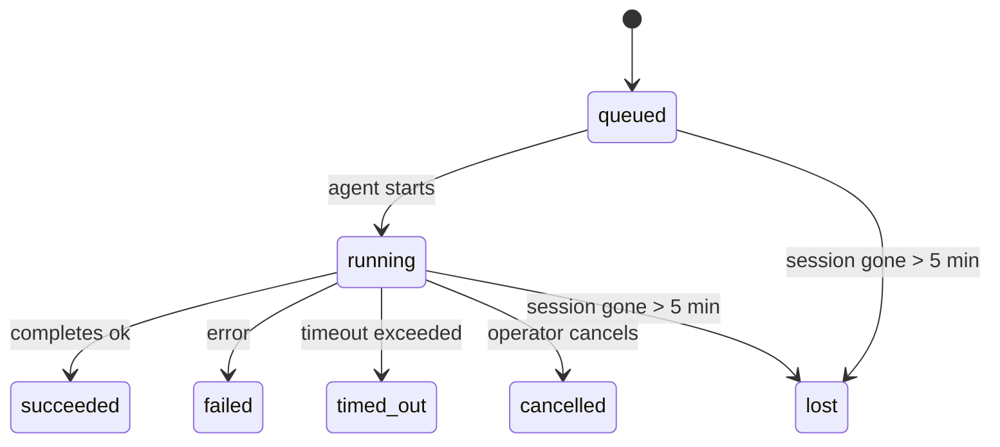

---
read_when:
    - فحص العمل في الخلفية الجاري أو المكتمل مؤخرًا
    - تصحيح أخطاء فشل التسليم في عمليات تشغيل الوكيل المنفصلة
    - فهم كيفية ارتباط عمليات التشغيل في الخلفية بالجلسات وCron وHeartbeat
sidebarTitle: Background tasks
summary: تتبّع مهام الخلفية لعمليات تشغيل ACP، والوكلاء الفرعيين، ومهام Cron المعزولة، وعمليات CLI
title: مهام الخلفية
x-i18n:
    generated_at: "2026-05-05T01:44:30Z"
    model: gpt-5.5
    provider: openai
    source_hash: 60d6ea6178535b19b95d761b8e8b05a665234584ae69852fd21097988aa32991
    source_path: automation/tasks.md
    workflow: 16
---

<Note>
تبحث عن الجدولة؟ راجع [الأتمتة والمهام](/ar/automation) لاختيار الآلية المناسبة. هذه الصفحة هي سجل النشاط لأعمال الخلفية، وليست المجدول.
</Note>

تتعقب مهام الخلفية العمل الذي يعمل **خارج جلسة محادثتك الرئيسية**: تشغيلات ACP، وإنشاءات الوكلاء الفرعيين، وتنفيذات مهام cron المعزولة، والعمليات التي تبدأها CLI.

لا تستبدل المهام الجلسات أو مهام cron أو heartbeats — فهي **سجل النشاط** الذي يسجل العمل المنفصل الذي حدث، ومتى حدث، وما إذا نجح.

<Note>
لا تنشئ كل تشغيلات الوكيل مهمة. لا تفعل ذلك أدوار Heartbeat ولا الدردشة التفاعلية العادية. تفعل ذلك كل تنفيذات cron، وإنشاءات ACP، وإنشاءات الوكلاء الفرعيين، وأوامر وكيل CLI.
</Note>

## الخلاصة

- المهام **سجلات** وليست مجدولات — يقرر cron وHeartbeat _متى_ يعمل العمل، وتتتبع المهام _ما حدث_.
- تنشئ ACP والوكلاء الفرعيون وكل مهام cron وعمليات CLI مهام. لا تفعل ذلك أدوار Heartbeat.
- تنتقل كل مهمة عبر `queued → running → terminal` (succeeded أو failed أو timed_out أو cancelled أو lost).
- تبقى مهام Cron حية ما دام وقت تشغيل cron لا يزال يملك المهمة؛ وإذا اختفت حالة وقت التشغيل داخل الذاكرة، تتحقق صيانة المهام أولا من سجل تشغيل cron الدائم قبل وضع علامة lost على مهمة.
- الإكمال مدفوع بالدفع: يمكن للعمل المنفصل الإخطار مباشرة أو إيقاظ جلسة/Heartbeat الطالب عند انتهائه، لذلك تكون حلقات استطلاع الحالة عادة الشكل غير المناسب.
- تحاول تشغيلات cron المعزولة وإكمالات الوكلاء الفرعيين، قدر الإمكان، تنظيف تبويبات/عمليات المتصفح المتتبعة لجلسة الطفل قبل سجلات التنظيف النهائية.
- يكبت تسليم cron المعزول الردود المرحلية القديمة من الأصل بينما لا يزال عمل الوكيل الفرعي التابع قيد التصريف، ويفضل خرج التابع النهائي عند وصوله قبل التسليم.
- تسلم إشعارات الإكمال مباشرة إلى قناة أو توضع في قائمة انتظار Heartbeat التالي.
- يعرض `openclaw tasks list` كل المهام؛ ويكشف `openclaw tasks audit` المشكلات.
- تحتفظ بالسجلات النهائية لمدة 7 أيام، ثم تشذب تلقائيا.

## البدء السريع

<Tabs>
  <Tab title="List and filter">
    ```bash
    # List all tasks (newest first)
    openclaw tasks list

    # Filter by runtime or status
    openclaw tasks list --runtime acp
    openclaw tasks list --status running
    ```

  </Tab>
  <Tab title="Inspect">
    ```bash
    # Show details for a specific task (by ID, run ID, or session key)
    openclaw tasks show <lookup>
    ```
  </Tab>
  <Tab title="Cancel and notify">
    ```bash
    # Cancel a running task (kills the child session)
    openclaw tasks cancel <lookup>

    # Change notification policy for a task
    openclaw tasks notify <lookup> state_changes
    ```

  </Tab>
  <Tab title="Audit and maintenance">
    ```bash
    # Run a health audit
    openclaw tasks audit

    # Preview or apply maintenance
    openclaw tasks maintenance
    openclaw tasks maintenance --apply
    ```

  </Tab>
  <Tab title="Task flow">
    ```bash
    # Inspect TaskFlow state
    openclaw tasks flow list
    openclaw tasks flow show <lookup>
    openclaw tasks flow cancel <lookup>
    ```
  </Tab>
</Tabs>

## ما الذي ينشئ مهمة

| المصدر                 | نوع وقت التشغيل | متى ينشأ سجل مهمة                                      | سياسة الإشعار الافتراضية |
| ---------------------- | ------------ | ------------------------------------------------------ | --------------------- |
| تشغيلات ACP في الخلفية | `acp`        | إنشاء جلسة ACP فرعية                                  | `done_only`           |
| تنسيق الوكلاء الفرعيين | `subagent`   | إنشاء وكيل فرعي عبر `sessions_spawn`                  | `done_only`           |
| مهام Cron (كل الأنواع) | `cron`       | كل تنفيذ cron (الجلسة الرئيسية والمعزول)              | `silent`              |
| عمليات CLI             | `cli`        | أوامر `openclaw agent` التي تعمل عبر Gateway          | `silent`              |
| مهام وسائط الوكيل      | `cli`        | تشغيلات `music_generate`/`video_generate` المدعومة بجلسة | `silent`              |

<AccordionGroup>
  <Accordion title="Notify defaults for cron and media">
    تستخدم مهام cron في الجلسة الرئيسية سياسة إشعار `silent` افتراضيا — فهي تنشئ سجلات للتتبع لكنها لا تولد إشعارات. تستخدم مهام cron المعزولة أيضا `silent` افتراضيا، لكنها أوضح لأنها تعمل في جلستها الخاصة.

    تستخدم تشغيلات `music_generate` و`video_generate` المدعومة بجلسة أيضا سياسة إشعار `silent`. لا تزال تنشئ سجلات مهام، لكن الإكمال يعاد إلى جلسة الوكيل الأصلية كإيقاظ داخلي لكي يتمكن الوكيل من كتابة رسالة المتابعة وإرفاق الوسائط النهائية بنفسه. تتبع إكمالات المجموعة/القناة سياسة الرد المرئي العادية، لذلك يستخدم الوكيل أداة الرسائل عندما يتطلب تسليم المصدر ذلك.

  </Accordion>
  <Accordion title="Concurrent video_generate guardrail">
    بينما لا تزال مهمة `video_generate` المدعومة بجلسة نشطة، تعمل الأداة أيضا كحاجز حماية: تعيد استدعاءات `video_generate` المتكررة في الجلسة نفسها حالة المهمة النشطة بدلا من بدء توليد ثان متزامن. استخدم `action: "status"` عندما تريد بحثا صريحا عن التقدم/الحالة من جهة الوكيل.
  </Accordion>
  <Accordion title="What does not create tasks">
    - أدوار Heartbeat — الجلسة الرئيسية؛ راجع [Heartbeat](/ar/gateway/heartbeat)
    - أدوار الدردشة التفاعلية العادية
    - ردود `/command` المباشرة

  </Accordion>
</AccordionGroup>

## دورة حياة المهمة



| الحالة      | معناها                                                                     |
| ----------- | -------------------------------------------------------------------------- |
| `queued`    | أنشئت، وتنتظر بدء الوكيل                                                   |
| `running`   | دور الوكيل قيد التنفيذ بنشاط                                               |
| `succeeded` | اكتملت بنجاح                                                               |
| `failed`    | اكتملت مع خطأ                                                              |
| `timed_out` | تجاوزت المهلة المضبوطة                                                     |
| `cancelled` | أوقفها المشغل عبر `openclaw tasks cancel`                                  |
| `lost`      | فقد وقت التشغيل حالة الإسناد الموثوقة بعد فترة سماح مدتها 5 دقائق          |

تحدث الانتقالات تلقائيا — عند انتهاء تشغيل الوكيل المرتبط، تتحدث حالة المهمة لتطابقه.

إكمال تشغيل الوكيل هو المرجع المعتمد لسجلات المهام النشطة. ينهي التشغيل المنفصل الناجح حالته إلى `succeeded`، وتنهي أخطاء التشغيل العادية حالتها إلى `failed`، وتنهي نتائج انتهاء المهلة أو الإجهاض حالتها إلى `timed_out`. إذا كان المشغل قد ألغى المهمة بالفعل، أو كان وقت التشغيل قد سجل بالفعل حالة نهائية أقوى مثل `failed` أو `timed_out` أو `lost`، فلن تخفض إشارة نجاح لاحقة تلك الحالة النهائية.

`lost` واعية بوقت التشغيل:

- مهام ACP: اختفت بيانات تعريف جلسة ACP الفرعية الداعمة.
- مهام الوكيل الفرعي: اختفت جلسة الطفل الداعمة من مخزن الوكيل الهدف.
- مهام Cron: لم يعد وقت تشغيل cron يتتبع المهمة كنشطة، ولا يظهر سجل تشغيل cron الدائم نتيجة نهائية لذلك التشغيل. لا يتعامل تدقيق CLI دون اتصال مع حالة وقت تشغيل cron الفارغة داخل العملية الخاصة به كمرجع معتمد.
- مهام CLI: تستخدم مهام الجلسة الفرعية المعزولة جلسة الطفل؛ أما مهام CLI المدعومة بالدردشة فتستخدم سياق التشغيل الحي بدلا من ذلك، لذلك لا تبقي صفوف جلسات القناة/المجموعة/المباشرة العالقة هذه المهام حية. تنتهي أيضا تشغيلات `openclaw agent` المدعومة بـ Gateway من نتيجة تشغيلها، لذلك لا تبقى التشغيلات المكتملة نشطة حتى يضع عليها الكناس علامة `lost`.

## التسليم والإشعارات

عندما تصل مهمة إلى حالة نهائية، يخطرك OpenClaw. هناك مساران للتسليم:

**التسليم المباشر** — إذا كان للمهمة هدف قناة (`requesterOrigin`)، تذهب رسالة الإكمال مباشرة إلى تلك القناة (Telegram وDiscord وSlack وما إلى ذلك). بالنسبة إلى إكمالات الوكلاء الفرعيين، يحافظ OpenClaw أيضا على توجيه السلسلة/الموضوع المرتبط عند توفره، ويمكنه ملء `to` / الحساب المفقود من مسار جلسة الطالب المخزن (`lastChannel` / `lastTo` / `lastAccountId`) قبل التخلي عن التسليم المباشر.

**التسليم الموضوع في قائمة انتظار الجلسة** — إذا فشل التسليم المباشر أو لم يضبط أي أصل، يوضع التحديث كحدث نظام في جلسة الطالب ويظهر في Heartbeat التالي.

<Tip>
يؤدي إكمال المهمة إلى إيقاظ Heartbeat فوري لكي ترى النتيجة بسرعة — لست مضطرا إلى انتظار نبضة Heartbeat المجدولة التالية.
</Tip>

يعني ذلك أن سير العمل المعتاد يعتمد على الدفع: ابدأ العمل المنفصل مرة واحدة، ثم دع وقت التشغيل يوقظك أو يخطرك عند الإكمال. لا تستطلع حالة المهمة إلا عندما تحتاج إلى تصحيح أخطاء أو تدخل أو تدقيق صريح.

### سياسات الإشعارات

تحكم في مقدار ما تسمعه عن كل مهمة:

| السياسة                | ما يتم تسليمه                                                            |
| --------------------- | ----------------------------------------------------------------------- |
| `done_only` (افتراضي) | الحالة النهائية فقط (succeeded وfailed وما إلى ذلك) — **هذا هو الافتراضي** |
| `state_changes`       | كل انتقال حالة وتحديث تقدم                                               |
| `silent`              | لا شيء إطلاقا                                                            |

غيّر السياسة أثناء تشغيل مهمة:

```bash
openclaw tasks notify <lookup> state_changes
```

## مرجع CLI

<AccordionGroup>
  <Accordion title="tasks list">
    ```bash
    openclaw tasks list [--runtime <acp|subagent|cron|cli>] [--status <status>] [--json]
    ```

    أعمدة الخرج: معرف المهمة، النوع، الحالة، التسليم، معرف التشغيل، جلسة الطفل، الملخص.

  </Accordion>
  <Accordion title="tasks show">
    ```bash
    openclaw tasks show <lookup>
    ```

    يقبل رمز البحث معرف مهمة أو معرف تشغيل أو مفتاح جلسة. يعرض السجل الكامل بما في ذلك التوقيت وحالة التسليم والخطأ والملخص النهائي.

  </Accordion>
  <Accordion title="tasks cancel">
    ```bash
    openclaw tasks cancel <lookup>
    ```

    بالنسبة إلى مهام ACP والوكلاء الفرعيين، يقتل هذا جلسة الطفل. بالنسبة إلى المهام التي تتعقبها CLI، يسجل الإلغاء في سجل المهام (لا يوجد مقبض وقت تشغيل فرعي منفصل). تنتقل الحالة إلى `cancelled` ويرسل إشعار تسليم عند انطباق ذلك.

  </Accordion>
  <Accordion title="tasks notify">
    ```bash
    openclaw tasks notify <lookup> <done_only|state_changes|silent>
    ```
  </Accordion>
  <Accordion title="tasks audit">
    ```bash
    openclaw tasks audit [--json]
    ```

    يكشف المشكلات التشغيلية. تظهر النتائج أيضا في `openclaw status` عند اكتشاف مشكلات.

    | النتيجة                   | الخطورة   | المُحفِّز                                                                                                      |
    | ------------------------- | ---------- | ------------------------------------------------------------------------------------------------------------ |
    | `stale_queued`            | تحذير       | في قائمة الانتظار لأكثر من 10 دقائق                                                                              |
    | `stale_running`           | خطأ      | قيد التشغيل لأكثر من 30 دقيقة                                                                             |
    | `lost`                    | تحذير/خطأ | اختفت ملكية المهمة المدعومة بوقت التشغيل؛ تبقى المهام المفقودة المحتفَظ بها تحذيرات حتى `cleanupAfter`، ثم تصبح أخطاء |
    | `delivery_failed`         | تحذير       | فشل التسليم وسياسة الإشعار ليست `silent`                                                            |
    | `missing_cleanup`         | تحذير       | مهمة نهائية بلا طابع زمني للتنظيف                                                                      |
    | `inconsistent_timestamps` | تحذير       | انتهاك في الخط الزمني (على سبيل المثال انتهت قبل أن تبدأ)                                                        |

  </Accordion>
  <Accordion title="صيانة المهام">
    ```bash
    openclaw tasks maintenance [--json]
    openclaw tasks maintenance --apply [--json]
    ```

    استخدم هذا لمعاينة أو تطبيق التسوية، وختم التنظيف، والتقليم للمهام وحالة Task Flow.

    التسوية واعية بوقت التشغيل:

    - تتحقق مهام ACP/الوكيل الفرعي من جلسة الطفل الداعمة لها.
    - تُوسَم مهام الوكيل الفرعي التي تحتوي جلسة الطفل الخاصة بها على شاهدة استعادة بعد إعادة التشغيل بأنها مفقودة بدلا من معاملتها كجلسات داعمة قابلة للاسترداد.
    - تتحقق مهام Cron مما إذا كان وقت تشغيل cron ما زال يملك المهمة، ثم تسترد الحالة النهائية من سجلات تشغيل cron المستمرة/حالة المهمة قبل الرجوع إلى `lost`. عملية Gateway وحدها هي المرجع الموثوق لمجموعة مهام cron النشطة في الذاكرة؛ يستخدم تدقيق CLI غير المتصل السجل الدائم لكنه لا يوسم مهمة cron بأنها مفقودة لمجرد أن ذلك الـ Set المحلي فارغ.
    - تتحقق مهام CLI المدعومة بالدردشة من سياق التشغيل الحي المالك، وليس فقط من صف جلسة الدردشة.

    التنظيف عند الإكمال واع بوقت التشغيل أيضا:

    - يبذل إكمال الوكيل الفرعي أفضل جهد لإغلاق علامات تبويب/عمليات المتصفح المتتبعة لجلسة الطفل قبل استمرار تنظيف الإعلان.
    - يبذل إكمال cron المعزول أفضل جهد لإغلاق علامات تبويب/عمليات المتصفح المتتبعة لجلسة cron قبل تفكيك التشغيل بالكامل.
    - ينتظر تسليم cron المعزول متابعة الوكيل الفرعي السليل عند الحاجة ويكتم نص إقرار الأصل القديم بدلا من إعلانه.
    - يفضل تسليم إكمال الوكيل الفرعي أحدث نص مساعد مرئي؛ إذا كان فارغا، فإنه يرجع إلى أحدث نص أداة/toolResult مُنقّى، ويمكن لتشغيلات استدعاء الأدوات القائمة على انتهاء المهلة فقط أن تنطوي إلى ملخص قصير للتقدم الجزئي. تعلن التشغيلات النهائية الفاشلة حالة الفشل دون إعادة عرض نص الرد الملتقط.
    - لا تحجب إخفاقات التنظيف نتيجة المهمة الحقيقية.

  </Accordion>
  <Accordion title="قائمة تدفق المهام | العرض | الإلغاء">
    ```bash
    openclaw tasks flow list [--status <status>] [--json]
    openclaw tasks flow show <lookup> [--json]
    openclaw tasks flow cancel <lookup>
    ```

    استخدم هذه عندما يكون Task Flow المنسق هو ما يهمك بدلا من سجل مهمة خلفية فردي واحد.

  </Accordion>
</AccordionGroup>

## لوحة مهام الدردشة (`/tasks`)

استخدم `/tasks` في أي جلسة دردشة لرؤية المهام الخلفية المرتبطة بتلك الجلسة. تعرض اللوحة المهام النشطة والمكتملة حديثا مع وقت التشغيل، والحالة، والتوقيت، وتفاصيل التقدم أو الخطأ.

عندما لا تحتوي الجلسة الحالية على مهام مرتبطة مرئية، يرجع `/tasks` إلى أعداد المهام المحلية للوكيل بحيث تحصل على نظرة عامة دون كشف تفاصيل جلسات أخرى.

للسجل الكامل للمشغل، استخدم CLI: `openclaw tasks list`.

## تكامل الحالة (ضغط المهام)

يتضمن `openclaw status` ملخصا سريعا للمهام:

```
Tasks: 3 queued · 2 running · 1 issues
```

يعرض الملخص:

- **النشطة** — عدد `queued` + `running`
- **الإخفاقات** — عدد `failed` + `timed_out` + `lost`
- **حسب وقت التشغيل** — تفصيل حسب `acp` و`subagent` و`cron` و`cli`

يستخدم كل من `/status` وأداة `session_status` لقطة مهام واعية بالتنظيف: تُفضَّل المهام النشطة، وتُخفى الصفوف المكتملة القديمة، ولا تظهر الإخفاقات الحديثة إلا عند عدم بقاء أي عمل نشط. هذا يُبقي بطاقة الحالة مركزة على ما يهم الآن.

## التخزين والصيانة

### أين تعيش المهام

تستمر سجلات المهام في SQLite عند:

```
$OPENCLAW_STATE_DIR/tasks/runs.sqlite
```

يُحمَّل السجل إلى الذاكرة عند بدء Gateway وتُزامَن عمليات الكتابة إلى SQLite لضمان الديمومة عبر عمليات إعادة التشغيل.
يُبقي Gateway سجل الكتابة المسبقة في SQLite محدودا باستخدام عتبة
نقطة التحقق التلقائية الافتراضية في SQLite إضافة إلى نقاط تحقق `TRUNCATE` الدورية وعند الإيقاف.

### الصيانة التلقائية

تعمل أداة كنس كل **60 ثانية** وتتعامل مع أربعة أشياء:

<Steps>
  <Step title="التسوية">
    تتحقق مما إذا كانت المهام النشطة ما زالت لديها دعامة وقت تشغيل موثوقة. تستخدم مهام ACP/الوكيل الفرعي حالة جلسة الطفل، وتستخدم مهام cron ملكية المهمة النشطة، وتستخدم مهام CLI المدعومة بالدردشة سياق التشغيل المالك. إذا اختفت تلك الحالة الداعمة لأكثر من 5 دقائق، تُوسَم المهمة بأنها `lost`.
  </Step>
  <Step title="إصلاح جلسات ACP">
    تغلق جلسات ACP أحادية التشغيل النهائية أو اليتيمة المملوكة للأصل، وتغلق جلسات ACP المستمرة النهائية القديمة أو اليتيمة فقط عندما لا يبقى أي ارتباط محادثة نشط.
  </Step>
  <Step title="ختم التنظيف">
    تضبط طابعا زمنيا `cleanupAfter` على المهام النهائية (endedAt + 7 أيام). أثناء الاحتفاظ، تظل المهام المفقودة تظهر في التدقيق كتحذيرات؛ وبعد انتهاء `cleanupAfter` أو عند غياب بيانات التنظيف الوصفية، تصبح أخطاء.
  </Step>
  <Step title="التقليم">
    يحذف السجلات التي تجاوزت تاريخ `cleanupAfter` الخاص بها.
  </Step>
</Steps>

<Note>
**الاحتفاظ:** تُحفَظ سجلات المهام النهائية لمدة **7 أيام**، ثم تُقلَّم تلقائيا. لا حاجة إلى إعدادات.
</Note>

## كيف ترتبط المهام بأنظمة أخرى

<AccordionGroup>
  <Accordion title="المهام وTask Flow">
    [Task Flow](/ar/automation/taskflow) هو طبقة تنسيق التدفق فوق المهام الخلفية. قد ينسق تدفق واحد عدة مهام على مدى عمره باستخدام أوضاع مزامنة مُدارة أو معكوسة. استخدم `openclaw tasks` لفحص سجلات المهام الفردية و`openclaw tasks flow` لفحص التدفق المنسق.

    راجع [Task Flow](/ar/automation/taskflow) للتفاصيل.

  </Accordion>
  <Accordion title="المهام وcron">
    يعيش **تعريف** مهمة cron في `~/.openclaw/cron/jobs.json`؛ وتعيش حالة تنفيذ وقت التشغيل بجانبه في `~/.openclaw/cron/jobs-state.json`. تنشئ **كل** عملية تنفيذ cron سجل مهمة، سواء كانت في الجلسة الرئيسية أو معزولة. تستخدم مهام cron في الجلسة الرئيسية سياسة إشعار `silent` افتراضيا بحيث تتتبع دون إنشاء إشعارات.

    راجع [مهام Cron](/ar/automation/cron-jobs).

  </Accordion>
  <Accordion title="المهام وHeartbeat">
    تشغيلات Heartbeat هي أدوار في الجلسة الرئيسية، ولا تنشئ سجلات مهام. عند اكتمال مهمة، يمكنها تشغيل إيقاظ Heartbeat حتى ترى النتيجة بسرعة.

    راجع [Heartbeat](/ar/gateway/heartbeat).

  </Accordion>
  <Accordion title="المهام والجلسات">
    قد تشير مهمة إلى `childSessionKey` (حيث يعمل العمل) و`requesterSessionKey` (من بدأها). الجلسات هي سياق المحادثة؛ أما المهام فهي تتبع للنشاط فوق ذلك.
  </Accordion>
  <Accordion title="المهام وتشغيلات الوكيل">
    يربط `runId` الخاص بالمهمة بتشغيل الوكيل الذي ينفذ العمل. تُحدّث أحداث دورة حياة الوكيل (البداية، النهاية، الخطأ) حالة المهمة تلقائيا، ولا تحتاج إلى إدارة دورة الحياة يدويا.
  </Accordion>
</AccordionGroup>

## ذات صلة

- [الأتمتة والمهام](/ar/automation) — كل آليات الأتمتة في لمحة
- [CLI: المهام](/ar/cli/tasks) — مرجع أوامر CLI
- [Heartbeat](/ar/gateway/heartbeat) — أدوار دورية في الجلسة الرئيسية
- [المهام المجدولة](/ar/automation/cron-jobs) — جدولة العمل في الخلفية
- [Task Flow](/ar/automation/taskflow) — تنسيق التدفق فوق المهام
