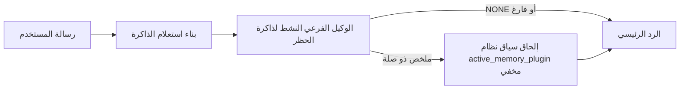

---
read_when:
    - تريد أن تفهم الغرض من الذاكرة النشطة
    - تريد تشغيل الذاكرة النشطة لوكيل محادثة
    - تريد ضبط سلوك الذاكرة النشطة من دون تمكينها في كل مكان
summary: وكيل فرعي لذاكرة الحظر مملوك للمكوّن الإضافي يحقن الذاكرة ذات الصلة في جلسات الدردشة التفاعلية
title: الذاكرة النشطة
x-i18n:
    generated_at: "2026-04-12T07:15:30Z"
    model: gpt-5.4
    provider: openai
    source_hash: 59456805c28daaab394ba2a7f87e1104a1334a5cf32dbb961d5d232d9c471d84
    source_path: concepts/active-memory.md
    workflow: 15
---

# الذاكرة النشطة

الذاكرة النشطة هي وكيل فرعي اختياري لذاكرة الحظر مملوك للمكوّن الإضافي ويعمل
قبل الرد الرئيسي للجلسات الحوارية المؤهلة.

وهي موجودة لأن معظم أنظمة الذاكرة قادرة لكنها تفاعلية. فهي تعتمد على
الوكيل الرئيسي ليقرر متى يبحث في الذاكرة، أو على المستخدم ليقول أشياء
مثل "تذكّر هذا" أو "ابحث في الذاكرة". وبحلول ذلك الوقت، تكون اللحظة التي
كان من الممكن أن تجعل فيها الذاكرة الرد يبدو طبيعيًا قد فاتت بالفعل.

تمنح الذاكرة النشطة النظام فرصة واحدة محدودة لإظهار الذاكرة ذات الصلة
قبل إنشاء الرد الرئيسي.

## الصق هذا في وكيلك

الصق هذا في وكيلك إذا كنت تريد تمكين الذاكرة النشطة بإعداد مستقل وآمن
افتراضيًا:

```json5
{
  plugins: {
    entries: {
      "active-memory": {
        enabled: true,
        config: {
          enabled: true,
          agents: ["main"],
          allowedChatTypes: ["direct"],
          modelFallback: "google/gemini-3-flash",
          queryMode: "recent",
          promptStyle: "balanced",
          timeoutMs: 15000,
          maxSummaryChars: 220,
          persistTranscripts: false,
          logging: true,
        },
      },
    },
  },
}
```

يؤدي هذا إلى تشغيل المكوّن الإضافي للوكيل `main`، وإبقائه مقصورًا افتراضيًا على
الجلسات ذات نمط الرسائل المباشرة، ويسمح له أولًا بوراثة نموذج الجلسة الحالي،
ويستخدم نموذج المزود الاحتياطي المضبوط فقط إذا لم يكن هناك نموذج صريح أو موروث
متاح.

بعد ذلك، أعد تشغيل البوابة:

```bash
openclaw gateway
```

لفحصه مباشرة داخل محادثة:

```text
/verbose on
```

## تشغيل الذاكرة النشطة

أكثر إعداد أمانًا هو:

1. تمكين المكوّن الإضافي
2. استهداف وكيل حواري واحد
3. إبقاء التسجيل مفعّلًا فقط أثناء الضبط

ابدأ بهذا في `openclaw.json`:

```json5
{
  plugins: {
    entries: {
      "active-memory": {
        enabled: true,
        config: {
          agents: ["main"],
          allowedChatTypes: ["direct"],
          modelFallback: "google/gemini-3-flash",
          queryMode: "recent",
          promptStyle: "balanced",
          timeoutMs: 15000,
          maxSummaryChars: 220,
          persistTranscripts: false,
          logging: true,
        },
      },
    },
  },
}
```

ثم أعد تشغيل البوابة:

```bash
openclaw gateway
```

ما يعنيه هذا:

- `plugins.entries.active-memory.enabled: true` يشغّل المكوّن الإضافي
- `config.agents: ["main"]` يشرك فقط الوكيل `main` في الذاكرة النشطة
- `config.allowedChatTypes: ["direct"]` يبقي الذاكرة النشطة مفعّلة افتراضيًا فقط للجلسات ذات نمط الرسائل المباشرة
- إذا لم يتم ضبط `config.model`، فإن الذاكرة النشطة ترث أولًا نموذج الجلسة الحالي
- يوفّر `config.modelFallback` اختياريًا نموذج المزود/النموذج الاحتياطي الخاص بك للاسترجاع
- يستخدم `config.promptStyle: "balanced"` نمط المطالبة العام الافتراضي لوضع `recent`
- لا تزال الذاكرة النشطة تعمل فقط على جلسات الدردشة التفاعلية المستمرة المؤهلة

## كيفية رؤيتها

تقوم الذاكرة النشطة بحقن سياق نظام مخفي للنموذج. وهي لا تعرض
وسوم `<active_memory_plugin>...</active_memory_plugin>` الخام للعميل.

## تبديل الجلسة

استخدم أمر المكوّن الإضافي عندما تريد إيقاف الذاكرة النشطة مؤقتًا أو استئنافها
لجلسة الدردشة الحالية من دون تعديل الإعدادات:

```text
/active-memory status
/active-memory off
/active-memory on
```

هذا النطاق خاص بالجلسة. وهو لا يغيّر
`plugins.entries.active-memory.enabled`، أو استهداف الوكيل، أو أي إعداد
عام آخر.

إذا أردت أن يكتب الأمر الإعدادات وأن يوقف الذاكرة النشطة مؤقتًا أو يستأنفها
لكل الجلسات، فاستخدم الصيغة العامة الصريحة:

```text
/active-memory status --global
/active-memory off --global
/active-memory on --global
```

تكتب الصيغة العامة `plugins.entries.active-memory.config.enabled`. وهي تُبقي
`plugins.entries.active-memory.enabled` مفعّلًا حتى يظل الأمر متاحًا لتشغيل
الذاكرة النشطة مرة أخرى لاحقًا.

إذا أردت رؤية ما تفعله الذاكرة النشطة في جلسة مباشرة، فعّل الوضع المفصل
لتلك الجلسة:

```text
/verbose on
```

مع تمكين الوضع المفصل، يمكن لـ OpenClaw عرض ما يلي:

- سطر حالة للذاكرة النشطة مثل `Active Memory: ok 842ms recent 34 chars`
- ملخص تصحيح مقروء مثل `Active Memory Debug: Lemon pepper wings with blue cheese.`

تُشتق هذه الأسطر من تمريرة الذاكرة النشطة نفسها التي تغذي سياق
النظام المخفي، لكنها تُنسّق للبشر بدلًا من كشف ترميز المطالبة الخام.

بشكل افتراضي، يكون سجل نص الوكيل الفرعي لذاكرة الحظر مؤقتًا ويُحذف
بعد اكتمال التشغيل.

مثال على التدفق:

```text
/verbose on
what wings should i order?
```

شكل الرد المرئي المتوقع:

```text
...normal assistant reply...

🧩 Active Memory: ok 842ms recent 34 chars
🔎 Active Memory Debug: Lemon pepper wings with blue cheese.
```

## متى تعمل

تستخدم الذاكرة النشطة بوابتين:

1. **الاشتراك عبر الإعدادات**
   يجب أن يكون المكوّن الإضافي مفعّلًا، ويجب أن يظهر معرّف الوكيل الحالي في
   `plugins.entries.active-memory.config.agents`.
2. **الأهلية الصارمة وقت التشغيل**
   حتى عند التمكين والاستهداف، لا تعمل الذاكرة النشطة إلا للجلسات
   التفاعلية المستمرة المؤهلة.

القاعدة الفعلية هي:

```text
plugin enabled
+
agent id targeted
+
allowed chat type
+
eligible interactive persistent chat session
=
active memory runs
```

إذا فشل أي من هذه الشروط، فلن تعمل الذاكرة النشطة.

## أنواع الجلسات

يتحكم `config.allowedChatTypes` في أنواع المحادثات التي يمكن أن تشغّل الذاكرة النشطة
من الأساس.

القيمة الافتراضية هي:

```json5
allowedChatTypes: ["direct"]
```

هذا يعني أن الذاكرة النشطة تعمل افتراضيًا في الجلسات ذات نمط الرسائل المباشرة،
ولكن ليس في جلسات المجموعات أو القنوات إلا إذا قمت بضمّها صراحةً.

أمثلة:

```json5
allowedChatTypes: ["direct"]
```

```json5
allowedChatTypes: ["direct", "group"]
```

```json5
allowedChatTypes: ["direct", "group", "channel"]
```

## أين تعمل

الذاكرة النشطة هي ميزة إثراء حواري، وليست ميزة استدلال على مستوى المنصة
بأكملها.

| السطح                                                             | هل تعمل الذاكرة النشطة؟                                  |
| ----------------------------------------------------------------- | -------------------------------------------------------- |
| جلسات Control UI / دردشة الويب المستمرة                           | نعم، إذا كان المكوّن الإضافي مفعّلًا وكان الوكيل مستهدفًا |
| جلسات القنوات التفاعلية الأخرى على مسار الدردشة المستمر نفسه      | نعم، إذا كان المكوّن الإضافي مفعّلًا وكان الوكيل مستهدفًا |
| التشغيلات غير التفاعلية لمرة واحدة                               | لا                                                       |
| تشغيلات النبض/الخلفية                                             | لا                                                       |
| مسارات `agent-command` الداخلية العامة                            | لا                                                       |
| تنفيذ الوكيل الفرعي/المساعد الداخلي                               | لا                                                       |

## لماذا تستخدمها

استخدم الذاكرة النشطة عندما:

- تكون الجلسة مستمرة وموجهة للمستخدم
- يكون لدى الوكيل ذاكرة طويلة الأمد ذات معنى للبحث فيها
- تكون الاستمرارية والتخصيص أهم من الحتمية الخام للمطالبة

وهي تعمل جيدًا خصوصًا مع:

- التفضيلات الثابتة
- العادات المتكررة
- سياق المستخدم طويل الأمد الذي ينبغي أن يظهر بشكل طبيعي

وهي غير مناسبة لـ:

- الأتمتة
- العمال الداخليين
- مهام API لمرة واحدة
- الأماكن التي قد يكون فيها التخصيص المخفي مفاجئًا

## كيف تعمل

شكل وقت التشغيل هو:



لا يمكن للوكيل الفرعي لذاكرة الحظر استخدام سوى:

- `memory_search`
- `memory_get`

إذا كان الاتصال ضعيفًا، فيجب أن يعيد `NONE`.

## أوضاع الاستعلام

يتحكم `config.queryMode` في مقدار المحادثة التي يراها الوكيل الفرعي لذاكرة الحظر.

## أنماط المطالبات

يتحكم `config.promptStyle` في مدى الحماس أو الصرامة لدى الوكيل الفرعي لذاكرة الحظر
عند اتخاذ قرار إرجاع الذاكرة.

الأنماط المتاحة:

- `balanced`: الإعداد العام الافتراضي لوضع `recent`
- `strict`: الأقل حماسًا؛ الأفضل عندما تريد أقل قدر ممكن من التأثر بالسياق القريب
- `contextual`: الأكثر ملاءمة للاستمرارية؛ الأفضل عندما يكون لتاريخ المحادثة أهمية أكبر
- `recall-heavy`: أكثر استعدادًا لإظهار الذاكرة عند وجود تطابقات أضعف لكنها لا تزال محتملة
- `precision-heavy`: يفضّل `NONE` بقوة ما لم يكن التطابق واضحًا
- `preference-only`: مُحسّن للمفضلات والعادات والروتين والذوق والحقائق الشخصية المتكررة

التعيين الافتراضي عندما لا يكون `config.promptStyle` مضبوطًا:

```text
message -> strict
recent -> balanced
full -> contextual
```

إذا ضبطت `config.promptStyle` صراحةً، فستكون لهذه القيمة الأولوية.

مثال:

```json5
promptStyle: "preference-only"
```

## سياسة النموذج الاحتياطي

إذا لم يكن `config.model` مضبوطًا، تحاول الذاكرة النشطة حل نموذج بهذا الترتيب:

```text
explicit plugin model
-> current session model
-> agent primary model
-> optional configured fallback model
```

يتحكم `config.modelFallback` في خطوة الإعداد الاحتياطي هذه.

إعداد احتياطي مخصص اختياري:

```json5
modelFallback: "google/gemini-3-flash"
```

إذا لم يتم العثور على نموذج صريح أو موروث أو احتياطي مضبوط، فإن الذاكرة النشطة
تتخطى الاسترجاع في ذلك الدور.

يُحتفظ بـ `config.modelFallbackPolicy` فقط كحقل توافق مهمل
للإعدادات الأقدم. ولم يعد يغيّر سلوك وقت التشغيل.

## مخارج متقدمة

هذه الخيارات ليست جزءًا من الإعداد الموصى به عن قصد.

يمكن لـ `config.thinking` تجاوز مستوى التفكير للوكيل الفرعي لذاكرة الحظر:

```json5
thinking: "medium"
```

القيمة الافتراضية:

```json5
thinking: "off"
```

لا تفعّل هذا افتراضيًا. تعمل الذاكرة النشطة في مسار الرد، لذا فإن وقت
التفكير الإضافي يزيد مباشرة من زمن الانتظار المرئي للمستخدم.

يضيف `config.promptAppend` تعليمات إضافية للمشغّل بعد مطالبة الذاكرة النشطة
الافتراضية وقبل سياق المحادثة:

```json5
promptAppend: "Prefer stable long-term preferences over one-off events."
```

يستبدل `config.promptOverride` مطالبة الذاكرة النشطة الافتراضية. ولا يزال OpenClaw
يلحق سياق المحادثة بعد ذلك:

```json5
promptOverride: "You are a memory search agent. Return NONE or one compact user fact."
```

لا يُنصح بتخصيص المطالبة إلا إذا كنت تختبر عمدًا
عقد استرجاع مختلفًا. المطالبة الافتراضية مضبوطة لإرجاع `NONE`
أو سياقًا مدمجًا لحقائق المستخدم للنموذج الرئيسي.

### `message`

يتم إرسال أحدث رسالة مستخدم فقط.

```text
Latest user message only
```

استخدم هذا عندما:

- تريد أسرع سلوك
- تريد أقوى انحياز نحو استرجاع التفضيلات الثابتة
- لا تحتاج الأدوار اللاحقة إلى سياق حواري

المهلة الموصى بها:

- ابدأ بحوالي `3000` إلى `5000` مللي ثانية

### `recent`

يتم إرسال أحدث رسالة مستخدم مع ذيل حواري حديث صغير.

```text
Recent conversation tail:
user: ...
assistant: ...
user: ...

Latest user message:
...
```

استخدم هذا عندما:

- تريد توازنًا أفضل بين السرعة والتأسيس الحواري
- تعتمد أسئلة المتابعة غالبًا على الأدوار القليلة الأخيرة

المهلة الموصى بها:

- ابدأ بحوالي `15000` مللي ثانية

### `full`

يتم إرسال المحادثة الكاملة إلى الوكيل الفرعي لذاكرة الحظر.

```text
Full conversation context:
user: ...
assistant: ...
user: ...
...
```

استخدم هذا عندما:

- تكون جودة الاسترجاع القصوى أهم من زمن الانتظار
- تحتوي المحادثة على إعداد مهم بعيد في بداية السلسلة

المهلة الموصى بها:

- زدها بشكل ملحوظ مقارنةً بـ `message` أو `recent`
- ابدأ بحوالي `15000` مللي ثانية أو أكثر بحسب حجم السلسلة

بشكل عام، يجب أن تزيد المهلة مع زيادة حجم السياق:

```text
message < recent < full
```

## استمرارية السجل النصي

تنشئ تشغيلات الوكيل الفرعي لذاكرة الحظر الخاصة بالذاكرة النشطة
سجل `session.jsonl` حقيقيًا أثناء استدعاء الوكيل الفرعي لذاكرة الحظر.

بشكل افتراضي، يكون هذا السجل مؤقتًا:

- يُكتب في دليل مؤقت
- يُستخدم فقط لتشغيل الوكيل الفرعي لذاكرة الحظر
- يُحذف فورًا بعد انتهاء التشغيل

إذا كنت تريد الاحتفاظ بسجلات نصوص الوكيل الفرعي لذاكرة الحظر على القرص لأغراض التصحيح أو
الفحص، فقم بتمكين الاستمرارية صراحةً:

```json5
{
  plugins: {
    entries: {
      "active-memory": {
        enabled: true,
        config: {
          agents: ["main"],
          persistTranscripts: true,
          transcriptDir: "active-memory",
        },
      },
    },
  },
}
```

عند التمكين، تخزّن الذاكرة النشطة السجلات النصية في دليل منفصل ضمن
مجلد جلسات الوكيل المستهدف، وليس في
مسار السجل النصي الرئيسي لمحادثة المستخدم.

يكون التخطيط الافتراضي من حيث المفهوم:

```text
agents/<agent>/sessions/active-memory/<blocking-memory-sub-agent-session-id>.jsonl
```

يمكنك تغيير الدليل الفرعي النسبي باستخدام `config.transcriptDir`.

استخدم هذا بحذر:

- يمكن أن تتراكم سجلات نصوص الوكيل الفرعي لذاكرة الحظر بسرعة في الجلسات النشطة
- يمكن لوضع الاستعلام `full` أن يكرر قدرًا كبيرًا من سياق المحادثة
- تحتوي هذه السجلات النصية على سياق مطالبة مخفي وذكريات مسترجعة

## الإعدادات

توجد كل إعدادات الذاكرة النشطة تحت:

```text
plugins.entries.active-memory
```

أهم الحقول هي:

| المفتاح                    | النوع                                                                                                | المعنى                                                                                                 |
| -------------------------- | ---------------------------------------------------------------------------------------------------- | ------------------------------------------------------------------------------------------------------ |
| `enabled`                  | `boolean`                                                                                            | يفعّل المكوّن الإضافي نفسه                                                                             |
| `config.agents`            | `string[]`                                                                                           | معرّفات الوكلاء الذين يمكنهم استخدام الذاكرة النشطة                                                   |
| `config.model`             | `string`                                                                                             | مرجع اختياري لنموذج الوكيل الفرعي لذاكرة الحظر؛ وعند عدم ضبطه تستخدم الذاكرة النشطة نموذج الجلسة الحالي |
| `config.queryMode`         | `"message" \| "recent" \| "full"`                                                                    | يتحكم في مقدار المحادثة التي يراها الوكيل الفرعي لذاكرة الحظر                                          |
| `config.promptStyle`       | `"balanced" \| "strict" \| "contextual" \| "recall-heavy" \| "precision-heavy" \| "preference-only"` | يتحكم في مدى حماس أو صرامة الوكيل الفرعي لذاكرة الحظر عند تقرير ما إذا كان سيعيد ذاكرة أم لا           |
| `config.thinking`          | `"off" \| "minimal" \| "low" \| "medium" \| "high" \| "xhigh" \| "adaptive"`                         | تجاوز متقدم لمستوى التفكير للوكيل الفرعي لذاكرة الحظر؛ والقيمة الافتراضية `off` للسرعة                |
| `config.promptOverride`    | `string`                                                                                             | استبدال متقدم كامل للمطالبة؛ غير موصى به للاستخدام العادي                                             |
| `config.promptAppend`      | `string`                                                                                             | تعليمات إضافية متقدمة تُلحق بالمطالبة الافتراضية أو المستبدلة                                         |
| `config.timeoutMs`         | `number`                                                                                             | مهلة قصوى ثابتة للوكيل الفرعي لذاكرة الحظر                                                             |
| `config.maxSummaryChars`   | `number`                                                                                             | الحد الأقصى لإجمالي الأحرف المسموح بها في ملخص الذاكرة النشطة                                          |
| `config.logging`           | `boolean`                                                                                            | يصدر سجلات الذاكرة النشطة أثناء الضبط                                                                  |
| `config.persistTranscripts`| `boolean`                                                                                            | يحتفظ بسجلات نصوص الوكيل الفرعي لذاكرة الحظر على القرص بدلًا من حذف الملفات المؤقتة                    |
| `config.transcriptDir`     | `string`                                                                                             | دليل نسبي لسجلات نصوص الوكيل الفرعي لذاكرة الحظر ضمن مجلد جلسات الوكيل                                |

حقول مفيدة للضبط:

| المفتاح                      | النوع    | المعنى                                                        |
| ---------------------------- | -------- | ------------------------------------------------------------- |
| `config.maxSummaryChars`     | `number` | الحد الأقصى لإجمالي الأحرف المسموح بها في ملخص الذاكرة النشطة |
| `config.recentUserTurns`     | `number` | أدوار المستخدم السابقة التي يجب تضمينها عندما يكون `queryMode` هو `recent` |
| `config.recentAssistantTurns`| `number` | أدوار المساعد السابقة التي يجب تضمينها عندما يكون `queryMode` هو `recent` |
| `config.recentUserChars`     | `number` | الحد الأقصى للأحرف لكل دور مستخدم حديث                        |
| `config.recentAssistantChars`| `number` | الحد الأقصى للأحرف لكل دور مساعد حديث                         |
| `config.cacheTtlMs`          | `number` | إعادة استخدام ذاكرة التخزين المؤقت للاستعلامات المتطابقة المتكررة |

## الإعداد الموصى به

ابدأ بـ `recent`.

```json5
{
  plugins: {
    entries: {
      "active-memory": {
        enabled: true,
        config: {
          agents: ["main"],
          queryMode: "recent",
          promptStyle: "balanced",
          timeoutMs: 15000,
          maxSummaryChars: 220,
          logging: true,
        },
      },
    },
  },
}
```

إذا كنت تريد فحص السلوك المباشر أثناء الضبط، فاستخدم `/verbose on` في
الجلسة بدلًا من البحث عن أمر تصحيح منفصل للذاكرة النشطة.

ثم انتقل إلى:

- `message` إذا كنت تريد زمن انتظار أقل
- `full` إذا قررت أن السياق الإضافي يستحق بطء الوكيل الفرعي لذاكرة الحظر

## تصحيح الأخطاء

إذا لم تظهر الذاكرة النشطة في المكان الذي تتوقعه:

1. أكّد أن المكوّن الإضافي مفعّل تحت `plugins.entries.active-memory.enabled`.
2. أكّد أن معرّف الوكيل الحالي مدرج في `config.agents`.
3. أكّد أنك تختبر من خلال جلسة دردشة تفاعلية مستمرة.
4. فعّل `config.logging: true` وراقب سجلات البوابة.
5. تحقّق من أن البحث في الذاكرة نفسه يعمل باستخدام `openclaw memory status --deep`.

إذا كانت نتائج الذاكرة مشوشة، فشدّد:

- `maxSummaryChars`

إذا كانت الذاكرة النشطة بطيئة جدًا:

- خفّض `queryMode`
- خفّض `timeoutMs`
- قلّل عدد الأدوار الحديثة
- قلّل حدود الأحرف لكل دور

## الصفحات ذات الصلة

- [البحث في الذاكرة](/ar/concepts/memory-search)
- [مرجع إعدادات الذاكرة](/ar/reference/memory-config)
- [إعداد Plugin SDK](/ar/plugins/sdk-setup)
