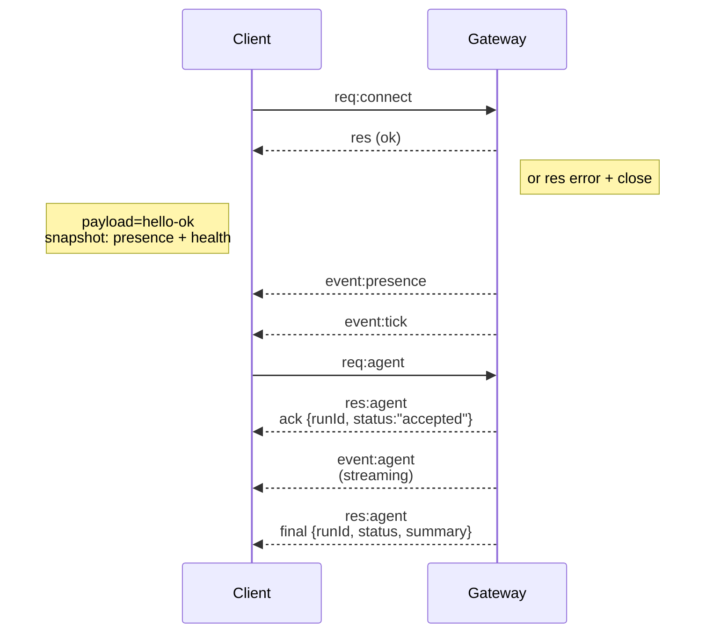

---
read_when:
    - العمل على بروتوكول Gateway أو العملاء أو وسائل النقل
summary: بنية Gateway المعتمدة على WebSocket، ومكوّناتها، وتدفقات العملاء
title: بنية Gateway
x-i18n:
    generated_at: "2026-04-24T07:36:50Z"
    model: gpt-5.4
    provider: openai
    source_hash: 91c553489da18b6ad83fc860014f5bfb758334e9789cb7893d4d00f81c650f02
    source_path: concepts/architecture.md
    workflow: 15
---

## نظرة عامة

- يمتلك **Gateway** واحد طويل العمر جميع أسطح المراسلة (WhatsApp عبر
  Baileys، وTelegram عبر grammY، وSlack، وDiscord، وSignal، وiMessage، وWebChat).
- تتصل عملاء control-plane ‏(تطبيق macOS، وCLI، وواجهة الويب، وعمليات الأتمتة) بـ
  Gateway عبر **WebSocket** على مضيف الربط المهيأ (الافتراضي
  `127.0.0.1:18789`).
- تتصل **Nodes** ‏(macOS/iOS/Android/headless) أيضًا عبر **WebSocket**، لكنها
  تعلن `role: node` مع حدود/أوامر صريحة.
- يوجد Gateway واحد لكل مضيف؛ وهو المكان الوحيد الذي يفتح جلسة WhatsApp.
- يتم تقديم **مضيف canvas** بواسطة خادم HTTP الخاص بـ Gateway ضمن:
  - `/__openclaw__/canvas/` ‏(HTML/CSS/JS قابل للتحرير بواسطة الوكيل)
  - `/__openclaw__/a2ui/` ‏(مضيف A2UI)
    وهو يستخدم المنفذ نفسه الخاص بـ Gateway (الافتراضي `18789`).

## المكوّنات والتدفقات

### Gateway (خدمة خلفية)

- يحتفظ باتصالات المزوّدين.
- يكشف واجهة WS برمجية typed ‏(طلبات، وردود، وأحداث يدفعها الخادم).
- يتحقق من صحة الإطارات الواردة مقابل JSON Schema.
- يطلق أحداثًا مثل `agent` و`chat` و`presence` و`health` و`heartbeat` و`cron`.

### العملاء (تطبيق mac / CLI / إدارة الويب)

- اتصال WS واحد لكل عميل.
- يرسلون طلبات (`health` و`status` و`send` و`agent` و`system-presence`).
- يشتركون في الأحداث (`tick` و`agent` و`presence` و`shutdown`).

### Nodes ‏(macOS / iOS / Android / headless)

- تتصل بـ **خادم WS نفسه** مع `role: node`.
- توفّر هوية جهاز في `connect`؛ ويكون الاقتران **قائمًا على الجهاز** (الدور `node`) وتوجد
  الموافقة في مخزن اقتران الأجهزة.
- تكشف أوامر مثل `canvas.*` و`camera.*` و`screen.record` و`location.get`.

تفاصيل البروتوكول:

- [بروتوكول Gateway](/ar/gateway/protocol)

### WebChat

- واجهة ثابتة تستخدم واجهة WS البرمجية الخاصة بـ Gateway لسجل الدردشة وعمليات الإرسال.
- في الإعدادات البعيدة، تتصل عبر نفق SSH/Tailscale نفسه المستخدم من قبل
  العملاء الآخرين.

## دورة حياة الاتصال (عميل واحد)



## بروتوكول السلك (ملخص)

- النقل: WebSocket، وإطارات نصية بحمولات JSON.
- **يجب** أن يكون أول إطار هو `connect`.
- بعد المصافحة:
  - الطلبات: `{type:"req", id, method, params}` ← `{type:"res", id, ok, payload|error}`
  - الأحداث: `{type:"event", event, payload, seq?, stateVersion?}`
- `hello-ok.features.methods` / `events` هي بيانات وصفية للاكتشاف، وليست
  تفريغًا مولدًا لكل مسار helper قابل للاستدعاء.
- تستخدم المصادقة بالسر المشترك `connect.params.auth.token` أو
  `connect.params.auth.password`، بحسب وضع مصادقة gateway المهيأ.
- تستوفي الأوضاع الحاملة للهوية مثل Tailscale Serve
  (`gateway.auth.allowTailscale: true`) أو
  `gateway.auth.mode: "trusted-proxy"` غير loopback المصادقة من ترويسات الطلب
  بدلًا من `connect.params.auth.*`.
- يقوم `gateway.auth.mode: "none"` الخاص بالدخول الخاص
  بتعطيل المصادقة بالسر المشترك بالكامل؛ أبقِ هذا الوضع معطلًا على نقاط الدخول العامة/غير الموثوقة.
- مفاتيح idempotency مطلوبة للطرق ذات الآثار الجانبية (`send` و`agent`) من أجل
  إعادة المحاولة بأمان؛ ويحتفظ الخادم بذاكرة dedupe مؤقتة قصيرة العمر.
- يجب أن تتضمن Nodes القيمة `role: "node"` بالإضافة إلى caps/commands/permissions في `connect`.

## الاقتران + الثقة المحلية

- تتضمن جميع عملاء WS ‏(المشغّلين + Nodes) **هوية جهاز** في `connect`.
- تتطلب معرّفات الأجهزة الجديدة موافقة على الاقتران؛ ويصدر Gateway **رمز جهاز**
  للاتصالات اللاحقة.
- يمكن الموافقة تلقائيًا على اتصالات loopback المحلية المباشرة للحفاظ على سلاسة تجربة الاستخدام على المضيف نفسه.
- يمتلك OpenClaw أيضًا مسار self-connect ضيقًا محليًا للواجهة الخلفية/الحاوية من أجل تدفقات helper الموثوقة ذات السر المشترك.
- لا تزال اتصالات tailnet وLAN، بما في ذلك ارتباطات tailnet على المضيف نفسه، تتطلب موافقة اقتران صريحة.
- يجب على جميع الاتصالات توقيع nonce الخاص بـ `connect.challenge`.
- تقوم حمولة التوقيع `v3` أيضًا بربط `platform` + `deviceFamily`؛ ويثبّت gateway
  البيانات الوصفية المقترنة عند إعادة الاتصال ويتطلب repair pairing عند تغيّر البيانات الوصفية.
- لا تزال الاتصالات **غير المحلية** تتطلب موافقة صريحة.
- لا تزال مصادقة Gateway ‏(`gateway.auth.*`) تُطبَّق على **جميع** الاتصالات، المحلية أو
  البعيدة.

التفاصيل: [بروتوكول Gateway](/ar/gateway/protocol)، و[الاقتران](/ar/channels/pairing)،
و[الأمان](/ar/gateway/security).

## الكتابة الصارمة للبروتوكول وتوليد الكود

- تحدد مخططات TypeBox البروتوكول.
- يتم توليد JSON Schema من هذه المخططات.
- يتم توليد نماذج Swift من JSON Schema.

## الوصول البعيد

- المفضل: Tailscale أو VPN.
- بديل: نفق SSH

  ```bash
  ssh -N -L 18789:127.0.0.1:18789 user@host
  ```

- تنطبق المصافحة نفسها + رمز المصادقة عبر النفق.
- يمكن تمكين TLS + التثبيت الاختياري لـ WS في الإعدادات البعيدة.

## لمحة تشغيلية

- البدء: `openclaw gateway` ‏(في المقدمة، مع تسجيلات إلى stdout).
- السلامة: `health` عبر WS ‏(وهي مضمّنة أيضًا في `hello-ok`).
- الإشراف: launchd/systemd لإعادة التشغيل التلقائي.

## الثوابت

- يتحكم Gateway واحد بالضبط في جلسة Baileys واحدة لكل مضيف.
- المصافحة إلزامية؛ وأي إطار أول غير JSON أو غير `connect` يؤدي إلى إغلاق صارم.
- لا تُعاد الأحداث؛ ويجب على العملاء إجراء تحديث عند وجود فجوات.

## ذو صلة

- [حلقة الوكيل](/ar/concepts/agent-loop) — دورة تنفيذ الوكيل بالتفصيل
- [بروتوكول Gateway](/ar/gateway/protocol) — عقد بروتوكول WebSocket
- [الطابور](/ar/concepts/queue) — طابور الأوامر والتزامن
- [الأمان](/ar/gateway/security) — نموذج الثقة والتقوية
