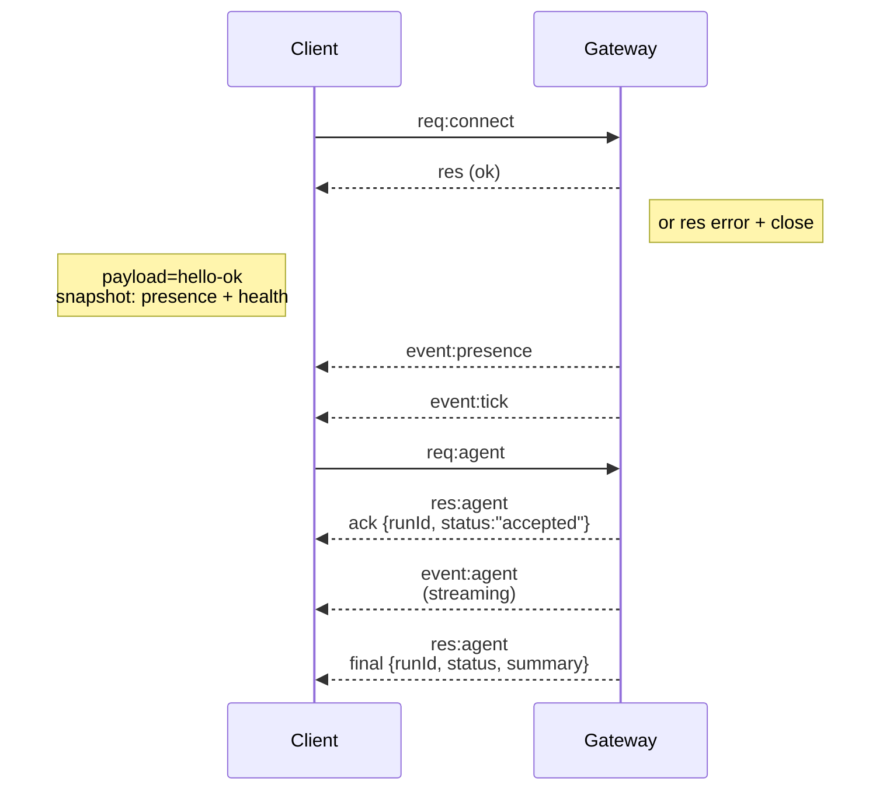

---
read_when:
    - العمل على بروتوكول Gateway أو العملاء أو وسائل النقل
summary: بنية Gateway WebSocket ومكوّناته وتدفقات العملاء
title: معمارية Gateway
x-i18n:
    generated_at: "2026-05-06T07:47:04Z"
    model: gpt-5.5
    provider: openai
    source_hash: 433489081bfe07691b211f5076ec45ce0ed3fd043eb86128f73121f2cab71cd3
    source_path: concepts/architecture.md
    workflow: 16
---

## نظرة عامة

- يمتلك **Gateway** واحد طويل العمر كل أسطح المراسلة (WhatsApp عبر
  Baileys، Telegram عبر grammY، Slack، Discord، Signal، iMessage، WebChat).
- يتصل عملاء مستوى التحكم (تطبيق macOS، وCLI، وواجهة الويب، والأتمتات) بـ
  Gateway عبر **WebSocket** على مضيف الربط المُكوَّن (الافتراضي
  `127.0.0.1:18789`).
- تتصل **العُقد** (macOS/iOS/Android/بدون واجهة) أيضًا عبر **WebSocket**، لكنها
  تعلن `role: node` مع قدرات/أوامر صريحة.
- Gateway واحد لكل مضيف؛ وهو المكان الوحيد الذي يفتح جلسة WhatsApp.
- يقدَّم **مضيف اللوحة** بواسطة خادم HTTP الخاص بـ Gateway تحت:
  - `/__openclaw__/canvas/` (HTML/CSS/JS قابلة لتحرير الوكيل)
  - `/__openclaw__/a2ui/` (مضيف A2UI)
    يستخدم المنفذ نفسه الذي يستخدمه Gateway (الافتراضي `18789`).

## المكوّنات والتدفقات

### Gateway (خفي)

- يحافظ على اتصالات المزوّدين.
- يعرّض واجهة WS API ذات أنواع محددة (طلبات، استجابات، أحداث دفع من الخادم).
- يتحقق من الإطارات الواردة وفق JSON Schema.
- يصدر أحداثًا مثل `agent`، و`chat`، و`presence`، و`health`، و`heartbeat`، و`cron`.

### العملاء (تطبيق Mac / CLI / إدارة الويب)

- اتصال WS واحد لكل عميل.
- يرسلون طلبات (`health`، و`status`، و`send`، و`agent`، و`system-presence`).
- يشتركون في الأحداث (`tick`، و`agent`، و`presence`، و`shutdown`).

### العُقد (macOS / iOS / Android / بدون واجهة)

- تتصل بـ **خادم WS نفسه** مع `role: node`.
- تقدّم هوية جهاز في `connect`؛ الاقتران **معتمد على الجهاز** (الدور `node`) وتوجد
  الموافقة في مخزن اقتران الأجهزة.
- تعرّض أوامر مثل `canvas.*`، و`camera.*`، و`screen.record`، و`location.get`.

تفاصيل البروتوكول:

- [بروتوكول Gateway](/ar/gateway/protocol)

### WebChat

- واجهة مستخدم ثابتة تستخدم Gateway WS API لسجل الدردشة والإرسال.
- في الإعدادات البعيدة، تتصل عبر نفق SSH/Tailscale نفسه مثل العملاء الآخرين.

## دورة حياة الاتصال (عميل واحد)



## بروتوكول السلك (ملخص)

- النقل: WebSocket، إطارات نصية بحمولات JSON.
- يجب أن يكون الإطار الأول **حتماً** `connect`.
- بعد المصافحة:
  - الطلبات: `{type:"req", id, method, params}` → `{type:"res", id, ok, payload|error}`
  - الأحداث: `{type:"event", event, payload, seq?, stateVersion?}`
- `hello-ok.features.methods` / `events` هي بيانات وصفية للاكتشاف، وليست
  تفريغًا مولّدًا لكل مسار مساعد قابل للاستدعاء.
- تستخدم مصادقة السر المشترك `connect.params.auth.token` أو
  `connect.params.auth.password`، حسب وضع مصادقة Gateway المُكوَّن.
- أوضاع حمل الهوية مثل Tailscale Serve
  (`gateway.auth.allowTailscale: true`) أو
  `gateway.auth.mode: "trusted-proxy"` غير المعتمدة على loopback
  تستوفي المصادقة من ترويسات الطلب بدلًا من `connect.params.auth.*`.
- يعطّل `gateway.auth.mode: "none"` للدخول الخاص مصادقة السر المشترك
  بالكامل؛ أبقِ هذا الوضع بعيدًا عن الدخول العام/غير الموثوق.
- مفاتيح عدم التكرار مطلوبة للطرق ذات الآثار الجانبية (`send`، و`agent`) لإعادة
  المحاولة بأمان؛ يحتفظ الخادم بذاكرة تخزين مؤقت قصيرة العمر لإزالة التكرارات.
- يجب أن تتضمن العُقد `role: "node"` إضافة إلى القدرات/الأوامر/الأذونات في `connect`.

## الاقتران + الثقة المحلية

- يضمّن كل عملاء WS (المشغّلون + العُقد) **هوية جهاز** عند `connect`.
- تتطلب معرّفات الأجهزة الجديدة موافقة اقتران؛ يصدر Gateway **رمز جهاز**
  للاتصالات اللاحقة.
- يمكن اعتماد اتصالات local loopback المباشرة تلقائيًا للحفاظ على سلاسة تجربة
  المستخدم على المضيف نفسه.
- لدى OpenClaw أيضًا مسار ضيق للاتصال الذاتي المحلي داخل الخلفية/الحاوية لتدفقات
  المساعد الموثوقة ذات السر المشترك.
- ما تزال اتصالات Tailnet وLAN، بما في ذلك روابط tailnet على المضيف نفسه، تتطلب
  موافقة اقتران صريحة.
- يجب أن توقّع كل الاتصالات nonce الخاص بـ `connect.challenge`.
- تربط حمولة التوقيع `v3` أيضًا `platform` + `deviceFamily`؛ يثبّت Gateway
  البيانات الوصفية المقترنة عند إعادة الاتصال ويتطلب اقتران إصلاح عند تغيّر
  البيانات الوصفية.
- ما تزال الاتصالات **غير المحلية** تتطلب موافقة صريحة.
- ما تزال مصادقة Gateway (`gateway.auth.*`) تنطبق على **كل** الاتصالات، محلية كانت أو
  بعيدة.

التفاصيل: [بروتوكول Gateway](/ar/gateway/protocol)، [الاقتران](/ar/channels/pairing)،
[الأمان](/ar/gateway/security).

## كتابة أنواع البروتوكول وتوليد الشيفرة

- تعرّف مخططات TypeBox البروتوكول.
- يُولَّد JSON Schema من تلك المخططات.
- تُولَّد نماذج Swift من JSON Schema.

## الوصول البعيد

- المفضّل: Tailscale أو VPN.
- البديل: نفق SSH

  ```bash
  ssh -N -L 18789:127.0.0.1:18789 user@host
  ```

- تنطبق المصافحة نفسها + رمز المصادقة نفسه عبر النفق.
- يمكن تمكين TLS + التثبيت الاختياري لـ WS في الإعدادات البعيدة.

## لقطة العمليات

- البدء: `openclaw gateway` (في المقدمة، تسجّل السجلات إلى stdout).
- الصحة: `health` عبر WS (مضمّنة أيضًا في `hello-ok`).
- الإشراف: launchd/systemd لإعادة التشغيل التلقائي.

## الثوابت

- يتحكم Gateway واحد بالضبط في جلسة Baileys واحدة لكل مضيف.
- المصافحة إلزامية؛ أي إطار أول غير JSON أو غير connect يؤدي إلى إغلاق صارم.
- لا تُعاد الأحداث؛ يجب على العملاء التحديث عند وجود فجوات.

## ذو صلة

- [حلقة الوكيل](/ar/concepts/agent-loop) — دورة تنفيذ الوكيل بالتفصيل
- [بروتوكول Gateway](/ar/gateway/protocol) — عقد بروتوكول WebSocket
- [قائمة الانتظار](/ar/concepts/queue) — قائمة انتظار الأوامر والتزامن
- [الأمان](/ar/gateway/security) — نموذج الثقة والتحصين
