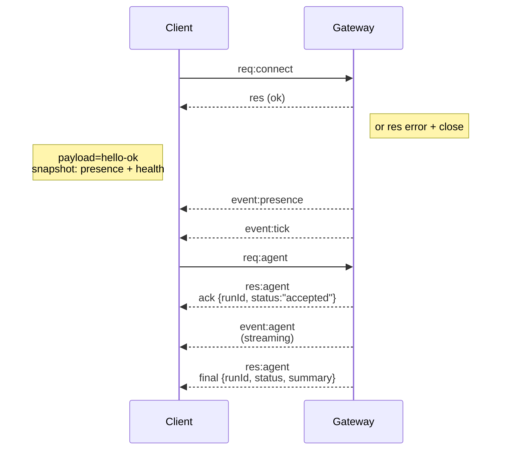

---
read_when:
    - العمل على بروتوكول Gateway أو العملاء أو وسائل النقل
summary: بنية Gateway المستندة إلى WebSocket ومكوّناتها وتدفّقات العملاء
title: بنية Gateway
x-i18n:
    generated_at: "2026-07-12T05:45:43Z"
    model: gpt-5.6
    postprocess_version: locale-links-v1
    provider: openai
    source_hash: f8054bd87f738b957c24f8d6965d55365de2293d44902530a9ba778afa597cc7
    source_path: concepts/architecture.md
    workflow: 16
---

## نظرة عامة

- تدير **Gateway** واحدة طويلة العمر جميع واجهات المراسلة (WhatsApp عبر
  Baileys، وTelegram عبر grammY، وSlack، وDiscord، وSignal، وiMessage، وWebChat).
- تتصل عملاء مستوى التحكم (تطبيق macOS، وCLI، وواجهة الويب، وعمليات الأتمتة)
  بـ Gateway عبر **WebSocket** على مضيف الربط المُهيأ (الافتراضي
  `127.0.0.1:18789`).
- تتصل **Nodes** (macOS/iOS/Android/من دون واجهة رسومية) أيضًا عبر **WebSocket**،
  لكنها تعلن `role: node` مع الإمكانات/الأوامر صراحةً.
- Gateway واحدة لكل مضيف؛ وهي الجهة الوحيدة التي تفتح جلسة WhatsApp.
- يقدّم خادم HTTP الخاص بـ Gateway **مضيف اللوحة** ضمن:
  - `/__openclaw__/canvas/` (HTML/CSS/JS قابل للتحرير بواسطة الوكيل)
  - `/__openclaw__/a2ui/` (مضيف A2UI)

  ويستخدم المنفذ نفسه الذي تستخدمه Gateway (الافتراضي `18789`).

## المكوّنات والتدفقات

### Gateway (خدمة خفية)

- تحافظ على اتصالات المزوّدين.
- توفّر واجهة برمجة WS محددة الأنواع (طلبات، واستجابات، وأحداث يدفعها الخادم).
- تتحقق من صحة الإطارات الواردة وفق JSON Schema.
- تصدر أحداثًا مثل `agent`، و`chat`، و`presence`، و`health`، و`heartbeat`، و`cron`.

### العملاء (تطبيق Mac / CLI / إدارة الويب)

- اتصال WS واحد لكل عميل.
- ترسل الطلبات (`health`، و`status`، و`send`، و`agent`، و`system-presence`).
- تشترك في الأحداث (`tick`، و`agent`، و`presence`، و`shutdown`).

### Nodes (macOS / iOS / Android / من دون واجهة رسومية)

- تتصل **بخادم WS نفسه** باستخدام `role: node`.
- توفّر هوية جهاز في `connect`؛ ويعتمد الاقتران **على الجهاز** (الدور `node`)،
  ويُحفظ الاعتماد في مخزن اقتران الأجهزة.
- توفّر أوامر مثل `canvas.*`، و`camera.*`، و`screen.record`، و`location.get`.

تفاصيل البروتوكول: [بروتوكول Gateway](/ar/gateway/protocol)

### WebChat

- واجهة مستخدم ثابتة تستخدم واجهة WS الخاصة بـ Gateway لسجل المحادثة والإرسال.
- في الإعدادات البعيدة، تتصل عبر نفق SSH/Tailscale نفسه الذي تستخدمه بقية
  العملاء.

## دورة حياة الاتصال (عميل واحد)



## بروتوكول الاتصال السلكي (ملخص)

- النقل: WebSocket، بإطارات نصية تتضمن حمولات JSON.
- **يجب** أن يكون الإطار الأول `connect`.
- بعد المصافحة:
  - الطلبات: `{type:"req", id, method, params}` → `{type:"res", id, ok, payload|error}`
  - الأحداث: `{type:"event", event, payload, seq?, stateVersion?}`
- تمثّل `hello-ok.features.methods` / `events` بيانات وصفية للاستكشاف، وليست
  تفريغًا مولّدًا لكل مسار مساعد قابل للاستدعاء.
- تستخدم مصادقة السر المشترك `connect.params.auth.token` أو
  `connect.params.auth.password`، وفق وضع مصادقة Gateway المُهيأ.
- تستوفي الأوضاع الحاملة للهوية، مثل Tailscale Serve
  (`gateway.auth.allowTailscale: true`) أو
  `gateway.auth.mode: "trusted-proxy"` خارج local loopback، المصادقة من ترويسات
  الطلب بدلًا من `connect.params.auth.*`.
- يعطّل `gateway.auth.mode: "none"` للدخول الخاص مصادقة السر المشترك
  بالكامل؛ لا تستخدم هذا الوضع مع دخول عام/غير موثوق.
- مفاتيح عدم التكرار مطلوبة للطرق ذات الآثار الجانبية (`send`، و`agent`) لإعادة
  المحاولة بأمان؛ ويحتفظ الخادم بذاكرة تخزين مؤقت قصيرة العمر لإزالة التكرار.
- يجب أن تتضمن Nodes القيمة `role: "node"` إلى جانب الإمكانات/الأوامر/الأذونات
  في `connect`.

## الاقتران والثقة المحلية

- تتضمن جميع عملاء WS (المشغّلون + Nodes) **هوية جهاز** في `connect`.
- تتطلب معرّفات الأجهزة الجديدة اعتماد الاقتران؛ وتصدر Gateway **رمز جهاز**
  للاتصالات اللاحقة.
- يمكن اعتماد اتصالات local loopback المحلية المباشرة تلقائيًا للحفاظ على
  سلاسة تجربة المستخدم على المضيف نفسه.
- يتضمن OpenClaw أيضًا مسار اتصال ذاتي ضيقًا ومحليًا في الخلفية/الحاوية لتدفقات
  المساعد الموثوقة التي تستخدم سرًا مشتركًا.
- تظل اتصالات Tailnet وLAN، بما فيها عمليات ربط Tailnet على المضيف نفسه،
  بحاجة إلى اعتماد اقتران صريح.
- يجب أن توقّع جميع الاتصالات قيمة nonce في `connect.challenge`. كما تربط حمولة
  التوقيع `v3` كلًا من `platform` و`deviceFamily`؛ وتثبّت Gateway البيانات
  الوصفية المقترنة عند إعادة الاتصال، وتتطلب إصلاح الاقتران عند تغييرها.
- لا تزال الاتصالات **غير المحلية** تتطلب اعتمادًا صريحًا.
- تظل مصادقة Gateway ‏(`gateway.auth.*`) مطبّقة على **جميع** الاتصالات، سواء
  كانت محلية أم بعيدة.

التفاصيل: [بروتوكول Gateway](/ar/gateway/protocol)، و[الاقتران](/ar/channels/pairing)،
و[الأمان](/ar/gateway/security).

## تحديد أنواع البروتوكول وتوليد الشيفرة

- تحدد مخططات TypeBox البروتوكول.
- يُولَّد JSON Schema من تلك المخططات.
- تُولَّد نماذج Swift من JSON Schema.

## الوصول البعيد

- المفضّل: Tailscale أو VPN.
- البديل: نفق SSH

  ```bash
  ssh -N -L 18789:127.0.0.1:18789 user@gateway-host
  ```

- تُطبَّق المصافحة ورمز المصادقة نفسيهما عبر النفق.
- يمكن تفعيل TLS مع التثبيت الاختياري لاتصالات WS في الإعدادات البعيدة.

## لمحة عن العمليات

- البدء: `openclaw gateway` (في الواجهة الأمامية، مع إرسال السجلات إلى stdout).
- السلامة: `health` عبر WS (ومضمّنة أيضًا في `hello-ok`).
- الإشراف: launchd/systemd لإعادة التشغيل تلقائيًا.

## الثوابت

- تتحكم Gateway واحدة فقط في جلسة Baileys واحدة لكل مضيف.
- المصافحة إلزامية؛ ويؤدي أي إطار أول غير صالح بصيغة JSON أو ليس `connect` إلى
  إغلاق فوري.
- لا تُعاد الأحداث؛ ويجب على العملاء التحديث عند وجود فجوات.

## ذو صلة

- [حلقة الوكيل](/ar/concepts/agent-loop) — دورة تنفيذ الوكيل بالتفصيل
- [بروتوكول Gateway](/ar/gateway/protocol) — عقد بروتوكول WebSocket
- [قائمة الانتظار](/ar/concepts/queue) — قائمة انتظار الأوامر والتزامن
- [الأمان](/ar/gateway/security) — نموذج الثقة والتقوية
