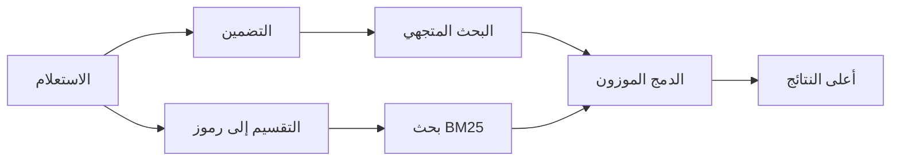

---
read_when:
    - تريد فهم كيفية عمل memory_search
    - تريد اختيار موفّر للتضمينات
    - تريد تحسين جودة البحث
summary: كيف يعثر البحث في الذاكرة على الملاحظات ذات الصلة باستخدام التضمينات والاسترجاع الهجين
title: البحث في الذاكرة
x-i18n:
    generated_at: "2026-07-16T14:09:14Z"
    model: gpt-5.6
    postprocess_version: locale-links-v1
    prompt_version: 32
    provider: openai
    source_hash: 2ae0830843fba28c24159d85425240051fb8caf086cd0563d3091890045dcfad
    source_path: concepts/memory-search.md
    workflow: 16
---

`memory_search` يعثر على الملاحظات ذات الصلة من ملفات ذاكرتك، حتى عندما تختلف
الصياغة عن النص الأصلي. فهو يقسّم الذاكرة إلى أجزاء صغيرة ويبحث
فيها باستخدام التضمينات أو الكلمات المفتاحية أو كليهما.

## البدء السريع

يستخدم OpenClaw تضمينات OpenAI افتراضيًا. لاستخدام موفّر آخر، عيّنه
صراحةً:

```json5
{
  agents: {
    defaults: {
      memorySearch: {
        provider: "openai", // أو "gemini"، "voyage"، "mistral"، "bedrock"، "local"، "ollama"، "lmstudio"، "github-copilot"، "openai-compatible"
      },
    },
  },
}
```

يمكن أن يشير `provider` أيضًا إلى إدخال `models.providers.<id>` مخصّص (على
سبيل المثال `ollama-5080`)، ما دام ذلك الإدخال يعيّن `api` إلى `"ollama"` أو
معرّف موفّر آخر يتضمن محوّل تضمين للذاكرة.

للتضمينات المحلية دون مفتاح API، ثبّت Plugin الرسمي لموفّر llama.cpp
وعيّن `provider: "local"`:

```bash
openclaw plugins install @openclaw/llama-cpp-provider
```

لا تزال نسخ الشيفرة المصدرية تتطلب الموافقة على البناء الأصلي: `pnpm approve-builds`، ثم
`pnpm rebuild node-llama-cpp`.

تتطلب بعض نقاط نهاية التضمين المتوافقة مع OpenAI تسميات `input_type`
غير متماثلة، مثل `"query"` لعمليات البحث و`"document"`/`"passage"` للأجزاء
المفهرسة. عيّنها باستخدام `queryInputType` و`documentInputType`؛ راجع
[مرجع إعدادات الذاكرة](/ar/reference/memory-config#provider-specific-config).

## الموفّرون المدعومون

| الموفّر          | المعرّف                  | يتطلب مفتاح API | ملاحظات                             |
| ----------------- | ------------------- | ------------- | --------------------------------- |
| Bedrock           | `bedrock`           | لا            | يستخدم سلسلة بيانات اعتماد AWS     |
| DeepInfra         | `deepinfra`         | نعم           | النموذج الافتراضي `BAAI/bge-m3`       |
| Gemini            | `gemini`            | نعم           | يدعم فهرسة الصور والصوت     |
| GitHub Copilot    | `github-copilot`    | لا            | يستخدم اشتراكك في Copilot    |
| محلي             | `local`             | لا            | نموذج GGUF، تنزيل تلقائي بحجم نحو 0.6 GB |
| LM Studio         | `lmstudio`          | لا            | خادم محلي/ذاتي الاستضافة          |
| Mistral           | `mistral`           | نعم           |                                   |
| Ollama            | `ollama`            | لا            | خادم محلي/ذاتي الاستضافة          |
| OpenAI            | `openai`            | نعم           | الافتراضي                           |
| متوافق مع OpenAI | `openai-compatible` | عادةً       | نقطة نهاية `/v1/embeddings` عامة |
| Voyage            | `voyage`            | نعم           |                                   |

## آلية عمل البحث

يشغّل OpenClaw مساري استرجاع بالتوازي ويدمج النتائج:



- **البحث المتجهي** يطابق المعاني المتشابهة ("مضيف Gateway" يطابق "الجهاز
  الذي يشغّل OpenClaw").
- **بحث الكلمات المفتاحية باستخدام BM25** يطابق المصطلحات الدقيقة (المعرّفات وسلاسل الأخطاء ومفاتيح
  الإعداد).
- **البحث بأسماء الملفات** يفهرس المسارات بصورة منفصلة عن محتوى الملاحظات. تتقدم المسارات الكاملة
  المطابقة تمامًا وأسماء الملفات وأصول أسمائها في الترتيب على مطابقات المسار الجزئية،
  بينما تظل درجات المقتطفات والكلمات المفتاحية في المحتوى مستمدة من محتوى الملاحظات.

إذا توفر مسار واحد فقط، فسيعمل بمفرده.

**وضع FTS فقط.** عيّن `provider: "none"` لتعطيل التضمينات عمدًا
والبحث باستخدام الكلمات المفتاحية فقط. كما أن ترك `provider` دون تعيين أو تعيينه إلى `"auto"`
يؤدي إلى الرجوع إلى الترتيب باستخدام الكلمات المفتاحية فقط إذا لم تُضبط مصادقة التضمين،
من دون إظهار خطأ، وكذلك يفعل `provider: "local"` (موفّر GGUF/llama.cpp)
عند فشله.

**الموفّر المحدد صراحةً غير متاح.** إذا سميت أي موفّر آخر صراحةً
(على سبيل المثال `openai` أو `ollama` أو `gemini`) وأصبح غير متاح
وقت الطلب (مصادقة غير صالحة أو فشل في الشبكة)، فإن `memory_search` يبلغ بأن الذاكرة
غير متاحة بدلًا من التحول بصمت إلى نتائج FTS فقط. يحافظ ذلك على وضوح
تعطل الموفّر المضبوط. عيّن `provider: "none"` للاسترجاع المتعمد
باستخدام FTS فقط، أو أصلح إعدادات الموفّر/المصادقة لاستعادة الترتيب
الدلالي.

## تحسين جودة البحث

تساعد ميزتان اختياريتان عند وجود سجل كبير من الملاحظات.

### الاضمحلال الزمني

تفقد الملاحظات القديمة وزنها في الترتيب تدريجيًا، بحيث تظهر المعلومات الحديثة أولًا.
مع عمر النصف الافتراضي البالغ 30 يومًا، تحصل ملاحظة من الشهر الماضي على 50% من
وزنها الأصلي. يُعد `MEMORY.md` والملفات الأخرى غير المؤرخة ضمن `memory/`
دائمة الصلة ولا تضمحل أبدًا؛ ولا تضمحل إلا ملفات `memory/YYYY-MM-DD.md` المؤرخة.

<Tip>
فعّل هذا إذا كان لدى وكيلك ملاحظات يومية تمتد لأشهر، وكانت المعلومات القديمة
تواصل التفوق في الترتيب على السياق الحديث.
</Tip>

### MMR (التنوع)

يقلل النتائج المتكررة. إذا كانت خمس ملاحظات تشير جميعها إلى إعداد الموجّه نفسه،
يضمن MMR أن تغطي أعلى النتائج موضوعات مختلفة بدلًا من التكرار.

<Tip>
فعّل هذا إذا كان `memory_search` يواصل إرجاع مقتطفات شبه متطابقة من
ملاحظات يومية مختلفة.
</Tip>

### تفعيلهما معًا

```json5
{
  agents: {
    defaults: {
      memorySearch: {
        query: {
          hybrid: {
            mmr: { enabled: true },
            temporalDecay: { enabled: true },
          },
        },
      },
    },
  },
}
```

## الذاكرة متعددة الوسائط

باستخدام `gemini-embedding-2-preview`، يمكنك فهرسة الصور والصوت إلى جانب
Markdown. ينطبق هذا فقط على الملفات ضمن `memorySearch.extraPaths`؛ وتظل
جذور الذاكرة الافتراضية (`MEMORY.md` و`memory/*.md`) مقتصرة على Markdown. تظل استعلامات البحث
نصية، لكنها تطابق المحتوى المرئي والصوتي. راجع
[مرجع إعدادات الذاكرة](/ar/reference/memory-config#multimodal-memory-gemini)
للاطلاع على خطوات الإعداد.

## البحث في ذاكرة الجلسة

للاسترجاع الدقيق للنص الكامل من نصوص الجلسات، استخدم [`sessions_search`](/concepts/session-search)
ثم افتح نتيجة باستخدام `sessions_history`. يظل البحث في ذاكرة الجلسة المكمّل الدلالي
والتجريبي.

يمكن اختياريًا فهرسة نصوص الجلسات بحيث يستطيع `memory_search` استرجاع
المحادثات السابقة. هذه ميزة اختيارية: عيّن `experimental.sessionMemory: true` وأضف
`"sessions"` إلى `sources` (القيمة الافتراضية لـ `sources` هي `["memory"]`).

تخضع نتائج الجلسات لـ `tools.sessions.visibility`: لا تكشف القيمة الافتراضية `"tree"`
إلا الجلسة الحالية والجلسات التي أنشأتها. لاسترجاع جلسة غير مرتبطة
للوكيل نفسه من جلسة مختلفة (مثل جلسة أرسلها Gateway
من رسالة مباشرة)، وسّع مستوى الرؤية إلى `"agent"`.

عند استخدام الواجهة الخلفية QMD، عيّن أيضًا `memory.qmd.sessions.enabled: true` حتى
تُصدّر النصوص إلى مجموعة QMD؛ لا يؤدي `experimental.sessionMemory`
و`sources` وحدهما إلى تصدير النصوص إلى QMD. راجع
[مرجع الإعدادات](/ar/reference/memory-config#session-memory-search-experimental).

## استكشاف الأخطاء وإصلاحها

**لا توجد نتائج؟** شغّل `openclaw memory status` للتحقق من الفهرس. إذا كان فارغًا، فشغّل
`openclaw memory index --force`.

**تظهر مطابقات الكلمات المفتاحية فقط؟** قد لا يكون موفّر التضمين مضبوطًا. تحقق من
`openclaw memory status --deep`.

**تنتهي مهلة التضمينات المحلية؟** تستخدم `ollama` و`lmstudio` و`local` مهلة
أطول للدفعات المضمّنة افتراضيًا. إذا كان المضيف بطيئًا فحسب، فعيّن
`agents.defaults.memorySearch.sync.embeddingBatchTimeoutSeconds` وأعد تشغيل
`openclaw memory index --force`.

**تعذّر العثور على نص CJK؟** أعد بناء فهرس FTS باستخدام
`openclaw memory index --force`.

## ذو صلة

- [نظرة عامة على الذاكرة](/ar/concepts/memory)
- [Active Memory](/ar/concepts/active-memory)
- [محرك الذاكرة المدمج](/ar/concepts/memory-builtin)
- [مرجع إعدادات الذاكرة](/ar/reference/memory-config)
