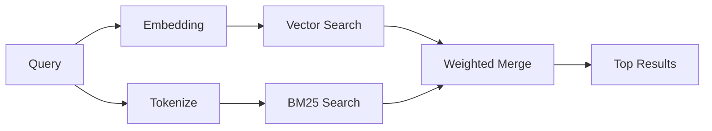

---
read_when:
    - تريد فهم كيفية عمل memory_search
    - تريد اختيار مزوّد تضمينات
    - تريد ضبط جودة البحث
summary: كيف يعثر بحث الذاكرة على الملاحظات ذات الصلة باستخدام التضمينات والاسترجاع الهجين
title: البحث في الذاكرة
x-i18n:
    generated_at: "2026-06-28T22:33:43Z"
    model: gpt-5.5
    postprocess_version: locale-links-v1
    provider: openai
    source_hash: 32ffb9d996851566eb92b7812c5425f545ecbb5387a0a445686df35a6c8ae143
    source_path: concepts/memory-search.md
    workflow: 16
---

يعثر `memory_search` على الملاحظات ذات الصلة من ملفات الذاكرة لديك، حتى عندما
تختلف الصياغة عن النص الأصلي. يعمل ذلك عبر فهرسة الذاكرة في مقاطع صغيرة
والبحث فيها باستخدام التضمينات، أو الكلمات المفتاحية، أو كليهما.

## البدء السريع

يستخدم بحث الذاكرة تضمينات OpenAI افتراضيًا. لاستخدام خلفية تضمينات أخرى،
عيّن مزودًا صراحةً:

```json5
{
  agents: {
    defaults: {
      memorySearch: {
        provider: "openai", // or "gemini", "local", "ollama", "openai-compatible", etc.
      },
    },
  },
}
```

في إعدادات نقاط النهاية المتعددة التي تتضمن مزودين مخصصين للذاكرة، يمكن أن يكون
`provider` أيضًا إدخالًا مخصصًا من `models.providers.<id>`، مثل `ollama-5080`،
عندما يعيّن ذلك المزود `api: "ollama"` أو مالكًا آخر لمحول تضمينات الذاكرة.

للتضمينات المحلية من دون مفتاح API، ثبّت
`@openclaw/llama-cpp-provider` وعيّن `provider: "local"`. قد تظل نسخ المصدر
تتطلب موافقة بناء أصلية: `pnpm approve-builds` ثم
`pnpm rebuild node-llama-cpp`.

تتطلب بعض نقاط نهاية التضمينات المتوافقة مع OpenAI تسميات غير متماثلة مثل
`input_type: "query"` لعمليات البحث و`input_type: "document"` أو `"passage"`
للمقاطع المفهرسة. اضبط ذلك باستخدام `memorySearch.queryInputType` و
`memorySearch.documentInputType`؛ راجع [مرجع إعدادات الذاكرة](/ar/reference/memory-config#provider-specific-config).

## المزودون المدعومون

| المزود            | المعرّف             | يحتاج إلى مفتاح API | ملاحظات                      |
| ----------------- | ------------------- | ------------------- | ---------------------------- |
| Bedrock           | `bedrock`           | لا                  | يستخدم سلسلة اعتماد AWS     |
| DeepInfra         | `deepinfra`         | نعم                 | الافتراضي: `BAAI/bge-m3`     |
| Gemini            | `gemini`            | نعم                 | يدعم فهرسة الصور/الصوت       |
| GitHub Copilot    | `github-copilot`    | لا                  | يستخدم اشتراك Copilot        |
| Local             | `local`             | لا                  | نموذج GGUF، تنزيل ~0.6 GB    |
| Mistral           | `mistral`           | نعم                 |                              |
| Ollama            | `ollama`            | لا                  | محلي/مستضاف ذاتيًا           |
| OpenAI            | `openai`            | نعم                 | الافتراضي                    |
| OpenAI-compatible | `openai-compatible` | عادةً               | عام `/v1/embeddings`         |
| Voyage            | `voyage`            | نعم                 |                              |

## آلية عمل البحث

يشغّل OpenClaw مساري استرجاع بالتوازي ويدمج النتائج:



- **البحث المتجهي** يعثر على الملاحظات ذات المعنى المشابه ("مضيف Gateway" يطابق
  "الجهاز الذي يشغّل OpenClaw").
- **بحث الكلمات المفتاحية BM25** يعثر على التطابقات الدقيقة (المعرّفات، سلاسل
  الأخطاء، مفاتيح الإعداد).

إذا كان مسار واحد فقط متاحًا، يعمل المسار الآخر وحده. لا يزال وضع FTS المقصود فقط
(`provider: "none"`) والاختيار التلقائي/الافتراضي للمزود قادرين على استخدام
الترتيب المعجمي عندما لا تتوفر التضمينات.

يختلف مزودو التضمينات غير المحليين الصريحون. إذا عيّنت
`memorySearch.provider` إلى مزود محدد مدعوم عن بُعد وكان ذلك المزود غير متاح
وقت التشغيل، يبلّغ `memory_search` أن الذاكرة غير متاحة بدلًا من استخدام نتائج
FTS فقط بصمت. هذا يجعل مزود الدلالات المعطّل والمهيأ ظاهرًا. عيّن
`provider: "none"` للاستدعاء المتعمد عبر FTS فقط، أو أصلح إعدادات المزود/المصادقة
لاستعادة الترتيب الدلالي.

## تحسين جودة البحث

تساعد ميزتان اختياريتان عندما يكون لديك سجل ملاحظات كبير:

### التناقص الزمني

تفقد الملاحظات القديمة وزن الترتيب تدريجيًا بحيث تظهر المعلومات الحديثة أولًا.
مع نصف العمر الافتراضي البالغ 30 يومًا، تحصل ملاحظة من الشهر الماضي على 50% من
وزنها الأصلي. لا تتناقص الملفات الدائمة مثل `MEMORY.md` أبدًا.

<Tip>
فعّل التناقص الزمني إذا كان لدى وكيلك أشهر من الملاحظات اليومية وكانت
المعلومات القديمة تتفوق باستمرار على السياق الحديث.
</Tip>

### MMR (التنوع)

يقلل النتائج المتكررة. إذا ذكرت خمس ملاحظات إعداد الموجه نفسه، يضمن MMR أن تغطي
النتائج الأعلى موضوعات مختلفة بدلًا من التكرار.

<Tip>
فعّل MMR إذا كان `memory_search` يعيد باستمرار مقتطفات شبه مكررة من ملاحظات
يومية مختلفة.
</Tip>

### تفعيل كليهما

```json5
{
  agents: {
    defaults: {
      memorySearch: {
        query: {
          hybrid: {
            mmr: { enabled: true },
            temporalDecay: { enabled: true },
          },
        },
      },
    },
  },
}
```

## الذاكرة متعددة الوسائط

مع Gemini Embedding 2، يمكنك فهرسة الصور وملفات الصوت إلى جانب Markdown. تظل
استعلامات البحث نصية، لكنها تطابق المحتوى المرئي والصوتي. راجع
[مرجع إعدادات الذاكرة](/ar/reference/memory-config) للإعداد.

## بحث ذاكرة الجلسة

يمكنك اختياريًا فهرسة نصوص الجلسات بحيث يستطيع `memory_search` استدعاء
المحادثات السابقة. هذا خيار اشتراك عبر
`memorySearch.experimental.sessionMemory` و`sources: ["sessions"]`؛ قائمة
المصادر الافتراضية مخصصة للذاكرة فقط. يفعّل العلم التجريبي فهرسة نصوص الجلسات،
بينما تتحكم `sources` فيما إذا كانت مقاطع الجلسات ستُبحث.

تلتزم نتائج الجلسات بـ `tools.sessions.visibility`: الإعداد الافتراضي `tree`
يعرض الجلسة الحالية والجلسات التي أنشأتها فقط. لاستدعاء جلسة غير مرتبطة للوكيل
نفسه أرسلها Gateway من جلسة رسالة مباشرة منفصلة، وسّع الرؤية عمدًا إلى `agent`.

عند استخدام QMD، عيّن أيضًا `memory.qmd.sessions.enabled: true` حتى تُصدّر
النصوص إلى مجموعة QMD. راجع
[مرجع الإعدادات](/ar/reference/memory-config) للتفاصيل.

## استكشاف الأخطاء وإصلاحها

**لا توجد نتائج؟** شغّل `openclaw memory status` للتحقق من الفهرس. إذا كان
فارغًا، شغّل `openclaw memory index --force`.

**تطابقات كلمات مفتاحية فقط؟** قد لا يكون مزود التضمينات مهيأً. تحقق من
`openclaw memory status --deep`.

**هل تنتهي مهلة التضمينات المحلية؟** يستخدم `ollama` و`lmstudio` و`local` مهلة
دفعات مضمنة أطول افتراضيًا. إذا كان المضيف بطيئًا ببساطة، عيّن
`agents.defaults.memorySearch.sync.embeddingBatchTimeoutSeconds` ثم أعد تشغيل
`openclaw memory index --force`.

**نص CJK غير موجود؟** أعد بناء فهرس FTS باستخدام
`openclaw memory index --force`.

## قراءات إضافية

- [Active Memory](/ar/concepts/active-memory) -- ذاكرة وكيل فرعي لجلسات الدردشة التفاعلية
- [الذاكرة](/ar/concepts/memory) -- تخطيط الملفات، الخلفيات، الأدوات
- [مرجع إعدادات الذاكرة](/ar/reference/memory-config) -- جميع مفاتيح الإعداد

## ذو صلة

- [نظرة عامة على الذاكرة](/ar/concepts/memory)
- [Active Memory](/ar/concepts/active-memory)
- [محرك الذاكرة المدمج](/ar/concepts/memory-builtin)
