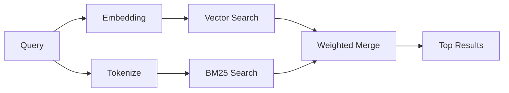

---
read_when:
    - تريد فهم كيفية عمل memory_search
    - تريد اختيار موفّر تضمين
    - تريد ضبط جودة البحث
summary: كيف يعثر بحث الذاكرة على الملاحظات ذات الصلة باستخدام التضمينات والاسترجاع الهجين
title: بحث الذاكرة
x-i18n:
    generated_at: "2026-06-27T17:29:41Z"
    model: gpt-5.5
    postprocess_version: locale-links-v1
    provider: openai
    source_hash: b0bcb8cf400100ba8b6ddbb46bdf8b2a89a8bc32a550ee6df47c874e7e9e0879
    source_path: concepts/memory-search.md
    workflow: 16
---

`memory_search` يعثر على الملاحظات ذات الصلة من ملفات الذاكرة لديك، حتى عندما تختلف الصياغة عن النص الأصلي. يعمل ذلك عبر فهرسة الذاكرة إلى أجزاء صغيرة والبحث فيها باستخدام التضمينات أو الكلمات المفتاحية أو كليهما.

## البداية السريعة

يستخدم بحث الذاكرة تضمينات OpenAI افتراضيًا. لاستخدام واجهة تضمين خلفية أخرى، عيّن مزوّدًا صراحةً:

```json5
{
  agents: {
    defaults: {
      memorySearch: {
        provider: "openai", // or "gemini", "local", "ollama", "openai-compatible", etc.
      },
    },
  },
}
```

بالنسبة إلى إعدادات نقاط النهاية المتعددة التي تحتوي على مزوّدين مخصصين للذاكرة، يمكن أن يكون `provider` أيضًا إدخالًا مخصصًا في `models.providers.<id>`، مثل `ollama-5080`، عندما يعيّن ذلك المزوّد `api: "ollama"` أو مالكًا آخر لمهايئ تضمين الذاكرة.

للتضمينات المحلية من دون مفتاح API، ثبّت `@openclaw/llama-cpp-provider` وعيّن `provider: "local"`. قد تظل نسخ المصدر تتطلب موافقة على البناء الأصلي: `pnpm approve-builds` ثم `pnpm rebuild node-llama-cpp`.

تتطلب بعض نقاط نهاية التضمين المتوافقة مع OpenAI تسميات غير متماثلة مثل `input_type: "query"` لعمليات البحث و`input_type: "document"` أو `"passage"` للأجزاء المفهرسة. اضبط ذلك باستخدام `memorySearch.queryInputType` و`memorySearch.documentInputType`؛ راجع [مرجع تكوين الذاكرة](/ar/reference/memory-config#provider-specific-config).

## المزوّدون المدعومون

| المزوّد           | المعرّف             | يحتاج إلى مفتاح API | ملاحظات                      |
| ----------------- | ------------------- | ------------------- | ---------------------------- |
| Bedrock           | `bedrock`           | لا                  | يستخدم سلسلة اعتماد AWS     |
| DeepInfra         | `deepinfra`         | نعم                 | الافتراضي: `BAAI/bge-m3`     |
| Gemini            | `gemini`            | نعم                 | يدعم فهرسة الصور/الصوت       |
| GitHub Copilot    | `github-copilot`    | لا                  | يستخدم اشتراك Copilot        |
| محلي              | `local`             | لا                  | نموذج GGUF، تنزيل بحجم ~0.6 GB |
| Mistral           | `mistral`           | نعم                 |                              |
| Ollama            | `ollama`            | لا                  | محلي/مستضاف ذاتيًا           |
| OpenAI            | `openai`            | نعم                 | الافتراضي                    |
| متوافق مع OpenAI  | `openai-compatible` | عادةً               | عام لـ `/v1/embeddings`      |
| Voyage            | `voyage`            | نعم                 |                              |

## كيف يعمل البحث

يشغّل OpenClaw مساري استرجاع بالتوازي ويدمج النتائج:



- **بحث المتجهات** يعثر على الملاحظات ذات المعنى المتشابه ("مضيف Gateway" يطابق
  "الجهاز الذي يشغّل OpenClaw").
- **بحث الكلمات المفتاحية BM25** يعثر على التطابقات الدقيقة (المعرّفات، سلاسل الأخطاء، مفاتيح التكوين).

إذا كان مسار واحد فقط متاحًا، يعمل الآخر بمفرده. لا يزال وضع FTS فقط المقصود (`provider: "none"`) والاختيار التلقائي/الافتراضي للمزوّد قادرين على استخدام الترتيب المعجمي عندما لا تتوفر التضمينات.

تختلف مزوّدات التضمين الصريحة غير المحلية. إذا عيّنت `memorySearch.provider` إلى مزوّد محدد مدعوم عن بُعد ولم يكن ذلك المزوّد متاحًا وقت التشغيل، فسيبلغ `memory_search` أن الذاكرة غير متاحة بدلًا من استخدام نتائج FTS فقط بصمت. يبقي هذا مزوّدًا دلاليًا مكوّنًا ومعطّلًا ظاهرًا. عيّن `provider: "none"` للاسترجاع المقصود باستخدام FTS فقط، أو أصلح تكوين المزوّد/المصادقة لاستعادة الترتيب الدلالي.

## تحسين جودة البحث

تساعد ميزتان اختياريتان عندما يكون لديك سجل ملاحظات كبير:

### التضاؤل الزمني

تفقد الملاحظات القديمة وزن الترتيب تدريجيًا حتى تظهر المعلومات الحديثة أولًا. مع نصف العمر الافتراضي البالغ 30 يومًا، تحصل ملاحظة من الشهر الماضي على 50% من وزنها الأصلي. لا تتضاءل الملفات دائمة الصلاحية مثل `MEMORY.md` أبدًا.

<Tip>
فعّل التضاؤل الزمني إذا كان لدى وكيلك أشهر من الملاحظات اليومية وكانت المعلومات القديمة تواصل التفوق على السياق الحديث.
</Tip>

### MMR (التنوع)

يقلل النتائج المتكررة. إذا ذكرت خمس ملاحظات كلها تكوين الموجّه نفسه، يضمن MMR أن تغطي النتائج العليا موضوعات مختلفة بدلًا من التكرار.

<Tip>
فعّل MMR إذا كان `memory_search` يواصل إرجاع مقتطفات شبه مكررة من ملاحظات يومية مختلفة.
</Tip>

### تفعيل كليهما

```json5
{
  agents: {
    defaults: {
      memorySearch: {
        query: {
          hybrid: {
            mmr: { enabled: true },
            temporalDecay: { enabled: true },
          },
        },
      },
    },
  },
}
```

## الذاكرة متعددة الوسائط

مع Gemini Embedding 2، يمكنك فهرسة الصور وملفات الصوت إلى جانب Markdown. تبقى استعلامات البحث نصية، لكنها تطابق المحتوى المرئي والصوتي. راجع [مرجع تكوين الذاكرة](/ar/reference/memory-config) للإعداد.

## بحث ذاكرة الجلسة

يمكنك اختياريًا فهرسة نصوص الجلسات حتى يتمكن `memory_search` من استحضار المحادثات السابقة. هذا اشتراك اختياري عبر `memorySearch.experimental.sessionMemory`. راجع [مرجع التكوين](/ar/reference/memory-config) للتفاصيل.

## استكشاف الأخطاء وإصلاحها

**لا توجد نتائج؟** شغّل `openclaw memory status` للتحقق من الفهرس. إذا كان فارغًا، شغّل
`openclaw memory index --force`.

**تطابقات كلمات مفتاحية فقط؟** قد لا يكون مزوّد التضمين لديك مكوّنًا. تحقق من
`openclaw memory status --deep`.

**هل تنتهي مهلة التضمينات المحلية؟** تستخدم `ollama` و`lmstudio` و`local` مهلة دفعات مضمنة أطول افتراضيًا. إذا كان المضيف بطيئًا فحسب، فعيّن `agents.defaults.memorySearch.sync.embeddingBatchTimeoutSeconds` وأعد تشغيل
`openclaw memory index --force`.

**لم يتم العثور على نص CJK؟** أعد بناء فهرس FTS باستخدام
`openclaw memory index --force`.

## قراءة إضافية

- [Active Memory](/ar/concepts/active-memory) -- ذاكرة الوكيل الفرعي لجلسات الدردشة التفاعلية
- [الذاكرة](/ar/concepts/memory) -- تخطيط الملفات، الواجهات الخلفية، الأدوات
- [مرجع تكوين الذاكرة](/ar/reference/memory-config) -- جميع مقابض التكوين

## ذات صلة

- [نظرة عامة على الذاكرة](/ar/concepts/memory)
- [Active Memory](/ar/concepts/active-memory)
- [محرك الذاكرة المضمّن](/ar/concepts/memory-builtin)
