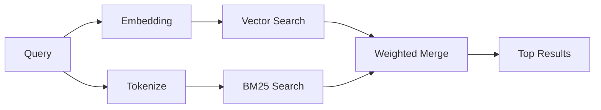

---
read_when:
    - تريد فهم كيفية عمل memory_search
    - تريد اختيار مزوّد تضمين
    - تريد ضبط جودة البحث
summary: كيف يعثر البحث في الذاكرة على الملاحظات ذات الصلة باستخدام التضمينات والاسترجاع الهجين
title: البحث في الذاكرة
x-i18n:
    generated_at: "2026-04-30T07:52:33Z"
    model: gpt-5.5
    provider: openai
    source_hash: 3e6c44d90f49a797bda01b9a575928c128a334f89ae14fc3620e65562a866aa9
    source_path: concepts/memory-search.md
    workflow: 16
---

`memory_search` يعثر على الملاحظات ذات الصلة من ملفات الذاكرة لديك، حتى عندما تختلف
الصياغة عن النص الأصلي. يعمل عبر فهرسة الذاكرة إلى مقاطع صغيرة
والبحث فيها باستخدام التضمينات، أو الكلمات المفتاحية، أو كليهما.

## البدء السريع

إذا كان لديك اشتراك GitHub Copilot، أو مفتاح API مضبوط لـ OpenAI أو Gemini أو Voyage أو Mistral،
فإن البحث في الذاكرة يعمل تلقائيًا. لتعيين مزوّد
صراحةً:

```json5
{
  agents: {
    defaults: {
      memorySearch: {
        provider: "openai", // or "gemini", "local", "ollama", etc.
      },
    },
  },
}
```

في الإعدادات متعددة نقاط النهاية، يمكن أن يكون `provider` أيضًا إدخالًا مخصصًا في
`models.providers.<id>`، مثل `ollama-5080`، عندما يعيّن ذلك المزوّد
`api: "ollama"` أو مالك محوّل تضمين آخر.

للتضمينات المحلية من دون مفتاح API، ثبّت حزمة وقت التشغيل الاختيارية `node-llama-cpp`
بجوار OpenClaw واستخدم `provider: "local"`.

تتطلب بعض نقاط نهاية التضمين المتوافقة مع OpenAI تسميات غير متماثلة مثل
`input_type: "query"` لعمليات البحث و`input_type: "document"` أو `"passage"`
للمقاطع المفهرسة. اضبطها باستخدام `memorySearch.queryInputType` و
`memorySearch.documentInputType`؛ راجع [مرجع إعدادات الذاكرة](/ar/reference/memory-config#provider-specific-config).

## المزوّدون المدعومون

| المزوّد        | المعرّف          | يحتاج مفتاح API | ملاحظات                                             |
| -------------- | ---------------- | --------------- | --------------------------------------------------- |
| Bedrock        | `bedrock`        | لا              | يُكتشف تلقائيًا عند حل سلسلة بيانات اعتماد AWS     |
| Gemini         | `gemini`         | نعم             | يدعم فهرسة الصور والصوت                            |
| GitHub Copilot | `github-copilot` | لا              | يُكتشف تلقائيًا، ويستخدم اشتراك Copilot             |
| Local          | `local`          | لا              | نموذج GGUF، تنزيل بحجم يقارب 0.6 GB                |
| Mistral        | `mistral`        | نعم             | يُكتشف تلقائيًا                                    |
| Ollama         | `ollama`         | لا              | محلي، ويجب تعيينه صراحةً                           |
| OpenAI         | `openai`         | نعم             | يُكتشف تلقائيًا، وسريع                             |
| Voyage         | `voyage`         | نعم             | يُكتشف تلقائيًا                                    |

## كيفية عمل البحث

يشغّل OpenClaw مساري استرجاع بالتوازي ويدمج النتائج:



- **البحث المتجهي** يعثر على الملاحظات ذات المعنى المتشابه ("مضيف Gateway" يطابق
  "الجهاز الذي يشغّل OpenClaw").
- **بحث الكلمات المفتاحية BM25** يعثر على التطابقات الدقيقة (المعرّفات، سلاسل الأخطاء، مفاتيح
  الإعداد).

إذا كان مسار واحد فقط متاحًا (لا توجد تضمينات أو لا توجد FTS)، يعمل المسار الآخر وحده.

عندما لا تتوفر التضمينات، يظل OpenClaw يستخدم الترتيب المعجمي على نتائج FTS بدلًا من الرجوع إلى ترتيب التطابق الدقيق الخام فقط. يعزز هذا الوضع المتدهور المقاطع ذات تغطية مصطلحات الاستعلام الأقوى ومسارات الملفات ذات الصلة، مما يحافظ على فائدة الاستدعاء حتى من دون `sqlite-vec` أو مزوّد تضمين.

## تحسين جودة البحث

تساعد ميزتان اختياريتان عندما يكون لديك سجل ملاحظات كبير:

### التضاؤل الزمني

تفقد الملاحظات القديمة وزن الترتيب تدريجيًا حتى تظهر المعلومات الحديثة أولًا.
مع عمر النصف الافتراضي البالغ 30 يومًا، تحصل ملاحظة من الشهر الماضي على 50% من
وزنها الأصلي. لا تتعرض الملفات دائمة الصلاحية مثل `MEMORY.md` للتضاؤل مطلقًا.

<Tip>
فعّل التضاؤل الزمني إذا كان لدى وكيلك أشهر من الملاحظات اليومية وكانت المعلومات القديمة
تواصل التفوق على السياق الحديث.
</Tip>

### MMR (التنوع)

يقلل النتائج المتكررة. إذا كانت خمس ملاحظات تذكر إعداد الموجّه نفسه، فإن MMR
يضمن أن تغطي النتائج العليا موضوعات مختلفة بدلًا من التكرار.

<Tip>
فعّل MMR إذا كان `memory_search` يواصل إرجاع مقتطفات شبه مكررة من
ملاحظات يومية مختلفة.
</Tip>

### تفعيل كليهما

```json5
{
  agents: {
    defaults: {
      memorySearch: {
        query: {
          hybrid: {
            mmr: { enabled: true },
            temporalDecay: { enabled: true },
          },
        },
      },
    },
  },
}
```

## الذاكرة متعددة الوسائط

مع Gemini Embedding 2، يمكنك فهرسة الصور وملفات الصوت إلى جانب
Markdown. تظل استعلامات البحث نصية، لكنها تطابق المحتوى المرئي والصوتي.
راجع [مرجع إعدادات الذاكرة](/ar/reference/memory-config) لمعرفة طريقة الإعداد.

## بحث ذاكرة الجلسات

يمكنك اختياريًا فهرسة نصوص الجلسات حتى يتمكن `memory_search` من تذكّر
المحادثات السابقة. هذا خيار اشتراك صريح عبر
`memorySearch.experimental.sessionMemory`. راجع
[مرجع الإعدادات](/ar/reference/memory-config) للتفاصيل.

## استكشاف الأخطاء وإصلاحها

**لا توجد نتائج؟** شغّل `openclaw memory status` للتحقق من الفهرس. إذا كان فارغًا، شغّل
`openclaw memory index --force`.

**تطابقات كلمات مفتاحية فقط؟** قد لا يكون مزوّد التضمين مضبوطًا. تحقق من
`openclaw memory status --deep`.

**هل تنتهي مهلة التضمينات المحلية؟** يستخدم `ollama` و`lmstudio` و`local` مهلة دفعة مضمنة أطول
افتراضيًا. إذا كان المضيف بطيئًا فحسب، فعيّن
`agents.defaults.memorySearch.sync.embeddingBatchTimeoutSeconds` ثم أعد تشغيل
`openclaw memory index --force`.

**نص CJK غير موجود؟** أعد بناء فهرس FTS باستخدام
`openclaw memory index --force`.

## قراءة إضافية

- [Active Memory](/ar/concepts/active-memory) -- ذاكرة الوكيل الفرعي لجلسات الدردشة التفاعلية
- [الذاكرة](/ar/concepts/memory) -- تخطيط الملفات، الخلفيات، الأدوات
- [مرجع إعدادات الذاكرة](/ar/reference/memory-config) -- جميع مفاتيح الإعداد

## ذات صلة

- [نظرة عامة على الذاكرة](/ar/concepts/memory)
- [Active Memory](/ar/concepts/active-memory)
- [محرك الذاكرة المدمج](/ar/concepts/memory-builtin)
