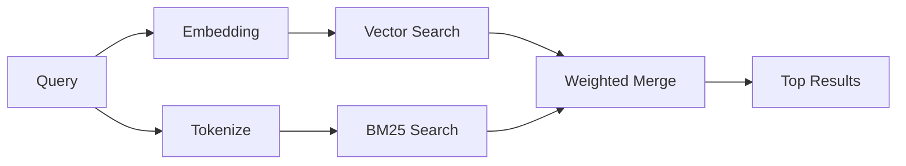

---
read_when:
    - تريد فهم كيفية عمل memory_search
    - تريد اختيار موفّر تضمينات
    - تريد ضبط جودة البحث
summary: كيف يعثر بحث الذاكرة على الملاحظات ذات الصلة باستخدام التضمينات والاسترجاع الهجين
title: البحث في الذاكرة
x-i18n:
    generated_at: "2026-04-30T16:27:53Z"
    model: gpt-5.5
    provider: openai
    source_hash: 7f40bbe32453a28070ffc67f19a4c06e2fe59a24237a2aef353f4b9b8260bcf2
    source_path: concepts/memory-search.md
    workflow: 16
---

`memory_search` يعثر على الملاحظات ذات الصلة من ملفات الذاكرة لديك، حتى عندما تختلف
الصياغة عن النص الأصلي. يعمل ذلك عبر فهرسة الذاكرة في أجزاء صغيرة
والبحث فيها باستخدام التضمينات أو الكلمات المفتاحية أو كليهما.

## البدء السريع

إذا كان لديك اشتراك GitHub Copilot أو مفتاح API مهيأ لـ OpenAI أو Gemini أو Voyage أو Mistral،
فإن البحث في الذاكرة يعمل تلقائيًا. لتعيين مزوّد
صراحةً:

```json5
{
  agents: {
    defaults: {
      memorySearch: {
        provider: "openai", // or "gemini", "local", "ollama", etc.
      },
    },
  },
}
```

بالنسبة للإعدادات متعددة نقاط النهاية، يمكن أن يكون `provider` أيضًا إدخالًا مخصصًا
في `models.providers.<id>`، مثل `ollama-5080`، عندما يعيّن ذلك المزوّد
`api: "ollama"` أو مالك محوّل تضمين آخر.

للتضمينات المحلية دون مفتاح API، عيّن `provider: "local"`. تحتفظ
التثبيتات المعبأة بوقت تشغيل `node-llama-cpp` الأصلي في شجرة تبعيات وقت تشغيل Plugin
المُدارة في OpenClaw؛ شغّل `openclaw doctor --fix` إذا كانت تلك الشجرة تحتاج إلى إصلاح.

تتطلب بعض نقاط نهاية التضمين المتوافقة مع OpenAI تسميات غير متماثلة مثل
`input_type: "query"` لعمليات البحث و`input_type: "document"` أو `"passage"`
للأجزاء المفهرسة. هيّئها باستخدام `memorySearch.queryInputType` و
`memorySearch.documentInputType`؛ راجع [مرجع تهيئة الذاكرة](/ar/reference/memory-config#provider-specific-config).

## المزوّدون المدعومون

| المزوّد       | المعرّف               | يحتاج إلى مفتاح API | ملاحظات                                                |
| -------------- | ---------------- | ------------- | ---------------------------------------------------- |
| Bedrock        | `bedrock`        | لا            | يُكتشف تلقائيًا عندما تُحل سلسلة بيانات اعتماد AWS |
| Gemini         | `gemini`         | نعم           | يدعم فهرسة الصور/الصوت                        |
| GitHub Copilot | `github-copilot` | لا            | يُكتشف تلقائيًا، ويستخدم اشتراك Copilot             |
| Local          | `local`          | لا            | نموذج GGUF، تنزيل بحجم ~0.6 GB                         |
| Mistral        | `mistral`        | نعم           | يُكتشف تلقائيًا                                        |
| Ollama         | `ollama`         | لا            | محلي، يجب تعيينه صراحةً                           |
| OpenAI         | `openai`         | نعم           | يُكتشف تلقائيًا، سريع                                  |
| Voyage         | `voyage`         | نعم           | يُكتشف تلقائيًا                                        |

## كيف يعمل البحث

يشغّل OpenClaw مسارين للاسترجاع بالتوازي ويدمج النتائج:



- **البحث المتجهي** يعثر على الملاحظات ذات المعنى المشابه ("مضيف Gateway" يطابق
  "الجهاز الذي يشغّل OpenClaw").
- **البحث بالكلمات المفتاحية BM25** يعثر على المطابقات الدقيقة (المعرّفات، سلاسل الأخطاء، مفاتيح التهيئة).

إذا كان مسار واحد فقط متاحًا (لا توجد تضمينات أو لا يوجد FTS)، فسيعمل المسار الآخر وحده.

عندما تكون التضمينات غير متاحة، يظل OpenClaw يستخدم ترتيبًا معجميًا على نتائج FTS بدلًا من الرجوع إلى ترتيب المطابقة الدقيقة الخام فقط. يعزز ذلك الوضع المتدهور الأجزاء ذات تغطية أقوى لمصطلحات الاستعلام ومسارات الملفات ذات الصلة، مما يبقي الاستدعاء مفيدًا حتى دون `sqlite-vec` أو مزوّد تضمين.

## تحسين جودة البحث

تساعد ميزتان اختياريتان عندما يكون لديك سجل كبير من الملاحظات:

### التلاشي الزمني

تفقد الملاحظات القديمة وزنها في الترتيب تدريجيًا بحيث تظهر المعلومات الحديثة أولًا.
مع نصف العمر الافتراضي البالغ 30 يومًا، تحصل ملاحظة من الشهر الماضي على 50% من
وزنها الأصلي. لا تُطبّق عملية التلاشي أبدًا على الملفات الدائمة مثل `MEMORY.md`.

<Tip>
فعّل التلاشي الزمني إذا كان لدى وكيلك أشهر من الملاحظات اليومية وكانت
المعلومات القديمة تتصدر السياق الحديث باستمرار.
</Tip>

### MMR (التنوّع)

يقلل النتائج المتكررة. إذا كانت خمس ملاحظات كلها تذكر تهيئة جهاز التوجيه نفسها، فإن MMR
يضمن أن تغطي النتائج الأعلى موضوعات مختلفة بدلًا من التكرار.

<Tip>
فعّل MMR إذا كان `memory_search` يعيد باستمرار مقتطفات شبه مكررة من
ملاحظات يومية مختلفة.
</Tip>

### تفعيل كليهما

```json5
{
  agents: {
    defaults: {
      memorySearch: {
        query: {
          hybrid: {
            mmr: { enabled: true },
            temporalDecay: { enabled: true },
          },
        },
      },
    },
  },
}
```

## الذاكرة متعددة الوسائط

مع Gemini Embedding 2، يمكنك فهرسة الصور وملفات الصوت إلى جانب
Markdown. تظل استعلامات البحث نصية، لكنها تطابق المحتوى المرئي والصوتي.
راجع [مرجع تهيئة الذاكرة](/ar/reference/memory-config) للإعداد.

## البحث في ذاكرة الجلسة

يمكنك اختياريًا فهرسة نصوص الجلسات بحيث يستطيع `memory_search` تذكّر
المحادثات السابقة. يتم ذلك بالاشتراك الصريح عبر
`memorySearch.experimental.sessionMemory`. راجع
[مرجع التهيئة](/ar/reference/memory-config) للتفاصيل.

## استكشاف الأخطاء وإصلاحها

**لا توجد نتائج؟** شغّل `openclaw memory status` للتحقق من الفهرس. إذا كان فارغًا، فشغّل
`openclaw memory index --force`.

**مطابقات كلمات مفتاحية فقط؟** ربما لم تتم تهيئة مزوّد التضمين لديك. تحقق من
`openclaw memory status --deep`.

**انتهاء مهلة التضمينات المحلية؟** يستخدم `ollama` و`lmstudio` و`local` مهلة
دفعات مضمنة أطول افتراضيًا. إذا كان المضيف بطيئًا فحسب، فعيّن
`agents.defaults.memorySearch.sync.embeddingBatchTimeoutSeconds` وأعد تشغيل
`openclaw memory index --force`.

**لم يُعثر على نص CJK؟** أعد بناء فهرس FTS باستخدام
`openclaw memory index --force`.

## قراءة إضافية

- [Active Memory](/ar/concepts/active-memory) -- ذاكرة الوكيل الفرعي لجلسات الدردشة التفاعلية
- [الذاكرة](/ar/concepts/memory) -- تخطيط الملفات، الواجهات الخلفية، الأدوات
- [مرجع تهيئة الذاكرة](/ar/reference/memory-config) -- جميع خيارات التهيئة

## ذات صلة

- [نظرة عامة على الذاكرة](/ar/concepts/memory)
- [Active Memory](/ar/concepts/active-memory)
- [محرك الذاكرة المضمّن](/ar/concepts/memory-builtin)
