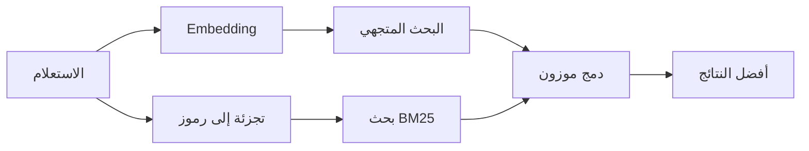

---
read_when:
    - تريد فهم كيفية عمل `memory_search`
    - تريد اختيار مزوّد embedding
    - تريد ضبط جودة البحث
summary: كيف يعثر بحث الذاكرة على الملاحظات ذات الصلة باستخدام embeddings والاسترجاع الهجين
title: بحث الذاكرة
x-i18n:
    generated_at: "2026-04-26T11:27:22Z"
    model: gpt-5.4
    provider: openai
    source_hash: 95d86fb3efe79aae92f5e3590f1c15fb0d8f3bb3301f8fe9a41f891e290d7a14
    source_path: concepts/memory-search.md
    workflow: 15
---

يعثر `memory_search` على الملاحظات ذات الصلة من ملفات الذاكرة لديك، حتى عندما
تختلف الصياغة عن النص الأصلي. ويعمل ذلك عبر فهرسة الذاكرة إلى مقاطع صغيرة
والبحث فيها باستخدام embeddings أو الكلمات المفتاحية أو كليهما.

## بداية سريعة

إذا كانت لديك اشتراك GitHub Copilot، أو مفتاح API لـ OpenAI أو Gemini أو Voyage أو Mistral
مُعدّ، فسيعمل بحث الذاكرة تلقائيًا. ولتعيين مزوّد
بشكل صريح:

```json5
{
  agents: {
    defaults: {
      memorySearch: {
        provider: "openai", // أو "gemini" أو "local" أو "ollama" أو غير ذلك
      },
    },
  },
}
```

بالنسبة إلى embeddings المحلية من دون مفتاح API، ثبّت حزمة runtime الاختيارية `node-llama-cpp`
بجوار OpenClaw واستخدم `provider: "local"`.

## المزوّدون المدعومون

| المزوّد        | المعرّف          | يحتاج إلى مفتاح API | ملاحظات                                                |
| -------------- | ---------------- | ------------------- | ------------------------------------------------------ |
| Bedrock        | `bedrock`        | لا                  | يُكتشف تلقائيًا عند نجاح سلسلة بيانات اعتماد AWS      |
| Gemini         | `gemini`         | نعم                 | يدعم فهرسة الصور/الصوت                                 |
| GitHub Copilot | `github-copilot` | لا                  | يُكتشف تلقائيًا ويستخدم اشتراك Copilot                 |
| Local          | `local`          | لا                  | نموذج GGUF، تنزيل بحجم ~0.6 GB                         |
| Mistral        | `mistral`        | نعم                 | يُكتشف تلقائيًا                                        |
| Ollama         | `ollama`         | لا                  | محلي، ويجب تعيينه صراحةً                               |
| OpenAI         | `openai`         | نعم                 | يُكتشف تلقائيًا، وسريع                                 |
| Voyage         | `voyage`         | نعم                 | يُكتشف تلقائيًا                                        |

## كيف يعمل البحث

يشغّل OpenClaw مساري استرجاع بالتوازي ويجمع النتائج:



- **البحث المتجهي** يعثر على الملاحظات ذات المعنى المتشابه ("مضيف gateway" يطابق
  "الجهاز الذي يشغّل OpenClaw").
- **بحث الكلمات المفتاحية BM25** يعثر على التطابقات الدقيقة (المعرّفات، وسلاسل الأخطاء، ومفاتيح
  الإعدادات).

إذا كان أحد المسارين فقط متاحًا (لا توجد embeddings أو لا توجد FTS)، فسيعمل الآخر وحده.

عندما لا تكون embeddings متاحة، يظل OpenClaw يستخدم ترتيبًا معجميًا فوق نتائج FTS بدلًا من الرجوع إلى ترتيب خام قائم على التطابق الدقيق فقط. يعزّز هذا الوضع المتدهور المقاطع ذات التغطية الأقوى لمصطلحات الاستعلام ومسارات الملفات ذات الصلة، مما يبقي الاسترجاع مفيدًا حتى من دون `sqlite-vec` أو مزوّد embedding.

## تحسين جودة البحث

تساعد ميزتان اختياريتان عندما يكون لديك سجل ملاحظات كبير:

### التلاشي الزمني

تفقد الملاحظات القديمة وزنها في الترتيب تدريجيًا بحيث تظهر المعلومات الحديثة أولًا.
وباستخدام نصف العمر الافتراضي البالغ 30 يومًا، تحصل ملاحظة من الشهر الماضي على 50% من
وزنها الأصلي. ولا يُطبَّق التلاشي أبدًا على الملفات الدائمة مثل `MEMORY.md`.

<Tip>
فعّل التلاشي الزمني إذا كان لدى الوكيل لديك ملاحظات يومية تعود لأشهر وكانت
المعلومات القديمة تتفوّق باستمرار على السياق الحديث.
</Tip>

### MMR (التنوّع)

يقلل النتائج المتكررة. فإذا كانت خمس ملاحظات كلها تذكر إعداد الموجّه نفسه، فإن MMR
يضمن أن تغطي أفضل النتائج موضوعات مختلفة بدلًا من التكرار.

<Tip>
فعّل MMR إذا كان `memory_search` يستمر في إعادة مقاطع شبه مكررة من
ملاحظات يومية مختلفة.
</Tip>

### فعّل الاثنين معًا

```json5
{
  agents: {
    defaults: {
      memorySearch: {
        query: {
          hybrid: {
            mmr: { enabled: true },
            temporalDecay: { enabled: true },
          },
        },
      },
    },
  },
}
```

## الذاكرة متعددة الوسائط

باستخدام Gemini Embedding 2، يمكنك فهرسة الصور وملفات الصوت إلى جانب
Markdown. وتظل استعلامات البحث نصية، لكنها تطابق المحتوى المرئي والصوتي. راجع [مرجع إعدادات الذاكرة](/ar/reference/memory-config) من أجل
الإعداد.

## بحث ذاكرة الجلسة

يمكنك اختياريًا فهرسة نصوص الجلسات حتى يتمكن `memory_search` من استرجاع
المحادثات السابقة. وهذا يتم بالاشتراك الصريح عبر
`memorySearch.experimental.sessionMemory`. راجع
[مرجع الإعدادات](/ar/reference/memory-config) للتفاصيل.

## استكشاف الأخطاء وإصلاحها

**لا توجد نتائج؟** شغّل `openclaw memory status` للتحقق من الفهرس. وإذا كان فارغًا، فشغّل
`openclaw memory index --force`.

**مطابقات كلمات مفتاحية فقط؟** قد لا يكون مزوّد embedding لديك مُعدًا. تحقّق عبر
`openclaw memory status --deep`.

**انتهت مهلة embeddings المحلية؟** تستخدم `ollama` و`lmstudio` و`local` مهلة
دفعات مضمّنة أطول افتراضيًا. وإذا كان المضيف بطيئًا ببساطة، فاضبط
`agents.defaults.memorySearch.sync.embeddingBatchTimeoutSeconds` ثم أعد تشغيل
`openclaw memory index --force`.

**لم يتم العثور على نص CJK؟** أعد بناء فهرس FTS باستخدام
`openclaw memory index --force`.

## قراءة إضافية

- [Active Memory](/ar/concepts/active-memory) -- ذاكرة الوكيل الفرعي لجلسات الدردشة التفاعلية
- [الذاكرة](/ar/concepts/memory) -- تخطيط الملفات، والواجهات الخلفية، والأدوات
- [مرجع إعدادات الذاكرة](/ar/reference/memory-config) -- جميع خيارات الإعداد

## ذو صلة

- [نظرة عامة على الذاكرة](/ar/concepts/memory)
- [Active Memory](/ar/concepts/active-memory)
- [محرك الذاكرة المضمّن](/ar/concepts/memory-builtin)
