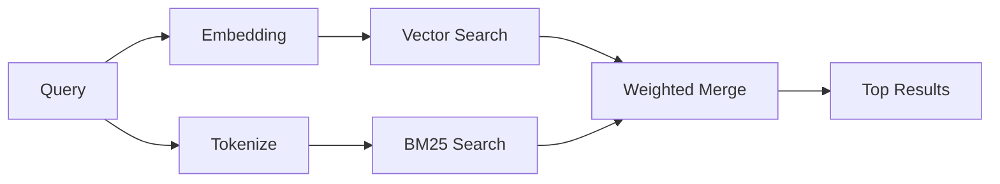

---
read_when:
    - تريد أن تفهم كيف يعمل `memory_search`
    - تريد اختيار موفّر تضمينات
    - تريد ضبط جودة البحث
summary: كيف يعثر بحث الذاكرة على الملاحظات ذات الصلة باستخدام التضمينات والاسترجاع الهجين
title: بحث الذاكرة
x-i18n:
    generated_at: "2026-04-15T14:40:32Z"
    model: gpt-5.4
    provider: openai
    source_hash: f5757aa8fe8f7fec30ef5c826f72230f591ce4cad591d81a091189d50d4262ed
    source_path: concepts/memory-search.md
    workflow: 15
---

# بحث الذاكرة

يعثر `memory_search` على الملاحظات ذات الصلة من ملفات الذاكرة لديك، حتى عندما
تختلف الصياغة عن النص الأصلي. ويعمل ذلك من خلال فهرسة الذاكرة إلى أجزاء صغيرة
والبحث فيها باستخدام التضمينات أو الكلمات المفتاحية أو كليهما.

## البدء السريع

إذا كان لديك اشتراك GitHub Copilot، أو كان لديك مفتاح API مضبوط لـ OpenAI أو Gemini أو Voyage أو Mistral،
فإن بحث الذاكرة يعمل تلقائيًا. لتعيين موفّر بشكل صريح:

```json5
{
  agents: {
    defaults: {
      memorySearch: {
        provider: "openai", // or "gemini", "local", "ollama", etc.
      },
    },
  },
}
```

للتضمينات المحلية بدون مفتاح API، استخدم `provider: "local"` (يتطلب
node-llama-cpp).

## الموفّرون المدعومون

| الموفّر        | المعرّف           | يحتاج إلى مفتاح API | ملاحظات                                               |
| -------------- | ----------------- | ------------------- | ----------------------------------------------------- |
| Bedrock        | `bedrock`         | لا                  | يُكتشف تلقائيًا عند نجاح سلسلة بيانات اعتماد AWS     |
| Gemini         | `gemini`          | نعم                 | يدعم فهرسة الصور/الصوت                                |
| GitHub Copilot | `github-copilot`  | لا                  | يُكتشف تلقائيًا، ويستخدم اشتراك Copilot              |
| Local          | `local`           | لا                  | نموذج GGUF، تنزيل بحجم ~0.6 غيغابايت                 |
| Mistral        | `mistral`         | نعم                 | يُكتشف تلقائيًا                                       |
| Ollama         | `ollama`          | لا                  | محلي، ويجب تعيينه صراحةً                              |
| OpenAI         | `openai`          | نعم                 | يُكتشف تلقائيًا، وسريع                                |
| Voyage         | `voyage`          | نعم                 | يُكتشف تلقائيًا                                       |

## كيف يعمل البحث

يشغّل OpenClaw مساري استرجاع بالتوازي ويدمج النتائج:



- **البحث المتجهي** يعثر على الملاحظات ذات المعنى المتشابه ("gateway host" يطابق
  "the machine running OpenClaw").
- **بحث الكلمات المفتاحية BM25** يعثر على المطابقات الدقيقة (المعرّفات، سلاسل
  الأخطاء، مفاتيح الإعداد).

إذا كان أحد المسارين فقط متاحًا (لا توجد تضمينات أو لا توجد FTS)، فسيعمل المسار
الآخر وحده.

عندما لا تكون التضمينات متاحة، يظل OpenClaw يستخدم الترتيب المعجمي فوق نتائج FTS بدلًا من الرجوع إلى ترتيب المطابقة الدقيقة الخام فقط. يعزّز هذا الوضع المتدهور الأجزاء التي تتمتع بتغطية أقوى لمصطلحات الاستعلام ومسارات ملفات أكثر صلة، مما يُبقي الاستدعاء مفيدًا حتى بدون `sqlite-vec` أو موفّر تضمينات.

## تحسين جودة البحث

تساعد ميزتان اختياريتان عندما يكون لديك سجل كبير من الملاحظات:

### التلاشي الزمني

تفقد الملاحظات القديمة وزن الترتيب تدريجيًا بحيث تظهر المعلومات الأحدث أولًا.
مع نصف العمر الافتراضي البالغ 30 يومًا، تسجّل الملاحظة من الشهر الماضي 50% من
وزنها الأصلي. لا يُطبّق التلاشي أبدًا على الملفات الدائمة مثل `MEMORY.md`.

<Tip>
فعّل التلاشي الزمني إذا كان وكيلك يملك ملاحظات يومية تمتد لأشهر وكانت
المعلومات القديمة تتفوّق باستمرار على السياق الأحدث.
</Tip>

### MMR (التنوع)

يقلّل النتائج المتكررة. إذا كانت خمس ملاحظات تذكر إعداد جهاز التوجيه نفسه، فإن
MMR يضمن أن تغطي النتائج العليا موضوعات مختلفة بدلًا من التكرار.

<Tip>
فعّل MMR إذا كان `memory_search` يستمر في إرجاع مقتطفات شبه مكررة من
ملاحظات يومية مختلفة.
</Tip>

### تفعيل الاثنين معًا

```json5
{
  agents: {
    defaults: {
      memorySearch: {
        query: {
          hybrid: {
            mmr: { enabled: true },
            temporalDecay: { enabled: true },
          },
        },
      },
    },
  },
}
```

## الذاكرة متعددة الوسائط

باستخدام Gemini Embedding 2، يمكنك فهرسة الصور والملفات الصوتية إلى جانب
Markdown. تظل استعلامات البحث نصية، لكنها تطابق المحتوى المرئي والصوتي. راجع
[مرجع إعداد الذاكرة](/ar/reference/memory-config) لمعرفة الإعداد.

## بحث ذاكرة الجلسة

يمكنك اختياريًا فهرسة نصوص الجلسات بحيث يتمكن `memory_search` من استدعاء
المحادثات السابقة. هذا يتطلب تفعيلًا يدويًا عبر
`memorySearch.experimental.sessionMemory`. راجع
[مرجع الإعداد](/ar/reference/memory-config) للتفاصيل.

## استكشاف الأخطاء وإصلاحها

**لا توجد نتائج؟** شغّل `openclaw memory status` للتحقق من الفهرس. إذا كان فارغًا، شغّل
`openclaw memory index --force`.

**مطابقات كلمات مفتاحية فقط؟** قد لا يكون موفّر التضمينات مضبوطًا. تحقّق من
`openclaw memory status --deep`.

**تعذّر العثور على نص CJK؟** أعد بناء فهرس FTS باستخدام
`openclaw memory index --force`.

## قراءة إضافية

- [Active Memory](/ar/concepts/active-memory) -- ذاكرة الوكيل الفرعي لجلسات الدردشة التفاعلية
- [الذاكرة](/ar/concepts/memory) -- تخطيط الملفات، الواجهات الخلفية، الأدوات
- [مرجع إعداد الذاكرة](/ar/reference/memory-config) -- جميع خيارات الإعداد
