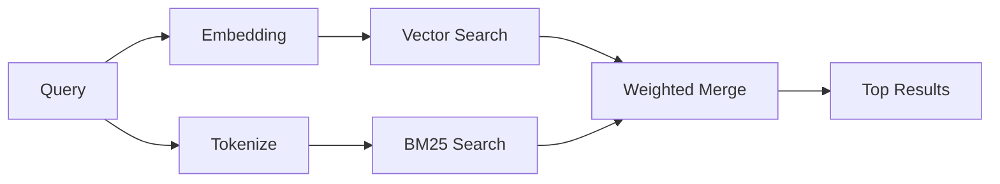

---
read_when:
    - تريد أن تفهم كيف يعمل memory_search
    - تريد اختيار موفر embeddings
    - تريد ضبط جودة البحث
summary: كيف يعثر بحث الذاكرة على الملاحظات ذات الصلة باستخدام embeddings والاسترجاع الهجين
title: بحث الذاكرة
x-i18n:
    generated_at: "2026-04-24T07:37:58Z"
    model: gpt-5.4
    provider: openai
    source_hash: 04db62e519a691316ce40825c082918094bcaa9c36042cc8101c6504453d238e
    source_path: concepts/memory-search.md
    workflow: 15
---

يعثر `memory_search` على الملاحظات ذات الصلة من ملفات الذاكرة لديك، حتى عندما
تختلف الصياغة عن النص الأصلي. ويعمل ذلك عبر فهرسة الذاكرة إلى مقاطع صغيرة
والبحث فيها باستخدام embeddings أو الكلمات المفتاحية أو كليهما.

## بدء سريع

إذا كان لديك اشتراك GitHub Copilot، أو مفتاح API لـ OpenAI أو Gemini أو Voyage أو Mistral
مضبوط، فإن بحث الذاكرة يعمل تلقائيًا. ولضبط موفر
بشكل صريح:

```json5
{
  agents: {
    defaults: {
      memorySearch: {
        provider: "openai", // or "gemini", "local", "ollama", etc.
      },
    },
  },
}
```

بالنسبة إلى embeddings المحلية من دون مفتاح API، استخدم `provider: "local"` ‏(يتطلب
node-llama-cpp).

## الموفرون المدعومون

| الموفر         | المعرّف          | يحتاج مفتاح API | ملاحظات                                               |
| -------------- | ---------------- | --------------- | ----------------------------------------------------- |
| Bedrock        | `bedrock`        | لا              | يتم اكتشافه تلقائيًا عندما تُحل سلسلة بيانات اعتماد AWS |
| Gemini         | `gemini`         | نعم             | يدعم فهرسة الصور/الصوت                                |
| GitHub Copilot | `github-copilot` | لا              | يُكتشف تلقائيًا، ويستخدم اشتراك Copilot              |
| Local          | `local`          | لا              | نموذج GGUF، تنزيل بحجم ~0.6 GB                        |
| Mistral        | `mistral`        | نعم             | يُكتشف تلقائيًا                                       |
| Ollama         | `ollama`         | لا              | محلي، ويجب ضبطه صراحةً                                |
| OpenAI         | `openai`         | نعم             | يُكتشف تلقائيًا، سريع                                 |
| Voyage         | `voyage`         | نعم             | يُكتشف تلقائيًا                                       |

## كيف يعمل البحث

يشغّل OpenClaw مساري استرجاع بالتوازي ويدمج النتائج:



- يعثر **البحث المتجهي** على الملاحظات ذات المعنى المتشابه ("gateway host" يطابق
  "الجهاز الذي يشغّل OpenClaw").
- يعثر **بحث الكلمات المفتاحية BM25** على التطابقات الدقيقة (المعرّفات، وسلاسل الأخطاء، ومفاتيح
  الإعدادات).

إذا كان أحد المسارين فقط متاحًا (لا embeddings أو لا FTS)، يعمل الآخر وحده.

عندما لا تكون embeddings متاحة، لا يزال OpenClaw يستخدم الترتيب المعجمي فوق نتائج FTS بدلًا من الرجوع إلى ترتيب مطابقات دقيقة خام فقط. ويعزز هذا الوضع المتدهور المقاطع ذات تغطية مصطلحات الاستعلام الأقوى ومسارات الملفات ذات الصلة، مما يبقي الاستدعاء مفيدًا حتى من دون `sqlite-vec` أو موفر embedding.

## تحسين جودة البحث

يساعد خياران اختياريان عندما يكون لديك سجل ملاحظات كبير:

### التناقص الزمني

تفقد الملاحظات القديمة وزنها في الترتيب تدريجيًا بحيث تظهر المعلومات الحديثة أولًا.
ومع نصف العمر الافتراضي البالغ 30 يومًا، تحصل الملاحظة من الشهر الماضي على 50% من
وزنها الأصلي. ولا يتم تطبيق التناقص على الملفات الدائمة مثل `MEMORY.md` مطلقًا.

<Tip>
فعّل التناقص الزمني إذا كان لدى وكيلك أشهر من الملاحظات اليومية وكانت
المعلومات القديمة تستمر في التفوق على السياق الحديث.
</Tip>

### MMR ‏(التنوع)

يقلل النتائج المكررة. فإذا كانت خمس ملاحظات جميعها تذكر إعداد جهاز التوجيه نفسه، فإن MMR
يضمن أن تغطي النتائج العليا موضوعات مختلفة بدلًا من التكرار.

<Tip>
فعّل MMR إذا كان `memory_search` يستمر في إعادة مقاطع شبه مكررة من
ملاحظات يومية مختلفة.
</Tip>

### تمكين الاثنين معًا

```json5
{
  agents: {
    defaults: {
      memorySearch: {
        query: {
          hybrid: {
            mmr: { enabled: true },
            temporalDecay: { enabled: true },
          },
        },
      },
    },
  },
}
```

## الذاكرة متعددة الوسائط

باستخدام Gemini Embedding 2، يمكنك فهرسة الصور والملفات الصوتية إلى جانب
Markdown. تظل استعلامات البحث نصية، لكنها تطابق المحتوى البصري والصوتي. راجع [مرجع إعدادات الذاكرة](/ar/reference/memory-config) لمعرفة
الإعداد.

## بحث ذاكرة الجلسة

يمكنك اختياريًا فهرسة نصوص جلسات المحادثة حتى يتمكن `memory_search` من استدعاء
المحادثات السابقة. وهذا يتم عبر الاشتراك الاختياري من خلال
`memorySearch.experimental.sessionMemory`. راجع
[مرجع الإعدادات](/ar/reference/memory-config) للحصول على التفاصيل.

## استكشاف الأخطاء وإصلاحها

**لا توجد نتائج؟** شغّل `openclaw memory status` للتحقق من الفهرس. وإذا كان فارغًا، فشغّل
`openclaw memory index --force`.

**مطابقات كلمات مفتاحية فقط؟** قد لا يكون موفر embedding مضبوطًا. تحقّق باستخدام
`openclaw memory status --deep`.

**تعذر العثور على نص CJK؟** أعد بناء فهرس FTS باستخدام
`openclaw memory index --force`.

## قراءة إضافية

- [Active Memory](/ar/concepts/active-memory) -- ذاكرة الوكيل الفرعي لجلسات الدردشة التفاعلية
- [الذاكرة](/ar/concepts/memory) -- تخطيط الملفات، والواجهات الخلفية، والأدوات
- [مرجع إعدادات الذاكرة](/ar/reference/memory-config) -- جميع مقابض الإعداد

## ذو صلة

- [نظرة عامة على الذاكرة](/ar/concepts/memory)
- [Active Memory](/ar/concepts/active-memory)
- [محرك الذاكرة المضمن](/ar/concepts/memory-builtin)
