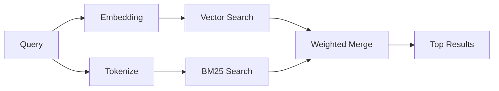

---
read_when:
    - تريد فهم كيفية عمل memory_search
    - تريد اختيار مزوّد تضمينات
    - تريد ضبط جودة البحث
summary: كيف يعثر بحث الذاكرة على الملاحظات ذات الصلة باستخدام التضمينات والاسترجاع الهجين
title: البحث في الذاكرة
x-i18n:
    generated_at: "2026-05-02T07:24:40Z"
    model: gpt-5.5
    provider: openai
    source_hash: 2a71fb0809d5c70689e8046f854e4b4b4e79f45769ac2964e40a762ebb4e91a8
    source_path: concepts/memory-search.md
    workflow: 16
---

`memory_search` يعثر على الملاحظات ذات الصلة من ملفات الذاكرة لديك، حتى عندما تختلف
الصياغة عن النص الأصلي. يعمل ذلك عبر فهرسة الذاكرة إلى مقاطع صغيرة
والبحث فيها باستخدام التضمينات، أو الكلمات المفتاحية، أو كليهما.

## البدء السريع

إذا كان لديك اشتراك GitHub Copilot، أو مفتاح API مكوّن لـ OpenAI أو Gemini أو Voyage أو Mistral،
فإن البحث في الذاكرة يعمل تلقائيًا. لتعيين مزوّد
صراحةً:

```json5
{
  agents: {
    defaults: {
      memorySearch: {
        provider: "openai", // or "gemini", "local", "ollama", etc.
      },
    },
  },
}
```

في إعدادات نقاط النهاية المتعددة، يمكن أن يكون `provider` أيضًا إدخالًا مخصصًا
ضمن `models.providers.<id>`، مثل `ollama-5080`، عندما يعيّن ذلك المزوّد
`api: "ollama"` أو مالك محوّل تضمينات آخر.

للتضمينات المحلية من دون مفتاح API، عيّن `provider: "local"`. قد تظل عمليات السحب من المصدر
تتطلب موافقة بناء أصلية: `pnpm approve-builds` ثم
`pnpm rebuild node-llama-cpp`.

تتطلب بعض نقاط نهاية التضمين المتوافقة مع OpenAI تسميات غير متماثلة مثل
`input_type: "query"` لعمليات البحث و`input_type: "document"` أو `"passage"`
للمقاطع المفهرسة. اضبط ذلك باستخدام `memorySearch.queryInputType` و
`memorySearch.documentInputType`؛ راجع [مرجع تهيئة الذاكرة](/ar/reference/memory-config#provider-specific-config).

## المزوّدون المدعومون

| المزوّد       | المعرّف               | يحتاج مفتاح API | ملاحظات                                                |
| -------------- | ---------------- | ------------- | ---------------------------------------------------- |
| Bedrock        | `bedrock`        | لا            | يُكتشف تلقائيًا عندما تُحل سلسلة اعتماد AWS |
| Gemini         | `gemini`         | نعم           | يدعم فهرسة الصور والصوت                        |
| GitHub Copilot | `github-copilot` | لا            | يُكتشف تلقائيًا، ويستخدم اشتراك Copilot             |
| Local          | `local`          | لا            | نموذج GGUF، تنزيل بحجم ~0.6 GB                         |
| Mistral        | `mistral`        | نعم           | يُكتشف تلقائيًا                                        |
| Ollama         | `ollama`         | لا            | محلي، ويجب تعيينه صراحةً                           |
| OpenAI         | `openai`         | نعم           | يُكتشف تلقائيًا، وسريع                                  |
| Voyage         | `voyage`         | نعم           | يُكتشف تلقائيًا                                        |

## كيف يعمل البحث

يشغّل OpenClaw مساري استرجاع بالتوازي ويدمج النتائج:



- **البحث المتجهي** يعثر على الملاحظات ذات المعنى المشابه ("gateway host" يطابق
  "الجهاز الذي يشغّل OpenClaw").
- **بحث الكلمات المفتاحية BM25** يعثر على التطابقات الدقيقة (المعرّفات، سلاسل الأخطاء، مفاتيح
  التهيئة).

إذا كان مسار واحد فقط متاحًا (لا توجد تضمينات أو لا يوجد FTS)، يعمل المسار الآخر وحده.

عندما لا تتوفر التضمينات، يظل OpenClaw يستخدم الترتيب المعجمي فوق نتائج FTS بدلًا من الرجوع إلى ترتيب التطابق الدقيق الخام فقط. يعزز هذا الوضع المتدهور المقاطع ذات تغطية أقوى لمصطلحات الاستعلام ومسارات ملفات ذات صلة، مما يحافظ على فائدة الاسترجاع حتى من دون `sqlite-vec` أو مزوّد تضمينات.

## تحسين جودة البحث

تساعد ميزتان اختياريتان عندما يكون لديك سجل ملاحظات كبير:

### التلاشي الزمني

تفقد الملاحظات القديمة وزنها في الترتيب تدريجيًا بحيث تظهر المعلومات الأحدث أولًا.
مع عمر النصف الافتراضي البالغ 30 يومًا، تحصل ملاحظة من الشهر الماضي على 50% من
وزنها الأصلي. لا تتلاشى الملفات الدائمة مثل `MEMORY.md` مطلقًا.

<Tip>
فعّل التلاشي الزمني إذا كان لدى وكيلك أشهر من الملاحظات اليومية وكانت المعلومات
القديمة تتقدم باستمرار على السياق الأحدث.
</Tip>

### MMR (التنوع)

يقلل النتائج المكررة. إذا كانت خمس ملاحظات كلها تذكر تهيئة الموجّه نفسها، فإن MMR
يضمن أن تغطي النتائج الأعلى موضوعات مختلفة بدلًا من التكرار.

<Tip>
فعّل MMR إذا كان `memory_search` يعيد باستمرار مقتطفات شبه مكررة من
ملاحظات يومية مختلفة.
</Tip>

### تفعيل كليهما

```json5
{
  agents: {
    defaults: {
      memorySearch: {
        query: {
          hybrid: {
            mmr: { enabled: true },
            temporalDecay: { enabled: true },
          },
        },
      },
    },
  },
}
```

## الذاكرة متعددة الوسائط

باستخدام Gemini Embedding 2، يمكنك فهرسة ملفات الصور والصوت إلى جانب
Markdown. تظل استعلامات البحث نصية، لكنها تطابق المحتوى المرئي والصوتي.
راجع [مرجع تهيئة الذاكرة](/ar/reference/memory-config) للإعداد.

## البحث في ذاكرة الجلسة

يمكنك اختياريًا فهرسة نصوص الجلسات بحيث يستطيع `memory_search` استدعاء
المحادثات السابقة. هذا خيار يُفعّل صراحةً عبر
`memorySearch.experimental.sessionMemory`. راجع
[مرجع التهيئة](/ar/reference/memory-config) للتفاصيل.

## استكشاف الأخطاء وإصلاحها

**لا توجد نتائج؟** شغّل `openclaw memory status` للتحقق من الفهرس. إذا كان فارغًا، فشغّل
`openclaw memory index --force`.

**مطابقات كلمات مفتاحية فقط؟** قد لا يكون مزوّد التضمينات لديك مهيأً. تحقق من
`openclaw memory status --deep`.

**انتهت مهلة التضمينات المحلية؟** يستخدم `ollama` و`lmstudio` و`local` مهلة
دفعات مضمنة أطول افتراضيًا. إذا كان المضيف بطيئًا ببساطة، فعيّن
`agents.defaults.memorySearch.sync.embeddingBatchTimeoutSeconds` وأعد تشغيل
`openclaw memory index --force`.

**لم يُعثر على نص CJK؟** أعد بناء فهرس FTS باستخدام
`openclaw memory index --force`.

## قراءة إضافية

- [Active Memory](/ar/concepts/active-memory) -- ذاكرة الوكيل الفرعي لجلسات الدردشة التفاعلية
- [الذاكرة](/ar/concepts/memory) -- تخطيط الملفات، الواجهات الخلفية، الأدوات
- [مرجع تهيئة الذاكرة](/ar/reference/memory-config) -- كل خيارات التهيئة

## ذات صلة

- [نظرة عامة على الذاكرة](/ar/concepts/memory)
- [Active Memory](/ar/concepts/active-memory)
- [محرك الذاكرة المدمج](/ar/concepts/memory-builtin)
