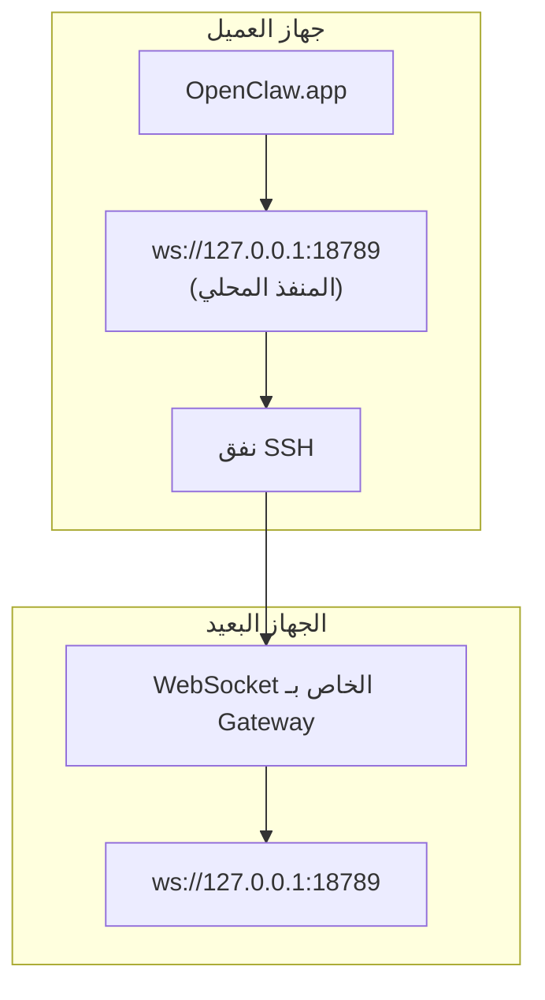

<Note>
أصبح هذا المحتوى الآن موجودًا في [الوصول عن بُعد](/ar/gateway/remote#macos-persistent-ssh-tunnel-via-launchagent). استخدم تلك الصفحة للاطلاع على الدليل الحالي؛ وتبقى هذه الصفحة هدفًا لإعادة التوجيه.
</Note>

# تشغيل OpenClaw.app باستخدام Gateway بعيد

يتصل OpenClaw.app بـ Gateway بعيد عبر نفق SSH: يربط توجيه SSH ‏`LocalForward` منفذًا محليًا بمنفذ WebSocket الخاص بـ Gateway على المضيف البعيد.

## الإعداد

1. أضف إدخالًا إلى إعدادات SSH يتضمن `LocalForward 18789 127.0.0.1:18789` (راجع [الوصول عن بُعد](/ar/gateway/remote#macos-persistent-ssh-tunnel-via-launchagent) للاطلاع على كتلة الإعدادات الكاملة).
2. انسخ مفتاح SSH إلى المضيف البعيد باستخدام `ssh-copy-id`.
3. عيّن `gateway.remote.token` (أو `gateway.remote.password`) عبر `openclaw config set gateway.remote.token "<your-token>"`.
4. ابدأ النفق: `ssh -N remote-gateway &`.
5. أغلق OpenClaw.app ثم أعد فتحه.

لإنشاء نفق يستمر بعد إعادة التشغيل ويعيد الاتصال تلقائيًا، استخدم إعداد LaunchAgent في صفحة [الوصول عن بُعد](/ar/gateway/remote#macos-persistent-ssh-tunnel-via-launchagent) بدلًا من تشغيل `ssh -N` يدويًا.

## آلية العمل

| المكوّن                              | وظيفته                                                        |
| ------------------------------------ | ------------------------------------------------------------- |
| `LocalForward 18789 127.0.0.1:18789` | يوجّه المنفذ المحلي 18789 إلى المنفذ البعيد 18789             |
| `ssh -N`                             | يشغّل SSH دون تنفيذ أوامر بعيدة (لتوجيه المنافذ فقط)          |
| `KeepAlive`                          | يعيد تشغيل النفق تلقائيًا إذا تعطّل (LaunchAgent)             |
| `RunAtLoad`                          | يبدأ النفق عند تحميل LaunchAgent ‏(LaunchAgent)               |

يتصل OpenClaw.app بالعنوان `ws://127.0.0.1:18789` على جهاز العميل. ويوجّه النفق هذا الاتصال إلى المنفذ 18789 على المضيف البعيد الذي يشغّل Gateway.

## موضوعات ذات صلة

- [الوصول عن بُعد](/ar/gateway/remote)
- [Tailscale](/ar/gateway/tailscale)
