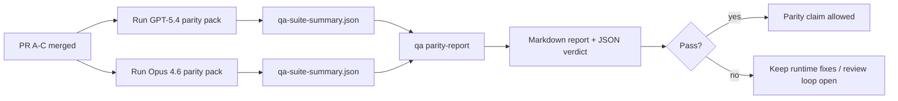

---
read_when:
    - مراجعة سلسلة طلبات السحب الخاصة بتكافؤ GPT-5.4 / Codex
    - صيانة البنية agentic ذات العقود الستة وراء برنامج التكافؤ
summary: كيفية مراجعة برنامج التكافؤ GPT-5.4 / Codex كوحدات دمج أربع
title: ملاحظات صيانة تكافؤ GPT-5.4 / Codex
x-i18n:
    generated_at: "2026-04-24T07:45:42Z"
    model: gpt-5.4
    provider: openai
    source_hash: 803b62bf5bb6b00125f424fa733e743ecdec7f8410dec0782096f9d1ddbed6c0
    source_path: help/gpt54-codex-agentic-parity-maintainers.md
    workflow: 15
---

تشرح هذه الملاحظة كيفية مراجعة برنامج التكافؤ GPT-5.4 / Codex كوحدات دمج أربع من دون فقدان البنية الأصلية ذات العقود الستة.

## وحدات الدمج

### PR A: تنفيذ strict-agentic

يمتلك:

- `executionContract`
- الاستمرار في الدور نفسه مع تفضيل GPT-5
- `update_plan` كتتبع تقدم غير نهائي
- حالات الحظر الصريحة بدلًا من التوقفات الصامتة القائمة على الخطة فقط

لا يمتلك:

- تصنيف أعطال المصادقة/وقت التشغيل
- صدق الأذونات
- إعادة تصميم الإعادة/الاستمرار
- قياس التكافؤ

### PR B: صدق وقت التشغيل

يمتلك:

- صحة نطاق OAuth الخاص بـ Codex
- تصنيف أعطال الموفّر/وقت التشغيل typed
- التوفّر الصادق لـ `/elevated full` وأسباب الحظر

لا يمتلك:

- تطبيع مخطط الأدوات
- حالة الإعادة/الحيوية
- تقييد benchmark

### PR C: صحة التنفيذ

يمتلك:

- التوافق الخاص بالأدوات المملوكة للموفّر في OpenAI/Codex
- التعامل الصارم مع المخططات الخالية من المعاملات
- إظهار replay-invalid
- وضوح حالة المهام الطويلة المتوقفة مؤقتًا، والمحظورة، والمتروكة

لا يمتلك:

- الاستمرار المنتخَب ذاتيًا
- سلوك لهجة Codex العامة خارج خطافات الموفّر
- تقييد benchmark

### PR D: parity harness

يمتلك:

- الحزمة الأولى من السيناريوهات GPT-5.4 مقابل Opus 4.6
- توثيق التكافؤ
- تقرير التكافؤ وآليات بوابة الإصدار

لا يمتلك:

- تغييرات سلوك وقت التشغيل خارج QA-lab
- محاكاة المصادقة/الوكيل/‏DNS داخل harness

## الربط مرة أخرى بالعقود الستة الأصلية

| العقد الأصلي                           | وحدة الدمج |
| -------------------------------------- | ---------- |
| صحة النقل/المصادقة الخاصة بالموفّر     | PR B       |
| توافق عقد/مخطط الأدوات                 | PR C       |
| التنفيذ في الدور نفسه                  | PR A       |
| صدق الأذونات                           | PR B       |
| صحة الإعادة/الاستمرار/الحيوية          | PR C       |
| benchmark/بوابة الإصدار                | PR D       |

## ترتيب المراجعة

1. PR A
2. PR B
3. PR C
4. PR D

PR D هي طبقة الإثبات. ويجب ألا تكون هي السبب في تأخير طلبات السحب الخاصة بصحة وقت التشغيل.

## ما الذي يجب البحث عنه

### PR A

- تعمل تشغيلات GPT-5 أو تفشل بشكل مغلق بدلًا من التوقف عند التعليق
- لم يعد `update_plan` يبدو تقدمًا بحد ذاته
- يبقى السلوك مفضّلًا لـ GPT-5 ومحصورًا في embedded-Pi

### PR B

- لم تعد أعطال المصادقة/الوكيل/وقت التشغيل تنهار إلى معالجة عامة من نوع "فشل النموذج"
- لا يتم وصف `/elevated full` على أنه متاح إلا عندما يكون متاحًا فعلًا
- تكون أسباب الحظر مرئية لكلٍّ من النموذج ووقت التشغيل المواجه للمستخدم

### PR C

- يتصرف تسجيل الأدوات الصارم في OpenAI/Codex بشكل متوقع
- لا تفشل الأدوات الخالية من المعاملات في فحوصات المخطط الصارمة
- تحافظ نتائج الإعادة وCompaction على حالة حيوية صادقة

### PR D

- تكون حزمة السيناريوهات مفهومة وقابلة لإعادة الإنتاج
- تتضمن الحزمة مسار mutating replay-safety، وليس فقط التدفقات للقراءة فقط
- تكون التقارير قابلة للقراءة من قبل البشر والأتمتة
- تكون ادعاءات التكافؤ مدعومة بالأدلة، وليست قصصية

العناصر المتوقعة من PR D:

- `qa-suite-report.md` / `qa-suite-summary.json` لكل تشغيل نموذج
- `qa-agentic-parity-report.md` مع مقارنة إجمالية وعلى مستوى السيناريو
- `qa-agentic-parity-summary.json` مع حكم قابل للقراءة آليًا

## بوابة الإصدار

لا تدّعِ تكافؤ GPT-5.4 أو تفوقه على Opus 4.6 حتى:

- يتم دمج PR A وPR B وPR C
- يقوم PR D بتشغيل حزمة التكافؤ الأولى بشكل نظيف
- تبقى مجموعات انحدار runtime-truthfulness باللون الأخضر
- يُظهر تقرير التكافؤ عدم وجود حالات fake-success وعدم وجود انحدار في سلوك التوقف

ليست parity harness مصدر الإثبات الوحيد. أبقِ هذا الفصل صريحًا في المراجعة:

- يمتلك PR D المقارنة القائمة على السيناريو بين GPT-5.4 وOpus 4.6
- ولا تزال المجموعات الحتمية في PR B تمتلك أدلة المصادقة/الوكيل/‏DNS وصدق الوصول الكامل

## خريطة الهدف إلى الدليل

| عنصر بوابة الإكمال                      | المالك الأساسي | عنصر المراجعة                                                     |
| -------------------------------------- | -------------- | ----------------------------------------------------------------- |
| لا توقفات قائمة على الخطة فقط          | PR A           | اختبارات وقت تشغيل strict-agentic و`approval-turn-tool-followthrough` |
| لا تقدم زائف أو إكمال أداة زائف       | PR A + PR D    | عدد fake-success في التكافؤ بالإضافة إلى تفاصيل التقرير على مستوى السيناريو |
| لا إرشادات خاطئة لـ `/elevated full`   | PR B           | مجموعات runtime-truthfulness الحتمية                             |
| تبقى أعطال الإعادة/الحيوية صريحة       | PR C + PR D    | مجموعات lifecycle/replay بالإضافة إلى `compaction-retry-mutating-tool` |
| يطابق GPT-5.4 أو يتفوق على Opus 4.6   | PR D           | `qa-agentic-parity-report.md` و`qa-agentic-parity-summary.json`  |

## اختصار المراجع: قبل مقابل بعد

| المشكلة المرئية للمستخدم قبل ذلك                         | إشارة المراجعة بعد ذلك                                                                 |
| -------------------------------------------------------- | -------------------------------------------------------------------------------------- |
| توقف GPT-5.4 بعد التخطيط                                 | يُظهر PR A سلوك التنفيذ أو الحظر بدلًا من الإكمال القائم على التعليق فقط             |
| بدا استخدام الأدوات هشًا مع مخططات OpenAI/Codex الصارمة | يحافظ PR C على تسجيل الأدوات واستدعائها من دون معاملات بشكل متوقع                   |
| كانت تلميحات `/elevated full` مضللة أحيانًا              | يربط PR B الإرشاد بالقدرة الفعلية لوقت التشغيل وأسباب الحظر                           |
| كان يمكن للمهام الطويلة أن تختفي داخل غموض replay/Compaction | يصدر PR C حالة صريحة للتوقف المؤقت، والحظر، والتخلي، وreplay-invalid                |
| كانت ادعاءات التكافؤ قصصية                               | ينتج PR D تقريرًا بالإضافة إلى حكم JSON مع تغطية السيناريو نفسها على كلا النموذجين |

## ذو صلة

- [التكافؤ agentic لـ GPT-5.4 / Codex](/ar/help/gpt54-codex-agentic-parity)
