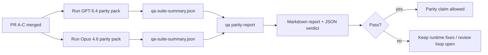

---
x-i18n:
    generated_at: "2026-04-11T15:15:51Z"
    model: gpt-5.4
    provider: openai
    source_hash: 910bcf7668becf182ef48185b43728bf2fa69629d6d50189d47d47b06f807a9e
    source_path: help/gpt54-codex-agentic-parity-maintainers.md
    workflow: 15
---

# ملاحظات الصيانة لتكافؤ GPT-5.4 / Codex

تشرح هذه الملاحظة كيفية مراجعة برنامج تكافؤ GPT-5.4 / Codex بوصفه أربع وحدات دمج، من دون فقدان البنية الأصلية ذات العقود الستة.

## وحدات الدمج

### طلب السحب A: التنفيذ الصارم القائم على الوكلاء

يشمل:

- `executionContract`
- المتابعة في نفس الدور مع إعطاء الأولوية لـ GPT-5
- `update_plan` كتتبّع غير نهائي للتقدم
- حالات التعذر الصريحة بدلًا من التوقفات الصامتة المعتمدة على الخطة فقط

لا يشمل:

- تصنيف فشل المصادقة/بيئة التشغيل
- الصدق في الأذونات
- إعادة تصميم إعادة التشغيل/الاستئناف
- قياس التكافؤ

### طلب السحب B: الصدق في بيئة التشغيل

يشمل:

- صحة نطاق Codex OAuth
- التصنيف المطبوع لفشل المزوّد/بيئة التشغيل
- الصدق في إتاحة `/elevated full` وأسباب التعذر

لا يشمل:

- توحيد مخطط الأدوات
- حالة إعادة التشغيل/الحيوية
- بوابة القياس

### طلب السحب C: صحة التنفيذ

يشمل:

- توافق الأدوات المملوكة للمزوّد مع OpenAI/Codex
- التعامل الصارم مع المخطط الخالي من المعلمات
- إظهار حالات إعادة التشغيل غير الصالحة
- إظهار حالة المهام الطويلة عند التوقف المؤقت أو التعذر أو الهجر

لا يشمل:

- الاستئناف الذي يقرره النظام ذاتيًا
- سلوك لهجة Codex العامة خارج خطافات المزوّد
- بوابة القياس

### طلب السحب D: أداة اختبار التكافؤ

يشمل:

- الحزمة الأولى من السيناريوهات لـ GPT-5.4 مقابل Opus 4.6
- توثيق التكافؤ
- تقرير التكافؤ وآليات بوابة الإصدار

لا يشمل:

- تغييرات سلوك بيئة التشغيل خارج QA-lab
- محاكاة المصادقة/الوكيل/DNS داخل أداة الاختبار

## الربط بالعقود الستة الأصلية

| العقد الأصلي                              | وحدة الدمج |
| ----------------------------------------- | ---------- |
| صحة النقل/المصادقة لدى المزوّد            | طلب السحب B |
| توافق عقد الأداة/المخطط                   | طلب السحب C |
| التنفيذ في نفس الدور                      | طلب السحب A |
| الصدق في الأذونات                         | طلب السحب B |
| صحة إعادة التشغيل/الاستئناف/الحيوية      | طلب السحب C |
| بوابة القياس/الإصدار                      | طلب السحب D |

## ترتيب المراجعة

1. طلب السحب A
2. طلب السحب B
3. طلب السحب C
4. طلب السحب D

طلب السحب D هو طبقة الإثبات. يجب ألا يكون سببًا في تأخير طلبات السحب الخاصة بصحة بيئة التشغيل.

## ما الذي يجب البحث عنه

### طلب السحب A

- تشغيلات GPT-5 تنفذ أو تفشل بشكل مغلق بدلًا من التوقف عند التعليق
- لم يعد `update_plan` يبدو وكأنه تقدم بحد ذاته
- يظل السلوك مع إعطاء الأولوية لـ GPT-5 وضمن نطاق embedded-Pi

### طلب السحب B

- لم تعد حالات فشل المصادقة/الوكيل/بيئة التشغيل تنهار في معالجة عامة من نوع "فشل النموذج"
- لا يتم وصف `/elevated full` بأنه متاح إلا عندما يكون متاحًا فعلًا
- تكون أسباب التعذر مرئية لكل من النموذج وبيئة التشغيل المواجهة للمستخدم

### طلب السحب C

- يعمل تسجيل الأدوات الصارم في OpenAI/Codex بطريقة متوقعة
- لا تفشل الأدوات الخالية من المعلمات في فحوصات المخطط الصارمة
- تحافظ نتائج إعادة التشغيل والضغط على حالة حيوية صادقة

### طلب السحب D

- تكون حزمة السيناريوهات مفهومة وقابلة لإعادة الإنتاج
- تتضمن الحزمة مسار أمان إعادة تشغيل متحوّل، وليس تدفقات للقراءة فقط
- تكون التقارير قابلة للقراءة من قبل البشر والأتمتة
- تكون ادعاءات التكافؤ مدعومة بالأدلة وليست قصصية

المخرجات المتوقعة من طلب السحب D:

- `qa-suite-report.md` / `qa-suite-summary.json` لكل تشغيل نموذج
- `qa-agentic-parity-report.md` مع مقارنة مجمعة وعلى مستوى السيناريو
- `qa-agentic-parity-summary.json` مع قرار مقروء آليًا

## بوابة الإصدار

لا تدّعِ وجود تكافؤ أو تفوق لـ GPT-5.4 على Opus 4.6 حتى:

- يتم دمج طلبات السحب A وB وC
- يشغّل طلب السحب D حزمة التكافؤ الأولى بنجاح كامل
- تظل مجموعات انحدار الصدق في بيئة التشغيل خضراء
- يُظهر تقرير التكافؤ عدم وجود حالات نجاح زائف وعدم وجود تراجع في سلوك التوقف

أداة اختبار التكافؤ ليست مصدر الأدلة الوحيد. أبقِ هذا الفصل واضحًا في المراجعة:

- يملك طلب السحب D المقارنة القائمة على السيناريو بين GPT-5.4 وOpus 4.6
- وما تزال المجموعات الحتمية في طلب السحب B هي المالكة لأدلة المصادقة/الوكيل/DNS وصدق الوصول الكامل

## خريطة الهدف إلى الدليل

| عنصر بوابة الإكمال                       | المالك الأساسي | مخرج المراجعة                                                       |
| ---------------------------------------- | -------------- | ------------------------------------------------------------------- |
| عدم وجود توقفات تعتمد على الخطة فقط      | طلب السحب A    | اختبارات بيئة التشغيل الصارمة القائمة على الوكلاء و`approval-turn-tool-followthrough` |
| عدم وجود تقدم زائف أو إتمام أداة زائف    | طلب السحب A + D | عدد حالات النجاح الزائف في التكافؤ مع تفاصيل التقرير على مستوى السيناريو |
| عدم وجود إرشادات خاطئة حول `/elevated full` | طلب السحب B    | مجموعات الصدق الحتمية في بيئة التشغيل                              |
| بقاء إخفاقات إعادة التشغيل/الحيوية صريحة | طلب السحب C + D | مجموعات lifecycle/replay بالإضافة إلى `compaction-retry-mutating-tool` |
| أن يطابق GPT-5.4 أو يتفوق على Opus 4.6   | طلب السحب D    | `qa-agentic-parity-report.md` و`qa-agentic-parity-summary.json`     |

## صياغة مختصرة للمراجع: قبل مقابل بعد

| المشكلة المرئية للمستخدم سابقًا                            | إشارة المراجعة لاحقًا                                                                      |
| ---------------------------------------------------------- | ------------------------------------------------------------------------------------------ |
| كان GPT-5.4 يتوقف بعد التخطيط                              | يُظهر طلب السحب A سلوكًا ينفذ أو يتعذر بدلًا من الاكتمال القائم على التعليق فقط          |
| بدا استخدام الأدوات هشًا مع مخططات OpenAI/Codex الصارمة   | يحافظ طلب السحب C على إمكانية التنبؤ بتسجيل الأدوات واستدعائها من دون معلمات            |
| كانت تلميحات `/elevated full` مضللة أحيانًا               | يربط طلب السحب B الإرشاد بقدرة بيئة التشغيل الفعلية وأسباب التعذر                        |
| كان يمكن أن تختفي المهام الطويلة داخل غموض إعادة التشغيل/الضغط | يُصدر طلب السحب C حالات صريحة للتوقف المؤقت والتعذر والهجر وإعادة التشغيل غير الصالحة |
| كانت ادعاءات التكافؤ قصصية                                | يُنتج طلب السحب D تقريرًا بالإضافة إلى قرار JSON مع التغطية نفسها للسيناريوهات على كلا النموذجين |
