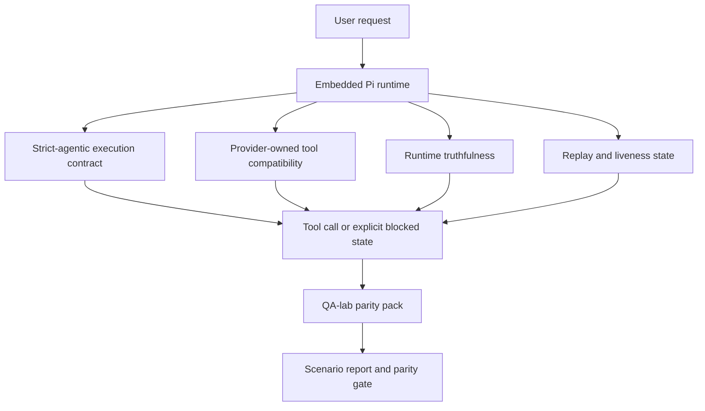
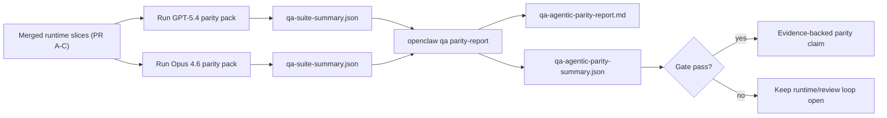

---
read_when:
    - تصحيح سلوك الوكيل في GPT-5.4 أو Codexassistant to=functions.read వ్యాఖ్యary  微信公众号天天中彩票{"path":"docs/help/gpt-5.4-codex-agentic-parity.md"}
    - مقارنة السلوك الوكيلي في OpenClaw عبر النماذج الرائدة المختلفة
    - مراجعة إصلاحات strict-agentic، ومخطط الأدوات، وelevation، وإعادة التشغيل
summary: كيف يسد OpenClaw فجوات التنفيذ الوكيلي في GPT-5.4 والنماذج على نمط Codex
title: تكافؤ السلوك الوكيلي لـ GPT-5.4 / Codex
x-i18n:
    generated_at: "2026-04-24T07:45:50Z"
    model: gpt-5.4
    provider: openai
    source_hash: 9f8c7dcf21583e6dbac80da9ddd75f2dc9af9b80801072ade8fa14b04258d4dc
    source_path: help/gpt54-codex-agentic-parity.md
    workflow: 15
---

# تكافؤ السلوك الوكيلي لـ GPT-5.4 / Codex في OpenClaw

كان OpenClaw يعمل بالفعل بشكل جيد مع النماذج الرائدة التي تستخدم الأدوات، لكن نماذج GPT-5.4 والنماذج على نمط Codex كانت لا تزال دون المستوى في بعض الجوانب العملية:

- يمكنها التوقف بعد التخطيط بدلًا من تنفيذ العمل
- يمكنها استخدام مخططات أدوات OpenAI/Codex الصارمة بشكل غير صحيح
- يمكنها طلب `/elevated full` حتى عندما يكون الوصول الكامل مستحيلًا
- يمكنها فقدان حالة المهام طويلة التشغيل أثناء إعادة التشغيل أو Compaction
- كانت ادعاءات التكافؤ مع Claude Opus 4.6 تستند إلى روايات متفرقة بدلًا من سيناريوهات قابلة للتكرار

يعالج برنامج التكافؤ هذا هذه الفجوات في أربع شرائح قابلة للمراجعة.

## ما الذي تغيّر

### PR A: تنفيذ strict-agentic

تضيف هذه الشريحة عقد تنفيذ `strict-agentic` اختياريًا لتشغيلات Pi GPT-5 المضمنة.

عند تفعيله، يتوقف OpenClaw عن قبول الأدوار التي تكتفي بالخطة على أنها إكمال "جيد بما يكفي". فإذا اكتفى النموذج بقول ما ينوي فعله ولم يستخدم الأدوات فعليًا أو يحرز تقدمًا، يعيد OpenClaw المحاولة مع توجيه ينص على "نفّذ الآن"، ثم يفشل بشكل مغلق مع حالة حظر صريحة بدلًا من إنهاء المهمة بصمت.

ويحسن هذا تجربة GPT-5.4 أكثر ما يكون في:

- متابعات قصيرة من نوع "حسنًا افعلها"
- مهام البرمجة التي تكون فيها الخطوة الأولى واضحة
- التدفقات التي يجب أن تكون فيها `update_plan` لتتبع التقدم بدلًا من نص حشو

### PR B: الصدق وقت التشغيل

تجعل هذه الشريحة OpenClaw يقول الحقيقة بشأن أمرين:

- لماذا فشل استدعاء provider/وقت التشغيل
- وما إذا كان `/elevated full` متاحًا فعليًا

وهذا يعني أن GPT-5.4 يحصل على إشارات أفضل من وقت التشغيل بشأن نقص النطاق، وفشل تحديث المصادقة، وأخطاء مصادقة HTML 403، ومشكلات الوكيل، وأخطاء DNS أو انتهاء المهلة، وأوضاع الوصول الكامل المحظورة. ويصبح احتمال أن يختلق النموذج علاجًا خاطئًا أو يستمر في طلب وضع أذونات لا يمكن لوقت التشغيل توفيره أقل.

### PR C: صحة التنفيذ

تحسن هذه الشريحة نوعين من الصحة:

- توافق مخطط الأدوات OpenAI/Codex المملوك للـ provider
- وإظهار قابلية الملاحظة لإعادة التشغيل واستمرارية المهام الطويلة

يقلل عمل توافق الأدوات من احتكاك المخطط عند تسجيل أدوات OpenAI/Codex الصارمة، خصوصًا حول الأدوات من دون معلمات وتوقعات الجذر الصارمة للكائنات. أما عمل إعادة التشغيل/الاستمرارية فيجعل المهام طويلة التشغيل أكثر قابلية للملاحظة، بحيث تصبح الحالات المتوقفة مؤقتًا، والمحظورة، والمتروكة مرئية بدلًا من أن تختفي داخل نص فشل عام.

### PR D: حزمة التكافؤ

تضيف هذه الشريحة أول حزمة تكافؤ من qa-lab بحيث يمكن تمرين GPT-5.4 وOpus 4.6 عبر السيناريوهات نفسها ومقارنتهما باستخدام أدلة مشتركة.

حزمة التكافؤ هي طبقة الإثبات. وهي لا تغيّر سلوك وقت التشغيل بحد ذاتها.

بعد أن يصبح لديك ملفا `qa-suite-summary.json`، أنشئ مقارنة بوابة الإصدار باستخدام:

```bash
pnpm openclaw qa parity-report \
  --repo-root . \
  --candidate-summary .artifacts/qa-e2e/gpt54/qa-suite-summary.json \
  --baseline-summary .artifacts/qa-e2e/opus46/qa-suite-summary.json \
  --output-dir .artifacts/qa-e2e/parity
```

يكتب هذا الأمر:

- تقرير Markdown قابلًا للقراءة البشرية
- وقرارًا بصيغة JSON قابلة للقراءة آليًا
- ونتيجة بوابة `pass` / `fail` صريحة

## لماذا يحسن هذا GPT-5.4 عمليًا

قبل هذا العمل، كان GPT-5.4 على OpenClaw قد يبدو أقل سلوكًا وكيليًا من Opus في جلسات البرمجة الفعلية لأن وقت التشغيل كان يتسامح مع سلوكيات تضر بنماذج نمط GPT-5 بشكل خاص:

- أدوار تقتصر على التعليق
- احتكاك مخطط الأدوات
- تغذية راجعة غامضة حول الأذونات
- تعطل صامت في إعادة التشغيل أو Compaction

الهدف ليس جعل GPT-5.4 يقلّد Opus. بل الهدف هو منح GPT-5.4 عقد وقت تشغيل يكافئ التقدم الحقيقي، ويوفر دلالات أنظف للأدوات والأذونات، ويحوّل أوضاع الفشل إلى حالات صريحة قابلة للقراءة آليًا وبشريًا.

وهذا يغيّر تجربة المستخدم من:

- "كان لدى النموذج خطة جيدة لكنه توقف"

إلى:

- "إما أن النموذج نفّذ، أو أن OpenClaw أظهر السبب الدقيق لعدم قدرته على التنفيذ"

## قبل هذا البرنامج وبعده لمستخدمي GPT-5.4

| قبل هذا البرنامج | بعد PR A-D |
| ---------------- | ---------- |
| كان بإمكان GPT-5.4 التوقف بعد خطة معقولة من دون اتخاذ خطوة الأداة التالية | PR A يحوّل "الخطة فقط" إلى "نفّذ الآن أو أظهر حالة حظر" |
| كانت مخططات الأدوات الصارمة قد ترفض الأدوات الخالية من المعلمات أو الأدوات ذات الشكل OpenAI/Codex بطرق مربكة | PR C يجعل تسجيل الأدوات واستدعاءها من النوع المملوك للـ provider أكثر قابلية للتنبؤ |
| كانت توجيهات `/elevated full` قد تكون غامضة أو خاطئة في أوقات التشغيل المحظورة | PR B يمنح GPT-5.4 والمستخدم تلميحات صادقة عن وقت التشغيل والأذونات |
| كانت إخفاقات إعادة التشغيل أو Compaction قد توحي بأن المهمة اختفت بصمت | PR C يُظهر بوضوح نتائج التوقف المؤقت، والحظر، والهجر، وعدم صلاحية إعادة التشغيل |
| كانت عبارة "GPT-5.4 أسوأ من Opus" في الغالب مجرد روايات | PR D يحوّل ذلك إلى حزمة السيناريوهات نفسها، والمقاييس نفسها، وبوابة نجاح/فشل صارمة |

## البنية



## تدفق الإصدار



## حزمة السيناريوهات

تغطي حزمة التكافؤ للموجة الأولى حاليًا خمسة سيناريوهات:

### `approval-turn-tool-followthrough`

يتحقق من أن النموذج لا يتوقف عند "سأفعل ذلك" بعد موافقة قصيرة. بل يجب أن يتخذ أول إجراء ملموس في الدور نفسه.

### `model-switch-tool-continuity`

يتحقق من أن العمل الذي يستخدم الأدوات يظل مترابطًا عبر حدود تبديل النموذج/وقت التشغيل بدلًا من أن يعيد الضبط إلى تعليق أو يفقد سياق التنفيذ.

### `source-docs-discovery-report`

يتحقق من أن النموذج يمكنه قراءة المصدر والوثائق، وتركيب النتائج، ومواصلة المهمة بشكل وكيلي بدلًا من إنتاج ملخص سطحي ثم التوقف مبكرًا.

### `image-understanding-attachment`

يتحقق من أن المهام متعددة الأنماط التي تتضمن مرفقات تبقى قابلة للتنفيذ ولا تنهار إلى سرد غامض.

### `compaction-retry-mutating-tool`

يتحقق من أن المهمة التي تتضمن كتابة تغييرية حقيقية تبقي عدم أمان إعادة التشغيل صريحًا بدلًا من أن تبدو آمنة لإعادة التشغيل بهدوء إذا خضعت العملية لـ Compaction أو إعادة محاولة أو فقدت حالة الرد تحت الضغط.

## مصفوفة السيناريوهات

| السيناريو | ما الذي يختبره | سلوك GPT-5.4 الجيد | إشارة الفشل |
| --------- | -------------- | ------------------ | ----------- |
| `approval-turn-tool-followthrough` | أدوار الموافقة القصيرة بعد خطة | يبدأ أول إجراء أداة ملموس فورًا بدلًا من إعادة صياغة النية | متابعة بالخطة فقط، أو من دون نشاط أداة، أو دور محظور من دون مانع حقيقي |
| `model-switch-tool-continuity` | تبديل وقت التشغيل/النموذج أثناء استخدام الأدوات | يحافظ على سياق المهمة ويواصل العمل بشكل مترابط | يعيد الضبط إلى تعليق، أو يفقد سياق الأداة، أو يتوقف بعد التبديل |
| `source-docs-discovery-report` | قراءة المصدر + التركيب + الإجراء | يعثر على المصادر، ويستخدم الأدوات، وينتج تقريرًا مفيدًا من دون تعطل | ملخص سطحي، أو غياب عمل الأدوات، أو توقف في دور غير مكتمل |
| `image-understanding-attachment` | عمل وكيلي مدفوع بالمرفقات | يفسر المرفق، ويربطه بالأدوات، ويواصل المهمة | سرد غامض، أو تجاهل للمرفق، أو غياب إجراء تالٍ ملموس |
| `compaction-retry-mutating-tool` | عمل تغييري تحت ضغط Compaction | ينفذ كتابة حقيقية ويبقي عدم أمان إعادة التشغيل صريحًا بعد الأثر الجانبي | تحدث كتابة تغييرية لكن يتم الإيحاء بأمان إعادة التشغيل أو يكون غائبًا أو متناقضًا |

## بوابة الإصدار

لا يمكن اعتبار GPT-5.4 مكافئًا أو أفضل إلا عندما يجتاز وقت التشغيل المدمج حزمة التكافؤ وانحدارات الصدق في وقت التشغيل في الوقت نفسه.

النتائج المطلوبة:

- لا يوجد تعطل عند الخطة فقط عندما يكون إجراء الأداة التالي واضحًا
- لا يوجد إكمال زائف من دون تنفيذ حقيقي
- لا توجد توجيهات خاطئة لـ `/elevated full`
- لا يوجد هجر صامت بسبب إعادة التشغيل أو Compaction
- مقاييس حزمة التكافؤ لا تقل قوة عن خط الأساس المتفق عليه لـ Opus 4.6

بالنسبة إلى أداة الموجة الأولى، تقارن البوابة بين:

- معدل الإكمال
- معدل التوقف غير المقصود
- معدل استدعاءات الأدوات الصالحة
- عدد النجاحات الزائفة

يتم تقسيم دليل التكافؤ عمدًا على طبقتين:

- يثبت PR D سلوك GPT-5.4 مقابل Opus 4.6 على السيناريوهات نفسها باستخدام QA-lab
- وتثبت مجموعات PR B الحتمية صدق المصادقة والوكيل وDNS و`/elevated full` خارج الأداة

## مصفوفة الهدف إلى الدليل

| عنصر بوابة الإكمال | PR المسؤول | مصدر الدليل | إشارة النجاح |
| ------------------ | ---------- | ----------- | ------------ |
| لم يعد GPT-5.4 يتعطل بعد التخطيط | PR A | `approval-turn-tool-followthrough` بالإضافة إلى مجموعات وقت التشغيل في PR A | تؤدي أدوار الموافقة إلى عمل حقيقي أو حالة حظر صريحة |
| لم يعد GPT-5.4 يزيّف التقدم أو إكمال الأداة الزائف | PR A + PR D | نتائج سيناريوهات تقرير التكافؤ وعدد النجاحات الزائفة | لا توجد نتائج نجاح مشبوهة ولا إكمال يقتصر على التعليق |
| لم يعد GPT-5.4 يقدم توجيهًا خاطئًا لـ `/elevated full` | PR B | مجموعات الصدق الحتمية | تبقى أسباب الحظر وتلميحات الوصول الكامل دقيقة بالنسبة لوقت التشغيل |
| تبقى إخفاقات إعادة التشغيل/الاستمرارية صريحة | PR C + PR D | مجموعات دورة الحياة/إعادة التشغيل في PR C بالإضافة إلى `compaction-retry-mutating-tool` | يبقي العمل التغييري عدم أمان إعادة التشغيل صريحًا بدلًا من اختفائه بصمت |
| يطابق GPT-5.4 أو يتفوق على Opus 4.6 في المقاييس المتفق عليها | PR D | `qa-agentic-parity-report.md` و`qa-agentic-parity-summary.json` | تغطية السيناريوهات نفسها وعدم وجود انحدار في الإكمال أو سلوك التوقف أو الاستخدام الصحيح للأدوات |

## كيفية قراءة قرار التكافؤ

استخدم القرار الموجود في `qa-agentic-parity-summary.json` باعتباره القرار النهائي القابل للقراءة آليًا لحزمة التكافؤ في الموجة الأولى.

- تعني `pass` أن GPT-5.4 غطى السيناريوهات نفسها التي غطاها Opus 4.6 ولم يتراجع في المقاييس التجميعية المتفق عليها.
- تعني `fail` أن بوابة صارمة واحدة على الأقل قد تعثرت: إكمال أضعف، أو توقفات غير مقصودة أسوأ، أو استخدام أضعف صالح للأدوات، أو أي حالة نجاح زائف، أو عدم تطابق في تغطية السيناريوهات.
- لا تُعد “shared/base CI issue” بحد ذاتها نتيجة تكافؤ. فإذا منعت ضوضاء CI خارج PR D تشغيلًا ما، فيجب أن ينتظر القرار تنفيذًا نظيفًا لوقت تشغيل مدمج بدلًا من استنتاجه من سجلات تعود إلى مرحلة الفرع.
- لا تزال دقة المصادقة والوكيل وDNS و`/elevated full` تأتي من المجموعات الحتمية في PR B، لذا فإن ادعاء الإصدار النهائي يحتاج إلى الأمرين معًا: قرار تكافؤ ناجح من PR D وتغطية صدق خضراء من PR B.

## من الذي ينبغي أن يفعّل `strict-agentic`

استخدم `strict-agentic` عندما:

- يُتوقع من الوكيل أن يتصرف فورًا عندما تكون الخطوة التالية واضحة
- تكون GPT-5.4 أو النماذج من عائلة Codex هي وقت التشغيل الأساسي
- تفضّل الحالات المحظورة الصريحة على الردود "المفيدة" التي تقتصر على إعادة التلخيص

أبقِ العقد الافتراضي عندما:

- تريد السلوك الحالي الأكثر مرونة
- لا تستخدم نماذج من عائلة GPT-5
- تختبر prompts بدلًا من فرض وقت التشغيل

## ذو صلة

- [ملاحظات صيانة تكافؤ GPT-5.4 / Codex](/ar/help/gpt54-codex-agentic-parity-maintainers)
