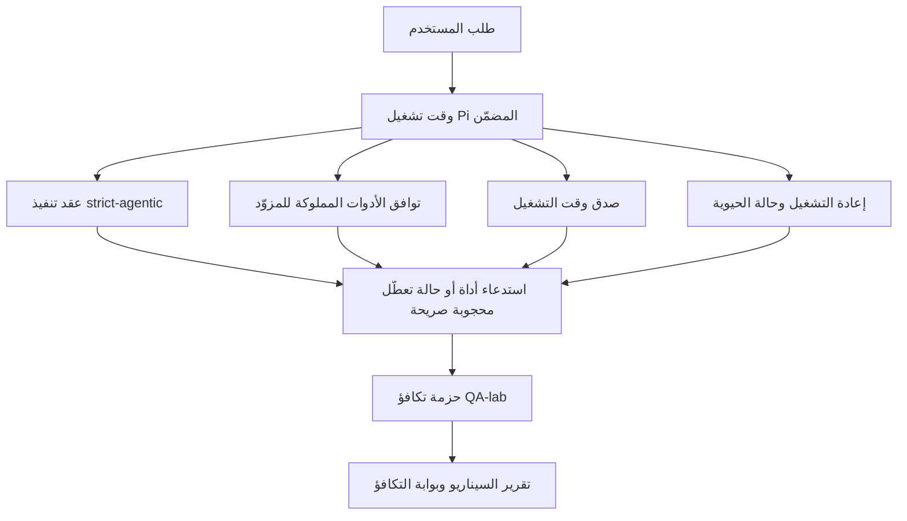

---
x-i18n:
    generated_at: "2026-04-11T15:15:51Z"
    model: gpt-5.4
    provider: openai
    source_hash: 7ee6b925b8a0f8843693cea9d50b40544657b5fb8a9e0860e2ff5badb273acb6
    source_path: help/gpt54-codex-agentic-parity.md
    workflow: 15
---

# التكافؤ الوكيلي بين GPT-5.4 / Codex في OpenClaw

كان OpenClaw يعمل بالفعل بشكل جيد مع النماذج الرائدة التي تستخدم الأدوات، لكن نماذج GPT-5.4 وCodex-style كانت لا تزال أقل أداءً في بعض الجوانب العملية:

- كان يمكنها التوقف بعد التخطيط بدلًا من تنفيذ العمل
- كان يمكنها استخدام مخططات أدوات OpenAI/Codex الصارمة بشكل غير صحيح
- كان يمكنها طلب `/elevated full` حتى عندما يكون الوصول الكامل مستحيلًا
- كان يمكنها فقدان حالة المهام طويلة التشغيل أثناء إعادة التشغيل أو الضغط
- كانت ادعاءات التكافؤ مقارنةً بـ Claude Opus 4.6 تستند إلى روايات فردية بدلًا من سيناريوهات قابلة للتكرار

يعالج برنامج التكافؤ هذا هذه الفجوات عبر أربع شرائح قابلة للمراجعة.

## ما الذي تغيّر

### طلب السحب A: تنفيذ strict-agentic

تضيف هذه الشريحة عقد تنفيذ `strict-agentic` اختياريًا لتشغيلات Pi GPT-5 المضمّنة.

عند تفعيله، يتوقف OpenClaw عن قبول الأدوار التي تحتوي على خطة فقط باعتبارها إكمالًا “جيدًا بما يكفي”. إذا اكتفى النموذج بقول ما ينوي فعله ولم يستخدم الأدوات فعليًا أو يحرز تقدمًا، يعيد OpenClaw المحاولة بتوجيه ينص على التنفيذ الفوري، ثم يفشل بشكل مغلق مع حالة تعطّل صريحة بدلًا من إنهاء المهمة بصمت.

ويحسّن ذلك تجربة GPT-5.4 بشكل خاص في الحالات التالية:

- المتابعات القصيرة مثل “حسنًا افعل ذلك”
- مهام البرمجة حيث تكون الخطوة الأولى واضحة
- التدفقات التي يجب أن يكون فيها `update_plan` لتتبع التقدم بدلًا من كونه نصًا حشوًا

### طلب السحب B: صدق وقت التشغيل

تجعل هذه الشريحة OpenClaw يقول الحقيقة بشأن أمرين:

- سبب فشل استدعاء المزوّد/وقت التشغيل
- ما إذا كان `/elevated full` متاحًا فعلًا

وهذا يعني أن GPT-5.4 يحصل على إشارات أفضل من وقت التشغيل بشأن نقص النطاق، وإخفاقات تحديث المصادقة، وإخفاقات المصادقة عبر HTML 403، ومشكلات الوكيل، وأعطال DNS أو المهلات، وأوضاع الوصول الكامل المحجوبة. ويصبح النموذج أقل عرضة لاختلاق معالجة خاطئة أو الاستمرار في طلب وضع أذونات لا يستطيع وقت التشغيل توفيره.

### طلب السحب C: صحة التنفيذ

تحسّن هذه الشريحة نوعين من الصحة:

- توافق مخططات الأدوات المملوكة للمزوّد مع OpenAI/Codex
- إظهار إعادة التشغيل وحيوية المهام الطويلة

يقلل عمل التوافق مع الأدوات من الاحتكاك المتعلق بالمخططات عند تسجيل أدوات OpenAI/Codex الصارمة، خصوصًا حول الأدوات التي لا تحتوي على معلمات وتوقعات الجذر الصارمة من نوع object. أما عمل إعادة التشغيل/الحيوية فيجعل المهام طويلة التشغيل أكثر قابلية للملاحظة، بحيث تصبح الحالات المتوقفة مؤقتًا، والمحجوبة، والمتروكة مرئية بدلًا من أن تختفي داخل نص فشل عام.

### طلب السحب D: حزمة التكافؤ

تضيف هذه الشريحة أول حزمة تكافؤ من QA-lab حتى يمكن اختبار GPT-5.4 وOpus 4.6 عبر السيناريوهات نفسها ومقارنتهما باستخدام أدلة مشتركة.

تمثل حزمة التكافؤ طبقة الإثبات. وهي لا تغيّر سلوك وقت التشغيل بحد ذاتها.

بعد أن يصبح لديك عنصران من `qa-suite-summary.json`، أنشئ مقارنة بوابة الإصدار باستخدام:

```bash
pnpm openclaw qa parity-report \
  --repo-root . \
  --candidate-summary .artifacts/qa-e2e/gpt54/qa-suite-summary.json \
  --baseline-summary .artifacts/qa-e2e/opus46/qa-suite-summary.json \
  --output-dir .artifacts/qa-e2e/parity
```

يكتب هذا الأمر ما يلي:

- تقرير Markdown قابل للقراءة البشرية
- حكم JSON قابل للقراءة آليًا
- نتيجة بوابة صريحة `pass` / `fail`

## لماذا يحسّن هذا GPT-5.4 عمليًا

قبل هذا العمل، كان يمكن أن يبدو GPT-5.4 على OpenClaw أقل وكالية من Opus في جلسات البرمجة الفعلية لأن وقت التشغيل كان يتسامح مع سلوكيات تضر نماذج GPT-5-style بشكل خاص:

- أدوار تعتمد على التعليق فقط
- احتكاك في المخططات حول الأدوات
- ملاحظات أذونات غامضة
- أعطال صامتة في إعادة التشغيل أو الضغط

الهدف ليس جعل GPT-5.4 يقلّد Opus. بل الهدف هو منح GPT-5.4 عقد وقت تشغيل يكافئ التقدم الحقيقي، ويوفر دلالات أنظف للأدوات والأذونات، ويحوّل أوضاع الفشل إلى حالات صريحة قابلة للقراءة آليًا وبشريًا.

وهذا يغيّر تجربة المستخدم من:

- “كان لدى النموذج خطة جيدة لكنه توقّف”

إلى:

- “إما أن النموذج نفّذ، أو أن OpenClaw أظهر السبب الدقيق الذي منعه من ذلك”

## قبل وبعد لمستخدمي GPT-5.4

| قبل هذا البرنامج                                                                            | بعد طلبات السحب A-D                                                                     |
| -------------------------------------------------------------------------------------------- | --------------------------------------------------------------------------------------- |
| كان يمكن لـ GPT-5.4 أن يتوقف بعد خطة معقولة من دون اتخاذ خطوة الأداة التالية                | يحوّل طلب السحب A حالة “خطة فقط” إلى “نفّذ الآن أو أظهر حالة تعطّل محجوبة”            |
| كان يمكن لمخططات الأدوات الصارمة أن ترفض الأدوات الخالية من المعلمات أو ذات شكل OpenAI/Codex بطرق مربكة | يجعل طلب السحب C تسجيل الأدوات المملوكة للمزوّد واستدعاءها أكثر قابلية للتنبؤ         |
| كان يمكن أن تكون إرشادات `/elevated full` غامضة أو خاطئة في بيئات التشغيل المحجوبة         | يمنح طلب السحب B كلًا من GPT-5.4 والمستخدم تلميحات صادقة عن وقت التشغيل والأذونات     |
| كان يمكن أن تبدو أعطال إعادة التشغيل أو الضغط وكأن المهمة اختفت بصمت                        | يُظهر طلب السحب C نتائج التوقف المؤقت، والحجب، والتخلي، وبطلان إعادة التشغيل بشكل صريح |
| كانت عبارة “GPT-5.4 أسوأ من Opus” في الغالب روايات فردية                                     | يحوّل طلب السحب D ذلك إلى حزمة السيناريوهات نفسها، والمقاييس نفسها، وبوابة نجاح/فشل صارمة |

## البنية المعمارية



## تدفق الإصدار


## حزمة السيناريوهات

تغطي حزمة التكافؤ للموجة الأولى حاليًا خمسة سيناريوهات:

### `approval-turn-tool-followthrough`

يتحقق من أن النموذج لا يتوقف عند “سأفعل ذلك” بعد موافقة قصيرة. يجب أن يتخذ أول إجراء ملموس في الدور نفسه.

### `model-switch-tool-continuity`

يتحقق من أن العمل القائم على الأدوات يظل متماسكًا عبر حدود تبديل النموذج/وقت التشغيل بدلًا من أن يعاد ضبطه إلى تعليق أو أن يفقد سياق التنفيذ.

### `source-docs-discovery-report`

يتحقق من أن النموذج يستطيع قراءة المصدر والوثائق، وتجميع النتائج، ومواصلة المهمة بشكل وكيلي بدلًا من إنتاج ملخص سطحي والتوقف مبكرًا.

### `image-understanding-attachment`

يتحقق من أن المهام المختلطة التي تتضمن مرفقات تبقى قابلة للتنفيذ ولا تنهار إلى سرد غامض.

### `compaction-retry-mutating-tool`

يتحقق من أن مهمة تتضمن كتابة تعديلية حقيقية تُبقي عدم أمان إعادة التشغيل صريحًا بدلًا من أن تبدو آمنة لإعادة التشغيل بهدوء إذا تعرّض التشغيل للضغط أو أُعيدت المحاولة أو فُقدت حالة الرد تحت الضغط.

## مصفوفة السيناريوهات

| السيناريو                           | ما الذي يختبره                           | السلوك الجيد من GPT-5.4                                                        | إشارة الفشل                                                                      |
| ----------------------------------- | ---------------------------------------- | ------------------------------------------------------------------------------ | -------------------------------------------------------------------------------- |
| `approval-turn-tool-followthrough`  | أدوار الموافقة القصيرة بعد خطة          | يبدأ أول إجراء أداة ملموس فورًا بدلًا من إعادة صياغة النية                    | متابعة بخطة فقط، أو دون نشاط أدوات، أو دور محجوب دون مانع حقيقي               |
| `model-switch-tool-continuity`      | تبديل وقت التشغيل/النموذج أثناء استخدام الأدوات | يحافظ على سياق المهمة ويواصل التنفيذ بشكل متماسك                              | يعاد ضبطه إلى تعليق، أو يفقد سياق الأدوات، أو يتوقف بعد التبديل               |
| `source-docs-discovery-report`      | قراءة المصدر + التجميع + الإجراء        | يعثر على المصادر، ويستخدم الأدوات، وينتج تقريرًا مفيدًا دون تعثر             | ملخص سطحي، أو غياب عمل الأدوات، أو توقف في دور غير مكتمل                      |
| `image-understanding-attachment`    | عمل وكيلي مدفوع بالمرفقات               | يفسر المرفق، ويربطه بالأدوات، ويواصل المهمة                                   | سرد غامض، أو تجاهل المرفق، أو عدم وجود إجراء تالٍ ملموس                       |
| `compaction-retry-mutating-tool`    | عمل تعديلي تحت ضغط الضغط                | ينفذ كتابة حقيقية ويُبقي عدم أمان إعادة التشغيل صريحًا بعد الأثر الجانبي      | تحدث كتابة تعديل، لكن يُفهم ضمنًا أن إعادة التشغيل آمنة، أو يكون ذلك مفقودًا أو متناقضًا |

## بوابة الإصدار

لا يمكن اعتبار GPT-5.4 عند مستوى التكافؤ أو أفضل إلا عندما يجتاز وقت التشغيل المدمج حزمة التكافؤ وانحدارات صدق وقت التشغيل في الوقت نفسه.

النتائج المطلوبة:

- عدم وجود تعثر عند خطة فقط عندما يكون إجراء الأداة التالي واضحًا
- عدم وجود إكمال مزيف من دون تنفيذ حقيقي
- عدم وجود إرشادات خاطئة بشأن `/elevated full`
- عدم وجود تخلٍ صامت عن إعادة التشغيل أو الضغط
- مقاييس حزمة التكافؤ تكون على الأقل بقوة خط الأساس المتفق عليه لـ Opus 4.6

بالنسبة إلى حزمة الموجة الأولى، تقارن البوابة ما يلي:

- معدل الإكمال
- معدل التوقف غير المقصود
- معدل استدعاء الأدوات الصحيح
- عدد النجاحات المزيفة

ينقسم دليل التكافؤ عمدًا إلى طبقتين:

- يثبت طلب السحب D سلوك GPT-5.4 مقابل Opus 4.6 في السيناريوهات نفسها باستخدام QA-lab
- وتثبت المجموعات الحتمية في طلب السحب B صدق المصادقة والوكيل وDNS و`/elevated full` خارج الحزمة

## مصفوفة الهدف إلى الدليل

| عنصر بوابة الإكمال                                     | طلب السحب المالك | مصدر الدليل                                                      | إشارة النجاح                                                                           |
| ------------------------------------------------------ | ---------------- | ---------------------------------------------------------------- | -------------------------------------------------------------------------------------- |
| لم يعد GPT-5.4 يتعثر بعد التخطيط                       | PR A             | `approval-turn-tool-followthrough` بالإضافة إلى مجموعات وقت تشغيل PR A | تؤدي أدوار الموافقة إلى عمل حقيقي أو إلى حالة تعطّل محجوبة صريحة                     |
| لم يعد GPT-5.4 يزيف التقدم أو إكمال الأداة المزيف      | PR A + PR D      | نتائج سيناريوهات تقرير التكافؤ وعدد النجاحات المزيفة            | عدم وجود نتائج نجاح مشبوهة وعدم وجود إكمال قائم على التعليق فقط                      |
| لم يعد GPT-5.4 يعطي إرشادات `/elevated full` خاطئة    | PR B             | مجموعات الصدق الحتمية                                            | تبقى أسباب الحجب وتلميحات الوصول الكامل دقيقة وفق وقت التشغيل                        |
| تبقى أعطال إعادة التشغيل/الحيوية صريحة                | PR C + PR D      | مجموعات دورة الحياة/إعادة التشغيل في PR C بالإضافة إلى `compaction-retry-mutating-tool` | يُبقي العمل التعديلي عدم أمان إعادة التشغيل صريحًا بدلًا من أن يختفي بصمت          |
| يطابق GPT-5.4 أو يتفوق على Opus 4.6 في المقاييس المتفق عليها | PR D             | `qa-agentic-parity-report.md` و`qa-agentic-parity-summary.json`  | التغطية نفسها للسيناريوهات وعدم وجود تراجع في الإكمال أو سلوك التوقف أو صحة استخدام الأدوات |

## كيفية قراءة حكم التكافؤ

استخدم الحكم الموجود في `qa-agentic-parity-summary.json` باعتباره القرار النهائي القابل للقراءة آليًا لحزمة التكافؤ الخاصة بالموجة الأولى.

- تعني `pass` أن GPT-5.4 غطّى السيناريوهات نفسها التي غطاها Opus 4.6 ولم يتراجع في المقاييس التجميعية المتفق عليها.
- تعني `fail` أن بوابة صارمة واحدة على الأقل قد تعثرت: إكمال أضعف، أو توقفات غير مقصودة أسوأ، أو استخدام صحيح أضعف للأدوات، أو أي حالة نجاح مزيف، أو تغطية سيناريوهات غير متطابقة.
- لا تُعد “مشكلة CI مشتركة/أساسية” بحد ذاتها نتيجة تكافؤ. إذا كان ضجيج CI خارج PR D يحجب تشغيلًا ما، فيجب أن ينتظر الحكم تنفيذًا نظيفًا لوقت تشغيل مدمج بدلًا من استنتاجه من سجلات مرحلة الفرع.
- لا تزال دقة المصادقة والوكيل وDNS و`/elevated full` تأتي من المجموعات الحتمية في PR B، لذلك يحتاج ادعاء الإصدار النهائي إلى الأمرين معًا: حكم تكافؤ ناجح من PR D وتغطية صدق خضراء من PR B.

## من الذي ينبغي له تفعيل `strict-agentic`

استخدم `strict-agentic` عندما:

- يُتوقع من الوكيل أن يتصرف فورًا عندما تكون الخطوة التالية واضحة
- تكون نماذج GPT-5.4 أو نماذج Codex-family هي وقت التشغيل الأساسي
- تفضّل الحالات المحجوبة الصريحة على الردود التي تقتصر على التلخيص “المفيد”

أبقِ العقد الافتراضي عندما:

- تريد السلوك الأرخى الحالي
- لا تستخدم نماذج GPT-5-family
- تختبر المطالبات بدلًا من فرض وقت التشغيل
