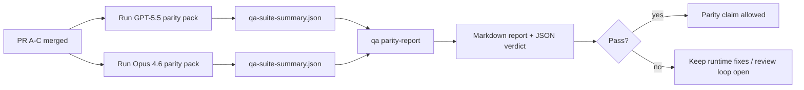

---
read_when:
    - مراجعة سلسلة طلبات السحب الخاصة بتكافؤ GPT-5.5 / Codex
    - صيانة البنية الوكيلية ذات العقود الستة التي يقوم عليها برنامج التكافؤ
summary: كيفية مراجعة برنامج تكافؤ GPT-5.5 / Codex بوصفه أربع وحدات دمج
title: ملاحظات المشرفين حول تكافؤ GPT-5.5 / Codex
x-i18n:
    generated_at: "2026-05-06T07:57:40Z"
    model: gpt-5.5
    provider: openai
    source_hash: 5752b4610f8b0d70b80d880ea10df75478b5f85ca431cdb73d3b61d745b23356
    source_path: help/gpt55-codex-agentic-parity-maintainers.md
    workflow: 16
---

تشرح هذه الملاحظة كيفية مراجعة برنامج تكافؤ GPT-5.5 / Codex بوصفه أربع وحدات دمج دون فقدان معمارية العقود الستة الأصلية.

## وحدات الدمج

### PR A: التنفيذ الوكيلي الصارم

يمتلك:

- `executionContract`
- متابعة GPT-5 أولاً ضمن نفس الدور
- `update_plan` كتتبع تقدم غير نهائي
- حالات حظر صريحة بدلاً من توقفات صامتة قائمة على الخطة فقط

لا يمتلك:

- تصنيف إخفاقات المصادقة/وقت التشغيل
- صدق الأذونات
- إعادة تصميم إعادة التشغيل/المتابعة
- قياس التكافؤ

### PR B: صدق وقت التشغيل

يمتلك:

- صحة نطاق OAuth في Codex
- تصنيف مكتوب لإخفاقات المزوّد/وقت التشغيل
- توفر `/elevated full` الصادق وأسباب الحظر

لا يمتلك:

- تطبيع مخطط الأداة
- حالة إعادة التشغيل/الحيوية
- بوابات القياس

### PR C: صحة التنفيذ

يمتلك:

- توافق أدوات OpenAI/Codex المملوك للمزوّد
- معالجة المخطط الصارم الخالي من المعاملات
- إظهار عدم صلاحية إعادة التشغيل
- وضوح حالة المهام الطويلة المتوقفة مؤقتاً، والمحظورة، والمتروكة

لا يمتلك:

- المتابعة ذاتية الاختيار
- سلوك لهجة Codex العامة خارج خطافات المزوّد
- بوابات القياس

### PR D: حزمة اختبار التكافؤ

يمتلك:

- حزمة سيناريوهات الموجة الأولى لمقارنة GPT-5.5 مع Opus 4.6
- توثيق التكافؤ
- تقرير التكافؤ وآليات بوابة الإصدار

لا يمتلك:

- تغييرات سلوك وقت التشغيل خارج QA-lab
- محاكاة المصادقة/الوكيل/DNS داخل حزمة الاختبار

## الربط بالعقود الستة الأصلية

| العقد الأصلي                            | وحدة الدمج |
| ---------------------------------------- | ---------- |
| صحة نقل/مصادقة المزوّد                  | PR B       |
| توافق عقد/مخطط الأداة                   | PR C       |
| التنفيذ ضمن نفس الدور                   | PR A       |
| صدق الأذونات                            | PR B       |
| صحة إعادة التشغيل/المتابعة/الحيوية      | PR C       |
| بوابة القياس/الإصدار                    | PR D       |

## ترتيب المراجعة

1. PR A
2. PR B
3. PR C
4. PR D

PR D هي طبقة الإثبات. ينبغي ألا تكون سبباً في تأخير PRs صحة وقت التشغيل.

## ما الذي يجب البحث عنه

### PR A

- تشغيلات GPT-5 تتصرف أو تفشل بإغلاق آمن بدلاً من التوقف عند التعليق
- لم يعد `update_plan` يبدو كتقدم بحد ذاته
- يبقى السلوك موجهاً إلى GPT-5 أولاً ومحصوراً في Pi المضمّن

### PR B

- تتوقف إخفاقات المصادقة/الوكيل/وقت التشغيل عن الانهيار إلى معالجة عامة من نوع "فشل النموذج"
- لا يوصف `/elevated full` بأنه متاح إلا عندما يكون متاحاً فعلاً
- تكون أسباب الحظر مرئية لكل من النموذج ووقت التشغيل المواجه للمستخدم

### PR C

- يعمل تسجيل أدوات OpenAI/Codex الصارم بشكل قابل للتنبؤ
- لا تفشل الأدوات الخالية من المعاملات في فحوصات المخطط الصارم
- تحفظ نتائج إعادة التشغيل وCompaction حالة حيوية صادقة

### PR D

- حزمة السيناريوهات مفهومة وقابلة لإعادة الإنتاج
- تتضمن الحزمة مسار سلامة إعادة تشغيل مُعدِّلاً، وليس تدفقات قراءة فقط
- التقارير قابلة للقراءة من البشر والأتمتة
- ادعاءات التكافؤ مدعومة بالأدلة، لا بالانطباعات

المخرجات المتوقعة من PR D:

- `qa-suite-report.md` / `qa-suite-summary.json` لكل تشغيل نموذج
- `qa-agentic-parity-report.md` مع مقارنة إجمالية وعلى مستوى السيناريو
- `qa-agentic-parity-summary.json` مع حكم قابل للقراءة آلياً

## بوابة الإصدار

لا تدّعِ تكافؤ GPT-5.5 أو تفوقه على Opus 4.6 حتى:

- يتم دمج PR A وPR B وPR C
- يشغّل PR D حزمة تكافؤ الموجة الأولى بنظافة
- تبقى حزم انحدار صدق وقت التشغيل خضراء
- يُظهر تقرير التكافؤ عدم وجود حالات نجاح زائف وعدم وجود انحدار في سلوك التوقف

حزمة اختبار التكافؤ ليست مصدر الأدلة الوحيد. أبقِ هذا الفصل صريحاً في المراجعة:

- يمتلك PR D المقارنة القائمة على السيناريوهات بين GPT-5.5 وOpus 4.6
- لا تزال حزم PR B الحتمية تمتلك أدلة صدق المصادقة/الوكيل/DNS والوصول الكامل

## سير عمل دمج سريع للمشرف

استخدم هذا عندما تكون جاهزاً لدمج PR تكافؤ وتريد تسلسلاً قابلاً للتكرار ومنخفض المخاطر.

1. أكّد أن حد الأدلة مستوفى قبل الدمج:
   - عرض قابل لإعادة الإنتاج أو اختبار فاشل
   - سبب جذري متحقق منه في الكود الملموس
   - إصلاح في المسار المعني
   - اختبار انحدار أو ملاحظة تحقق يدوية صريحة
2. فرز/وسم قبل الدمج:
   - طبّق أي تسميات إغلاق تلقائي `r:*` عندما لا ينبغي أن يندمج PR
   - أبقِ مرشحي الدمج خاليين من نقاشات الحظر غير المحلولة
3. تحقق محلياً على السطح الملموس:
   - `pnpm check:changed`
   - `pnpm test:changed` عندما تتغير الاختبارات أو تعتمد الثقة بإصلاح العلة على تغطية الاختبارات
4. ادمج باستخدام تدفق المشرف القياسي (عملية `/landpr`)، ثم تحقق من:
   - سلوك الإغلاق التلقائي للمشكلات المرتبطة
   - حالة CI وما بعد الدمج على `main`
5. بعد الدمج، شغّل بحث التكرارات لـ PRs/المشكلات المفتوحة ذات الصلة، وأغلق فقط بمرجع قانوني.

إذا كان أي عنصر من عناصر حد الأدلة مفقوداً، فاطلب تغييرات بدلاً من الدمج.

## خريطة الهدف إلى الدليل

| عنصر بوابة الإكمال                         | المالك الأساسي | أثر المراجعة                                                        |
| ------------------------------------------ | ------------- | ------------------------------------------------------------------- |
| لا توقفات قائمة على الخطة فقط              | PR A          | اختبارات وقت التشغيل الوكيلي الصارم و`approval-turn-tool-followthrough` |
| لا تقدم زائف أو إكمال أداة زائف            | PR A + PR D   | عدد حالات النجاح الزائف في التكافؤ مع تفاصيل تقرير مستوى السيناريو |
| لا إرشاد خاطئ لـ `/elevated full`          | PR B          | حزم صدق وقت التشغيل الحتمية                                         |
| تبقى إخفاقات إعادة التشغيل/الحيوية صريحة   | PR C + PR D   | حزم دورة الحياة/إعادة التشغيل مع `compaction-retry-mutating-tool`  |
| يطابق GPT-5.5 أو يتفوق على Opus 4.6        | PR D          | `qa-agentic-parity-report.md` و`qa-agentic-parity-summary.json`     |

## اختصار المراجع: قبل مقابل بعد

| المشكلة المرئية للمستخدم قبل                                 | إشارة المراجعة بعد                                                                  |
| ------------------------------------------------------------- | ------------------------------------------------------------------------------------ |
| توقف GPT-5.5 بعد التخطيط                                      | يبيّن PR A سلوك التصرف أو الحظر بدلاً من إكمال قائم على التعليق فقط                 |
| بدا استخدام الأدوات هشاً مع مخططات OpenAI/Codex الصارمة       | يحافظ PR C على قابلية التنبؤ في تسجيل الأدوات والاستدعاء الخالي من المعاملات        |
| كانت تلميحات `/elevated full` مضللة أحياناً                  | يربط PR B الإرشاد بقدرة وقت التشغيل الفعلية وأسباب الحظر                            |
| كانت المهام الطويلة قد تختفي في غموض إعادة التشغيل/Compaction | يصدر PR C حالات صريحة: متوقف مؤقتاً، محظور، متروك، وإعادة تشغيل غير صالحة          |
| كانت ادعاءات التكافؤ انطباعية                                  | ينتج PR D تقريراً مع حكم JSON وتغطية السيناريو نفسها على كلا النموذجين              |

## ذو صلة

- [تكافؤ GPT-5.5 / Codex الوكيلي](/ar/help/gpt55-codex-agentic-parity)
