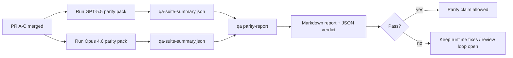

---
read_when:
    - مراجعة سلسلة طلبات السحب الخاصة بالتماثل بين GPT-5.5 وCodex
    - صيانة البنية الوكيلة ذات العقود الستة التي تقف وراء برنامج التماثل
summary: كيفية مراجعة برنامج التماثل بين GPT-5.5 وCodex بوصفه أربع وحدات دمج
title: ملاحظات المشرف بشأن التماثل بين GPT-5.5 وCodex
x-i18n:
    generated_at: "2026-04-25T18:20:09Z"
    model: gpt-5.4
    provider: openai
    source_hash: 8de69081f5985954b88583880c36388dc47116c3351c15d135b8ab3a660058e3
    source_path: help/gpt55-codex-agentic-parity-maintainers.md
    workflow: 15
---

تشرح هذه الملاحظة كيفية مراجعة برنامج التماثل بين GPT-5.5 وCodex بوصفه أربع وحدات دمج من دون فقدان البنية الأصلية ذات العقود الستة.

## وحدات الدمج

### PR A: التنفيذ الوكيلي الصارم

يمتلك:

- `executionContract`
- المتابعة ضمن الدور نفسه مع أولوية GPT-5
- `update_plan` بوصفه تتبعًا غير نهائي للتقدّم
- حالات التعطّل الصريحة بدلًا من التوقفات الصامتة المعتمدة على الخطة فقط

لا يمتلك:

- تصنيف أعطال المصادقة/التشغيل
- صدق الأذونات
- إعادة تصميم الإعادة/الاستمرار
- قياس التماثل

### PR B: الصدق في وقت التشغيل

يمتلك:

- صحة نطاق OAuth في Codex
- تصنيف أعطال المزوّد/وقت التشغيل المطبّعة
- التوفّر الصادق لـ `/elevated full` وأسباب التعطّل

لا يمتلك:

- تطبيع مخطط الأداة
- حالة الإعادة/الحيوية
- بوابة القياس المرجعي

### PR C: صحة التنفيذ

يمتلك:

- توافق أدوات OpenAI/Codex المملوك للمزوّد
- التعامل الصارم مع المخططات الخالية من المعلمات
- إظهار عدم صلاحية الإعادة
- وضوح حالة المهام الطويلة المتوقفة مؤقتًا، والمتعطلة، والمتروكة

لا يمتلك:

- الاستمرار المختار ذاتيًا
- سلوك لهجة Codex العامة خارج خطافات المزوّد
- بوابة القياس المرجعي

### PR D: حزام التماثل

يمتلك:

- الحزمة الأولى من سيناريوهات GPT-5.5 مقابل Opus 4.6
- توثيق التماثل
- آليات تقرير التماثل وبوابة الإصدار

لا يمتلك:

- تغييرات سلوك وقت التشغيل خارج QA-lab
- محاكاة المصادقة/الوكيل/‏DNS داخل الحزام

## الربط بالعقود الستة الأصلية

| العقد الأصلي                             | وحدة الدمج |
| ---------------------------------------- | ---------- |
| صحة نقل/مصادقة المزوّد                   | PR B       |
| توافق عقد/مخطط الأداة                    | PR C       |
| التنفيذ ضمن الدور نفسه                   | PR A       |
| صدق الأذونات                             | PR B       |
| صحة الإعادة/الاستمرار/الحيوية            | PR C       |
| بوابة القياس المرجعي/الإصدار             | PR D       |

## ترتيب المراجعة

1. PR A
2. PR B
3. PR C
4. PR D

يمثل PR D طبقة الإثبات. ولا ينبغي أن يكون سببًا لتأخير طلبات السحب الخاصة بصحة وقت التشغيل.

## ما الذي ينبغي البحث عنه

### PR A

- تعمل عمليات GPT-5 أو تفشل على نحو مغلق بدلًا من التوقف عند التعليقات
- لم يعد `update_plan` يبدو تقدمًا بحد ذاته
- يبقى السلوك ذا أولوية GPT-5 ومحصورًا في Pi المضمّن

### PR B

- لم تعد أعطال المصادقة/الوكيل/وقت التشغيل تنهار إلى معالجة عامة من نوع "فشل النموذج"
- لا يُوصَف `/elevated full` بأنه متاح إلا عندما يكون متاحًا بالفعل
- تكون أسباب التعطّل مرئية لكل من النموذج ووقت التشغيل الموجّه للمستخدم

### PR C

- يتصرف تسجيل أدوات OpenAI/Codex الصارم بطريقة متوقعة
- لا تفشل الأدوات الخالية من المعلمات في فحوصات المخطط الصارمة
- تحافظ نتائج الإعادة وCompaction على حالة حيوية صادقة

### PR D

- حزمة السيناريوهات مفهومة وقابلة لإعادة الإنتاج
- تتضمن الحزمة مسار أمان إعادة تغييريًا، وليس تدفقات للقراءة فقط
- تكون التقارير قابلة للقراءة من قبل البشر والأتمتة
- تكون ادعاءات التماثل مدعومة بالأدلة، لا بالانطباعات

الأصول المتوقعة من PR D:

- `qa-suite-report.md` / `qa-suite-summary.json` لكل تشغيل نموذج
- `qa-agentic-parity-report.md` مع مقارنة كلية وعلى مستوى السيناريو
- `qa-agentic-parity-summary.json` مع حكم قابل للقراءة آليًا

## بوابة الإصدار

لا تدّعِ تماثل GPT-5.5 مع Opus 4.6 أو تفوقه عليه حتى:

- يتم دمج PR A وPR B وPR C
- يشغّل PR D الحزمة الأولى للتماثل بنجاح كامل
- تبقى مجموعات الانحدار الخاصة بصدق وقت التشغيل خضراء
- يُظهر تقرير التماثل عدم وجود حالات نجاح زائف وعدم وجود تراجع في سلوك التوقف

ليس حزام التماثل هو المصدر الوحيد للأدلة. أبقِ هذا الفصل صريحًا في المراجعة:

- يمتلك PR D المقارنة المعتمدة على السيناريوهات بين GPT-5.5 وOpus 4.6
- وما تزال المجموعات الحتمية في PR B تمتلك أدلة المصادقة/الوكيل/‏DNS وصدق الوصول الكامل

## سير عمل دمج سريع للمشرف

استخدم هذا عندما تكون مستعدًا لإنزال طلب سحب خاص بالتماثل وتريد تسلسلًا قابلًا للتكرار ومنخفض المخاطر.

1. أكّد استيفاء معيار الأدلة قبل الدمج:
   - عرَض قابل لإعادة الإنتاج أو اختبار فاشل
   - سبب جذري تم التحقق منه في الشيفرة المعدّلة
   - إصلاح في المسار المتسبب
   - اختبار انحدار أو ملاحظة تحقق يدوي صريحة
2. أجرِ الفرز/الوسم قبل الدمج:
   - طبّق أي وسوم `r:*` للإغلاق التلقائي عندما لا ينبغي إنزال طلب السحب
   - أبقِ مرشحي الدمج خالين من سلاسل الحظر غير المحلولة
3. تحقّق محليًا على السطح المعدّل:
   - `pnpm check:changed`
   - `pnpm test:changed` عند تغيّر الاختبارات أو عندما تعتمد الثقة في إصلاح الخلل على تغطية الاختبارات
4. أنزِل التغيير باستخدام تدفق المشرف القياسي (عملية `/landpr`)، ثم تحقّق من:
   - سلوك الإغلاق التلقائي للمشكلات المرتبطة
   - CI وحالة ما بعد الدمج على `main`
5. بعد الإنزال، نفّذ بحثًا عن التكرارات لطلبات السحب/المشكلات المفتوحة ذات الصلة، ولا تُغلق إلا مع مرجع أساسي.

إذا كان أي عنصر واحد من عناصر معيار الأدلة مفقودًا، فاطلب تغييرات بدلًا من الدمج.

## خريطة الهدف إلى الأدلة

| عنصر بوابة الإكمال                       | المالك الأساسي | أصل المراجعة                                                        |
| ---------------------------------------- | -------------- | ------------------------------------------------------------------- |
| عدم وجود حالات تعطل معتمدة على الخطة فقط | PR A           | اختبارات وقت التشغيل الوكيلي الصارم و`approval-turn-tool-followthrough` |
| عدم وجود تقدم زائف أو إكمال أداة زائف    | PR A + PR D    | عدد حالات النجاح الزائف في التماثل بالإضافة إلى تفاصيل التقرير على مستوى السيناريو |
| عدم وجود إرشادات `/elevated full` زائفة  | PR B           | مجموعات صدق وقت التشغيل الحتمية                                     |
| تبقى أعطال الإعادة/الحيوية صريحة         | PR C + PR D    | مجموعات lifecycle/replay بالإضافة إلى `compaction-retry-mutating-tool` |
| يطابق GPT-5.5 أو يتفوق على Opus 4.6      | PR D           | `qa-agentic-parity-report.md` و`qa-agentic-parity-summary.json`     |

## اختصار للمراجع: قبل مقابل بعد

| المشكلة المرئية للمستخدم قبل                              | إشارة المراجعة بعد                                                                    |
| --------------------------------------------------------- | ------------------------------------------------------------------------------------- |
| توقف GPT-5.5 بعد التخطيط                                  | يُظهر PR A سلوك التنفيذ أو التعطّل بدلًا من الاكتمال القائم على التعليق فقط          |
| بدا استخدام الأداة هشًا مع مخططات OpenAI/Codex الصارمة   | يحافظ PR C على إمكانية التنبؤ بتسجيل الأداة واستدعائها من دون معلمات                 |
| كانت تلميحات `/elevated full` مضللة أحيانًا              | يربط PR B الإرشاد بقدرة وقت التشغيل الفعلية وأسباب التعطّل                           |
| كان يمكن أن تختفي المهام الطويلة في غموض الإعادة/Compaction | يصدر PR C حالة صريحة للتوقف المؤقت، والتعطّل، والترك، وعدم صلاحية الإعادة         |
| كانت ادعاءات التماثل انطباعية                             | ينتج PR D تقريرًا بالإضافة إلى حكم JSON مع تغطية السيناريوهات نفسها على كلا النموذجين |

## ذو صلة

- [التماثل الوكيلي بين GPT-5.5 وCodex](/ar/help/gpt55-codex-agentic-parity)
