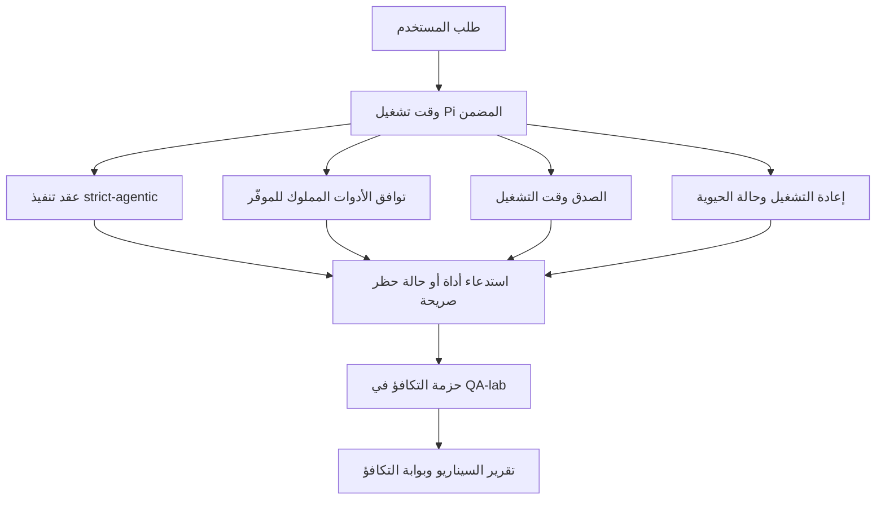

---
read_when:
    - تصحيح سلوك الوكيل في GPT-5.5 أو Codex
    - مقارنة السلوك الوكيلي في OpenClaw عبر النماذج الرائدة
    - مراجعة إصلاحات strict-agentic ومخطط الأدوات والتصعيد وإعادة التشغيل
summary: كيف يسد OpenClaw فجوات التنفيذ الوكيلي في GPT-5.5 والنماذج بأسلوب Codex
title: تكافؤ GPT-5.5 / Codex الوكيلي
x-i18n:
    generated_at: "2026-04-25T18:20:38Z"
    model: gpt-5.4
    provider: openai
    source_hash: 8a3b9375cd9e9d95855c4a1135953e00fd7a939e52fb7b75342da3bde2d83fe1
    source_path: help/gpt55-codex-agentic-parity.md
    workflow: 15
---

# تكافؤ GPT-5.5 / Codex الوكيلي في OpenClaw

كان OpenClaw يعمل بالفعل بشكل جيد مع النماذج الرائدة التي تستخدم الأدوات، لكن نماذج GPT-5.5 والنماذج بأسلوب Codex كانت لا تزال دون المستوى في بعض الجوانب العملية:

- قد تتوقف بعد التخطيط بدلًا من تنفيذ العمل
- قد تستخدم مخططات الأدوات الصارمة الخاصة بـ OpenAI/Codex بشكل غير صحيح
- قد تطلب `/elevated full` حتى عندما يكون الوصول الكامل مستحيلًا
- قد تفقد حالة المهام طويلة التشغيل أثناء إعادة التشغيل أو Compaction
- كانت ادعاءات التكافؤ مقارنةً بـ Claude Opus 4.6 تستند إلى روايات متفرقة بدلًا من سيناريوهات قابلة للتكرار

يعالج برنامج التكافؤ هذا هذه الفجوات عبر أربع شرائح قابلة للمراجعة.

## ما الذي تغيّر

### PR A: تنفيذ strict-agentic

تضيف هذه الشريحة عقد تنفيذ `strict-agentic` اختياريًا لتشغيلات Pi المضمنة الخاصة بـ GPT-5.

عند تفعيله، يتوقف OpenClaw عن قبول الأدوار التي تقتصر على الخطة باعتبارها إنجازًا "جيدًا بما يكفي". فإذا كان النموذج يكتفي بذكر ما ينوي فعله ولا يستخدم الأدوات فعليًا أو يحرز تقدمًا، يعيد OpenClaw المحاولة مع توجيه للتنفيذ الفوري، ثم يفشل بطريقة مغلقة مع حالة حظر صريحة بدلًا من إنهاء المهمة بصمت.

يحسّن هذا تجربة GPT-5.5 بشكل أكبر خصوصًا في:

- متابعات قصيرة من نوع "حسنًا، نفّذ ذلك"
- مهام البرمجة التي تكون فيها الخطوة الأولى واضحة
- التدفقات التي يجب أن يكون فيها `update_plan` تتبّعًا للتقدم بدلًا من نص حشو

### PR B: الصدق وقت التشغيل

تجعل هذه الشريحة OpenClaw يقول الحقيقة بشأن أمرين:

- سبب فشل استدعاء الموفّر/وقت التشغيل
- ما إذا كان `/elevated full` متاحًا فعلًا

وهذا يعني أن GPT-5.5 يحصل على إشارات أفضل وقت التشغيل عند غياب النطاق المطلوب، أو فشل تحديث المصادقة، أو فشل مصادقة HTML 403، أو مشكلات الوكيل، أو فشل DNS أو المهلة الزمنية، أو أوضاع الوصول الكامل المحظورة. ويصبح احتمال أن يهلوس النموذج إجراءً علاجيًا خاطئًا أو أن يواصل طلب وضع أذونات لا يستطيع وقت التشغيل تقديمه أقل.

### PR C: صحة التنفيذ

تحسّن هذه الشريحة نوعين من الصحة:

- التوافق مع مخططات أدوات OpenAI/Codex المملوكة للموفّر
- إظهار إعادة التشغيل وحيوية المهام الطويلة

يقلّل عمل توافق الأدوات من الاحتكاك مع تسجيل الأدوات الصارم في OpenAI/Codex، خصوصًا حول الأدوات الخالية من المعلمات وتوقعات الجذر الكائني الصارمة. أما عمل إعادة التشغيل/الحيوية فيجعل المهام طويلة التشغيل أكثر قابلية للملاحظة، بحيث تصبح الحالات المتوقفة مؤقتًا أو المحظورة أو المتروكة مرئية بدلًا من اختفائها داخل نص فشل عام.

### PR D: حزمة التكافؤ

تضيف هذه الشريحة أول حزمة تكافؤ في QA-lab بحيث يمكن تشغيل GPT-5.5 وOpus 4.6 عبر السيناريوهات نفسها ومقارنتهما باستخدام أدلة مشتركة.

حزمة التكافؤ هي طبقة الإثبات. وهي لا تغيّر سلوك وقت التشغيل بحد ذاته.

بعد حصولك على ملفي `qa-suite-summary.json`، أنشئ مقارنة بوابة الإصدار باستخدام:

```bash
pnpm openclaw qa parity-report \
  --repo-root . \
  --candidate-summary .artifacts/qa-e2e/gpt55/qa-suite-summary.json \
  --baseline-summary .artifacts/qa-e2e/opus46/qa-suite-summary.json \
  --output-dir .artifacts/qa-e2e/parity
```

يكتب هذا الأمر:

- تقرير Markdown قابلًا للقراءة البشرية
- حكم JSON قابلًا للقراءة الآلية
- نتيجة بوابة صريحة `pass` / `fail`

## لماذا يحسّن هذا GPT-5.5 عمليًا

قبل هذا العمل، كان GPT-5.5 على OpenClaw قد يبدو أقل وكيلية من Opus في جلسات البرمجة الفعلية لأن وقت التشغيل كان يتسامح مع سلوكيات ضارة بشكل خاص لنماذج بأسلوب GPT-5:

- أدوار تعتمد على التعليق فقط
- احتكاك مخططات الأدوات
- تغذية راجعة مبهمة بشأن الأذونات
- أعطال صامتة في إعادة التشغيل أو Compaction

الهدف ليس جعل GPT-5.5 يقلّد Opus. الهدف هو منح GPT-5.5 عقد وقت تشغيل يكافئ التقدم الحقيقي، ويوفر دلالات أوضح للأدوات والأذونات، ويحوّل أوضاع الفشل إلى حالات صريحة قابلة للقراءة من البشر والآلات.

وهذا يغيّر تجربة المستخدم من:

- "كان لدى النموذج خطة جيدة لكنه توقف"

إلى:

- "إما أن النموذج نفّذ، أو أن OpenClaw أظهر السبب الدقيق لعدم قدرته على ذلك"

## قبل البرنامج وبعده لمستخدمي GPT-5.5

| قبل هذا البرنامج                                                                      | بعد PR A-D                                                                             |
| -------------------------------------------------------------------------------------- | -------------------------------------------------------------------------------------- |
| كان بإمكان GPT-5.5 التوقف بعد خطة معقولة من دون اتخاذ الخطوة التالية عبر الأدوات      | يحوّل PR A حالة "خطة فقط" إلى "نفّذ الآن أو أظهر حالة حظر"                           |
| كان يمكن لمخططات الأدوات الصارمة أن ترفض الأدوات الخالية من المعلمات أو المصاغة بأسلوب OpenAI/Codex بطرق مربكة | يجعل PR C تسجيل الأدوات واستدعاءها المملوكين للموفّر أكثر قابلية للتنبؤ |
| كان يمكن أن تكون إرشادات `/elevated full` مبهمة أو خاطئة في أزمنة التشغيل المحظورة    | يمنح PR B كلًا من GPT-5.5 والمستخدم تلميحات صادقة عن وقت التشغيل والأذونات           |
| كان يمكن أن تبدو أعطال إعادة التشغيل أو Compaction وكأن المهمة اختفت بصمت             | يُظهر PR C نتائج التوقف المؤقت والحظر والتخلي وعدم صلاحية إعادة التشغيل بشكل صريح     |
| كان قول "GPT-5.5 أسوأ من Opus" قائمًا في الغالب على روايات متفرقة                     | يحوّل PR D ذلك إلى حزمة السيناريو نفسها، والمقاييس نفسها، وبوابة نجاح/فشل صارمة      |

## البنية



## تدفق الإصدار


## حزمة السيناريوهات

تغطي حزمة التكافؤ في الموجة الأولى حاليًا خمسة سيناريوهات:

### `approval-turn-tool-followthrough`

يتحقق من أن النموذج لا يتوقف عند "سأفعل ذلك" بعد موافقة قصيرة. يجب أن يتخذ أول إجراء ملموس في الدور نفسه.

### `model-switch-tool-continuity`

يتحقق من أن العمل الذي يستخدم الأدوات يبقى متماسكًا عبر حدود تبديل النموذج/وقت التشغيل بدلًا من أن يُعاد ضبطه إلى تعليق أو أن يفقد سياق التنفيذ.

### `source-docs-discovery-report`

يتحقق من أن النموذج يستطيع قراءة المصدر والوثائق، وتجميع النتائج، ومتابعة المهمة بشكل وكيلي بدلًا من إنتاج ملخص ضعيف والتوقف مبكرًا.

### `image-understanding-attachment`

يتحقق من أن المهام متعددة الأنماط التي تتضمن مرفقات تبقى قابلة للتنفيذ ولا تنهار إلى سرد مبهم.

### `compaction-retry-mutating-tool`

يتحقق من أن مهمة تحتوي على كتابة حقيقية مغيرة للحالة تُبقي عدم أمان إعادة التشغيل صريحًا بدلًا من أن تبدو آمنة لإعادة التشغيل بهدوء إذا خضعت العملية إلى Compaction أو إعادة محاولة أو فقدان حالة الرد تحت الضغط.

## مصفوفة السيناريوهات

| السيناريو                           | ما الذي يختبره                           | سلوك GPT-5.5 الجيد                                                           | إشارة الفشل                                                                      |
| ---------------------------------- | ---------------------------------------- | ---------------------------------------------------------------------------- | -------------------------------------------------------------------------------- |
| `approval-turn-tool-followthrough` | أدوار الموافقة القصيرة بعد خطة           | يبدأ أول إجراء أداة ملموس فورًا بدلًا من إعادة صياغة النية                | متابعة بخطة فقط، أو غياب نشاط الأدوات، أو دور محظور دون عائق حقيقي             |
| `model-switch-tool-continuity`     | تبديل وقت التشغيل/النموذج أثناء استخدام الأدوات | يحافظ على سياق المهمة ويواصل التنفيذ بشكل متماسك                         | يعاد ضبطه إلى تعليق، أو يفقد سياق الأدوات، أو يتوقف بعد التبديل                |
| `source-docs-discovery-report`     | قراءة المصدر + التجميع + التنفيذ         | يعثر على المصادر، ويستخدم الأدوات، وينتج تقريرًا مفيدًا دون تعثر         | ملخص ضعيف، أو غياب عمل الأدوات، أو توقف قبل اكتمال الدور                       |
| `image-understanding-attachment`   | العمل الوكيلي المعتمد على المرفقات       | يفسر المرفق، ويربطه بالأدوات، ويواصل المهمة                               | سرد مبهم، أو تجاهل المرفق، أو غياب إجراء ملموس تالٍ                            |
| `compaction-retry-mutating-tool`   | العمل المغير للحالة تحت ضغط Compaction   | ينفّذ كتابة حقيقية ويُبقي عدم أمان إعادة التشغيل صريحًا بعد التأثير الجانبي | تحدث كتابة مغيرة للحالة لكن يُفهم ضمنًا أمان إعادة التشغيل أو يغيب أو يتناقض |

## بوابة الإصدار

لا يمكن اعتبار GPT-5.5 في حالة تكافؤ أو أفضل إلا عندما يجتاز وقت التشغيل المدمج حزمة التكافؤ وتراجعات الصدق في وقت التشغيل في الوقت نفسه.

النتائج المطلوبة:

- عدم حدوث تعثر عند الخطة فقط عندما يكون إجراء الأداة التالي واضحًا
- عدم وجود اكتمال زائف من دون تنفيذ حقيقي
- عدم وجود إرشادات خاطئة لـ `/elevated full`
- عدم وجود تخلي صامت أثناء إعادة التشغيل أو Compaction
- مقاييس حزمة التكافؤ تكون على الأقل بقوة خط الأساس المتفق عليه لـ Opus 4.6

بالنسبة إلى تسخير الموجة الأولى، تقارن البوابة بين:

- معدل الإكمال
- معدل التوقف غير المقصود
- معدل استدعاءات الأدوات الصحيحة
- عدد النجاحات الزائفة

يُقسَّم دليل التكافؤ عمدًا عبر طبقتين:

- يثبت PR D سلوك GPT-5.5 مقابل Opus 4.6 في السيناريوهات نفسها باستخدام QA-lab
- تثبت المجموعات الحتمية في PR B الصدق المتعلق بالمصادقة والوكيل وDNS و`/elevated full` خارج التسخير

## مصفوفة الهدف إلى الدليل

| عنصر بوابة الإكمال                                     | PR المالك   | مصدر الدليل                                                        | إشارة النجاح                                                                            |
| ------------------------------------------------------ | ----------- | ------------------------------------------------------------------ | --------------------------------------------------------------------------------------- |
| لم يعد GPT-5.5 يتعثر بعد التخطيط                      | PR A        | `approval-turn-tool-followthrough` بالإضافة إلى مجموعات وقت التشغيل في PR A | تؤدي أدوار الموافقة إلى عمل حقيقي أو إلى حالة حظر صريحة                              |
| لم يعد GPT-5.5 يزيّف التقدم أو إكمال الأدوات الزائف   | PR A + PR D | نتائج سيناريوهات تقرير التكافؤ وعدد النجاحات الزائفة              | لا توجد نتائج نجاح مشبوهة ولا اكتمال قائم على التعليق فقط                            |
| لم يعد GPT-5.5 يقدّم إرشادات خاطئة لـ `/elevated full` | PR B        | مجموعات الصدق الحتمية                                              | تبقى أسباب الحظر وتلميحات الوصول الكامل دقيقة وفق وقت التشغيل                        |
| تبقى أعطال إعادة التشغيل/الحيوية صريحة                | PR C + PR D | مجموعات دورة الحياة/إعادة التشغيل في PR C بالإضافة إلى `compaction-retry-mutating-tool` | يبقي العمل المغير للحالة عدم أمان إعادة التشغيل صريحًا بدلًا من أن يختفي بصمت |
| يطابق GPT-5.5 أو يتفوق على Opus 4.6 في المقاييس المتفق عليها | PR D        | `qa-agentic-parity-report.md` و`qa-agentic-parity-summary.json` | التغطية نفسها للسيناريوهات وعدم وجود تراجع في الإكمال أو سلوك التوقف أو استخدام الأدوات الصحيح |

## كيفية قراءة حكم التكافؤ

استخدم الحكم الموجود في `qa-agentic-parity-summary.json` باعتباره القرار النهائي القابل للقراءة آليًا لحزمة التكافؤ في الموجة الأولى.

- تعني `pass` أن GPT-5.5 غطّى السيناريوهات نفسها التي غطاها Opus 4.6 ولم يتراجع في المقاييس التجميعية المتفق عليها.
- تعني `fail` أن بوابة صارمة واحدة على الأقل قد تعثرت: إكمال أضعف، أو توقفات غير مقصودة أسوأ، أو استخدام صحيح للأدوات أضعف، أو أي حالة نجاح زائف، أو عدم تطابق في تغطية السيناريوهات.
- لا تُعد "مشكلة CI مشتركة/أساسية" بحد ذاتها نتيجة تكافؤ. فإذا منعت ضوضاء CI خارج PR D تشغيلًا ما، فيجب أن ينتظر الحكم تنفيذًا نظيفًا لوقت تشغيل مدمج بدلًا من استنتاجه من سجلات قديمة خاصة بالفرع.
- ما تزال صحة المصادقة والوكيل وDNS و`/elevated full` تأتي من المجموعات الحتمية في PR B، لذا يحتاج ادعاء الإصدار النهائي إلى الأمرين معًا: حكم تكافؤ ناجح في PR D وتغطية صحة خضراء في PR B.

## من الذي ينبغي له تفعيل `strict-agentic`

استخدم `strict-agentic` عندما:

- يُتوقع من الوكيل أن ينفّذ فورًا عندما تكون الخطوة التالية واضحة
- تكون نماذج GPT-5.5 أو عائلة Codex هي وقت التشغيل الأساسي
- تفضّل حالات الحظر الصريحة على الردود التي تقتصر على التلخيص "المفيد"

أبقِ العقد الافتراضي عندما:

- تريد السلوك الحالي الأكثر تساهلًا
- لا تستخدم نماذج من عائلة GPT-5
- تختبر المطالبات بدلًا من فرض وقت التشغيل

## ذي صلة

- [ملاحظات صيانة تكافؤ GPT-5.5 / Codex](/ar/help/gpt55-codex-agentic-parity-maintainers)
