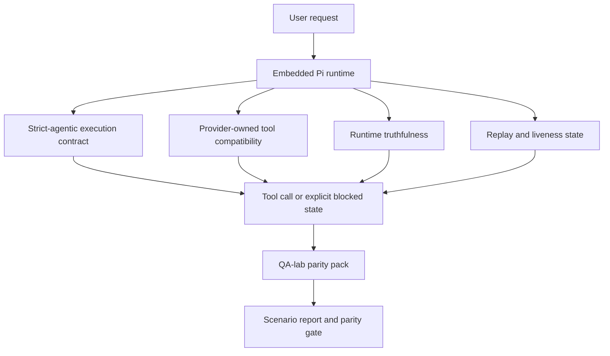
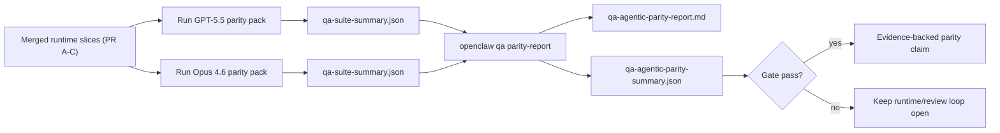

---
read_when:
    - تصحيح أخطاء سلوك وكيل GPT-5.5 أو Codex
    - مقارنة السلوك الوكيلي في OpenClaw عبر النماذج الرائدة
    - مراجعة إصلاحات الوكالية الصارمة ومخطط الأدوات ورفع الامتيازات وإعادة التشغيل
summary: كيف يسد OpenClaw فجوات التنفيذ الوكيلية لنماذج GPT-5.5 والنماذج بأسلوب Codex
title: تكافؤ القدرات الوكيلية بين GPT-5.5 وCodex
x-i18n:
    generated_at: "2026-05-06T07:57:59Z"
    model: gpt-5.5
    provider: openai
    source_hash: bbc32f418dfffe2786093fa6b42b19f92a2d382c9408dfc55dd0154d67959390
    source_path: help/gpt55-codex-agentic-parity.md
    workflow: 16
---

كان OpenClaw يعمل بالفعل بشكل جيد مع نماذج الحدود المتقدمة التي تستخدم الأدوات، لكن GPT-5.5 والنماذج بأسلوب Codex كانت لا تزال تؤدي بأقل من المتوقع في عدة نواحٍ عملية:

- كان يمكن أن تتوقف بعد التخطيط بدلًا من تنفيذ العمل
- كان يمكن أن تستخدم مخططات أدوات OpenAI/Codex الصارمة بشكل غير صحيح
- كان يمكن أن تطلب `/elevated full` حتى عندما يكون الوصول الكامل مستحيلًا
- كان يمكن أن تفقد حالة المهام طويلة التشغيل أثناء إعادة التشغيل أو Compaction
- كانت ادعاءات التكافؤ مع Claude Opus 4.6 مبنية على حكايات بدلًا من سيناريوهات قابلة للتكرار

يعالج برنامج التكافؤ هذا تلك الفجوات في أربع شرائح قابلة للمراجعة.

## ما الذي تغيّر

### PR A: التنفيذ الوكيلي الصارم

تضيف هذه الشريحة عقد تنفيذ `strict-agentic` اختياريًا لتشغيلات GPT-5 المضمّنة في Pi.

عند تفعيله، يتوقف OpenClaw عن قبول الأدوار التي تقتصر على الخطة باعتبارها إنجازًا "كافيًا". إذا قال النموذج فقط ما ينوي فعله ولم يستخدم الأدوات فعليًا أو يحرز تقدمًا، يعيد OpenClaw المحاولة بتوجيه للتنفيذ الآن، ثم يفشل مغلقًا بحالة حظر صريحة بدلًا من إنهاء المهمة بصمت.

يحسّن هذا تجربة GPT-5.5 أكثر في:

- متابعات قصيرة مثل "حسنًا نفّذ"
- مهام البرمجة حيث تكون الخطوة الأولى واضحة
- التدفقات التي يجب أن يكون فيها `update_plan` لتتبع التقدم لا كنص حشو

### PR B: صدق وقت التشغيل

تجعل هذه الشريحة OpenClaw يصرّح بالحقيقة حول أمرين:

- سبب فشل استدعاء المزوّد/وقت التشغيل
- ما إذا كان `/elevated full` متاحًا فعليًا

هذا يعني أن GPT-5.5 يحصل على إشارات وقت تشغيل أفضل لنطاق مفقود، وفشل تحديث المصادقة، وفشل مصادقة HTML 403، ومشكلات الوكيل، وفشل DNS أو انتهاء المهلة، وأوضاع الوصول الكامل المحظورة. يصبح النموذج أقل عرضة لاختلاق معالجة خاطئة أو الاستمرار في طلب وضع أذونات لا يستطيع وقت التشغيل توفيره.

### PR C: صحة التنفيذ

تحسّن هذه الشريحة نوعين من الصحة:

- توافق مخططات أدوات OpenAI/Codex المملوك للمزوّد
- إبراز حيوية إعادة التشغيل والمهام الطويلة

يقلل عمل توافق الأدوات احتكاك المخططات عند تسجيل أدوات OpenAI/Codex الصارمة، خصوصًا حول الأدوات بلا معاملات وتوقعات جذر الكائن الصارمة. ويجعل عمل إعادة التشغيل/الحيوية المهام طويلة التشغيل أكثر قابلية للملاحظة، بحيث تظهر الحالات المتوقفة مؤقتًا والمحظورة والمتروكة بدلًا من الاختفاء داخل نص فشل عام.

### PR D: إطار التكافؤ

تضيف هذه الشريحة حزمة تكافؤ QA-lab من الموجة الأولى حتى يمكن تشغيل GPT-5.5 وOpus 4.6 عبر السيناريوهات نفسها ومقارنتهما باستخدام أدلة مشتركة.

حزمة التكافؤ هي طبقة الإثبات. ولا تغيّر سلوك وقت التشغيل بمفردها.

بعد أن يصبح لديك ملفا `qa-suite-summary.json`، أنشئ مقارنة بوابة الإصدار باستخدام:

```bash
pnpm openclaw qa parity-report \
  --repo-root . \
  --candidate-summary .artifacts/qa-e2e/gpt55/qa-suite-summary.json \
  --baseline-summary .artifacts/qa-e2e/opus46/qa-suite-summary.json \
  --output-dir .artifacts/qa-e2e/parity
```

يكتب ذلك الأمر:

- تقرير Markdown قابلًا للقراءة البشرية
- حكم JSON قابلًا للقراءة آليًا
- نتيجة بوابة صريحة `pass` / `fail`

## لماذا يحسّن هذا GPT-5.5 عمليًا

قبل هذا العمل، كان GPT-5.5 على OpenClaw قد يبدو أقل وكيليّة من Opus في جلسات البرمجة الحقيقية لأن وقت التشغيل كان يتسامح مع سلوكيات ضارة بشكل خاص للنماذج بأسلوب GPT-5:

- أدوار للتعليق فقط
- احتكاك مخططات حول الأدوات
- ملاحظات أذونات مبهمة
- أعطال صامتة في إعادة التشغيل أو Compaction

ليس الهدف جعل GPT-5.5 يقلّد Opus. الهدف هو منح GPT-5.5 عقد وقت تشغيل يكافئ التقدم الحقيقي، ويوفر دلالات أنظف للأدوات والأذونات، ويحوّل أوضاع الفشل إلى حالات صريحة قابلة للقراءة آليًا وبشريًا.

هذا يغيّر تجربة المستخدم من:

- "كان لدى النموذج خطة جيدة لكنه توقف"

إلى:

- "إما أن النموذج تصرّف، أو أظهر OpenClaw السبب الدقيق الذي منعه من ذلك"

## قبل وبعد لمستخدمي GPT-5.5

| قبل هذا البرنامج                                                                            | بعد PR A-D                                                                             |
| ---------------------------------------------------------------------------------------------- | ---------------------------------------------------------------------------------------- |
| كان يمكن أن يتوقف GPT-5.5 بعد خطة معقولة من دون تنفيذ خطوة الأداة التالية                   | يحوّل PR A "الخطة فقط" إلى "نفّذ الآن أو أظهر حالة محظورة"                         |
| كان يمكن أن ترفض مخططات الأدوات الصارمة الأدوات بلا معاملات أو الأدوات بشكل OpenAI/Codex بطرق مربكة | يجعل PR C تسجيل الأدوات واستدعاءها المملوكين للمزوّد أكثر قابلية للتنبؤ              |
| كان يمكن أن تكون إرشادات `/elevated full` مبهمة أو خاطئة في أوقات التشغيل المحظورة                          | يعطي PR B ‏GPT-5.5 والمستخدم تلميحات صادقة عن وقت التشغيل والأذونات                    |
| كان يمكن أن تبدو أعطال إعادة التشغيل أو Compaction وكأن المهمة اختفت بصمت                    | يبرز PR C النتائج المتوقفة مؤقتًا والمحظورة والمتروكة وغير الصالحة لإعادة التشغيل بوضوح         |
| كان "GPT-5.5 يبدو أسوأ من Opus" في الغالب انطباعيًا                                           | يحوّل PR D ذلك إلى حزمة السيناريوهات نفسها، والمقاييس نفسها، وبوابة نجاح/فشل صارمة |

## البنية



## تدفق الإصدار



## حزمة السيناريوهات

تغطي حزمة التكافؤ من الموجة الأولى حاليًا خمسة سيناريوهات:

### `approval-turn-tool-followthrough`

يتحقق من أن النموذج لا يتوقف عند "سأفعل ذلك" بعد موافقة قصيرة. يجب أن يتخذ أول إجراء ملموس في الدور نفسه.

### `model-switch-tool-continuity`

يتحقق من أن العمل المستخدم للأدوات يبقى متماسكًا عبر حدود تبديل النموذج/وقت التشغيل بدلًا من إعادة الضبط إلى التعليق أو فقدان سياق التنفيذ.

### `source-docs-discovery-report`

يتحقق من أن النموذج يستطيع قراءة المصدر والوثائق، وتركيب النتائج، ومواصلة المهمة وكيليًا بدلًا من إنتاج ملخص سطحي والتوقف مبكرًا.

### `image-understanding-attachment`

يتحقق من أن المهام متعددة الأنماط التي تتضمن مرفقات تبقى قابلة للتنفيذ ولا تنهار إلى سرد مبهم.

### `compaction-retry-mutating-tool`

يتحقق من أن مهمة ذات كتابة تغييرية حقيقية تبقي عدم أمان إعادة التشغيل صريحًا بدلًا من أن تبدو آمنة لإعادة التشغيل بصمت إذا تعرض التشغيل إلى Compaction أو إعادة محاولة أو فقد حالة الرد تحت الضغط.

## مصفوفة السيناريوهات

| السيناريو                           | ما الذي يختبره                           | سلوك GPT-5.5 الجيد                                                          | إشارة الفشل                                                                 |
| ---------------------------------- | --------------------------------------- | ------------------------------------------------------------------------------ | ------------------------------------------------------------------------------ |
| `approval-turn-tool-followthrough` | أدوار الموافقة القصيرة بعد خطة       | يبدأ أول إجراء أداة ملموس فورًا بدلًا من إعادة ذكر النية  | متابعة بخطة فقط، أو عدم وجود نشاط أدوات، أو دور محظور بلا عائق حقيقي  |
| `model-switch-tool-continuity`     | تبديل وقت التشغيل/النموذج أثناء استخدام الأدوات  | يحافظ على سياق المهمة ويستمر في التصرف بتماسك                         | يعيد الضبط إلى التعليق، أو يفقد سياق الأدوات، أو يتوقف بعد التبديل              |
| `source-docs-discovery-report`     | قراءة المصدر + التركيب + الإجراء     | يجد المصادر، ويستخدم الأدوات، وينتج تقريرًا مفيدًا دون تعطل       | ملخص سطحي، أو عمل أدوات مفقود، أو توقف دور غير مكتمل                       |
| `image-understanding-attachment`   | عمل وكيلي مدفوع بالمرفقات          | يفسّر المرفق، ويربطه بالأدوات، ويواصل المهمة        | سرد مبهم، أو تجاهل المرفق، أو عدم وجود إجراء تالٍ ملموس                |
| `compaction-retry-mutating-tool`   | عمل تغييري تحت ضغط Compaction | ينفذ كتابة حقيقية ويبقي عدم أمان إعادة التشغيل صريحًا بعد الأثر الجانبي | تحدث كتابة تغييرية لكن أمان إعادة التشغيل يكون ضمنيًا، أو مفقودًا، أو متناقضًا |

## بوابة الإصدار

لا يمكن اعتبار GPT-5.5 عند مستوى التكافؤ أو أفضل إلا عندما يجتاز وقت التشغيل المدمج حزمة التكافؤ وانحدارات صدق وقت التشغيل في الوقت نفسه.

النتائج المطلوبة:

- لا تعطل بخطة فقط عندما يكون إجراء الأداة التالي واضحًا
- لا إكمال مزيف دون تنفيذ حقيقي
- لا إرشادات غير صحيحة بشأن `/elevated full`
- لا ترك صامت لإعادة التشغيل أو Compaction
- مقاييس حزمة التكافؤ قوية على الأقل بقدر خط أساس Opus 4.6 المتفق عليه

بالنسبة إلى إطار الموجة الأولى، تقارن البوابة:

- معدل الإكمال
- معدل التوقف غير المقصود
- معدل استدعاء الأدوات الصالح
- عدد النجاحات المزيفة

تقسّم أدلة التكافؤ عمدًا عبر طبقتين:

- يثبت PR D سلوك GPT-5.5 مقابل Opus 4.6 في السيناريو نفسه باستخدام QA-lab
- تثبت مجموعات PR B الحتمية صدق المصادقة والوكيل وDNS و`/elevated full` خارج الإطار

## مصفوفة الهدف إلى الدليل

| عنصر بوابة الإكمال                                     | PR المالك   | مصدر الدليل                                                    | إشارة النجاح                                                                              |
| -------------------------------------------------------- | ----------- | ------------------------------------------------------------------ | ---------------------------------------------------------------------------------------- |
| لم يعد GPT-5.5 يتعطل بعد التخطيط                  | PR A        | `approval-turn-tool-followthrough` إضافة إلى مجموعات وقت تشغيل PR A        | تؤدي أدوار الموافقة إلى عمل حقيقي أو حالة محظورة صريحة                            |
| لم يعد GPT-5.5 يزيّف التقدم أو إكمال الأداة المزيف | PR A + PR D | نتائج سيناريو تقرير التكافؤ وعدد النجاحات المزيفة             | لا نتائج نجاح مشبوهة ولا إكمال للتعليق فقط                             |
| لم يعد GPT-5.5 يعطي إرشادات خاطئة بشأن `/elevated full`  | PR B        | مجموعات الصدق الحتمية                                  | تبقى أسباب الحظر وتلميحات الوصول الكامل دقيقة بالنسبة لوقت التشغيل                              |
| تبقى أعطال إعادة التشغيل/الحيوية صريحة                   | PR C + PR D | مجموعات دورة الحياة/إعادة التشغيل في PR C إضافة إلى `compaction-retry-mutating-tool` | يبقي العمل التغييري عدم أمان إعادة التشغيل صريحًا بدلًا من الاختفاء بصمت            |
| يطابق GPT-5.5 أو يتفوق على Opus 4.6 في المقاييس المتفق عليها  | PR D        | `qa-agentic-parity-report.md` و`qa-agentic-parity-summary.json` | تغطية السيناريو نفسها ودون تراجع في الإكمال أو سلوك التوقف أو استخدام الأدوات الصالح |

## كيفية قراءة حكم التكافؤ

استخدم الحكم في `qa-agentic-parity-summary.json` باعتباره القرار النهائي القابل للقراءة آليًا لحزمة تكافؤ الموجة الأولى.

- يعني `pass` أن GPT-5.5 غطى السيناريوهات نفسها التي غطاها Opus 4.6 ولم يتراجع في المقاييس الإجمالية المتفق عليها.
- يعني `fail` أن بوابة صارمة واحدة على الأقل تعطلت: إكمال أضعف، أو توقفات غير مقصودة أسوأ، أو استخدام صالح أضعف للأدوات، أو أي حالة نجاح زائف، أو عدم تطابق في تغطية السيناريوهات.
- "مشكلة CI مشتركة/أساسية" ليست بحد ذاتها نتيجة تكافؤ. إذا منع تشويش CI خارج PR D تشغيلًا ما، فيجب أن ينتظر الحكم تنفيذًا نظيفًا لوقت التشغيل المدمج بدلًا من استنتاجه من سجلات فترة الفرع.
- لا تزال صحة المصادقة والوكيل وDNS و`/elevated full` تأتي من مجموعات PR B الحتمية، لذا يحتاج ادعاء الإصدار النهائي إلى الأمرين معًا: حكم تكافؤ ناجح لـ PR D وتغطية ناجحة لصحة PR B.

## من ينبغي أن يمكّن `strict-agentic`

استخدم `strict-agentic` عندما:

- يُتوقع من الوكيل أن يتصرف فورًا عندما تكون الخطوة التالية واضحة
- تكون نماذج GPT-5.5 أو عائلة Codex هي وقت التشغيل الأساسي
- تفضّل حالات الحظر الصريحة على الردود "المفيدة" التي تقتصر على التلخيص

أبقِ العقد الافتراضي عندما:

- تريد السلوك الحالي الأكثر تساهلًا
- لا تستخدم نماذج عائلة GPT-5
- تختبر المطالبات بدلًا من فرض وقت التشغيل

## ذات صلة

- [ملاحظات المشرفين على تكافؤ GPT-5.5 / Codex](/ar/help/gpt55-codex-agentic-parity-maintainers)
