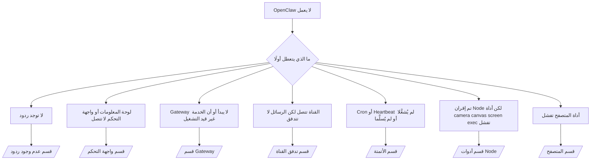

---
read_when:
    - لا يعمل OpenClaw وتحتاج إلى أسرع طريق إلى الإصلاح
    - تريد مسار فرز أولي قبل التعمق في أدلة التشغيل التفصيلية
summary: مركز استكشاف الأخطاء وإصلاحها في OpenClaw بدءًا من الأعراض
title: استكشاف الأخطاء وإصلاحها العام
x-i18n:
    generated_at: "2026-04-20T07:30:23Z"
    model: gpt-5.4
    provider: openai
    source_hash: cc5d8c9f804084985c672c5a003ce866e8142ab99fe81abb7a0d38e22aea4b88
    source_path: help/troubleshooting.md
    workflow: 15
---

# استكشاف الأخطاء وإصلاحها

إذا كان لديك دقيقتان فقط، فاستخدم هذه الصفحة كبوابة فرز أولي.

## أول 60 ثانية

شغّل هذا التسلسل بالضبط وبالترتيب:

```bash
openclaw status
openclaw status --all
openclaw gateway probe
openclaw gateway status
openclaw doctor
openclaw channels status --probe
openclaw logs --follow
```

المخرجات الجيدة في سطر واحد:

- `openclaw status` → يعرض القنوات المضبوطة ولا توجد أخطاء مصادقة واضحة.
- `openclaw status --all` → التقرير الكامل موجود وقابل للمشاركة.
- `openclaw gateway probe` → يمكن الوصول إلى هدف Gateway المتوقع (`Reachable: yes`). يوضّح `Capability: ...` مستوى المصادقة الذي أمكن للفحص إثباته، و`Read probe: limited - missing scope: operator.read` يعني تشخيصًا متدهورًا وليس فشلًا في الاتصال.
- `openclaw gateway status` → `Runtime: running` و`Connectivity probe: ok` وسطر `Capability: ...` منطقي. استخدم `--require-rpc` إذا كنت تحتاج أيضًا إلى إثبات RPC بنطاق القراءة.
- `openclaw doctor` → لا توجد أخطاء إعداد/خدمة مانعة.
- `openclaw channels status --probe` → يعرض Gateway القابل للوصول حالة نقل مباشرة لكل حساب
  بالإضافة إلى نتائج الفحص/التدقيق مثل `works` أو `audit ok`؛ وإذا تعذر
  الوصول إلى Gateway، يعود الأمر إلى ملخصات تعتمد على الإعداد فقط.
- `openclaw logs --follow` → نشاط مستمر، من دون أخطاء قاتلة متكررة.

## 429 من Anthropic للسياق الطويل

إذا رأيت:
`HTTP 429: rate_limit_error: Extra usage is required for long context requests`,
فانتقل إلى [/gateway/troubleshooting#anthropic-429-extra-usage-required-for-long-context](/ar/gateway/troubleshooting#anthropic-429-extra-usage-required-for-long-context).

## تعمل الواجهة الخلفية المحلية المتوافقة مع OpenAI مباشرة ولكنها تفشل في OpenClaw

إذا كانت الواجهة الخلفية المحلية أو المستضافة ذاتيًا `/v1` تستجيب لفحوصات
`/v1/chat/completions` المباشرة الصغيرة لكنها تفشل عند `openclaw infer model run` أو
في دورات الوكيل العادية:

1. إذا ذكرت الرسالة أن `messages[].content` يجب أن يكون سلسلة نصية، فاضبط
   `models.providers.<provider>.models[].compat.requiresStringContent: true`.
2. إذا استمرت الواجهة الخلفية في الفشل فقط في دورات وكيل OpenClaw، فاضبط
   `models.providers.<provider>.models[].compat.supportsTools: false` ثم أعد المحاولة.
3. إذا كانت الاستدعاءات المباشرة الصغيرة ما تزال تعمل ولكن المطالبات الأكبر في OpenClaw تتسبب في تعطل
   الواجهة الخلفية، فاعتبر المشكلة المتبقية قيدًا في النموذج/الخادم من المصدر
   وتابع في دليل التشغيل المتعمق:
   [/gateway/troubleshooting#local-openai-compatible-backend-passes-direct-probes-but-agent-runs-fail](/ar/gateway/troubleshooting#local-openai-compatible-backend-passes-direct-probes-but-agent-runs-fail)

## يفشل تثبيت Plugin بسبب فقدان openclaw extensions

إذا فشل التثبيت مع `package.json missing openclaw.extensions`، فهذا يعني أن حزمة Plugin
تستخدم بنية قديمة لم يعد OpenClaw يقبلها.

الإصلاح في حزمة Plugin:

1. أضف `openclaw.extensions` إلى `package.json`.
2. وجّه الإدخالات إلى ملفات وقت التشغيل المبنية (عادةً `./dist/index.js`).
3. أعد نشر Plugin ثم شغّل `openclaw plugins install <package>` مرة أخرى.

مثال:

```json
{
  "name": "@openclaw/my-plugin",
  "version": "1.2.3",
  "openclaw": {
    "extensions": ["./dist/index.js"]
  }
}
```

المرجع: [معمارية Plugin](/ar/plugins/architecture)

## شجرة القرار



<AccordionGroup>
  <Accordion title="لا توجد ردود">
    ```bash
    openclaw status
    openclaw gateway status
    openclaw channels status --probe
    openclaw pairing list --channel <channel> [--account <id>]
    openclaw logs --follow
    ```

    تبدو المخرجات الجيدة كالتالي:

    - `Runtime: running`
    - `Connectivity probe: ok`
    - `Capability: read-only` أو `write-capable` أو `admin-capable`
    - تعرض قناتك اتصال النقل، وحيثما كان ذلك مدعومًا، `works` أو `audit ok` في `channels status --probe`
    - يظهر المرسل على أنه تمت الموافقة عليه (أو أن سياسة الرسائل المباشرة DM مفتوحة/قائمة سماح)

    تواقيع السجلات الشائعة:

    - `drop guild message (mention required` → منعت بوابة الإشارة معالجة الرسالة في Discord.
    - `pairing request` → المرسل غير معتمد وينتظر موافقة إقران DM.
    - `blocked` / `allowlist` في سجلات القناة → تمت تصفية المرسل أو الغرفة أو المجموعة.

    الصفحات المتعمقة:

    - [/gateway/troubleshooting#no-replies](/ar/gateway/troubleshooting#no-replies)
    - [/channels/troubleshooting](/ar/channels/troubleshooting)
    - [/channels/pairing](/ar/channels/pairing)

  </Accordion>

  <Accordion title="لوحة المعلومات أو واجهة التحكم لا تتصل">
    ```bash
    openclaw status
    openclaw gateway status
    openclaw logs --follow
    openclaw doctor
    openclaw channels status --probe
    ```

    تبدو المخرجات الجيدة كالتالي:

    - يتم عرض `Dashboard: http://...` في `openclaw gateway status`
    - `Connectivity probe: ok`
    - `Capability: read-only` أو `write-capable` أو `admin-capable`
    - لا توجد حلقة مصادقة في السجلات

    تواقيع السجلات الشائعة:

    - `device identity required` → لا يستطيع سياق HTTP/غير الآمن إكمال مصادقة الجهاز.
    - `origin not allowed` → `Origin` الخاص بالمتصفح غير مسموح له لهدف Gateway
      الخاص بواجهة التحكم.
    - `AUTH_TOKEN_MISMATCH` مع تلميحات إعادة المحاولة (`canRetryWithDeviceToken=true`) → قد تحدث إعادة محاولة واحدة تلقائيًا باستخدام رمز جهاز موثوق.
    - تعيد محاولة الرمز المخبأ تلك استخدام مجموعة النطاقات المخزنة مؤقتًا مع
      رمز الجهاز المقترن. أما المستدعون الذين يستخدمون `deviceToken` صريحًا / `scopes` صريحة فيحتفظون
      بمجموعة النطاقات المطلوبة الخاصة بهم.
    - في مسار واجهة التحكم غير المتزامن عبر Tailscale Serve، تُسلسل المحاولات الفاشلة لنفس
      `{scope, ip}` قبل أن يسجل المحدِّد الفشل، لذلك قد تُظهر إعادة محاولة سيئة ثانية متزامنة بالفعل
      `retry later`.
    - `too many failed authentication attempts (retry later)` من origin متصفح محلي localhost → تُقفل الإخفاقات المتكررة من `Origin` نفسه مؤقتًا؛ بينما يستخدم origin محلي آخر حاوية منفصلة.
    - تكرار `unauthorized` بعد تلك إعادة المحاولة → token/password خاطئ، أو عدم تطابق وضع المصادقة، أو رمز جهاز مقترن قديم.
    - `gateway connect failed:` → تستهدف الواجهة عنوان URL/منفذًا خاطئًا أو Gateway غير قابل للوصول.

    الصفحات المتعمقة:

    - [/gateway/troubleshooting#dashboard-control-ui-connectivity](/ar/gateway/troubleshooting#dashboard-control-ui-connectivity)
    - [/web/control-ui](/web/control-ui)
    - [/gateway/authentication](/ar/gateway/authentication)

  </Accordion>

  <Accordion title="Gateway لا يبدأ أو أن الخدمة المثبتة ليست قيد التشغيل">
    ```bash
    openclaw status
    openclaw gateway status
    openclaw logs --follow
    openclaw doctor
    openclaw channels status --probe
    ```

    تبدو المخرجات الجيدة كالتالي:

    - `Service: ... (loaded)`
    - `Runtime: running`
    - `Connectivity probe: ok`
    - `Capability: read-only` أو `write-capable` أو `admin-capable`

    تواقيع السجلات الشائعة:

    - `Gateway start blocked: set gateway.mode=local` أو `existing config is missing gateway.mode` → وضع Gateway هو remote، أو أن ملف الإعداد يفتقد ختم الوضع المحلي ويجب إصلاحه.
    - `refusing to bind gateway ... without auth` → ربط غير loopback من دون مسار مصادقة صالح لـ Gateway (token/password، أو trusted-proxy حيث يكون مضبوطًا).
    - `another gateway instance is already listening` أو `EADDRINUSE` → المنفذ مستخدم بالفعل.

    الصفحات المتعمقة:

    - [/gateway/troubleshooting#gateway-service-not-running](/ar/gateway/troubleshooting#gateway-service-not-running)
    - [/gateway/background-process](/ar/gateway/background-process)
    - [/gateway/configuration](/ar/gateway/configuration)

  </Accordion>

  <Accordion title="القناة تتصل لكن الرسائل لا تتدفق">
    ```bash
    openclaw status
    openclaw gateway status
    openclaw logs --follow
    openclaw doctor
    openclaw channels status --probe
    ```

    تبدو المخرجات الجيدة كالتالي:

    - نقل القناة متصل.
    - تنجح فحوصات الإقران/قائمة السماح.
    - يتم اكتشاف الإشارات حيث تكون مطلوبة.

    تواقيع السجلات الشائعة:

    - `mention required` → منعت بوابة الإشارة في المجموعة المعالجة.
    - `pairing` / `pending` → مرسل DM لم تتم الموافقة عليه بعد.
    - `not_in_channel`, `missing_scope`, `Forbidden`, `401/403` → مشكلة في رمز صلاحيات القناة.

    الصفحات المتعمقة:

    - [/gateway/troubleshooting#channel-connected-messages-not-flowing](/ar/gateway/troubleshooting#channel-connected-messages-not-flowing)
    - [/channels/troubleshooting](/ar/channels/troubleshooting)

  </Accordion>

  <Accordion title="لم يتم تشغيل Cron أو Heartbeat أو لم يتم تسليمهما">
    ```bash
    openclaw status
    openclaw gateway status
    openclaw cron status
    openclaw cron list
    openclaw cron runs --id <jobId> --limit 20
    openclaw logs --follow
    ```

    تبدو المخرجات الجيدة كالتالي:

    - يعرض `cron.status` أنه مفعّل مع وقت الاستيقاظ التالي.
    - يعرض `cron runs` إدخالات `ok` حديثة.
    - Heartbeat مفعّل وليس خارج الساعات النشطة.

    تواقيع السجلات الشائعة:

    - `cron: scheduler disabled; jobs will not run automatically` → Cron معطّل.
    - `heartbeat skipped` مع `reason=quiet-hours` → خارج الساعات النشطة المضبوطة.
    - `heartbeat skipped` مع `reason=empty-heartbeat-file` → يوجد `HEARTBEAT.md` لكنه يحتوي فقط على هيكل فارغ/عناوين فقط.
    - `heartbeat skipped` مع `reason=no-tasks-due` → وضع مهام `HEARTBEAT.md` نشط لكن لم يحن موعد أي من فواصل المهام بعد.
    - `heartbeat skipped` مع `reason=alerts-disabled` → كل إظهار Heartbeat معطّل (`showOk` و`showAlerts` و`useIndicator` كلها متوقفة).
    - `requests-in-flight` → المسار الرئيسي مشغول؛ تم تأجيل استيقاظ Heartbeat.
    - `unknown accountId` → حساب هدف تسليم Heartbeat غير موجود.

    الصفحات المتعمقة:

    - [/gateway/troubleshooting#cron-and-heartbeat-delivery](/ar/gateway/troubleshooting#cron-and-heartbeat-delivery)
    - [/automation/cron-jobs#troubleshooting](/ar/automation/cron-jobs#troubleshooting)
    - [/gateway/heartbeat](/ar/gateway/heartbeat)

    </Accordion>

    <Accordion title="تم إقران Node لكن الأداة تفشل في camera canvas screen exec">
      ```bash
      openclaw status
      openclaw gateway status
      openclaw nodes status
      openclaw nodes describe --node <idOrNameOrIp>
      openclaw logs --follow
      ```

      تبدو المخرجات الجيدة كالتالي:

      - Node مدرجة على أنها متصلة ومقترنة للدور `node`.
      - توجد Capability للأمر الذي تستدعيه.
      - حالة الصلاحية ممنوحة للأداة.

      تواقيع السجلات الشائعة:

      - `NODE_BACKGROUND_UNAVAILABLE` → اجلب تطبيق Node إلى الواجهة.
      - `*_PERMISSION_REQUIRED` → تم رفض صلاحية نظام التشغيل أو أنها مفقودة.
      - `SYSTEM_RUN_DENIED: approval required` → الموافقة على exec لا تزال معلقة.
      - `SYSTEM_RUN_DENIED: allowlist miss` → الأمر ليس ضمن قائمة سماح exec.

      الصفحات المتعمقة:

      - [/gateway/troubleshooting#node-paired-tool-fails](/ar/gateway/troubleshooting#node-paired-tool-fails)
      - [/nodes/troubleshooting](/ar/nodes/troubleshooting)
      - [/tools/exec-approvals](/ar/tools/exec-approvals)

    </Accordion>

    <Accordion title="أصبح Exec يطلب الموافقة فجأة">
      ```bash
      openclaw config get tools.exec.host
      openclaw config get tools.exec.security
      openclaw config get tools.exec.ask
      openclaw gateway restart
      ```

      ما الذي تغيّر:

      - إذا كانت `tools.exec.host` غير مضبوطة، فالقيمة الافتراضية هي `auto`.
      - تحل `host=auto` إلى `sandbox` عندما يكون وقت تشغيل sandbox نشطًا، وإلى `gateway` بخلاف ذلك.
      - `host=auto` مخصص للتوجيه فقط؛ أما سلوك "YOLO" من دون مطالبة فيأتي من `security=full` مع `ask=off` على gateway/node.
      - في `gateway` و`node`، تكون القيمة الافتراضية لـ `tools.exec.security` عند عدم ضبطها هي `full`.
      - تكون القيمة الافتراضية لـ `tools.exec.ask` عند عدم ضبطها هي `off`.
      - النتيجة: إذا كنت ترى طلبات موافقة، فهذا يعني أن بعض السياسات المحلية للمضيف أو الخاصة بالجلسة قد شددت exec بعيدًا عن الإعدادات الافتراضية الحالية.

      لاستعادة السلوك الحالي الافتراضي من دون موافقة:

      ```bash
      openclaw config set tools.exec.host gateway
      openclaw config set tools.exec.security full
      openclaw config set tools.exec.ask off
      openclaw gateway restart
      ```

      بدائل أكثر أمانًا:

      - اضبط فقط `tools.exec.host=gateway` إذا كنت تريد فقط توجيهًا ثابتًا للمضيف.
      - استخدم `security=allowlist` مع `ask=on-miss` إذا كنت تريد exec على المضيف ولكنك ما زلت تريد المراجعة عند الإخفاق في قائمة السماح.
      - فعّل وضع sandbox إذا كنت تريد أن تُحل `host=auto` مرة أخرى إلى `sandbox`.

      تواقيع السجلات الشائعة:

      - `Approval required.` → الأمر ينتظر `/approve ...`.
      - `SYSTEM_RUN_DENIED: approval required` → موافقة exec على مضيف Node معلقة.
      - `exec host=sandbox requires a sandbox runtime for this session` → تم اختيار sandbox ضمنيًا/صراحةً لكن وضع sandbox متوقف.

      الصفحات المتعمقة:

      - [/tools/exec](/ar/tools/exec)
      - [/tools/exec-approvals](/ar/tools/exec-approvals)
      - [/gateway/security#what-the-audit-checks-high-level](/ar/gateway/security#what-the-audit-checks-high-level)

    </Accordion>

    <Accordion title="أداة المتصفح تفشل">
      ```bash
      openclaw status
      openclaw gateway status
      openclaw browser status
      openclaw logs --follow
      openclaw doctor
      ```

      تبدو المخرجات الجيدة كالتالي:

      - تعرض حالة المتصفح `running: true` ومتصفحًا/ملفًا شخصيًا محددًا.
      - يبدأ `openclaw`، أو يمكن لـ `user` رؤية علامات تبويب Chrome المحلية.

      تواقيع السجلات الشائعة:

      - `unknown command "browser"` أو `unknown command 'browser'` → تم ضبط `plugins.allow` ولا يتضمن `browser`.
      - `Failed to start Chrome CDP on port` → فشل تشغيل المتصفح المحلي.
      - `browser.executablePath not found` → مسار الملف التنفيذي المضبوط غير صحيح.
      - `browser.cdpUrl must be http(s) or ws(s)` → يستخدم عنوان CDP المضبوط مخططًا غير مدعوم.
      - `browser.cdpUrl has invalid port` → يحتوي عنوان CDP المضبوط على منفذ سيئ أو خارج النطاق.
      - `No Chrome tabs found for profile="user"` → لا يحتوي ملف الإرفاق Chrome MCP على علامات تبويب Chrome محلية مفتوحة.
      - `Remote CDP for profile "<name>" is not reachable` → لا يمكن الوصول إلى نقطة نهاية CDP البعيدة المضبوطة من هذا المضيف.
      - `Browser attachOnly is enabled ... not reachable` أو `Browser attachOnly is enabled and CDP websocket ... is not reachable` → لا يحتوي ملف attach-only على هدف CDP مباشر.
      - تجاوزات viewport / الوضع الداكن / locale / عدم الاتصال القديمة على ملفات attach-only أو CDP البعيدة → شغّل `openclaw browser stop --browser-profile <name>` لإغلاق جلسة التحكم النشطة وتحرير حالة المحاكاة من دون إعادة تشغيل Gateway.

      الصفحات المتعمقة:

      - [/gateway/troubleshooting#browser-tool-fails](/ar/gateway/troubleshooting#browser-tool-fails)
      - [/tools/browser#missing-browser-command-or-tool](/ar/tools/browser#missing-browser-command-or-tool)
      - [/tools/browser-linux-troubleshooting](/ar/tools/browser-linux-troubleshooting)
      - [/tools/browser-wsl2-windows-remote-cdp-troubleshooting](/ar/tools/browser-wsl2-windows-remote-cdp-troubleshooting)

    </Accordion>

  </AccordionGroup>

## ذو صلة

- [الأسئلة الشائعة](/ar/help/faq) — الأسئلة المتكررة
- [استكشاف أخطاء Gateway وإصلاحها](/ar/gateway/troubleshooting) — المشكلات الخاصة بـ Gateway
- [Doctor](/ar/gateway/doctor) — فحوصات السلامة والإصلاحات الآلية
- [استكشاف أخطاء القنوات وإصلاحها](/ar/channels/troubleshooting) — مشكلات اتصال القنوات
- [استكشاف أخطاء الأتمتة وإصلاحها](/ar/automation/cron-jobs#troubleshooting) — مشكلات Cron وHeartbeat
