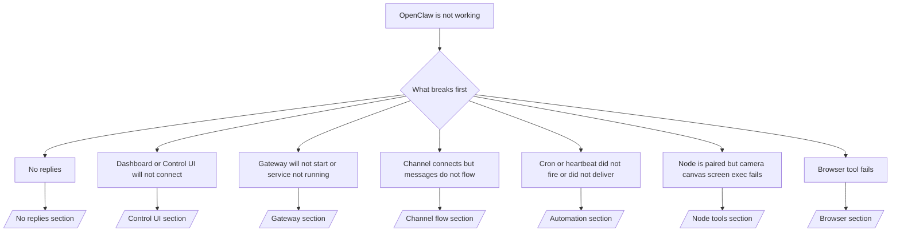

---
read_when:
    - OpenClaw لا يعمل وتحتاج إلى أسرع طريق إلى الحل
    - تريد مسار فرز أولي قبل التعمق في أدلة التشغيل التفصيلية
summary: مركز استكشاف الأخطاء وإصلاحها في OpenClaw بدءًا من الأعراض
title: استكشاف الأخطاء وإصلاحها العام
x-i18n:
    generated_at: "2026-04-11T02:45:31Z"
    model: gpt-5.4
    provider: openai
    source_hash: 16b38920dbfdc8d4a79bbb5d6fab2c67c9f218a97c36bb4695310d7db9c4614a
    source_path: help/troubleshooting.md
    workflow: 15
---

# استكشاف الأخطاء وإصلاحها

إذا كان لديك دقيقتان فقط، فاستخدم هذه الصفحة كبوابة فرز أولي.

## أول 60 ثانية

شغّل هذا التسلسل بالترتيب نفسه تمامًا:

```bash
openclaw status
openclaw status --all
openclaw gateway probe
openclaw gateway status
openclaw doctor
openclaw channels status --probe
openclaw logs --follow
```

المخرجات الجيدة في سطر واحد:

- `openclaw status` → يعرض القنوات المكوّنة من دون أخطاء مصادقة واضحة.
- `openclaw status --all` → التقرير الكامل موجود وقابل للمشاركة.
- `openclaw gateway probe` → يمكن الوصول إلى هدف gateway المتوقع (`Reachable: yes`). تشير `RPC: limited - missing scope: operator.read` إلى تشخيصات متدهورة، وليس إلى فشل في الاتصال.
- `openclaw gateway status` → `Runtime: running` و`RPC probe: ok`.
- `openclaw doctor` → لا توجد أخطاء حظر في الإعدادات/الخدمة.
- `openclaw channels status --probe` → عندما يكون الوصول إلى gateway ممكنًا، يعرض حالة النقل المباشرة لكل حساب بالإضافة إلى نتائج الفحص/التدقيق مثل `works` أو `audit ok`؛ وإذا تعذر الوصول إلى gateway، يعود الأمر إلى ملخصات تعتمد على الإعدادات فقط.
- `openclaw logs --follow` → نشاط مستقر، ولا توجد أخطاء قاتلة متكررة.

## ‏429 لسياق Anthropic الطويل

إذا رأيت:
`HTTP 429: rate_limit_error: Extra usage is required for long context requests`
فانتقل إلى [/gateway/troubleshooting#anthropic-429-extra-usage-required-for-long-context](/ar/gateway/troubleshooting#anthropic-429-extra-usage-required-for-long-context).

## تعمل الواجهة الخلفية المحلية المتوافقة مع OpenAI مباشرة لكنها تفشل في OpenClaw

إذا كانت الواجهة الخلفية المحلية أو المستضافة ذاتيًا على `/v1` تستجيب لطلبات الفحص المباشرة الصغيرة على
`/v1/chat/completions` لكنها تفشل مع `openclaw infer model run` أو أثناء دورات
الوكيل العادية:

1. إذا كانت رسالة الخطأ تشير إلى أن `messages[].content` يجب أن تكون سلسلة نصية، فاضبط
   `models.providers.<provider>.models[].compat.requiresStringContent: true`.
2. إذا استمرت الواجهة الخلفية في الفشل فقط أثناء دورات وكيل OpenClaw، فاضبط
   `models.providers.<provider>.models[].compat.supportsTools: false` وأعد المحاولة.
3. إذا كانت الاستدعاءات المباشرة الصغيرة لا تزال تعمل لكن موجّهات OpenClaw الأكبر تتسبب في تعطل
   الواجهة الخلفية، فتعامل مع المشكلة المتبقية على أنها قيد في النموذج/الخادم من المصدر
   وتابع في دليل التشغيل التفصيلي:
   [/gateway/troubleshooting#local-openai-compatible-backend-passes-direct-probes-but-agent-runs-fail](/ar/gateway/troubleshooting#local-openai-compatible-backend-passes-direct-probes-but-agent-runs-fail)

## فشل تثبيت plugin بسبب غياب openclaw extensions

إذا فشل التثبيت مع `package.json missing openclaw.extensions`، فهذا يعني أن حزمة plugin
تستخدم بنية قديمة لم يعد OpenClaw يقبلها.

أصلح ذلك في حزمة plugin:

1. أضف `openclaw.extensions` إلى `package.json`.
2. وجّه الإدخالات إلى ملفات وقت التشغيل المبنية (عادةً `./dist/index.js`).
3. أعد نشر plugin ثم شغّل `openclaw plugins install <package>` مرة أخرى.

مثال:

```json
{
  "name": "@openclaw/my-plugin",
  "version": "1.2.3",
  "openclaw": {
    "extensions": ["./dist/index.js"]
  }
}
```

مرجع: [بنية plugins](/ar/plugins/architecture)

## شجرة القرارات



<AccordionGroup>
  <Accordion title="لا توجد ردود">
    ```bash
    openclaw status
    openclaw gateway status
    openclaw channels status --probe
    openclaw pairing list --channel <channel> [--account <id>]
    openclaw logs --follow
    ```

    تبدو المخرجات الجيدة كالتالي:

    - `Runtime: running`
    - `RPC probe: ok`
    - تعرض قناتك اتصال النقل، وعند الدعم، `works` أو `audit ok` في `channels status --probe`
    - يظهر المرسِل على أنه معتمد (أو أن سياسة الرسائل الخاصة DM مفتوحة/ضمن قائمة السماح)

    التواقيع الشائعة في السجل:

    - `drop guild message (mention required` → منع حظر الإشارة معالجة الرسالة في Discord.
    - `pairing request` → المرسِل غير معتمد وينتظر الموافقة على الاقتران عبر DM.
    - `blocked` / `allowlist` في سجلات القناة → تم ترشيح المرسِل أو الغرفة أو المجموعة.

    الصفحات التفصيلية:

    - [/gateway/troubleshooting#no-replies](/ar/gateway/troubleshooting#no-replies)
    - [/channels/troubleshooting](/ar/channels/troubleshooting)
    - [/channels/pairing](/ar/channels/pairing)

  </Accordion>

  <Accordion title="لوحة المعلومات أو Control UI لا يتصلان">
    ```bash
    openclaw status
    openclaw gateway status
    openclaw logs --follow
    openclaw doctor
    openclaw channels status --probe
    ```

    تبدو المخرجات الجيدة كالتالي:

    - يظهر `Dashboard: http://...` في `openclaw gateway status`
    - `RPC probe: ok`
    - لا توجد حلقة مصادقة في السجلات

    التواقيع الشائعة في السجل:

    - `device identity required` → لا يمكن لـ HTTP/سياق غير آمن إكمال مصادقة الجهاز.
    - `origin not allowed` → إن `Origin` الخاص بالمتصفح غير مسموح له لهدف gateway الخاص بـ Control UI.
    - `AUTH_TOKEN_MISMATCH` مع تلميحات إعادة المحاولة (`canRetryWithDeviceToken=true`) → قد يحدث تلقائيًا retry واحد موثوق باستخدام رمز الجهاز.
    - تعيد إعادة المحاولة باستخدام الرمز المخزّن استخدام مجموعة النطاقات المخزنة مؤقتًا والمحفوظة مع
      رمز الجهاز المقترن. أما المستدعون الذين يستخدمون `deviceToken` صريحًا / `scopes` صريحة فيحتفظون
      بمجموعة النطاقات المطلوبة الخاصة بهم بدلًا من ذلك.
    - في مسار Control UI غير المتزامن لـ Tailscale Serve، تتم سلسلة المحاولات الفاشلة لنفس
      `{scope, ip}` قبل أن يسجّل المحدِّد الفشل، لذلك قد تُظهر إعادة محاولة ثانية سيئة ومتزامنة بالفعل
      `retry later`.
    - `too many failed authentication attempts (retry later)` من
      مصدر متصفح localhost → يتم قفل الإخفاقات المتكررة من `Origin` نفسه مؤقتًا؛ ويستخدم Origin آخر على localhost مجموعة منفصلة.
    - `unauthorized` متكرر بعد إعادة المحاولة تلك → رمز/كلمة مرور خاطئة، أو عدم تطابق في وضع المصادقة، أو رمز جهاز مقترن قديم.
    - `gateway connect failed:` → تستهدف الواجهة عنوان URL/منفذًا خاطئًا أو أن gateway غير قابل للوصول.

    الصفحات التفصيلية:

    - [/gateway/troubleshooting#dashboard-control-ui-connectivity](/ar/gateway/troubleshooting#dashboard-control-ui-connectivity)
    - [/web/control-ui](/web/control-ui)
    - [/gateway/authentication](/ar/gateway/authentication)

  </Accordion>

  <Accordion title="Gateway لا يبدأ أو أن الخدمة مثبّتة لكنها لا تعمل">
    ```bash
    openclaw status
    openclaw gateway status
    openclaw logs --follow
    openclaw doctor
    openclaw channels status --probe
    ```

    تبدو المخرجات الجيدة كالتالي:

    - `Service: ... (loaded)`
    - `Runtime: running`
    - `RPC probe: ok`

    التواقيع الشائعة في السجل:

    - `Gateway start blocked: set gateway.mode=local` أو `existing config is missing gateway.mode` → وضع gateway هو remote، أو أن ملف الإعدادات يفتقد علامة الوضع المحلي ويجب إصلاحه.
    - `refusing to bind gateway ... without auth` → ربط غير loopback من دون مسار مصادقة صالح لـ gateway (رمز/كلمة مرور، أو trusted-proxy حيثما تم تكوينه).
    - `another gateway instance is already listening` أو `EADDRINUSE` → المنفذ مستخدم بالفعل.

    الصفحات التفصيلية:

    - [/gateway/troubleshooting#gateway-service-not-running](/ar/gateway/troubleshooting#gateway-service-not-running)
    - [/gateway/background-process](/ar/gateway/background-process)
    - [/gateway/configuration](/ar/gateway/configuration)

  </Accordion>

  <Accordion title="القناة متصلة لكن الرسائل لا تتدفق">
    ```bash
    openclaw status
    openclaw gateway status
    openclaw logs --follow
    openclaw doctor
    openclaw channels status --probe
    ```

    تبدو المخرجات الجيدة كالتالي:

    - نقل القناة متصل.
    - تنجح فحوصات الاقتران/قائمة السماح.
    - يتم اكتشاف الإشارات حيث يكون ذلك مطلوبًا.

    التواقيع الشائعة في السجل:

    - `mention required` → منع حظر الإشارة المعالجة في المجموعة.
    - `pairing` / `pending` → مرسِل DM غير معتمد بعد.
    - `not_in_channel`, `missing_scope`, `Forbidden`, `401/403` → مشكلة في رمز أذونات القناة.

    الصفحات التفصيلية:

    - [/gateway/troubleshooting#channel-connected-messages-not-flowing](/ar/gateway/troubleshooting#channel-connected-messages-not-flowing)
    - [/channels/troubleshooting](/ar/channels/troubleshooting)

  </Accordion>

  <Accordion title="لم يعمل Cron أو heartbeat أو لم يقم بالتسليم">
    ```bash
    openclaw status
    openclaw gateway status
    openclaw cron status
    openclaw cron list
    openclaw cron runs --id <jobId> --limit 20
    openclaw logs --follow
    ```

    تبدو المخرجات الجيدة كالتالي:

    - يعرض `cron.status` أنه مفعّل مع وقت استيقاظ تالٍ.
    - يعرض `cron runs` إدخالات `ok` حديثة.
    - heartbeat مفعّل وليس خارج الساعات النشطة.

    التواقيع الشائعة في السجل:

    - `cron: scheduler disabled; jobs will not run automatically` → cron معطّل.
    - `heartbeat skipped` مع `reason=quiet-hours` → خارج الساعات النشطة المكوّنة.
    - `heartbeat skipped` مع `reason=empty-heartbeat-file` → الملف `HEARTBEAT.md` موجود لكنه يحتوي فقط على هيكل فارغ/عناوين فقط.
    - `heartbeat skipped` مع `reason=no-tasks-due` → وضع مهام `HEARTBEAT.md` نشط، لكن لم يحن موعد أي من فواصل المهام بعد.
    - `heartbeat skipped` مع `reason=alerts-disabled` → تم تعطيل كل ظهور heartbeat (`showOk` و`showAlerts` و`useIndicator` كلها متوقفة).
    - `requests-in-flight` → المسار الرئيسي مشغول؛ تم تأجيل إيقاظ heartbeat.
    - `unknown accountId` → حساب هدف تسليم heartbeat غير موجود.

    الصفحات التفصيلية:

    - [/gateway/troubleshooting#cron-and-heartbeat-delivery](/ar/gateway/troubleshooting#cron-and-heartbeat-delivery)
    - [/automation/cron-jobs#troubleshooting](/ar/automation/cron-jobs#troubleshooting)
    - [/gateway/heartbeat](/ar/gateway/heartbeat)

    </Accordion>

    <Accordion title="Node مقترن لكن أداة camera canvas screen exec تفشل">
      ```bash
      openclaw status
      openclaw gateway status
      openclaw nodes status
      openclaw nodes describe --node <idOrNameOrIp>
      openclaw logs --follow
      ```

      تبدو المخرجات الجيدة كالتالي:

      - تظهر Node على أنها متصلة ومقترنة بالدور `node`.
      - توجد الإمكانية للأمر الذي تستدعيه.
      - حالة الإذن ممنوحة للأداة.

      التواقيع الشائعة في السجل:

      - `NODE_BACKGROUND_UNAVAILABLE` → أحضر تطبيق node إلى الواجهة.
      - `*_PERMISSION_REQUIRED` → تم رفض إذن نظام التشغيل أو أنه مفقود.
      - `SYSTEM_RUN_DENIED: approval required` → الموافقة على exec معلقة.
      - `SYSTEM_RUN_DENIED: allowlist miss` → الأمر غير موجود في قائمة السماح الخاصة بـ exec.

      الصفحات التفصيلية:

      - [/gateway/troubleshooting#node-paired-tool-fails](/ar/gateway/troubleshooting#node-paired-tool-fails)
      - [/nodes/troubleshooting](/ar/nodes/troubleshooting)
      - [/tools/exec-approvals](/ar/tools/exec-approvals)

    </Accordion>

    <Accordion title="بدأ Exec يطلب الموافقة فجأة">
      ```bash
      openclaw config get tools.exec.host
      openclaw config get tools.exec.security
      openclaw config get tools.exec.ask
      openclaw gateway restart
      ```

      ما الذي تغيّر:

      - إذا لم يتم تعيين `tools.exec.host`، فالقيمة الافتراضية هي `auto`.
      - يَحل `host=auto` إلى `sandbox` عندما يكون وقت تشغيل sandbox نشطًا، وإلى `gateway` بخلاف ذلك.
      - إن `host=auto` مخصص للتوجيه فقط؛ أما سلوك "YOLO" من دون مطالبة فيأتي من `security=full` مع `ask=off` على gateway/node.
      - في `gateway` و`node`، إذا لم يتم تعيين `tools.exec.security` فالقيمة الافتراضية هي `full`.
      - وإذا لم يتم تعيين `tools.exec.ask` فالقيمة الافتراضية هي `off`.
      - النتيجة: إذا كنت ترى طلبات موافقة، فهذا يعني أن بعض السياسات المحلية على المضيف أو الخاصة بكل جلسة قد شددت exec بعيدًا عن الإعدادات الافتراضية الحالية.

      لاستعادة السلوك الافتراضي الحالي من دون موافقة:

      ```bash
      openclaw config set tools.exec.host gateway
      openclaw config set tools.exec.security full
      openclaw config set tools.exec.ask off
      openclaw gateway restart
      ```

      بدائل أكثر أمانًا:

      - عيّن فقط `tools.exec.host=gateway` إذا كنت تريد فقط توجيهًا ثابتًا على المضيف.
      - استخدم `security=allowlist` مع `ask=on-miss` إذا كنت تريد exec على المضيف ولكنك لا تزال تريد المراجعة عند عدم التطابق مع قائمة السماح.
      - فعّل وضع sandbox إذا كنت تريد أن يعود `host=auto` إلى `sandbox`.

      التواقيع الشائعة في السجل:

      - `Approval required.` → الأمر ينتظر `/approve ...`.
      - `SYSTEM_RUN_DENIED: approval required` → موافقة exec على مضيف node معلقة.
      - `exec host=sandbox requires a sandbox runtime for this session` → تم اختيار sandbox ضمنيًا/صراحةً لكن وضع sandbox متوقف.

      الصفحات التفصيلية:

      - [/tools/exec](/ar/tools/exec)
      - [/tools/exec-approvals](/ar/tools/exec-approvals)
      - [/gateway/security#what-the-audit-checks-high-level](/ar/gateway/security#what-the-audit-checks-high-level)

    </Accordion>

    <Accordion title="أداة Browser تفشل">
      ```bash
      openclaw status
      openclaw gateway status
      openclaw browser status
      openclaw logs --follow
      openclaw doctor
      ```

      تبدو المخرجات الجيدة كالتالي:

      - تعرض حالة Browser `running: true` مع Browser/profile محدد.
      - يبدأ `openclaw`، أو يمكن لـ `user` رؤية علامات تبويب Chrome المحلية.

      التواقيع الشائعة في السجل:

      - `unknown command "browser"` أو `unknown command 'browser'` → تم تعيين `plugins.allow` ولا يتضمن `browser`.
      - `Failed to start Chrome CDP on port` → فشل تشغيل Browser المحلي.
      - `browser.executablePath not found` → مسار الملف التنفيذي المكوَّن غير صحيح.
      - `browser.cdpUrl must be http(s) or ws(s)` → يستخدم عنوان CDP URL المكوَّن مخططًا غير مدعوم.
      - `browser.cdpUrl has invalid port` → يحتوي عنوان CDP URL المكوَّن على منفذ غير صالح أو خارج النطاق.
      - `No Chrome tabs found for profile="user"` → لا يحتوي profile الإرفاق Chrome MCP على علامات تبويب Chrome محلية مفتوحة.
      - `Remote CDP for profile "<name>" is not reachable` → لا يمكن الوصول إلى نقطة نهاية CDP البعيدة المكوَّنة من هذا المضيف.
      - `Browser attachOnly is enabled ... not reachable` أو `Browser attachOnly is enabled and CDP websocket ... is not reachable` → لا يملك profile ذو `attach-only` هدف CDP مباشرًا.
      - تجاوزات قديمة لـ viewport / dark-mode / locale / offline على profiles ذات `attach-only` أو CDP البعيد → شغّل `openclaw browser stop --browser-profile <name>` لإغلاق جلسة التحكم النشطة وتحرير حالة المحاكاة من دون إعادة تشغيل gateway.

      الصفحات التفصيلية:

      - [/gateway/troubleshooting#browser-tool-fails](/ar/gateway/troubleshooting#browser-tool-fails)
      - [/tools/browser#missing-browser-command-or-tool](/ar/tools/browser#missing-browser-command-or-tool)
      - [/tools/browser-linux-troubleshooting](/ar/tools/browser-linux-troubleshooting)
      - [/tools/browser-wsl2-windows-remote-cdp-troubleshooting](/ar/tools/browser-wsl2-windows-remote-cdp-troubleshooting)

    </Accordion>

  </AccordionGroup>

## ذو صلة

- [الأسئلة الشائعة](/ar/help/faq) — الأسئلة المتداولة
- [استكشاف أخطاء Gateway وإصلاحها](/ar/gateway/troubleshooting) — المشكلات الخاصة بـ gateway
- [Doctor](/ar/gateway/doctor) — فحوصات السلامة والإصلاحات المؤتمتة
- [استكشاف أخطاء القنوات وإصلاحها](/ar/channels/troubleshooting) — مشكلات اتصال القنوات
- [استكشاف أخطاء الأتمتة وإصلاحها](/ar/automation/cron-jobs#troubleshooting) — مشكلات cron وheartbeat
