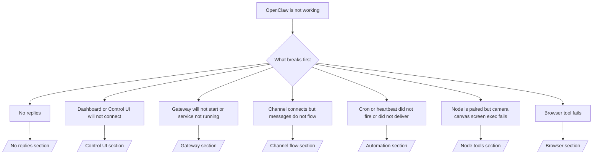

---
read_when:
    - OpenClaw لا يعمل وتحتاج إلى أسرع مسار للإصلاح
    - تحتاج إلى مسار فرز أولي قبل التعمق في أدلة التشغيل المفصلة
summary: مركز استكشاف الأخطاء وإصلاحها في OpenClaw حسب العَرَض أولًا
title: استكشاف الأخطاء العامة وإصلاحها
x-i18n:
    generated_at: "2026-06-27T17:48:25Z"
    model: gpt-5.5
    postprocess_version: locale-links-v1
    provider: openai
    source_hash: ae1236c73e3a5c9237bd81d603e8dca18c595a8bcbb71f5931bfbf2389b342cd
    source_path: help/troubleshooting.md
    workflow: 16
---

إذا كان لديك دقيقتان فقط، فاستخدم هذه الصفحة كبوابة فرز أولية.

## أول 60 ثانية

شغّل هذا السلم المحدد بالترتيب:

```bash
openclaw status
openclaw status --all
openclaw gateway probe
openclaw gateway status
openclaw doctor
openclaw channels status --probe
openclaw logs --follow
```

المخرجات الجيدة في سطر واحد:

- `openclaw status` → يعرض القنوات المضبوطة ولا يُظهر أخطاء مصادقة واضحة.
- `openclaw status --all` → التقرير الكامل موجود وقابل للمشاركة.
- `openclaw gateway probe` → هدف Gateway المتوقع قابل للوصول (`Reachable: yes`). يخبرك `Capability: ...` بمستوى المصادقة الذي استطاع الفحص إثباته، و`Read probe: limited - missing scope: operator.read` يعني تشخيصات متدهورة، وليس فشل اتصال.
- `openclaw gateway status` → `Runtime: running` و`Connectivity probe: ok` وسطر `Capability: ...` معقول. استخدم `--require-rpc` إذا كنت تحتاج أيضًا إلى إثبات RPC بنطاق قراءة.
- `openclaw doctor` → لا توجد أخطاء ضبط/خدمة مانعة.
- `openclaw channels status --probe` → يعيد Gateway القابل للوصول حالة نقل حية لكل حساب
  بالإضافة إلى نتائج الفحص/التدقيق مثل `works` أو `audit ok`؛ إذا كان
  Gateway غير قابل للوصول، يرجع الأمر إلى ملخصات الضبط فقط.
- `openclaw logs --follow` → نشاط مستقر، بلا أخطاء فادحة متكررة.

## المساعد يبدو محدودًا أو تنقصه الأدوات

إذا كان المساعد لا يستطيع فحص الملفات أو تشغيل الأوامر أو استخدام أتمتة المتصفح أو
رؤية الأدوات المتوقعة، فتحقق أولًا من ملف الأدوات الفعّال:

```bash
openclaw status
openclaw status --all
openclaw doctor
```

الأسباب الشائعة:

- `tools.profile: "messaging"` محدود عمدًا للوكلاء المخصصين للدردشة فقط.
- `tools.profile: "coding"` هو الملف المعتاد لتدفقات عمل المستودعات والملفات والصدفة
  ووقت التشغيل.
- `tools.profile: "full"` يكشف أوسع مجموعة أدوات ويجب حصره
  في الوكلاء الموثوقين الخاضعين لتحكم المشغل.
- يمكن لتجاوزات `agents.list[].tools` لكل وكيل تضييق الملف الجذري أو توسيعه
  لوكيل واحد.

غيّر ملف الأدوات الجذري أو الخاص بالوكيل، ثم أعد تشغيل Gateway أو أعد تحميله
وشغّل `openclaw status --all` مرة أخرى. راجع [الأدوات](/ar/tools) لمعرفة نموذج الملفات
وتجاوزات السماح/الرفض.

## سياق Anthropic الطويل 429

إذا رأيت:
`HTTP 429: rate_limit_error: Extra usage is required for long context requests`،
فانتقل إلى [/gateway/troubleshooting#anthropic-429-extra-usage-required-for-long-context](/ar/gateway/troubleshooting#anthropic-429-extra-usage-required-for-long-context).

## الواجهة الخلفية المحلية المتوافقة مع OpenAI تعمل مباشرةً لكنها تفشل في OpenClaw

إذا كانت واجهة `/v1` المحلية أو ذاتية الاستضافة تجيب على فحوصات
`/v1/chat/completions` المباشرة الصغيرة لكنها تفشل عند `openclaw infer model run` أو في
دورات الوكيل العادية:

1. إذا ذكر الخطأ أن `messages[].content` يتوقع سلسلة نصية، فاضبط
   `models.providers.<provider>.models[].compat.requiresStringContent: true`.
2. إذا ظلت الواجهة الخلفية تفشل فقط في دورات وكيل OpenClaw، فاضبط
   `models.providers.<provider>.models[].compat.supportsTools: false` وأعد المحاولة.
3. إذا كانت الاستدعاءات المباشرة الصغيرة ما زالت تعمل لكن مطالبات OpenClaw الأكبر تتسبب في تعطل
   الواجهة الخلفية، فتعامل مع المشكلة المتبقية كقيد في النموذج/الخادم upstream وتابع
   في دليل التشغيل المتعمق:
   [/gateway/troubleshooting#local-openai-compatible-backend-passes-direct-probes-but-agent-runs-fail](/ar/gateway/troubleshooting#local-openai-compatible-backend-passes-direct-probes-but-agent-runs-fail)

## فشل تثبيت Plugin بسبب فقدان امتدادات openclaw

إذا فشل التثبيت مع `package.json missing openclaw.extensions`، فهذا يعني أن حزمة Plugin
تستخدم شكلًا قديمًا لم يعد OpenClaw يقبله.

الإصلاح في حزمة Plugin:

1. أضف `openclaw.extensions` إلى `package.json`.
2. وجّه الإدخالات إلى ملفات وقت التشغيل المبنية (عادةً `./dist/index.js`).
3. أعد نشر Plugin وشغّل `openclaw plugins install <package>` مرة أخرى.

مثال:

```json
{
  "name": "@openclaw/my-plugin",
  "version": "1.2.3",
  "openclaw": {
    "extensions": ["./dist/index.js"]
  }
}
```

المرجع: [معمارية Plugin](/ar/plugins/architecture)

## سياسة التثبيت تمنع تثبيتات Plugin أو تحديثاتها

إذا اكتمل تحديث لكن Plugins قديمة أو معطلة أو تعرض رسائل مثل
`blocked by install policy` أو `install policy failed closed` أو
`Disabled "<plugin>" after plugin update failure`، فتحقق من
`security.installPolicy`.

تعمل سياسة التثبيت على تثبيتات Plugin وتحديثاتها. عادةً ما تتحرك إصدارات Plugin
المملوكة لـ OpenClaw مع إصدار OpenClaw، لذلك قد يحتاج تحديث OpenClaw
أيضًا إلى تحديثات Plugin مطابقة من `@openclaw/*` أثناء مزامنة ما بعد التحديث.

تجنب أشكال السياسات الواسعة هذه إلا إذا كنت تحافظ أيضًا على قاعدة الترقية المطابقة:

- تثبيت Plugins المملوكة لـ OpenClaw على إصدار قديم محدد واحد، مثل السماح
  فقط بـ `@openclaw/*@2026.5.3`.
- الحظر حسب نوع المصدر وحده، مثل كل طلبات Plugin من npm أو الشبكة أو
  `request.mode: "update"`.
- التعامل مع أمر السياسة على أنه اختياري. عند تمكين `security.installPolicy`،
  فإن ملف سياسة تنفيذي مفقودًا أو بطيئًا أو غير قابل للقراءة أو محجوبًا بالأذونات
  يفشل مغلقًا.
- الموافقة على إصدارات Plugin دون مراعاة
  `openclawVersion` في طلب السياسة وبيانات مرشح Plugin الوصفية.

تسمح قواعد السياسة الأكثر أمانًا بتحديثات Plugin الموثوقة المملوكة لـ OpenClaw عندما يكون
المرشح متوافقًا مع مضيف OpenClaw الحالي، بدلًا من تثبيت
إصدار واحد إلى الأبد. إذا كنت تحظر npm افتراضيًا، فأنشئ استثناءً ضيقًا
لحزم Plugin الموثوقة `@openclaw/*` أو معرّفات Plugin التي تستخدمها. إذا كنت
تميّز بين طلبات التثبيت والتحديث، فطبّق قاعدة الثقة نفسها على
`request.mode: "update"`.

الاسترداد:

```bash
openclaw doctor --deep
openclaw plugins update --all
openclaw status --all
```

إذا كانت السياسة صارمة عمدًا، فخففها لنافذة ترقية OpenClaw الموثوقة،
وأعد تشغيل `openclaw plugins update --all`، ثم أعد القاعدة الأكثر صرامة.
إذا تم تعطيل Plugin بعد فشل التحديث، فافحصه وأعد تمكينه فقط
بعد نجاح التحديث:

```bash
openclaw plugins inspect <plugin-id> --runtime --json
openclaw plugins enable <plugin-id>
```

المرجع: [سياسة تثبيت المشغل](/ar/tools/skills-config#operator-install-policy-securityinstallpolicy)

## Plugin موجود لكنه محجوب بسبب ملكية مشبوهة

إذا أظهر `openclaw doctor` أو الإعداد أو تحذيرات بدء التشغيل:

```text
blocked plugin candidate: suspicious ownership (... uid=1000, expected uid=0 or root)
plugin present but blocked
```

فإن ملفات Plugin مملوكة لمستخدم Unix مختلف عن العملية التي تحمّلها.
لا تزل ضبط Plugin. أصلح ملكية الملفات أو شغّل OpenClaw بالمستخدم نفسه
الذي يملك دليل الحالة.

تعمل تثبيتات Docker عادةً باسم `node` (uid `1000`). بالنسبة لإعداد Docker
الافتراضي، أصلح نقاط ربط المضيف:

```bash
sudo chown -R 1000:1000 /path/to/openclaw-config /path/to/openclaw-workspace
openclaw doctor --fix
```

إذا كنت تشغّل OpenClaw عمدًا كجذر، فأصلح جذر Plugin المُدار ليكون
بملكية الجذر بدلًا من ذلك:

```bash
sudo chown -R root:root /path/to/openclaw-config/npm
openclaw doctor --fix
```

مستندات أعمق:

- [ملكية مسار Plugin](/ar/tools/plugin#blocked-plugin-path-ownership)
- [أذونات Docker](/ar/install/docker#permissions-and-eacces)

## شجرة القرار



<AccordionGroup>
  <Accordion title="No replies">
    ```bash
    openclaw status
    openclaw gateway status
    openclaw channels status --probe
    openclaw pairing list --channel <channel> [--account <id>]
    openclaw logs --follow
    ```

    تبدو المخرجات الجيدة كالتالي:

    - `Runtime: running`
    - `Connectivity probe: ok`
    - `Capability: read-only` أو `write-capable` أو `admin-capable`
    - تعرض قناتك أن النقل متصل، وحيثما كان مدعومًا، `works` أو `audit ok` في `channels status --probe`
    - يظهر المُرسل موافَقًا عليه (أو سياسة الرسائل المباشرة مفتوحة/قائمة سماح)

    بصمات السجل الشائعة:

    - `drop guild message (mention required` → حجب شرط الإشارة الرسالة في Discord.
    - `pairing request` → المُرسل غير موافَق عليه وينتظر موافقة الاقتران عبر رسالة مباشرة.
    - `blocked` / `allowlist` في سجلات القناة → تمت تصفية المُرسل أو الغرفة أو المجموعة.

    صفحات متعمقة:

    - [/gateway/troubleshooting#no-replies](/ar/gateway/troubleshooting#no-replies)
    - [/channels/troubleshooting](/ar/channels/troubleshooting)
    - [/channels/pairing](/ar/channels/pairing)

  </Accordion>

  <Accordion title="Dashboard or Control UI will not connect">
    ```bash
    openclaw status
    openclaw gateway status
    openclaw logs --follow
    openclaw doctor
    openclaw channels status --probe
    ```

    تبدو المخرجات الجيدة كالتالي:

    - يظهر `Dashboard: http://...` في `openclaw gateway status`
    - `Connectivity probe: ok`
    - `Capability: read-only` أو `write-capable` أو `admin-capable`
    - لا توجد حلقة مصادقة في السجلات

    بصمات السجل الشائعة:

    - `device identity required` → لا يستطيع سياق HTTP/غير الآمن إكمال مصادقة الجهاز.
    - `origin not allowed` → `Origin` الخاص بالمتصفح غير مسموح به لهدف Gateway
      الخاص بـ Control UI.
    - `AUTH_TOKEN_MISMATCH` مع تلميحات إعادة المحاولة (`canRetryWithDeviceToken=true`) → قد تحدث إعادة محاولة واحدة موثوقة برمز الجهاز تلقائيًا.
    - تعيد إعادة المحاولة برمز مخزن مؤقتًا استخدام مجموعة النطاقات المخزنة مع رمز الجهاز
      المقترن. يحتفظ المستدعون الذين يستخدمون `deviceToken` صريحًا / `scopes` صريحة
      بمجموعة النطاقات المطلوبة بدلًا من ذلك.
    - على مسار Control UI غير المتزامن عبر Tailscale Serve، تُسلسل المحاولات الفاشلة لنفس
      `{scope, ip}` قبل أن يسجل المحدِّد الفشل، لذلك يمكن أن تعرض
      إعادة محاولة سيئة متزامنة ثانية `retry later` بالفعل.
    - `too many failed authentication attempts (retry later)` من أصل متصفح localhost
      → الإخفاقات المتكررة من `Origin` نفسه تُقفل مؤقتًا؛ يستخدم أصل localhost آخر حاوية منفصلة.
    - تكرار `unauthorized` بعد إعادة المحاولة تلك → رمز/كلمة مرور خاطئة، أو عدم تطابق وضع المصادقة، أو رمز جهاز مقترن قديم.
    - `gateway connect failed:` → تستهدف الواجهة عنوان URL/منفذًا خاطئًا أو Gateway غير قابل للوصول.

    صفحات متعمقة:

    - [/gateway/troubleshooting#dashboard-control-ui-connectivity](/ar/gateway/troubleshooting#dashboard-control-ui-connectivity)
    - [/web/control-ui](/ar/web/control-ui)
    - [/gateway/authentication](/ar/gateway/authentication)

  </Accordion>

  <Accordion title="Gateway will not start or service installed but not running">
    ```bash
    openclaw status
    openclaw gateway status
    openclaw logs --follow
    openclaw doctor
    openclaw channels status --probe
    ```

    تبدو المخرجات الجيدة كالتالي:

    - `Service: ... (loaded)`
    - `Runtime: running`
    - `Connectivity probe: ok`
    - `Capability: read-only` أو `write-capable` أو `admin-capable`

    بصمات السجل الشائعة:

    - `Gateway start blocked: set gateway.mode=local` أو `existing config is missing gateway.mode` → وضع Gateway بعيد، أو ملف الضبط يفتقد ختم الوضع المحلي ويجب إصلاحه.
    - `refusing to bind gateway ... without auth` → ربط غير loopback دون مسار مصادقة Gateway صالح (رمز/كلمة مرور، أو trusted-proxy حيث يكون مضبوطًا).
    - `another gateway instance is already listening` أو `EADDRINUSE` → المنفذ مشغول بالفعل.

    صفحات متعمقة:

    - [/gateway/troubleshooting#gateway-service-not-running](/ar/gateway/troubleshooting#gateway-service-not-running)
    - [/gateway/background-process](/ar/gateway/background-process)
    - [/gateway/configuration](/ar/gateway/configuration)

  </Accordion>

  <Accordion title="القناة متصلة لكن الرسائل لا تتدفق">
    ```bash
    openclaw status
    openclaw gateway status
    openclaw logs --follow
    openclaw doctor
    openclaw channels status --probe
    ```

    يبدو الإخراج الجيد كالتالي:

    - نقل القناة متصل.
    - تنجح فحوصات الاقتران/قائمة السماح.
    - تُكتشف الإشارات حيث تكون مطلوبة.

    بصمات السجل الشائعة:

    - `mention required` → منع بوابة الإشارة في المجموعة المعالجة.
    - `pairing` / `pending` → مرسل الرسائل المباشرة لم تتم الموافقة عليه بعد.
    - `not_in_channel`, `missing_scope`, `Forbidden`, `401/403` → مشكلة في رمز إذن القناة.

    صفحات تفصيلية:

    - [/gateway/troubleshooting#channel-connected-messages-not-flowing](/ar/gateway/troubleshooting#channel-connected-messages-not-flowing)
    - [/channels/troubleshooting](/ar/channels/troubleshooting)

  </Accordion>

  <Accordion title="Cron أو Heartbeat لم يعمل أو لم يسلّم">
    ```bash
    openclaw status
    openclaw gateway status
    openclaw cron status
    openclaw cron list
    openclaw cron runs --id <jobId> --limit 20
    openclaw logs --follow
    ```

    يبدو الإخراج الجيد كالتالي:

    - يعرض `cron.status` أنه مفعّل مع إيقاظ تالٍ.
    - يعرض `cron runs` إدخالات `ok` حديثة.
    - Heartbeat مفعّل وليس خارج ساعات النشاط.

    بصمات السجل الشائعة:

    - `cron: scheduler disabled; jobs will not run automatically` → Cron معطّل.
    - `heartbeat skipped` مع `reason=quiet-hours` → خارج ساعات النشاط المضبوطة.
    - `heartbeat skipped` مع `reason=empty-heartbeat-file` → يوجد `HEARTBEAT.md` لكنه يحتوي فقط على فراغات أو تعليقات أو ترويسة أو سياج أو هيكل قائمة تحقق فارغ.
    - `heartbeat skipped` مع `reason=no-tasks-due` → وضع مهام `HEARTBEAT.md` نشط، لكن لم يحن موعد أي من فواصل المهام بعد.
    - `heartbeat skipped` مع `reason=alerts-disabled` → كل مرئية Heartbeat معطّلة (`showOk` و`showAlerts` و`useIndicator` كلها متوقفة).
    - `requests-in-flight` → المسار الرئيسي مشغول؛ تم تأجيل إيقاظ Heartbeat.
    - `unknown accountId` → حساب هدف تسليم Heartbeat غير موجود.

    صفحات تفصيلية:

    - [/gateway/troubleshooting#cron-and-heartbeat-delivery](/ar/gateway/troubleshooting#cron-and-heartbeat-delivery)
    - [/automation/cron-jobs#troubleshooting](/ar/automation/cron-jobs#troubleshooting)
    - [/gateway/heartbeat](/ar/gateway/heartbeat)

  </Accordion>

  <Accordion title="Node مقترن لكن الأداة تفشل في camera أو canvas أو screen أو exec">
    ```bash
    openclaw status
    openclaw gateway status
    openclaw nodes status
    openclaw nodes describe --node <idOrNameOrIp>
    openclaw logs --follow
    ```

    يبدو الإخراج الجيد كالتالي:

    - يظهر Node كمتصل ومقترن للدور `node`.
    - توجد الإمكانية للأمر الذي تستدعيه.
    - حالة الإذن ممنوحة للأداة.

    بصمات السجل الشائعة:

    - `NODE_BACKGROUND_UNAVAILABLE` → اجلب تطبيق Node إلى المقدمة.
    - `*_PERMISSION_REQUIRED` → تم رفض/فقدان إذن نظام التشغيل.
    - `SYSTEM_RUN_DENIED: approval required` → موافقة exec معلّقة.
    - `SYSTEM_RUN_DENIED: allowlist miss` → الأمر غير موجود في قائمة سماح exec.

    صفحات تفصيلية:

    - [/gateway/troubleshooting#node-paired-tool-fails](/ar/gateway/troubleshooting#node-paired-tool-fails)
    - [/nodes/troubleshooting](/ar/nodes/troubleshooting)
    - [/tools/exec-approvals](/ar/tools/exec-approvals)

  </Accordion>

  <Accordion title="exec يطلب الموافقة فجأة">
    ```bash
    openclaw config get tools.exec.host
    openclaw config get tools.exec.security
    openclaw config get tools.exec.ask
    openclaw gateway restart
    ```

    ما الذي تغيّر:

    - إذا لم يتم ضبط `tools.exec.host`، فالافتراضي هو `auto`.
    - يتحول `host=auto` إلى `sandbox` عندما يكون وقت تشغيل sandbox نشطًا، وإلى `gateway` خلاف ذلك.
    - `host=auto` هو توجيه فقط؛ سلوك "YOLO" بلا مطالبة يأتي من `security=full` مع `ask=off` على Gateway/Node.
    - على `gateway` و`node`، القيمة غير المضبوطة لـ`tools.exec.security` تكون افتراضيًا `full`.
    - القيمة غير المضبوطة لـ`tools.exec.ask` تكون افتراضيًا `off`.
    - النتيجة: إذا كنت ترى موافقات، فهذا يعني أن سياسة محلية للمضيف أو خاصة بالجلسة شددت exec بعيدًا عن الإعدادات الافتراضية الحالية.

    استعد السلوك الافتراضي الحالي بلا موافقة:

    ```bash
    openclaw config set tools.exec.host gateway
    openclaw config set tools.exec.security full
    openclaw config set tools.exec.ask off
    openclaw gateway restart
    ```

    بدائل أكثر أمانًا:

    - اضبط فقط `tools.exec.host=gateway` إذا كنت تريد توجيه مضيف ثابتًا.
    - استخدم `security=allowlist` مع `ask=on-miss` إذا كنت تريد exec على المضيف لكنك ما زلت تريد المراجعة عند فقدان إدخال في قائمة السماح.
    - فعّل وضع sandbox إذا كنت تريد أن يعود `host=auto` إلى `sandbox`.

    بصمات السجل الشائعة:

    - `Approval required.` → الأمر ينتظر `/approve ...`.
    - `SYSTEM_RUN_DENIED: approval required` → موافقة exec على مضيف Node معلّقة.
    - `exec host=sandbox requires a sandbox runtime for this session` → اختيار sandbox ضمني/صريح لكن وضع sandbox متوقف.

    صفحات تفصيلية:

    - [/tools/exec](/ar/tools/exec)
    - [/tools/exec-approvals](/ar/tools/exec-approvals)
    - [/gateway/security#what-the-audit-checks-high-level](/ar/gateway/security#what-the-audit-checks-high-level)

  </Accordion>

  <Accordion title="أداة المتصفح تفشل">
    ```bash
    openclaw status
    openclaw gateway status
    openclaw browser status
    openclaw logs --follow
    openclaw doctor
    ```

    يبدو الإخراج الجيد كالتالي:

    - تعرض حالة المتصفح `running: true` ومتصفحًا/ملفًا شخصيًا مختارًا.
    - يبدأ `openclaw`، أو يستطيع `user` رؤية علامات تبويب Chrome المحلية.

    بصمات السجل الشائعة:

    - `unknown command "browser"` أو `unknown command 'browser'` → تم ضبط `plugins.allow` ولا يتضمن `browser`.
    - `Failed to start Chrome CDP on port` → فشل تشغيل المتصفح المحلي.
    - `browser.executablePath not found` → مسار الملف التنفيذي المضبوط خاطئ.
    - `browser.cdpUrl must be http(s) or ws(s)` → يستخدم عنوان URL المضبوط لـ CDP مخططًا غير مدعوم.
    - `browser.cdpUrl has invalid port` → يحتوي عنوان URL المضبوط لـ CDP على منفذ غير صالح أو خارج النطاق.
    - `No Chrome tabs found for profile="user"` → لا يحتوي ملف إرفاق Chrome MCP الشخصي على علامات تبويب Chrome محلية مفتوحة.
    - `Remote CDP for profile "<name>" is not reachable` → نقطة نهاية CDP البعيدة المضبوطة غير قابلة للوصول من هذا المضيف.
    - `Browser attachOnly is enabled ... not reachable` أو `Browser attachOnly is enabled and CDP websocket ... is not reachable` → ملف attach-only الشخصي لا يحتوي على هدف CDP حي.
    - تجاوزات منفذ عرض / وضع داكن / لغة / عدم اتصال قديمة على ملفات attach-only أو ملفات CDP البعيدة → شغّل `openclaw browser stop --browser-profile <name>` لإغلاق جلسة التحكم النشطة وتحرير حالة المحاكاة دون إعادة تشغيل Gateway.

    صفحات تفصيلية:

    - [/gateway/troubleshooting#browser-tool-fails](/ar/gateway/troubleshooting#browser-tool-fails)
    - [/tools/browser#missing-browser-command-or-tool](/ar/tools/browser#missing-browser-command-or-tool)
    - [/tools/browser-linux-troubleshooting](/ar/tools/browser-linux-troubleshooting)
    - [/tools/browser-wsl2-windows-remote-cdp-troubleshooting](/ar/tools/browser-wsl2-windows-remote-cdp-troubleshooting)

  </Accordion>

</AccordionGroup>

## ذو صلة

- [الأسئلة الشائعة](/ar/help/faq) — أسئلة متكررة
- [استكشاف أخطاء Gateway وإصلاحها](/ar/gateway/troubleshooting) — مشكلات خاصة بـ Gateway
- [Doctor](/ar/gateway/doctor) — فحوصات صحة وإصلاحات آلية
- [استكشاف أخطاء القنوات وإصلاحها](/ar/channels/troubleshooting) — مشكلات اتصال القنوات
- [استكشاف أخطاء الأتمتة وإصلاحها](/ar/automation/cron-jobs#troubleshooting) — مشكلات Cron وHeartbeat
