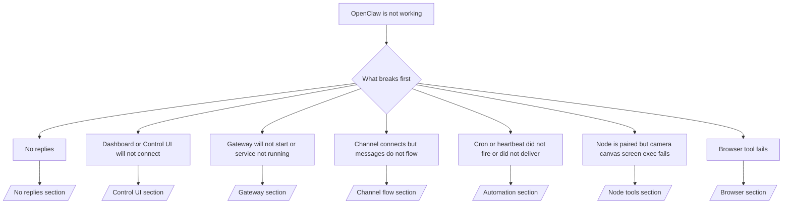

---
read_when:
    - OpenClaw لا يعمل وتحتاج إلى أسرع مسار لإصلاحه
    - تحتاج إلى مسار فرز قبل التعمق في أدلة التشغيل المفصلة
summary: مركز استكشاف أخطاء OpenClaw وإصلاحها بدءًا من الأعراض
title: استكشاف الأخطاء وإصلاحها العام
x-i18n:
    generated_at: "2026-05-06T07:58:55Z"
    model: gpt-5.5
    provider: openai
    source_hash: 624fa34cda3b440fa9cc636beb3fe6e3608a77a332933fa593097ebc556ac745
    source_path: help/troubleshooting.md
    workflow: 16
---

إذا كان لديك دقيقتان فقط، فاستخدم هذه الصفحة كمدخل أولي للفرز.

## أول 60 ثانية

شغّل هذا التسلسل الدقيق بالترتيب:

```bash
openclaw status
openclaw status --all
openclaw gateway probe
openclaw gateway status
openclaw doctor
openclaw channels status --probe
openclaw logs --follow
```

المخرجات الجيدة في سطر واحد:

- `openclaw status` → يعرض القنوات المضبوطة ولا يُظهر أخطاء مصادقة واضحة.
- `openclaw status --all` → التقرير الكامل موجود وقابل للمشاركة.
- `openclaw gateway probe` → هدف الـ Gateway المتوقع قابل للوصول (`Reachable: yes`). يخبرك `Capability: ...` بمستوى المصادقة الذي استطاع الفحص إثباته، و`Read probe: limited - missing scope: operator.read` يعني تشخيصات متدهورة، وليس فشل اتصال.
- `openclaw gateway status` → `Runtime: running` و`Connectivity probe: ok` وسطر `Capability: ...` معقول. استخدم `--require-rpc` إذا كنت تحتاج أيضًا إلى إثبات RPC بنطاق القراءة.
- `openclaw doctor` → لا توجد أخطاء ضبط/خدمة مانعة.
- `openclaw channels status --probe` → يعيد الـ Gateway القابل للوصول حالة النقل الحية لكل حساب
  إضافة إلى نتائج الفحص/التدقيق مثل `works` أو `audit ok`؛ وإذا كان
  الـ Gateway غير قابل للوصول، يعود الأمر إلى ملخصات الضبط فقط.
- `openclaw logs --follow` → نشاط مستقر، ولا توجد أخطاء فادحة متكررة.

## خطأ Anthropic 429 في السياق الطويل

إذا رأيت:
`HTTP 429: rate_limit_error: Extra usage is required for long context requests`,
فانتقل إلى [/gateway/troubleshooting#anthropic-429-extra-usage-required-for-long-context](/ar/gateway/troubleshooting#anthropic-429-extra-usage-required-for-long-context).

## الواجهة الخلفية المحلية المتوافقة مع OpenAI تعمل مباشرة لكنها تفشل في OpenClaw

إذا كانت الواجهة الخلفية المحلية أو ذاتية الاستضافة عند `/v1` تجيب على فحوصات
`/v1/chat/completions` المباشرة الصغيرة لكنها تفشل مع `openclaw infer model run` أو دورات
الوكيل العادية:

1. إذا ذكر الخطأ أن `messages[].content` يتوقع سلسلة نصية، فاضبط
   `models.providers.<provider>.models[].compat.requiresStringContent: true`.
2. إذا استمرت الواجهة الخلفية في الفشل فقط مع دورات وكيل OpenClaw، فاضبط
   `models.providers.<provider>.models[].compat.supportsTools: false` ثم أعد المحاولة.
3. إذا ظلت الاستدعاءات المباشرة الصغيرة تعمل لكن مطالبات OpenClaw الأكبر تتسبب في تعطل
   الواجهة الخلفية، فتعامل مع المشكلة المتبقية على أنها قيدًا في نموذج/خادم المنبع وتابع
   في دليل التشغيل التفصيلي:
   [/gateway/troubleshooting#local-openai-compatible-backend-passes-direct-probes-but-agent-runs-fail](/ar/gateway/troubleshooting#local-openai-compatible-backend-passes-direct-probes-but-agent-runs-fail)

## فشل تثبيت Plugin بسبب غياب امتدادات openclaw

إذا فشل التثبيت مع `package.json missing openclaw.extensions`، فهذا يعني أن حزمة الـ plugin
تستخدم بنية قديمة لم يعد OpenClaw يقبلها.

أصلح ذلك في حزمة الـ plugin:

1. أضف `openclaw.extensions` إلى `package.json`.
2. وجّه الإدخالات إلى ملفات التشغيل المبنية (عادةً `./dist/index.js`).
3. أعد نشر الـ plugin وشغّل `openclaw plugins install <package>` مرة أخرى.

مثال:

```json
{
  "name": "@openclaw/my-plugin",
  "version": "1.2.3",
  "openclaw": {
    "extensions": ["./dist/index.js"]
  }
}
```

المرجع: [بنية الـ Plugin](/ar/plugins/architecture)

## Plugin موجود لكنه محجوب بسبب ملكية مشبوهة

إذا أظهرت تحذيرات `openclaw doctor` أو الإعداد أو بدء التشغيل:

```text
blocked plugin candidate: suspicious ownership (... uid=1000, expected uid=0 or root)
plugin present but blocked
```

فملفات الـ plugin مملوكة لمستخدم Unix مختلف عن العملية التي تحمّلها.
لا تزل ضبط الـ plugin. أصلح ملكية الملفات أو شغّل OpenClaw بالمستخدم نفسه
الذي يملك دليل الحالة.

تعمل تثبيتات Docker عادةً باسم `node` (uid `1000`). في إعداد Docker الافتراضي،
أصلح عمليات ربط المضيف:

```bash
sudo chown -R 1000:1000 /path/to/openclaw-config /path/to/openclaw-workspace
openclaw doctor --fix
```

إذا كنت تشغّل OpenClaw كجذر عمدًا، فأصلح جذر الـ plugin المُدار ليصبح
بملكية الجذر بدلًا من ذلك:

```bash
sudo chown -R root:root /path/to/openclaw-config/npm
openclaw doctor --fix
```

مستندات أعمق:

- [ملكية مسار الـ Plugin](/ar/tools/plugin#blocked-plugin-path-ownership)
- [أذونات Docker](/ar/install/docker#permissions-and-eacces)

## شجرة القرار



<AccordionGroup>
  <Accordion title="لا توجد ردود">
    ```bash
    openclaw status
    openclaw gateway status
    openclaw channels status --probe
    openclaw pairing list --channel <channel> [--account <id>]
    openclaw logs --follow
    ```

    تبدو المخرجات الجيدة كما يلي:

    - `Runtime: running`
    - `Connectivity probe: ok`
    - `Capability: read-only` أو `write-capable` أو `admin-capable`
    - تعرض قناتك أن النقل متصل، وحيثما يكون ذلك مدعومًا، يظهر `works` أو `audit ok` في `channels status --probe`
    - يظهر المرسل معتمدًا (أو سياسة الرسائل المباشرة مفتوحة/قائمة سماح)

    بصمات السجل الشائعة:

    - `drop guild message (mention required` → حجب اشتراط الإشارة الرسالة في Discord.
    - `pairing request` → المرسل غير معتمد وينتظر موافقة الاقتران عبر الرسائل المباشرة.
    - `blocked` / `allowlist` في سجلات القناة → تمت تصفية المرسل أو الغرفة أو المجموعة.

    صفحات تفصيلية:

    - [/gateway/troubleshooting#no-replies](/ar/gateway/troubleshooting#no-replies)
    - [/channels/troubleshooting](/ar/channels/troubleshooting)
    - [/channels/pairing](/ar/channels/pairing)

  </Accordion>

  <Accordion title="لوحة المعلومات أو واجهة التحكم لا تتصل">
    ```bash
    openclaw status
    openclaw gateway status
    openclaw logs --follow
    openclaw doctor
    openclaw channels status --probe
    ```

    تبدو المخرجات الجيدة كما يلي:

    - يظهر `Dashboard: http://...` في `openclaw gateway status`
    - `Connectivity probe: ok`
    - `Capability: read-only` أو `write-capable` أو `admin-capable`
    - لا توجد حلقة مصادقة في السجلات

    بصمات السجل الشائعة:

    - `device identity required` → لا يستطيع سياق HTTP/غير الآمن إكمال مصادقة الجهاز.
    - `origin not allowed` → `Origin` الخاص بالمتصفح غير مسموح به لهدف Gateway
      الخاص بواجهة التحكم.
    - `AUTH_TOKEN_MISMATCH` مع تلميحات إعادة المحاولة (`canRetryWithDeviceToken=true`) → قد تحدث إعادة محاولة موثوقة واحدة باستخدام رمز الجهاز تلقائيًا.
    - تعيد محاولة الرمز المخزن مؤقتًا هذه استخدام مجموعة النطاقات المخزنة مؤقتًا مع رمز
      الجهاز المقترن. يحتفظ المستدعون الذين يستخدمون `deviceToken` صريحًا / `scopes` صريحة
      بمجموعة النطاقات المطلوبة لديهم بدلًا من ذلك.
    - على مسار واجهة التحكم غير المتزامن عبر Tailscale Serve، تُسلسل المحاولات الفاشلة لنفس
      `{scope, ip}` قبل أن يسجل المحدد الفشل، لذلك يمكن لإعادة محاولة سيئة ثانية متزامنة أن تعرض `retry later` بالفعل.
    - `too many failed authentication attempts (retry later)` من أصل متصفح localhost
      → تؤدي الإخفاقات المتكررة من `Origin` نفسه إلى قفل مؤقت؛ يستخدم أصل localhost آخر حاوية منفصلة.
    - تكرار `unauthorized` بعد إعادة المحاولة تلك → رمز/كلمة مرور خاطئة، أو عدم تطابق وضع المصادقة، أو رمز جهاز مقترن قديم.
    - `gateway connect failed:` → تستهدف واجهة المستخدم عنوان URL/منفذًا خاطئًا أو Gateway غير قابل للوصول.

    صفحات تفصيلية:

    - [/gateway/troubleshooting#dashboard-control-ui-connectivity](/ar/gateway/troubleshooting#dashboard-control-ui-connectivity)
    - [/web/control-ui](/ar/web/control-ui)
    - [/gateway/authentication](/ar/gateway/authentication)

  </Accordion>

  <Accordion title="Gateway لا يبدأ أو الخدمة مثبّتة لكنها لا تعمل">
    ```bash
    openclaw status
    openclaw gateway status
    openclaw logs --follow
    openclaw doctor
    openclaw channels status --probe
    ```

    تبدو المخرجات الجيدة كما يلي:

    - `Service: ... (loaded)`
    - `Runtime: running`
    - `Connectivity probe: ok`
    - `Capability: read-only` أو `write-capable` أو `admin-capable`

    بصمات السجل الشائعة:

    - `Gateway start blocked: set gateway.mode=local` أو `existing config is missing gateway.mode` → وضع الـ Gateway بعيد، أو أن ملف الضبط يفتقد علامة الوضع المحلي ويجب إصلاحه.
    - `refusing to bind gateway ... without auth` → ربط غير local loopback بدون مسار مصادقة Gateway صالح (رمز/كلمة مرور، أو وكيل موثوق حيث يكون مضبوطًا).
    - `another gateway instance is already listening` أو `EADDRINUSE` → المنفذ مستخدم بالفعل.

    صفحات تفصيلية:

    - [/gateway/troubleshooting#gateway-service-not-running](/ar/gateway/troubleshooting#gateway-service-not-running)
    - [/gateway/background-process](/ar/gateway/background-process)
    - [/gateway/configuration](/ar/gateway/configuration)

  </Accordion>

  <Accordion title="القناة تتصل لكن الرسائل لا تتدفق">
    ```bash
    openclaw status
    openclaw gateway status
    openclaw logs --follow
    openclaw doctor
    openclaw channels status --probe
    ```

    تبدو المخرجات الجيدة كما يلي:

    - نقل القناة متصل.
    - تنجح فحوصات الاقتران/قائمة السماح.
    - تُكتشف الإشارات حيث تكون مطلوبة.

    بصمات السجل الشائعة:

    - `mention required` → حجب اشتراط الإشارة في المجموعة المعالجة.
    - `pairing` / `pending` → مرسل الرسائل المباشرة غير معتمد بعد.
    - `not_in_channel` أو `missing_scope` أو `Forbidden` أو `401/403` → مشكلة في رمز أذونات القناة.

    صفحات تفصيلية:

    - [/gateway/troubleshooting#channel-connected-messages-not-flowing](/ar/gateway/troubleshooting#channel-connected-messages-not-flowing)
    - [/channels/troubleshooting](/ar/channels/troubleshooting)

  </Accordion>

  <Accordion title="Cron أو Heartbeat لم يعمل أو لم يسلّم">
    ```bash
    openclaw status
    openclaw gateway status
    openclaw cron status
    openclaw cron list
    openclaw cron runs --id <jobId> --limit 20
    openclaw logs --follow
    ```

    تبدو المخرجات الجيدة كما يلي:

    - يعرض `cron.status` أنه مفعّل مع الاستيقاظ التالي.
    - يعرض `cron runs` إدخالات `ok` حديثة.
    - Heartbeat مفعّل وليس خارج الساعات النشطة.

    بصمات السجل الشائعة:

    - `cron: scheduler disabled; jobs will not run automatically` → Cron معطّل.
    - `heartbeat skipped` مع `reason=quiet-hours` → خارج الساعات النشطة المضبوطة.
    - `heartbeat skipped` مع `reason=empty-heartbeat-file` → يوجد `HEARTBEAT.md` لكنه يحتوي فقط على هيكل فارغ/رؤوس فقط.
    - `heartbeat skipped` مع `reason=no-tasks-due` → وضع مهام `HEARTBEAT.md` نشط لكن لم يحِن بعد أي من فواصل المهام.
    - `heartbeat skipped` مع `reason=alerts-disabled` → كل ظهور Heartbeat معطّل (`showOk` و`showAlerts` و`useIndicator` كلها متوقفة).
    - `requests-in-flight` → المسار الرئيسي مشغول؛ تم تأجيل استيقاظ Heartbeat.
    - `unknown accountId` → حساب هدف تسليم Heartbeat غير موجود.

    صفحات تفصيلية:

    - [/gateway/troubleshooting#cron-and-heartbeat-delivery](/ar/gateway/troubleshooting#cron-and-heartbeat-delivery)
    - [/automation/cron-jobs#troubleshooting](/ar/automation/cron-jobs#troubleshooting)
    - [/gateway/heartbeat](/ar/gateway/heartbeat)

  </Accordion>

  <Accordion title="Node مقترن لكن الأداة تفشل في تنفيذ camera canvas screen exec">
    ```bash
    openclaw status
    openclaw gateway status
    openclaw nodes status
    openclaw nodes describe --node <idOrNameOrIp>
    openclaw logs --follow
    ```

    تبدو المخرجات الجيدة كما يلي:

    - يظهر Node كمتصل ومقترن لدور `node`.
    - توجد الإمكانية للأمر الذي تستدعيه.
    - حالة الإذن ممنوحة للأداة.

    بصمات السجل الشائعة:

    - `NODE_BACKGROUND_UNAVAILABLE` → أحضر تطبيق Node إلى المقدمة.
    - `*_PERMISSION_REQUIRED` → تم رفض/فقدان إذن نظام التشغيل.
    - `SYSTEM_RUN_DENIED: approval required` → موافقة exec معلقة.
    - `SYSTEM_RUN_DENIED: allowlist miss` → الأمر غير موجود في قائمة السماح لـ exec.

    صفحات تفصيلية:

    - [/gateway/troubleshooting#node-paired-tool-fails](/ar/gateway/troubleshooting#node-paired-tool-fails)
    - [/nodes/troubleshooting](/ar/nodes/troubleshooting)
    - [/tools/exec-approvals](/ar/tools/exec-approvals)

  </Accordion>

  <Accordion title="يطلب Exec الموافقة فجأة">
    ```bash
    openclaw config get tools.exec.host
    openclaw config get tools.exec.security
    openclaw config get tools.exec.ask
    openclaw gateway restart
    ```

    ما الذي تغير:

    - إذا لم يتم تعيين `tools.exec.host`، تكون القيمة الافتراضية `auto`.
    - يتحول `host=auto` إلى `sandbox` عندما يكون وقت تشغيل sandbox نشطا، وإلى `gateway` خلاف ذلك.
    - `host=auto` للتوجيه فقط؛ وسلوك "YOLO" بلا مطالبة يأتي من `security=full` مع `ask=off` على gateway/node.
    - على `gateway` و`node`، تكون القيمة الافتراضية غير المعينة لـ `tools.exec.security` هي `full`.
    - تكون القيمة الافتراضية غير المعينة لـ `tools.exec.ask` هي `off`.
    - النتيجة: إذا كنت ترى طلبات موافقة، فهذا يعني أن سياسة محلية للمضيف أو خاصة بالجلسة شددت exec بعيدا عن الإعدادات الافتراضية الحالية.

    استعادة السلوك الافتراضي الحالي بلا موافقة:

    ```bash
    openclaw config set tools.exec.host gateway
    openclaw config set tools.exec.security full
    openclaw config set tools.exec.ask off
    openclaw gateway restart
    ```

    بدائل أكثر أمانا:

    - عيّن فقط `tools.exec.host=gateway` إذا كنت تريد توجيها مستقرا للمضيف.
    - استخدم `security=allowlist` مع `ask=on-miss` إذا كنت تريد exec على المضيف مع استمرار المراجعة عند غياب الأمر عن قائمة السماح.
    - فعّل وضع sandbox إذا كنت تريد أن يتحول `host=auto` مرة أخرى إلى `sandbox`.

    توقيعات السجل الشائعة:

    - `Approval required.` → الأمر ينتظر `/approve ...`.
    - `SYSTEM_RUN_DENIED: approval required` → موافقة exec على مضيف Node معلقة.
    - `exec host=sandbox requires a sandbox runtime for this session` → اختيار sandbox ضمني/صريح لكن وضع sandbox متوقف.

    صفحات تفصيلية:

    - [/tools/exec](/ar/tools/exec)
    - [/tools/exec-approvals](/ar/tools/exec-approvals)
    - [/gateway/security#what-the-audit-checks-high-level](/ar/gateway/security#what-the-audit-checks-high-level)

  </Accordion>

  <Accordion title="تفشل أداة المتصفح">
    ```bash
    openclaw status
    openclaw gateway status
    openclaw browser status
    openclaw logs --follow
    openclaw doctor
    ```

    يبدو الإخراج الجيد هكذا:

    - تعرض حالة المتصفح `running: true` ومتصفحا/ملفا شخصيا مختارا.
    - يبدأ `openclaw`، أو يستطيع `user` رؤية تبويبات Chrome المحلية.

    توقيعات السجل الشائعة:

    - `unknown command "browser"` أو `unknown command 'browser'` → تم تعيين `plugins.allow` ولا يتضمن `browser`.
    - `Failed to start Chrome CDP on port` → فشل تشغيل المتصفح المحلي.
    - `browser.executablePath not found` → مسار الملف الثنائي المكوّن خاطئ.
    - `browser.cdpUrl must be http(s) or ws(s)` → يستخدم عنوان URL المكوّن لـ CDP مخططا غير مدعوم.
    - `browser.cdpUrl has invalid port` → يحتوي عنوان URL المكوّن لـ CDP على منفذ سيئ أو خارج النطاق.
    - `No Chrome tabs found for profile="user"` → لا يحتوي ملف إرفاق Chrome MCP الشخصي على تبويبات Chrome محلية مفتوحة.
    - `Remote CDP for profile "<name>" is not reachable` → لا يمكن الوصول إلى نقطة نهاية CDP البعيدة المكوّنة من هذا المضيف.
    - `Browser attachOnly is enabled ... not reachable` أو `Browser attachOnly is enabled and CDP websocket ... is not reachable` → لا يحتوي ملف التعريف attach-only على هدف CDP حي.
    - تجاوزات منفذ العرض / الوضع الداكن / اللغة / عدم الاتصال القديمة على ملفات تعريف attach-only أو CDP البعيدة → شغّل `openclaw browser stop --browser-profile <name>` لإغلاق جلسة التحكم النشطة وتحرير حالة المحاكاة دون إعادة تشغيل Gateway.

    صفحات تفصيلية:

    - [/gateway/troubleshooting#browser-tool-fails](/ar/gateway/troubleshooting#browser-tool-fails)
    - [/tools/browser#missing-browser-command-or-tool](/ar/tools/browser#missing-browser-command-or-tool)
    - [/tools/browser-linux-troubleshooting](/ar/tools/browser-linux-troubleshooting)
    - [/tools/browser-wsl2-windows-remote-cdp-troubleshooting](/ar/tools/browser-wsl2-windows-remote-cdp-troubleshooting)

  </Accordion>

</AccordionGroup>

## ذات صلة

- [الأسئلة الشائعة](/ar/help/faq) — الأسئلة المتكررة
- [استكشاف أخطاء Gateway وإصلاحها](/ar/gateway/troubleshooting) — مشكلات خاصة بـ Gateway
- [Doctor](/ar/gateway/doctor) — فحوصات صحية وإصلاحات آلية
- [استكشاف أخطاء القنوات وإصلاحها](/ar/channels/troubleshooting) — مشكلات اتصال القنوات
- [استكشاف أخطاء الأتمتة وإصلاحها](/ar/automation/cron-jobs#troubleshooting) — مشكلات Cron وHeartbeat
