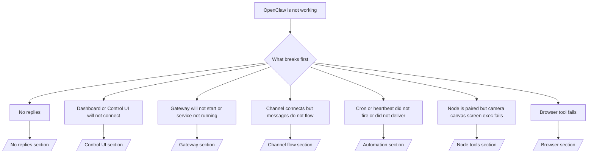

---
read_when:
    - OpenClaw لا يعمل وتحتاج إلى أسرع مسار للإصلاح
    - تريد تدفق فرز أولي قبل التعمق في أدلة التشغيل المفصلة
summary: مركز استكشاف الأخطاء وإصلاحها في OpenClaw مع البدء من الأعراض
title: استكشاف الأخطاء وإصلاحها العام
x-i18n:
    generated_at: "2026-04-24T07:46:18Z"
    model: gpt-5.4
    provider: openai
    source_hash: c832c3f7609c56a5461515ed0f693d2255310bf2d3958f69f57c482bcbef97f0
    source_path: help/troubleshooting.md
    workflow: 15
---

إذا كان لديك دقيقتان فقط، فاستخدم هذه الصفحة كنقطة دخول للفرز الأولي.

## أول 60 ثانية

شغّل هذا التسلسل بالترتيب تمامًا:

```bash
openclaw status
openclaw status --all
openclaw gateway probe
openclaw gateway status
openclaw doctor
openclaw channels status --probe
openclaw logs --follow
```

الإخراج الجيد في سطر واحد:

- `openclaw status` → يعرض القنوات المضبوطة ولا توجد أخطاء مصادقة واضحة.
- `openclaw status --all` → التقرير الكامل موجود وقابل للمشاركة.
- `openclaw gateway probe` → يمكن الوصول إلى هدف gateway المتوقع (`Reachable: yes`). وتخبرك `Capability: ...` بمستوى المصادقة الذي استطاع المسبار إثباته، أما `Read probe: limited - missing scope: operator.read` فهو تشخيص متدهور، وليس فشلًا في الاتصال.
- `openclaw gateway status` → `Runtime: running` و`Connectivity probe: ok` وسطر `Capability: ...` منطقي. استخدم `--require-rpc` إذا كنت تحتاج أيضًا إلى إثبات RPC ضمن نطاق القراءة.
- `openclaw doctor` → لا توجد أخطاء حظر في الإعدادات/الخدمة.
- `openclaw channels status --probe` → تعيد gateway القابلة للوصول حالة النقل المباشرة لكل حساب
  بالإضافة إلى نتائج الفحص/التدقيق مثل `works` أو `audit ok`؛ وإذا كانت
  gateway غير قابلة للوصول، يرجع الأمر إلى ملخصات معتمدة على الإعدادات فقط.
- `openclaw logs --follow` → نشاط ثابت، ولا توجد أخطاء قاتلة متكررة.

## Anthropic long context 429

إذا رأيت:
`HTTP 429: rate_limit_error: Extra usage is required for long context requests`,
فانتقل إلى [/gateway/troubleshooting#anthropic-429-extra-usage-required-for-long-context](/ar/gateway/troubleshooting#anthropic-429-extra-usage-required-for-long-context).

## واجهة خلفية محلية متوافقة مع OpenAI تعمل مباشرة لكنها تفشل داخل OpenClaw

إذا كانت واجهتك الخلفية المحلية أو المستضافة ذاتيًا عند `/v1` تستجيب لفحوصات
`/v1/chat/completions` الصغيرة المباشرة لكنها تفشل مع `openclaw infer model run` أو أدوار
الوكيل العادية:

1. إذا ذكر الخطأ أن `messages[].content` تتوقع سلسلة، فاضبط
   `models.providers.<provider>.models[].compat.requiresStringContent: true`.
2. إذا استمرت الواجهة الخلفية في الفشل فقط مع أدوار وكيل OpenClaw، فاضبط
   `models.providers.<provider>.models[].compat.supportsTools: false` ثم أعد المحاولة.
3. إذا استمرت الاستدعاءات الصغيرة المباشرة في العمل لكن مطالبات OpenClaw الأكبر تتسبب في تعطل
   الواجهة الخلفية، فاعتبر المشكلة المتبقية قيدًا في النموذج/الخادم في المصدر العلوي
   وتابع في دليل التشغيل المتعمق:
   [/gateway/troubleshooting#local-openai-compatible-backend-passes-direct-probes-but-agent-runs-fail](/ar/gateway/troubleshooting#local-openai-compatible-backend-passes-direct-probes-but-agent-runs-fail)

## فشل تثبيت Plugin مع openclaw extensions مفقودة

إذا فشل التثبيت مع `package.json missing openclaw.extensions`، فهذا يعني أن حزمة Plugin
تستخدم بنية قديمة لم يعد OpenClaw يقبلها.

الإصلاح في حزمة Plugin:

1. أضف `openclaw.extensions` إلى `package.json`.
2. وجّه الإدخالات إلى ملفات وقت التشغيل المبنية (عادةً `./dist/index.js`).
3. أعد نشر Plugin ثم شغّل `openclaw plugins install <package>` مرة أخرى.

مثال:

```json
{
  "name": "@openclaw/my-plugin",
  "version": "1.2.3",
  "openclaw": {
    "extensions": ["./dist/index.js"]
  }
}
```

المرجع: [بنية Plugin](/ar/plugins/architecture)

## شجرة القرار



<AccordionGroup>
  <Accordion title="لا توجد ردود">
    ```bash
    openclaw status
    openclaw gateway status
    openclaw channels status --probe
    openclaw pairing list --channel <channel> [--account <id>]
    openclaw logs --follow
    ```

    يبدو الإخراج الجيد كالتالي:

    - `Runtime: running`
    - `Connectivity probe: ok`
    - `Capability: read-only` أو `write-capable` أو `admin-capable`
    - تعرض قناتك النقل على أنه متصل، وحيثما كان ذلك مدعومًا، `works` أو `audit ok` في `channels status --probe`
    - يظهر المرسل على أنه معتمد (أو أن سياسة الرسائل الخاصة مفتوحة/قائمة سماح)

    التواقيع الشائعة في السجل:

    - `drop guild message (mention required` → منعت بوابة الإشارة الرسالة في Discord.
    - `pairing request` → المرسل غير معتمد وينتظر موافقة اقتران للرسائل الخاصة.
    - `blocked` / `allowlist` في سجلات القناة → تمت تصفية المرسل أو الغرفة أو المجموعة.

    الصفحات المتعمقة:

    - [/gateway/troubleshooting#no-replies](/ar/gateway/troubleshooting#no-replies)
    - [/channels/troubleshooting](/ar/channels/troubleshooting)
    - [/channels/pairing](/ar/channels/pairing)

  </Accordion>

  <Accordion title="Dashboard أو Control UI لا تتصل">
    ```bash
    openclaw status
    openclaw gateway status
    openclaw logs --follow
    openclaw doctor
    openclaw channels status --probe
    ```

    يبدو الإخراج الجيد كالتالي:

    - يتم عرض `Dashboard: http://...` في `openclaw gateway status`
    - `Connectivity probe: ok`
    - `Capability: read-only` أو `write-capable` أو `admin-capable`
    - لا توجد حلقة مصادقة في السجلات

    التواقيع الشائعة في السجل:

    - `device identity required` → لا يمكن لسياق HTTP/غير الآمن إكمال مصادقة الجهاز.
    - `origin not allowed` → المتصفح `Origin` غير مسموح له لهدف
      gateway الخاص بـ Control UI.
    - `AUTH_TOKEN_MISMATCH` مع تلميحات إعادة المحاولة (`canRetryWithDeviceToken=true`) → قد تحدث إعادة محاولة واحدة موثوقة باستخدام device token تلقائيًا.
    - تعيد إعادة المحاولة بذلك الرمز المخزن مؤقتًا استخدام مجموعة النطاقات المخزنة مع
      device token المقترنة. أما المتصلون باستخدام `deviceToken` / `scopes` صريحة فيحتفظون
      بمجموعة النطاقات المطلوبة الخاصة بهم بدلًا من ذلك.
    - في مسار Tailscale Serve Control UI غير المتزامن، يتم تسلسل المحاولات الفاشلة للنطاق نفسه
      `{scope, ip}` قبل أن يسجل المحدّد الفشل، لذلك يمكن أن تُظهر
      إعادة المحاولة السيئة الثانية المتزامنة بالفعل `retry later`.
    - `too many failed authentication attempts (retry later)` من أصل متصفح
      localhost → يتم قفل الإخفاقات المتكررة من `Origin` نفسه مؤقتًا؛ ويستخدم أصل localhost آخر حاوية منفصلة.
    - تكرار `unauthorized` بعد إعادة المحاولة تلك → token/password خاطئة، أو عدم تطابق وضع المصادقة، أو paired device token قديمة.
    - `gateway connect failed:` → تستهدف واجهة المستخدم URL/منفذًا خاطئًا أو gateway غير قابلة للوصول.

    الصفحات المتعمقة:

    - [/gateway/troubleshooting#dashboard-control-ui-connectivity](/ar/gateway/troubleshooting#dashboard-control-ui-connectivity)
    - [/web/control-ui](/ar/web/control-ui)
    - [/gateway/authentication](/ar/gateway/authentication)

  </Accordion>

  <Accordion title="Gateway لا تبدأ أو أن الخدمة المثبتة لا تعمل">
    ```bash
    openclaw status
    openclaw gateway status
    openclaw logs --follow
    openclaw doctor
    openclaw channels status --probe
    ```

    يبدو الإخراج الجيد كالتالي:

    - `Service: ... (loaded)`
    - `Runtime: running`
    - `Connectivity probe: ok`
    - `Capability: read-only` أو `write-capable` أو `admin-capable`

    التواقيع الشائعة في السجل:

    - `Gateway start blocked: set gateway.mode=local` أو `existing config is missing gateway.mode` → وضع gateway هو remote، أو أن ملف الإعدادات يفتقد ختم الوضع المحلي ويجب إصلاحه.
    - `refusing to bind gateway ... without auth` → ربط غير loopback من دون مسار مصادقة gateway صالح (token/password، أو trusted-proxy حيثما يكون مضبوطًا).
    - `another gateway instance is already listening` أو `EADDRINUSE` → المنفذ مستخدم بالفعل.

    الصفحات المتعمقة:

    - [/gateway/troubleshooting#gateway-service-not-running](/ar/gateway/troubleshooting#gateway-service-not-running)
    - [/gateway/background-process](/ar/gateway/background-process)
    - [/gateway/configuration](/ar/gateway/configuration)

  </Accordion>

  <Accordion title="القناة تتصل لكن الرسائل لا تتدفق">
    ```bash
    openclaw status
    openclaw gateway status
    openclaw logs --follow
    openclaw doctor
    openclaw channels status --probe
    ```

    يبدو الإخراج الجيد كالتالي:

    - نقل القناة متصل.
    - تنجح فحوصات الاقتران/قائمة السماح.
    - يتم اكتشاف الإشارات عند الحاجة.

    التواقيع الشائعة في السجل:

    - `mention required` → منعت بوابة الإشارة في المجموعة المعالجة.
    - `pairing` / `pending` → مرسل الرسائل الخاصة غير معتمد بعد.
    - `not_in_channel`, `missing_scope`, `Forbidden`, `401/403` → مشكلة في رمز أذونات القناة.

    الصفحات المتعمقة:

    - [/gateway/troubleshooting#channel-connected-messages-not-flowing](/ar/gateway/troubleshooting#channel-connected-messages-not-flowing)
    - [/channels/troubleshooting](/ar/channels/troubleshooting)

  </Accordion>

  <Accordion title="Cron أو Heartbeat لم تعمل أو لم يتم تسليمها">
    ```bash
    openclaw status
    openclaw gateway status
    openclaw cron status
    openclaw cron list
    openclaw cron runs --id <jobId> --limit 20
    openclaw logs --follow
    ```

    يبدو الإخراج الجيد كالتالي:

    - تعرض `cron.status` أنها مفعلة مع وجود استيقاظ تالٍ.
    - تعرض `cron runs` إدخالات `ok` حديثة.
    - Heartbeat مفعلة وليست خارج الساعات النشطة.

    التواقيع الشائعة في السجل:

    - `cron: scheduler disabled; jobs will not run automatically` → Cron معطلة.
    - `heartbeat skipped` مع `reason=quiet-hours` → خارج الساعات النشطة المضبوطة.
    - `heartbeat skipped` مع `reason=empty-heartbeat-file` → الملف `HEARTBEAT.md` موجود لكنه يحتوي فقط على بنية فارغة/عناوين فقط.
    - `heartbeat skipped` مع `reason=no-tasks-due` → وضع المهام في `HEARTBEAT.md` مفعّل لكن لم يحن موعد أي من فترات المهام بعد.
    - `heartbeat skipped` مع `reason=alerts-disabled` → تم تعطيل كل إظهار Heartbeat ‏(`showOk` و`showAlerts` و`useIndicator` كلها متوقفة).
    - `requests-in-flight` → المسار الرئيسي مشغول؛ وتم تأجيل استيقاظ Heartbeat.
    - `unknown accountId` → لا يوجد حساب لهدف تسليم Heartbeat.

    الصفحات المتعمقة:

    - [/gateway/troubleshooting#cron-and-heartbeat-delivery](/ar/gateway/troubleshooting#cron-and-heartbeat-delivery)
    - [/automation/cron-jobs#troubleshooting](/ar/automation/cron-jobs#troubleshooting)
    - [/gateway/heartbeat](/ar/gateway/heartbeat)

  </Accordion>

  <Accordion title="Node مقترنة لكن الأداة تفشل: camera أو canvas أو screen أو exec">
    ```bash
    openclaw status
    openclaw gateway status
    openclaw nodes status
    openclaw nodes describe --node <idOrNameOrIp>
    openclaw logs --follow
    ```

    يبدو الإخراج الجيد كالتالي:

    - تظهر Node على أنها متصلة ومقترنة للدور `node`.
    - توجد القدرة اللازمة للأمر الذي تستدعيه.
    - حالة الأذونات ممنوحة للأداة.

    التواقيع الشائعة في السجل:

    - `NODE_BACKGROUND_UNAVAILABLE` → اجعل تطبيق node في الواجهة الأمامية.
    - `*_PERMISSION_REQUIRED` → تم رفض إذن نظام التشغيل أو أنه مفقود.
    - `SYSTEM_RUN_DENIED: approval required` → موافقة exec معلقة.
    - `SYSTEM_RUN_DENIED: allowlist miss` → الأمر غير موجود في قائمة سماح exec.

    الصفحات المتعمقة:

    - [/gateway/troubleshooting#node-paired-tool-fails](/ar/gateway/troubleshooting#node-paired-tool-fails)
    - [/nodes/troubleshooting](/ar/nodes/troubleshooting)
    - [/tools/exec-approvals](/ar/tools/exec-approvals)

  </Accordion>

  <Accordion title="Exec أصبحت تطلب الموافقة فجأة">
    ```bash
    openclaw config get tools.exec.host
    openclaw config get tools.exec.security
    openclaw config get tools.exec.ask
    openclaw gateway restart
    ```

    ما الذي تغيّر:

    - إذا كانت `tools.exec.host` غير مضبوطة، فالقيمة الافتراضية هي `auto`.
    - تحل `host=auto` إلى `sandbox` عندما يكون وقت تشغيل sandbox نشطًا، وإلى `gateway` خلاف ذلك.
    - تُعد `host=auto` توجيهًا فقط؛ أما سلوك "YOLO" بلا مطالبة فيأتي من `security=full` مع `ask=off` على gateway/node.
    - على `gateway` و`node`، إذا لم يتم ضبط `tools.exec.security` فالقيمة الافتراضية هي `full`.
    - إذا لم يتم ضبط `tools.exec.ask` فالقيمة الافتراضية هي `off`.
    - النتيجة: إذا كنت ترى موافقات، فهذا يعني أن بعض السياسات المحلية للمضيف أو الخاصة بالجلسة قد شددت exec بعيدًا عن القيم الافتراضية الحالية.

    استعد سلوك عدم طلب الموافقة الافتراضي الحالي:

    ```bash
    openclaw config set tools.exec.host gateway
    openclaw config set tools.exec.security full
    openclaw config set tools.exec.ask off
    openclaw gateway restart
    ```

    بدائل أكثر أمانًا:

    - اضبط فقط `tools.exec.host=gateway` إذا كنت تريد فقط توجيه مضيف ثابتًا.
    - استخدم `security=allowlist` مع `ask=on-miss` إذا كنت تريد exec على المضيف لكنك ما زلت تريد مراجعة عند الإخفاق في قائمة السماح.
    - فعّل وضع sandbox إذا كنت تريد أن تُحل `host=auto` مرة أخرى إلى `sandbox`.

    التواقيع الشائعة في السجل:

    - `Approval required.` → الأمر ينتظر `/approve ...`.
    - `SYSTEM_RUN_DENIED: approval required` → موافقة exec الخاصة بمضيف node معلقة.
    - `exec host=sandbox requires a sandbox runtime for this session` → اختيار sandbox ضمني/صريح لكن وضع sandbox متوقف.

    الصفحات المتعمقة:

    - [/tools/exec](/ar/tools/exec)
    - [/tools/exec-approvals](/ar/tools/exec-approvals)
    - [/gateway/security#what-the-audit-checks-high-level](/ar/gateway/security#what-the-audit-checks-high-level)

  </Accordion>

  <Accordion title="فشل أداة المتصفح">
    ```bash
    openclaw status
    openclaw gateway status
    openclaw browser status
    openclaw logs --follow
    openclaw doctor
    ```

    يبدو الإخراج الجيد كالتالي:

    - تعرض حالة المتصفح `running: true` ومتصفحًا/ملف profile محددًا.
    - يبدأ `openclaw`، أو يمكن لـ `user` رؤية علامات تبويب Chrome المحلية.

    التواقيع الشائعة في السجل:

    - `unknown command "browser"` أو `unknown command 'browser'` → تم ضبط `plugins.allow` ولا تتضمن `browser`.
    - `Failed to start Chrome CDP on port` → فشل تشغيل المتصفح المحلي.
    - `browser.executablePath not found` → مسار الملف التنفيذي المضبوط خاطئ.
    - `browser.cdpUrl must be http(s) or ws(s)` → يستخدم عنوان URL المضبوط لـ CDP مخططًا غير مدعوم.
    - `browser.cdpUrl has invalid port` → يحتوي عنوان URL المضبوط لـ CDP على منفذ سيئ أو خارج النطاق.
    - `No Chrome tabs found for profile="user"` → لا تحتوي profile الارتباط Chrome MCP على أي علامات تبويب Chrome محلية مفتوحة.
    - `Remote CDP for profile "<name>" is not reachable` → لا يمكن الوصول إلى نقطة نهاية CDP البعيدة المضبوطة من هذا المضيف.
    - `Browser attachOnly is enabled ... not reachable` أو `Browser attachOnly is enabled and CDP websocket ... is not reachable` → لا تحتوي profile ‏attach-only على هدف CDP مباشر.
    - تجاوزات viewport / dark-mode / locale / offline القديمة على profiles ‏attach-only أو remote CDP → شغّل `openclaw browser stop --browser-profile <name>` لإغلاق جلسة التحكم النشطة وتحرير حالة المحاكاة من دون إعادة تشغيل gateway.

    الصفحات المتعمقة:

    - [/gateway/troubleshooting#browser-tool-fails](/ar/gateway/troubleshooting#browser-tool-fails)
    - [/tools/browser#missing-browser-command-or-tool](/ar/tools/browser#missing-browser-command-or-tool)
    - [/tools/browser-linux-troubleshooting](/ar/tools/browser-linux-troubleshooting)
    - [/tools/browser-wsl2-windows-remote-cdp-troubleshooting](/ar/tools/browser-wsl2-windows-remote-cdp-troubleshooting)

  </Accordion>

</AccordionGroup>

## ذو صلة

- [الأسئلة الشائعة](/ar/help/faq) — الأسئلة المتداولة
- [استكشاف أخطاء Gateway وإصلاحها](/ar/gateway/troubleshooting) — المشكلات الخاصة بـ gateway
- [Doctor](/ar/gateway/doctor) — فحوصات الصحة والإصلاحات المؤتمتة
- [استكشاف أخطاء القنوات وإصلاحها](/ar/channels/troubleshooting) — مشكلات اتصال القنوات
- [استكشاف أخطاء الأتمتة وإصلاحها](/ar/automation/cron-jobs#troubleshooting) — مشكلات cron وHeartbeat
