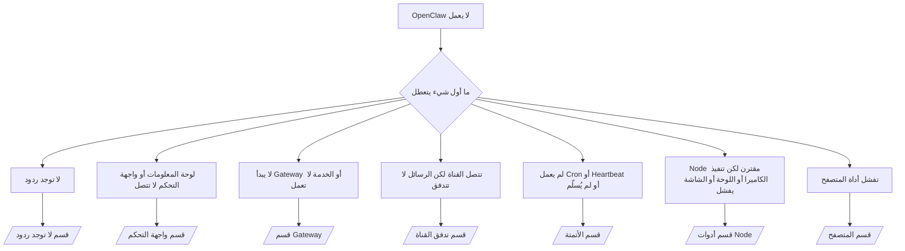

---
read_when:
    - OpenClaw لا يعمل وتحتاج إلى أسرع طريق لإصلاحه
    - تريد مسار فرز أولي قبل التعمق في أدلة التشغيل التفصيلية
summary: مركز استكشاف أخطاء OpenClaw وإصلاحها انطلاقًا من الأعراض أولًا
title: استكشاف الأخطاء وإصلاحها بشكل عام
x-i18n:
    generated_at: "2026-07-12T06:06:10Z"
    model: gpt-5.6
    postprocess_version: locale-links-v1
    provider: openai
    source_hash: db50e0cdf4d11f3aa6196be445358d904a2b9c40c89243f1b124c77167f6dd85
    source_path: help/troubleshooting.md
    workflow: 16
---

بوابة الفرز الأولى. دقيقتان للوصول إلى تشخيص، ثم انتقل إلى الصفحة المتعمقة.

## أول 60 ثانية

شغّل هذا التسلسل بالترتيب:

```bash
openclaw status
openclaw status --all
openclaw gateway probe
openclaw gateway status
openclaw doctor
openclaw channels status --probe
openclaw logs --follow
```

المخرجات السليمة، سطر واحد لكل منها:

- يعرض `openclaw status` القنوات المُعدّة، من دون أخطاء مصادقة.
- يُنتج `openclaw status --all` تقريرًا كاملًا قابلًا للمشاركة.
- يعرض `openclaw gateway probe` القيمة `Reachable: yes`. تمثل `Capability: ...`
  مستوى المصادقة الذي أثبته الفحص؛ أما `Read probe: limited - missing scope:
operator.read` فيشير إلى تشخيصات محدودة، وليس إلى فشل اتصال.
- يعرض `openclaw gateway status` القيم `Runtime: running` و`Connectivity probe:
ok` وقيمة معقولة لـ `Capability: ...`. أضف `--require-rpc` لاشتراط إثبات RPC
  بنطاق القراءة أيضًا.
- لا يُبلغ `openclaw doctor` عن أخطاء حاجبة في الإعدادات أو الخدمة.
- يعيد `openclaw channels status --probe` حالة النقل الحية لكل حساب
  (`works` / `audit ok`) عندما يكون Gateway قابلًا للوصول؛ ويعود إلى
  ملخصات الإعدادات فقط عندما لا يكون كذلك.
- يعرض `openclaw logs --follow` نشاطًا مستقرًا، من دون أخطاء فادحة متكررة.

## يبدو المساعد محدودًا أو تفتقد منه الأدوات

تحقق من ملف تعريف الأدوات الفعّال:

```bash
openclaw status
openclaw status --all
openclaw doctor
```

الأسباب الشائعة:

- لا يسمح `tools.profile: "minimal"` إلا بـ `session_status`.
- ملف التعريف `tools.profile: "messaging"` محدود ومخصص للوكلاء الذين يقتصرون على المحادثة.
- ملف التعريف `tools.profile: "coding"` هو الافتراضي للإعدادات المحلية الجديدة (العمل على المستودع والملفات
  والصدفة وبيئة التشغيل).
- يزيل `tools.profile: "full"` قيود ملف التعريف؛ احصره في الوكلاء الموثوقين
  الذين يتحكم بهم المشغّل.
- تتجاوز إعدادات `agents.list[].tools` الخاصة بكل وكيل ملف التعريف الجذري، فتضيّقه أو توسعه
  لوكيل واحد.

غيّر ملف التعريف، وأعد تشغيل Gateway أو أعد تحميله، ثم تحقق مجددًا باستخدام
`openclaw status --all`. جدول ملفات التعريف والمجموعات الكامل: [ملفات تعريف الأدوات](/ar/gateway/config-tools#tool-profiles).

## خطأ Anthropic ‏429 للسياق الطويل

`HTTP 429: rate_limit_error: Extra usage is required for long context requests`
← [يتطلب خطأ Anthropic ‏429 استخدامًا إضافيًا للسياق الطويل](/ar/gateway/troubleshooting#anthropic-429-extra-usage-required-for-long-context).

## تعمل الواجهة الخلفية المحلية المتوافقة مع OpenAI مباشرةً لكنها تفشل في OpenClaw

تستجيب واجهتك الخلفية المحلية/المستضافة ذاتيًا على `/v1` لفحوصات
`/v1/chat/completions` المباشرة، لكنها تفشل عند تشغيل `openclaw infer model run` أو في أدوار الوكيل المعتادة:

1. إذا ذكر الخطأ أن `messages[].content` يتوقع سلسلة نصية: اضبط
   `models.providers.<provider>.models[].compat.requiresStringContent: true`.
2. إذا ظل الفشل مقتصرًا على أدوار وكيل OpenClaw: اضبط
   `models.providers.<provider>.models[].compat.supportsTools: false` ثم أعد المحاولة.
3. إذا نجحت الاستدعاءات المباشرة الصغيرة، لكن مطالبات OpenClaw الأكبر تُعطّل الواجهة الخلفية: فهذا
   قيد في النموذج/الخادم المصدر، وليس خللًا في OpenClaw. تابع في
   [تنجح الواجهة الخلفية المحلية المتوافقة مع OpenAI في الفحوصات المباشرة لكن تشغيل الوكيل يفشل](/ar/gateway/troubleshooting#local-openai-compatible-backend-passes-direct-probes-but-agent-runs-fail).

## يفشل تثبيت Plugin بسبب غياب امتدادات openclaw

تعني الرسالة `package.json missing openclaw.extensions` أن حزمة Plugin تستخدم
بنية لم يعد OpenClaw يقبلها.

الإصلاح داخل حزمة Plugin:

1. أضف `openclaw.extensions` إلى `package.json` بحيث يشير إلى ملفات بيئة التشغيل
   المبنية (عادةً `./dist/index.js`).
2. أعد نشر الحزمة، ثم شغّل `openclaw plugins install <package>` مجددًا.

```json
{
  "name": "@openclaw/my-plugin",
  "version": "1.2.3",
  "openclaw": {
    "extensions": ["./dist/index.js"]
  }
}
```

المرجع: [معمارية Plugin](/ar/plugins/architecture)

## تمنع سياسة التثبيت عمليات تثبيت Plugin أو تحديثه

يكتمل التحديث، لكن Plugins تظل قديمة أو معطلة، أو تظهر الرسائل `blocked by install
policy` أو `install policy failed closed` أو `Disabled "<plugin>" after plugin
update failure`: تحقق من `security.installPolicy`.

تُطبّق سياسة التثبيت عند تثبيت Plugins وتحديثها. عادةً ما تنتقل إصدارات Plugins
ذات النطاق `@openclaw/*` مع إصدار OpenClaw، لذلك قد يتطلب تحديث OpenClaw
تحديثًا مطابقًا لـ Plugin أثناء المزامنة اللاحقة للتحديث.

تجنب أشكال السياسة التالية ما لم تكن تدير أيضًا قاعدة الترقية المطابقة:

- تجميد Plugins المملوكة لـ OpenClaw عند إصدار قديم محدد تمامًا (مثل السماح فقط
  بـ `@openclaw/*@2026.5.3`).
- الحظر استنادًا إلى نوع المصدر وحده (كل طلبات npm أو الشبكة أو `request.mode:
"update"`).
- اعتبار أمر السياسة اختياريًا: عند تفعيل `security.installPolicy`،
  يفشل النظام في وضع الإغلاق الآمن إذا كان ملف السياسة التنفيذي مفقودًا أو بطيئًا أو غير قابل للقراءة أو محجوبًا بسبب الأذونات.
- الموافقة على الإصدارات من دون مقارنة `openclawVersion` الخاص بالطلب
  بالبيانات الوصفية لإصدار Plugin المرشح.

فضّل القواعد التي تسمح بتحديثات `@openclaw/*` الموثوقة والمتوافقة مع
المضيف الحالي، بدلًا من تثبيت إصدار واحد إلى الأبد. إذا كنت تحظر npm
افتراضيًا، فأضف استثناءً ضيقًا لمعرّفات Plugins التي تستخدمها، وطبّق قاعدة
الثقة نفسها على `request.mode: "update"` كما تطبقها على عمليات التثبيت.

الاسترداد:

```bash
openclaw doctor --deep
openclaw plugins update --all
openclaw status --all
```

إذا كانت السياسة صارمة عن قصد، فخففها خلال نافذة الترقية الموثوقة،
وأعد تشغيل `openclaw plugins update --all`، ثم استعد القاعدة الأكثر صرامة.
إذا أدى فشل التحديث إلى تعطيل Plugin، فافحصه قبل إعادة تفعيله:

```bash
openclaw plugins inspect <plugin-id> --runtime --json
openclaw plugins enable <plugin-id>
```

المرجع: [سياسة تثبيت المشغّل](/ar/tools/skills-config#operator-install-policy-securityinstallpolicy)

## Plugin موجود لكنه محظور بسبب ملكية مريبة

تعرض تحذيرات `openclaw doctor` أو الإعداد أو بدء التشغيل ما يلي:

```text
blocked plugin candidate: suspicious ownership (... uid=1000, expected uid=0 or root)
plugin present but blocked
```

تعود ملكية ملفات Plugin إلى مستخدم Unix مختلف عن المستخدم الذي تشغّل العملية باسمه.
لا تُزل إعدادات Plugin؛ أصلح ملكية الملفات، أو شغّل
OpenClaw باسم المستخدم الذي يملك دليل الحالة.

تعمل عمليات تثبيت Docker باسم `node` (معرّف المستخدم `1000`). أصلح نقاط الربط من المضيف:

```bash
sudo chown -R 1000:1000 /path/to/openclaw-config /path/to/openclaw-workspace
openclaw doctor --fix
```

إذا كنت تشغّل OpenClaw عمدًا باسم الجذر، فأصلح بدلًا من ذلك جذر Plugin المُدار:

```bash
sudo chown -R root:root /path/to/openclaw-config/npm
openclaw doctor --fix
```

وثائق أكثر تعمقًا: [ملكية مسار Plugin المحظور](/ar/tools/plugin#blocked-plugin-path-ownership)، [Docker: الأذونات وEACCES](/ar/install/docker#shell-helpers-optional)

## شجرة القرار



<AccordionGroup>
  <Accordion title="لا توجد ردود">
    ```bash
    openclaw status
    openclaw gateway status
    openclaw channels status --probe
    openclaw pairing list --channel <channel> [--account <id>]
    openclaw logs --follow
    ```

    المخرجات السليمة:

    - `Runtime: running`
    - `Connectivity probe: ok`
    - `Capability: read-only` أو `write-capable` أو `admin-capable`
    - تعرض القناة أن النقل متصل، وحيثما كان ذلك مدعومًا، تعرض `works` أو
      `audit ok` في `channels status --probe`
    - المُرسل معتمد (أو سياسة الرسائل المباشرة مفتوحة/تستخدم قائمة سماح)

    بصمات السجل:

    - `drop guild message (mention required` ← منع اشتراط الإشارة في Discord الرسالة.
    - `pairing request` ← المُرسل غير معتمد، وفي انتظار الموافقة على إقران الرسائل المباشرة.
    - ظهور `blocked` / `allowlist` في سجلات القناة ← تمت تصفية المُرسل أو الغرفة أو المجموعة.

    الصفحات المتعمقة: [لا توجد ردود](/ar/gateway/troubleshooting#no-replies)، [استكشاف أخطاء القناة وإصلاحها](/ar/channels/troubleshooting)، [الإقران](/ar/channels/pairing)

  </Accordion>

  <Accordion title="لوحة المعلومات أو واجهة التحكم لا تتصل">
    ```bash
    openclaw status
    openclaw gateway status
    openclaw logs --follow
    openclaw doctor
    openclaw channels status --probe
    ```

    المخرجات السليمة:

    - يظهر `Dashboard: http://...` في `openclaw gateway status`
    - `Connectivity probe: ok`
    - `Capability: read-only` أو `write-capable` أو `admin-capable`
    - لا توجد حلقة مصادقة في السجلات

    بصمات السجل:

    - `device identity required` ← لا يمكن لسياق HTTP/غير الآمن إكمال مصادقة الجهاز.
    - `origin not allowed` ← قيمة `Origin` للمتصفح غير مسموح بها لهدف Gateway الخاص بواجهة التحكم.
    - `AUTH_TOKEN_MISMATCH` مع `canRetryWithDeviceToken=true` ← قد تحدث تلقائيًا محاولة واحدة باستخدام رمز جهاز موثوق، مع إعادة استخدام النطاقات المخزنة مؤقتًا للرمز المقترن.
    - تكرار `unauthorized` بعد تلك المحاولة ← رمز/كلمة مرور خاطئة، أو عدم تطابق وضع المصادقة، أو رمز جهاز مقترن قديم.
    - `too many failed authentication attempts (retry later)` ← تُحظر مؤقتًا الإخفاقات المتكررة من قيمة `Origin` الخاصة بذلك المتصفح؛ وتستخدم مصادر المضيف المحلي الأخرى مجموعات منفصلة. راجع [اتصال لوحة المعلومات/واجهة التحكم](/ar/gateway/troubleshooting#dashboard-control-ui-connectivity) للاطلاع على خصوصية إعادة المحاولة المتزامنة في Tailscale Serve.
    - `gateway connect failed:` ← تستهدف واجهة المستخدم عنوان URL/منفذًا خاطئًا، أو يتعذر الوصول إلى Gateway.

    الصفحات المتعمقة: [اتصال لوحة المعلومات/واجهة التحكم](/ar/gateway/troubleshooting#dashboard-control-ui-connectivity)، [واجهة التحكم](/ar/web/control-ui)، [المصادقة](/ar/gateway/authentication)

  </Accordion>

  <Accordion title="لا يبدأ Gateway أو الخدمة مثبتة لكنها لا تعمل">
    ```bash
    openclaw status
    openclaw gateway status
    openclaw logs --follow
    openclaw doctor
    openclaw channels status --probe
    ```

    المخرجات السليمة:

    - `Service: ... (loaded)`
    - `Runtime: running`
    - `Connectivity probe: ok`
    - `Capability: read-only` أو `write-capable` أو `admin-capable`

    بصمات السجل:

    - `Gateway start blocked: set gateway.mode=local` أو `existing config is missing gateway.mode` ← وضع Gateway بعيد، أو تفتقد الإعدادات علامة الوضع المحلي وتحتاج إلى إصلاح.
    - `refusing to bind gateway ... without auth` ← ربط خارج local loopback من دون مسار مصادقة صالح (رمز/كلمة مرور، أو وكيل موثوق حيث يكون مُعدًا).
    - `another gateway instance is already listening` أو `EADDRINUSE` ← المنفذ مستخدم بالفعل.

    الصفحات المتعمقة: [خدمة Gateway لا تعمل](/ar/gateway/troubleshooting#gateway-service-not-running)، [العملية الخلفية](/ar/gateway/background-process)، [الإعدادات](/ar/gateway/configuration)

  </Accordion>

  <Accordion title="تتصل القناة لكن الرسائل لا تتدفق">
    ```bash
    openclaw status
    openclaw gateway status
    openclaw logs --follow
    openclaw doctor
    openclaw channels status --probe
    ```

    المخرجات السليمة:

    - نقل القناة متصل.
    - تنجح فحوصات الإقران/قائمة السماح.
    - تُكتشف الإشارات حيث تكون مطلوبة.

    بصمات السجل:

    - `mention required` ← منع اشتراط الإشارة في المجموعة المعالجة.
    - `pairing` / `pending` ← لم يُعتمد مُرسل الرسائل المباشرة بعد.
    - `not_in_channel` أو `missing_scope` أو `Forbidden` أو `401/403` ← مشكلة في رمز أذونات القناة.

    الصفحات المتعمقة: [القناة متصلة لكن الرسائل لا تتدفق](/ar/gateway/troubleshooting#channel-connected-messages-not-flowing)، [استكشاف أخطاء القناة وإصلاحها](/ar/channels/troubleshooting)

  </Accordion>

  <Accordion title="لم يعمل Cron أو Heartbeat أو لم يُسلّم">
    ```bash
    openclaw status
    openclaw gateway status
    openclaw cron status
    openclaw cron list
    openclaw cron runs --id <jobId> --limit 20
    openclaw logs --follow
    ```

    المخرجات السليمة:

    - يعرض `cron status` أن المجدول مفعّل مع موعد التنبيه التالي.
    - يعرض `cron runs` إدخالات `ok` حديثة.
    - يكون Heartbeat مفعّلًا وضمن ساعات النشاط.

    بصمات السجل:

    - `cron: scheduler disabled; jobs will not run automatically` → ‏Cron معطّل.
    - `heartbeat skipped` والسبب `quiet-hours` → خارج ساعات النشاط المضبوطة.
    - `heartbeat skipped` والسبب `empty-heartbeat-file` → الملف `HEARTBEAT.md` موجود، لكنه لا يحتوي إلا على بنية أولية فارغة أو مكوّنة من أسطر فارغة أو تعليقات أو ترويسات أو أسوار أو قائمة تحقق فارغة.
    - `heartbeat skipped` والسبب `no-tasks-due` → وضع المهام نشط، لكن لم يحن موعد أي فاصل زمني للمهام بعد.
    - `heartbeat skipped` والسبب `alerts-disabled` → الخيارات `showOk` و`showAlerts` و`useIndicator` جميعها معطّلة.
    - `requests-in-flight` → المسار الرئيسي مشغول؛ أُجِّل تنبيه Heartbeat.
    - `unknown accountId` → حساب وجهة تسليم Heartbeat غير موجود.

    صفحات تفصيلية: [تسليم Cron وHeartbeat](/ar/gateway/troubleshooting#cron-and-heartbeat-delivery)، [المهام المجدولة: استكشاف الأخطاء وإصلاحها](/ar/automation/cron-jobs#troubleshooting)، [Heartbeat](/ar/gateway/heartbeat)

  </Accordion>

  <Accordion title="Node مقترنة، لكن الأداة تفشل مع الكاميرا أو اللوحة أو الشاشة أو التنفيذ">
    ```bash
    openclaw status
    openclaw gateway status
    openclaw nodes status
    openclaw nodes describe --node <idOrNameOrIp>
    openclaw logs --follow
    ```

    مخرجات سليمة:

    - تظهر Node على أنها متصلة ومقترنة للدور `node`.
    - تتوفر الإمكانية اللازمة للأمر الذي تستدعيه.
    - حالة الإذن الممنوح للأداة.

    بصمات السجل:

    - `NODE_BACKGROUND_UNAVAILABLE` → انقل تطبيق Node إلى الواجهة.
    - `*_PERMISSION_REQUIRED` → إذن نظام التشغيل مرفوض أو مفقود.
    - `SYSTEM_RUN_DENIED: approval required` → موافقة التنفيذ معلّقة.
    - `SYSTEM_RUN_DENIED: allowlist miss` → الأمر غير موجود في قائمة السماح للتنفيذ.

    صفحات تفصيلية: [Node مقترنة، لكن الأداة تفشل](/ar/gateway/troubleshooting#node-paired-tool-fails)، [استكشاف أخطاء Node وإصلاحها](/ar/nodes/troubleshooting)، [موافقات التنفيذ](/ar/tools/exec-approvals)

  </Accordion>

  <Accordion title="التنفيذ يطلب الموافقة فجأة">
    ```bash
    openclaw config get tools.exec.host
    openclaw config get tools.exec.security
    openclaw config get tools.exec.ask
    openclaw gateway restart
    ```

    ما الذي تغيّر:

    - القيمة الافتراضية عند عدم ضبط `tools.exec.host` هي `auto`، والتي تُحل إلى `sandbox`
      عندما تكون بيئة تشغيل صندوق عزل نشطة، وإلى `gateway` بخلاف ذلك.
    - لا يفعل `host=auto` سوى التوجيه؛ أما السلوك من دون مطالبات فينتج من
      `security=full` مع `ask=off` على Gateway أو Node.
    - القيمة الافتراضية عند عدم ضبط `tools.exec.security` هي `full` على `gateway`/`node`.
    - القيمة الافتراضية عند عدم ضبط `tools.exec.ask` هي `off`.
    - إذا كنت ترى طلبات موافقة، فهذا يعني أن سياسة محلية للمضيف أو خاصة بالجلسة
      شددت قيود التنفيذ مقارنة بهذه القيم الافتراضية.

    استعد القيم الافتراضية الحالية التي لا تتطلب موافقة:

    ```bash
    openclaw config set tools.exec.host gateway
    openclaw config set tools.exec.security full
    openclaw config set tools.exec.ask off
    openclaw gateway restart
    ```

    بدائل أكثر أمانًا:

    - اضبط `tools.exec.host=gateway` فقط للحصول على توجيه ثابت للمضيف.
    - استخدم `security=allowlist` مع `ask=on-miss` لتنفيذ الأوامر على المضيف مع طلب المراجعة عند
      عدم مطابقة قائمة السماح.
    - فعّل وضع صندوق العزل حتى تُحل `host=auto` مجددًا إلى `sandbox`.

    بصمات السجل:

    - `Approval required.` → الأمر ينتظر `/approve ...`.
    - `SYSTEM_RUN_DENIED: approval required` → موافقة التنفيذ على مضيف Node معلّقة.
    - `exec host=sandbox requires a sandbox runtime for this session` → تم اختيار صندوق العزل ضمنيًا أو صراحةً، لكن وضع صندوق العزل معطّل.

    صفحات تفصيلية: [التنفيذ](/ar/tools/exec)، [موافقات التنفيذ](/ar/tools/exec-approvals)، [الأمان: ما الذي يتحقق منه التدقيق](/ar/gateway/security#what-the-audit-checks-high-level)

  </Accordion>

  <Accordion title="فشل أداة المتصفح">
    ```bash
    openclaw status
    openclaw gateway status
    openclaw browser status
    openclaw logs --follow
    openclaw doctor
    ```

    مخرجات سليمة:

    - تعرض حالة المتصفح `running: true` ومتصفحًا/ملفًا شخصيًا مختارًا.
    - يبدأ الملف الشخصي `openclaw`، أو يرى الملف الشخصي `user` علامات تبويب Chrome المحلية.

    بصمات السجل:

    - `unknown command "browser"` → تم ضبط `plugins.allow` وهو يستبعد `browser`.
    - `Failed to start Chrome CDP on port` → فشل تشغيل المتصفح المحلي.
    - `browser.executablePath not found` → مسار الملف التنفيذي المضبوط غير صحيح.
    - `browser.cdpUrl must be http(s) or ws(s)` → يستخدم عنوان URL المضبوط لـCDP مخططًا غير مدعوم.
    - `browser.cdpUrl has invalid port` → يحتوي عنوان URL المضبوط لـCDP على منفذ غير صالح أو خارج النطاق.
    - `No Chrome tabs found for profile="user"` → لا يحتوي ملف الإرفاق الشخصي لـChrome MCP على علامات تبويب Chrome محلية مفتوحة.
    - `Remote CDP for profile "<name>" is not reachable` → لا يمكن لهذا المضيف الوصول إلى نقطة نهاية CDP البعيدة المضبوطة.
    - `Browser attachOnly is enabled ... not reachable` → لا يحتوي ملف الإرفاق فقط على هدف CDP نشط.
    - تجاوزات منفذ العرض أو الوضع الداكن أو الإعدادات المحلية أو وضع عدم الاتصال القديمة في ملفات CDP الشخصية الخاصة بالإرفاق فقط أو البعيدة → شغّل `openclaw browser stop --browser-profile <name>` لإغلاق جلسة التحكم وتحرير حالة المحاكاة دون إعادة تشغيل Gateway.

    صفحات تفصيلية: [فشل أداة المتصفح](/ar/gateway/troubleshooting#browser-tool-fails)، [أمر المتصفح أو أداته مفقودان](/ar/tools/browser#missing-browser-command-or-tool)، [المتصفح: استكشاف الأخطاء وإصلاحها على Linux](/ar/tools/browser-linux-troubleshooting)، [المتصفح: استكشاف أخطاء CDP البعيد وإصلاحها على WSL2/Windows](/ar/tools/browser-wsl2-windows-remote-cdp-troubleshooting)

  </Accordion>

</AccordionGroup>

## ذو صلة

- [الأسئلة الشائعة](/ar/help/faq) — الأسئلة المتكررة
- [استكشاف أخطاء Gateway وإصلاحها](/ar/gateway/troubleshooting) — مشكلات خاصة بـGateway
- [التشخيص](/ar/gateway/doctor) — فحوصات الصحة والإصلاحات الآلية
- [استكشاف أخطاء القنوات وإصلاحها](/ar/channels/troubleshooting) — مشكلات اتصال القنوات
- [المهام المجدولة: استكشاف الأخطاء وإصلاحها](/ar/automation/cron-jobs#troubleshooting) — مشكلات Cron وHeartbeat
