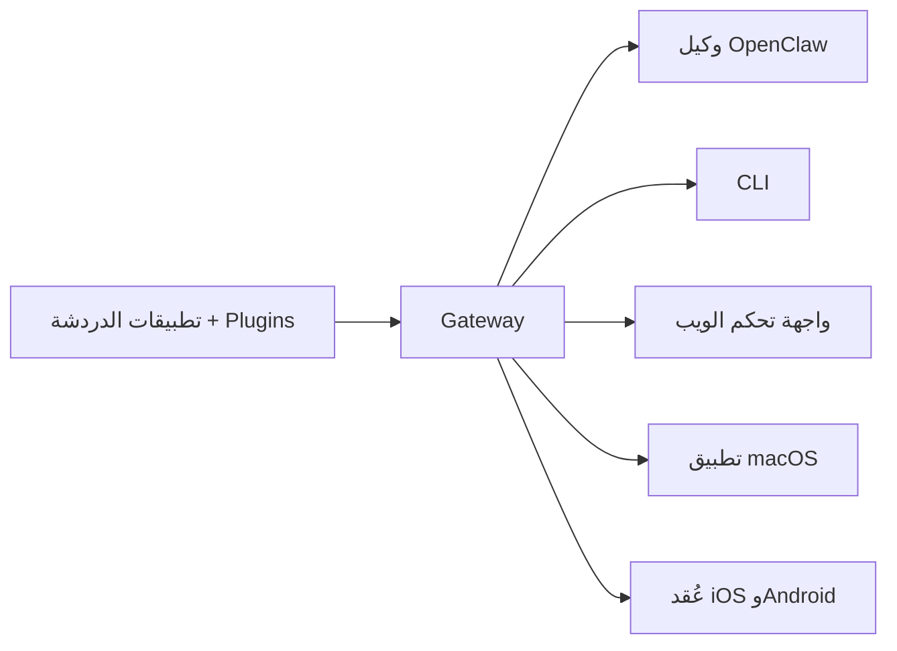

---
read_when:
    - تقديم OpenClaw للمستخدمين الجدد
summary: OpenClaw هو Gateway متعدد القنوات لوكلاء الذكاء الاصطناعي، ويعمل على أي نظام تشغيل.
title: OpenClaw
x-i18n:
    generated_at: "2026-07-16T14:11:49Z"
    model: gpt-5.6
    postprocess_version: locale-links-v1
    prompt_version: 32
    provider: openai
    source_hash: fe97e7299be4855fd9af21838e0626b5a5c8aafe46d982859e9033f0efec2443
    source_path: index.md
    workflow: 16
---

# OpenClaw 🦞

<p align="center">
    
    
</p>

> _"قَشِّر! قَشِّر!"_ — جراد بحر فضائي، على الأرجح

<p align="center">
  <strong>Gateway لأي نظام تشغيل لوكلاء الذكاء الاصطناعي عبر Discord وGoogle Chat وiMessage وMatrix وMicrosoft Teams وSignal وSlack وTelegram وWhatsApp وZalo وغيرها.</strong><br />
  أرسل رسالة، وتلقَّ ردًا من وكيل في متناول يدك. شغّل Gateway واحدة عبر Plugins القنوات وWebChat وعُقد الأجهزة المحمولة.
</p>

<Columns>
  <Card title="بدء الاستخدام" href="/ar/start/getting-started" icon="rocket">
    ثبّت OpenClaw وشغّل Gateway خلال دقائق.
  </Card>
  <Card title="تشغيل الإعداد الأولي" href="/ar/start/wizard" icon="list-checks">
    إعداد موجّه باستخدام `openclaw onboard` وتدفقات الاقتران.
  </Card>
  <Card title="ربط قناة" href="/ar/channels" icon="message-circle">
    اربط Discord وSignal وTelegram وWhatsApp وغيرها للدردشة من أي مكان.
  </Card>
  <Card title="فتح واجهة التحكم" href="/ar/web/control-ui" icon="layout-dashboard">
    شغّل لوحة المعلومات في المتصفح للدردشة والتهيئة والجلسات.
  </Card>
</Columns>

## تصفّح الوثائق

قد تعرض متصفحات الأجهزة المحمولة قائمة الأقسام من دون شريط علامات التبويب الكامل الخاص بسطح المكتب. استخدم
روابط المحاور هذه للوصول إلى أقسام الوثائق العليا نفسها من نص الصفحة.

<Columns>
  <Card title="بدء الاستخدام" href="/ar" icon="rocket">
    نظرة عامة، وعرض توضيحي، وخطوات أولى، وأدلة إعداد.
  </Card>
  <Card title="التثبيت" href="/ar/install" icon="download">
    مسارات التثبيت، والتحديثات، والحاويات، والاستضافة، والإعداد المتقدم.
  </Card>
  <Card title="القنوات" href="/ar/channels" icon="messages-square">
    قنوات المراسلة، والاقتران، والتوجيه، ومجموعات الوصول، وضمان جودة القنوات.
  </Card>
  <Card title="الوكلاء" href="/ar/concepts/architecture" icon="bot">
    البنية، والجلسات، والسياق، والذاكرة، وتوجيه الوكلاء المتعددين.
  </Card>
  <Card title="الإمكانات" href="/ar/tools" icon="wand-sparkles">
    الأدوات، والمهارات، وCron، وWebhooks، وإمكانات الأتمتة.
  </Card>
  <Card title="ClawHub" href="/ar/clawhub" icon="store">
    سوق Plugins، والنشر، والتنظيم، وإرشادات الثقة.
  </Card>
  <Card title="النماذج" href="/ar/providers" icon="brain">
    المزوّدون، وتهيئة النماذج، والتحويل عند التعطل، وخدمات النماذج المحلية.
  </Card>
  <Card title="المنصات" href="/ar/platforms" icon="monitor-smartphone">
    macOS وWindows وiOS وAndroid والعُقد وواجهات الويب.
  </Card>
  <Card title="Gateway والعمليات" href="/ar/gateway" icon="server">
    تهيئة Gateway، والأمان، والتشخيص، والعمليات.
  </Card>
  <Card title="المرجع" href="/ar/cli" icon="terminal">
    مرجع CLI، والمخططات، وRPC، وملاحظات الإصدار، والقوالب.
  </Card>
  <Card title="المساعدة" href="/ar/help" icon="life-buoy">
    استكشاف الأخطاء وإصلاحها، والأسئلة الشائعة، والاختبار، والتشخيص، وفحوصات البيئة.
  </Card>
</Columns>

## ما OpenClaw؟

OpenClaw هي **Gateway ذاتية الاستضافة** تربط تطبيقات الدردشة المفضلة لديك — Discord وGoogle Chat وiMessage وMatrix وMicrosoft Teams وSignal وSlack وTelegram وWhatsApp وZalo وغيرها عبر Plugins القنوات — بوكلاء برمجة يعملون بالذكاء الاصطناعي. تشغّل عملية Gateway واحدة على جهازك (أو خادم)، فتغدو جسرًا بين تطبيقات المراسلة لديك ومساعد ذكاء اصطناعي متاح دائمًا.

**لمن صُممت؟** للمطورين والمستخدمين المتقدمين الذين يريدون مساعد ذكاء اصطناعي شخصيًا يمكنهم مراسلته من أي مكان — من دون التخلي عن التحكم في بياناتهم أو الاعتماد على خدمة مستضافة.

**ما الذي يميّزها؟**

- **ذاتية الاستضافة**: تعمل على أجهزتك ووفق قواعدك
- **متعددة القنوات**: تخدم Gateway واحدة كل Plugin قناة مهيأة في الوقت نفسه
- **مصممة للوكلاء**: مبنية لوكلاء البرمجة مع استخدام الأدوات والجلسات والذاكرة وتوجيه الوكلاء المتعددين
- **مفتوحة المصدر**: مرخصة بموجب MIT ويقودها المجتمع

**ما الذي تحتاج إليه؟** Node 24.15+ (موصى به)، أو Node 22 LTS ‏(`22.22.3+`) للتوافق، أو Node 25.9+، ومفتاح API من المزوّد الذي تختاره، و5 دقائق. للحصول على أفضل جودة وأمان، استخدم أقوى نموذج متاح من أحدث جيل.

## آلية العمل



Gateway هي المصدر الوحيد للحقيقة فيما يخص الجلسات والتوجيه واتصالات القنوات.

## الإمكانات الرئيسية

<Columns>
  <Card title="Gateway متعددة القنوات" icon="network" href="/ar/channels">
    Discord وiMessage وSignal وSlack وTelegram وWhatsApp وWebChat وغيرها باستخدام عملية Gateway واحدة.
  </Card>
  <Card title="قنوات Plugins" icon="plug" href="/ar/tools/plugin">
    تضيف Plugins القنوات Matrix وNostr وTwitch وZalo وغيرها؛ وتُثبَّت Plugins الرسمية عند الطلب.
  </Card>
  <Card title="توجيه الوكلاء المتعددين" icon="route" href="/ar/concepts/multi-agent">
    جلسات معزولة لكل وكيل أو مساحة عمل أو مُرسِل.
  </Card>
  <Card title="دعم الوسائط" icon="image" href="/ar/nodes/images">
    أرسل الصور والصوت والمستندات واستقبلها.
  </Card>
  <Card title="واجهة تحكم الويب" icon="monitor" href="/ar/web/control-ui">
    لوحة معلومات في المتصفح للدردشة والتهيئة والجلسات والعُقد.
  </Card>
  <Card title="عُقد الأجهزة المحمولة" icon="smartphone" href="/ar/nodes">
    اقرن عُقد iOS وAndroid لتدفقات العمل التي تدعم Canvas والكاميرا والصوت.
  </Card>
</Columns>

## البدء السريع

<Steps>
  <Step title="تثبيت OpenClaw">
    ```bash
    npm install -g openclaw@latest
    ```
  </Step>
  <Step title="إجراء الإعداد الأولي وتثبيت الخدمة">
    ```bash
    openclaw onboard --install-daemon
    ```
  </Step>
  <Step title="الدردشة">
    افتح واجهة التحكم في متصفحك وأرسل رسالة:

    ```bash
    openclaw dashboard
    ```

    أو اربط قناة ([Telegram](/ar/channels/telegram) هي الأسرع) وابدأ الدردشة من هاتفك.

  </Step>
</Steps>

هل تحتاج إلى إعداد التثبيت والتطوير الكامل؟ راجع [بدء الاستخدام](/ar/start/getting-started).

## لوحة المعلومات

افتح واجهة التحكم في المتصفح بعد بدء تشغيل Gateway.

- الإعداد المحلي الافتراضي: [http://127.0.0.1:18789/](http://127.0.0.1:18789/)
- الوصول عن بُعد: [واجهات الويب](/ar/web) و[Tailscale](/ar/gateway/tailscale)

<p align="center">
  
</p>

## التهيئة (اختيارية)

توجد التهيئة في `~/.openclaw/openclaw.json`.

- إذا **لم تفعل شيئًا**، تستخدم OpenClaw بيئة تشغيل وكيل OpenClaw المضمّنة؛ وتتشارك الرسائل المباشرة الجلسة الرئيسية للوكيل، بينما تحصل كل دردشة جماعية على جلسة خاصة بها.
- إذا أردت تقييدها، فابدأ باستخدام `channels.whatsapp.allowFrom` وقواعد الإشارة (للمجموعات).

مثال:

```json5
{
  channels: {
    whatsapp: {
      allowFrom: ["+15555550123"],
      groups: { "*": { requireMention: true } },
    },
  },
  messages: { groupChat: { mentionPatterns: ["@openclaw"] } },
}
```

## ابدأ من هنا

<Columns>
  <Card title="محاور الوثائق" href="/ar/start/hubs" icon="book-open">
    جميع الوثائق والأدلة منظّمة حسب حالة الاستخدام.
  </Card>
  <Card title="التهيئة" href="/ar/gateway/configuration" icon="settings">
    إعدادات Gateway الأساسية والرموز وتهيئة المزوّد.
  </Card>
  <Card title="الوصول عن بُعد" href="/ar/gateway/remote" icon="globe">
    أنماط الوصول عبر SSH والشبكة الطرفية.
  </Card>
  <Card title="القنوات" href="/ar/channels/telegram" icon="message-square">
    إعداد خاص بالقنوات لكل من Discord وFeishu وMicrosoft Teams وTelegram وWhatsApp وغيرها.
  </Card>
  <Card title="العُقد" href="/ar/nodes" icon="smartphone">
    عُقد iOS وAndroid مع الاقتران وCanvas والكاميرا وإجراءات الجهاز.
  </Card>
  <Card title="المساعدة" href="/ar/help" icon="life-buoy">
    نقطة دخول للإصلاحات الشائعة واستكشاف الأخطاء وإصلاحها.
  </Card>
</Columns>

## معرفة المزيد

<Columns>
  <Card title="قائمة الميزات الكاملة" href="/ar/concepts/features" icon="list">
    إمكانات القنوات والتوجيه والوسائط كاملةً.
  </Card>
  <Card title="توجيه الوكلاء المتعددين" href="/ar/concepts/multi-agent" icon="route">
    عزل مساحات العمل وجلسات منفصلة لكل وكيل.
  </Card>
  <Card title="الأمان" href="/ar/gateway/security" icon="shield">
    الرموز، وقوائم السماح، وضوابط السلامة.
  </Card>
  <Card title="استكشاف الأخطاء وإصلاحها" href="/ar/gateway/troubleshooting" icon="wrench">
    تشخيص Gateway والأخطاء الشائعة.
  </Card>
  <Card title="حول المشروع وشكر المساهمين" href="/ar/reference/credits" icon="info">
    أصول المشروع، والمساهمون، والترخيص.
  </Card>
</Columns>
