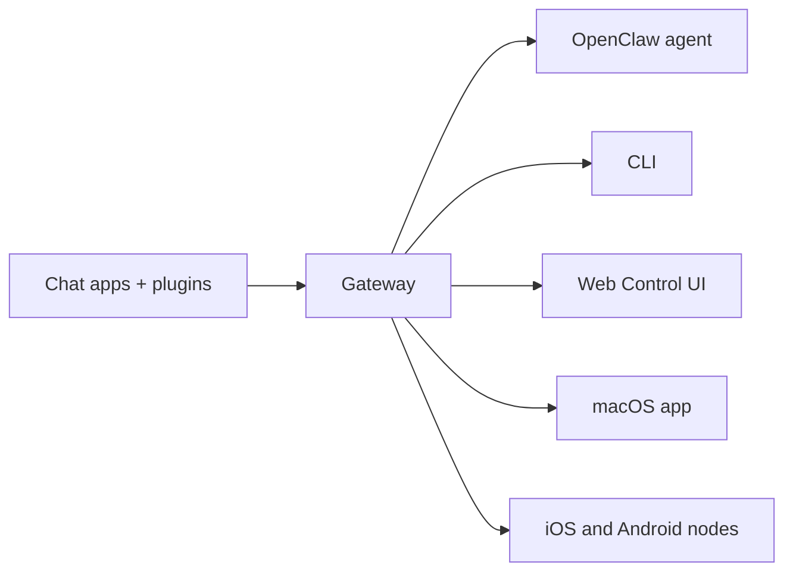

---
read_when:
    - تقديم OpenClaw للقادمين الجدد
summary: OpenClaw هو Gateway متعدد القنوات لوكلاء الذكاء الاصطناعي يعمل على أي نظام تشغيل.
title: OpenClaw
x-i18n:
    generated_at: "2026-06-27T17:48:28Z"
    model: gpt-5.5
    postprocess_version: locale-links-v1
    provider: openai
    source_hash: fcaa54a0a6d7aa62193fd9f03428bbcbfdcb2c00a184bcd6f49e4e093fefc473
    source_path: index.md
    workflow: 16
---

# OpenClaw 🦞

<p align="center">
    
    
</p>

> _"قشّر! قشّر!"_ — كركند فضائي، على الأرجح

<p align="center">
  <strong>Gateway لأي نظام تشغيل لوكلاء الذكاء الاصطناعي عبر Discord وGoogle Chat وiMessage وMatrix وMicrosoft Teams وSignal وSlack وTelegram وWhatsApp وZalo والمزيد.</strong><br />
  أرسل رسالة، واحصل على رد من وكيل من جيبك. شغّل Gateway واحدًا عبر القنوات المدمجة، وPlugins القنوات المرفقة، وWebChat، والعُقد المحمولة.
</p>

<Columns>
  <Card title="ابدأ" href="/ar/start/getting-started" icon="rocket">
    ثبّت OpenClaw وشغّل Gateway خلال دقائق.
  </Card>
  <Card title="شغّل التهيئة" href="/ar/start/wizard" icon="sparkles">
    إعداد موجّه باستخدام `openclaw onboard` وتدفقات الاقتران.
  </Card>
  <Card title="افتح واجهة التحكم" href="/ar/web/control-ui" icon="layout-dashboard">
    شغّل لوحة معلومات المتصفح للدردشة، والإعدادات، والجلسات.
  </Card>
</Columns>

## ما هو OpenClaw؟

OpenClaw هو **Gateway مستضاف ذاتيًا** يربط تطبيقات الدردشة وأسطح القنوات المفضلة لديك — القنوات المدمجة إضافةً إلى Plugins القنوات المرفقة أو الخارجية مثل Discord وGoogle Chat وiMessage وMatrix وMicrosoft Teams وSignal وSlack وTelegram وWhatsApp وZalo والمزيد — بوكلاء برمجة ذكاء اصطناعي. تشغّل عملية Gateway واحدة على جهازك الخاص (أو على خادم)، فتصبح الجسر بين تطبيقات المراسلة لديك ومساعد ذكاء اصطناعي متاح دائمًا.

**لمن هو؟** للمطورين والمستخدمين المتقدمين الذين يريدون مساعد ذكاء اصطناعي شخصيًا يمكنهم مراسلته من أي مكان — من دون التخلي عن التحكم في بياناتهم أو الاعتماد على خدمة مستضافة.

**ما الذي يجعله مختلفًا؟**

- **مستضاف ذاتيًا**: يعمل على عتادك، ووفق قواعدك
- **متعدد القنوات**: يخدم Gateway واحد القنوات المدمجة وPlugins القنوات المرفقة أو الخارجية في الوقت نفسه
- **مصمم للوكلاء**: مبني لوكلاء البرمجة مع استخدام الأدوات، والجلسات، والذاكرة، وتوجيه متعدد الوكلاء
- **مفتوح المصدر**: مرخّص برخصة MIT وتقوده المجتمعات

**ماذا تحتاج؟** Node 24 (موصى به)، أو Node 22 LTS (`22.19+`) للتوافق، ومفتاح API من المزوّد الذي تختاره، و5 دقائق. للحصول على أفضل جودة وأمان، استخدم أقوى نموذج من الجيل الأحدث متاحًا.

## كيف يعمل



Gateway هو مصدر الحقيقة الوحيد للجلسات، والتوجيه، واتصالات القنوات.

## القدرات الرئيسية

<Columns>
  <Card title="Gateway متعدد القنوات" icon="network" href="/ar/channels">
    Discord وiMessage وSignal وSlack وTelegram وWhatsApp وWebChat والمزيد عبر عملية Gateway واحدة.
  </Card>
  <Card title="قنوات Plugin" icon="plug" href="/ar/tools/plugin">
    تضيف Plugins المرفقة Matrix وNostr وTwitch وZalo والمزيد في الإصدارات الحالية العادية.
  </Card>
  <Card title="توجيه متعدد الوكلاء" icon="route" href="/ar/concepts/multi-agent">
    جلسات معزولة لكل وكيل، أو مساحة عمل، أو مُرسل.
  </Card>
  <Card title="دعم الوسائط" icon="image" href="/ar/nodes/images">
    أرسل واستقبل الصور، والصوت، والمستندات.
  </Card>
  <Card title="واجهة التحكم على الويب" icon="monitor" href="/ar/web/control-ui">
    لوحة معلومات في المتصفح للدردشة، والإعدادات، والجلسات، والعُقد.
  </Card>
  <Card title="العُقد المحمولة" icon="smartphone" href="/ar/nodes">
    اقرن عُقد iOS وAndroid لتدفقات عمل Canvas والكاميرا والصوت.
  </Card>
</Columns>

## البدء السريع

<Steps>
  <Step title="ثبّت OpenClaw">
    ```bash
    npm install -g openclaw@latest
    ```
  </Step>
  <Step title="أكمل التهيئة وثبّت الخدمة">
    ```bash
    openclaw onboard --install-daemon
    ```
  </Step>
  <Step title="ابدأ الدردشة">
    افتح واجهة التحكم في متصفحك وأرسل رسالة:

    ```bash
    openclaw dashboard
    ```

    أو صِل قناة ([Telegram](/ar/channels/telegram) هي الأسرع) وابدأ الدردشة من هاتفك.

  </Step>
</Steps>

هل تحتاج إلى إعداد التثبيت والتطوير الكامل؟ راجع [بدء الاستخدام](/ar/start/getting-started).

## لوحة المعلومات

افتح واجهة التحكم في المتصفح بعد بدء Gateway.

- الافتراضي المحلي: [http://127.0.0.1:18789/](http://127.0.0.1:18789/)
- الوصول عن بُعد: [أسطح الويب](/ar/web) و[Tailscale](/ar/gateway/tailscale)

<p align="center">
  
</p>

## التكوين (اختياري)

يوجد ملف التكوين في `~/.openclaw/openclaw.json`.

- إذا **لم تفعل شيئًا**، يستخدم OpenClaw وقت تشغيل وكيل OpenClaw المرفق مع جلسات لكل مُرسل.
- إذا أردت تقييده، فابدأ بـ `channels.whatsapp.allowFrom` وقواعد الإشارة (للمجموعات).

مثال:

```json5
{
  channels: {
    whatsapp: {
      allowFrom: ["+15555550123"],
      groups: { "*": { requireMention: true } },
    },
  },
  messages: { groupChat: { mentionPatterns: ["@openclaw"] } },
}
```

## ابدأ من هنا

<Columns>
  <Card title="مراكز التوثيق" href="/ar/start/hubs" icon="book-open">
    كل المستندات والأدلة، منظّمة حسب حالة الاستخدام.
  </Card>
  <Card title="التكوين" href="/ar/gateway/configuration" icon="settings">
    إعدادات Gateway الأساسية، والرموز، وتكوين المزوّد.
  </Card>
  <Card title="الوصول عن بُعد" href="/ar/gateway/remote" icon="globe">
    أنماط الوصول عبر SSH وtailnet.
  </Card>
  <Card title="القنوات" href="/ar/channels/telegram" icon="message-square">
    إعداد خاص بالقنوات لـ Feishu وMicrosoft Teams وWhatsApp وTelegram وDiscord والمزيد.
  </Card>
  <Card title="العُقد" href="/ar/nodes" icon="smartphone">
    عُقد iOS وAndroid مع الاقتران، وCanvas، والكاميرا، وإجراءات الجهاز.
  </Card>
  <Card title="المساعدة" href="/ar/help" icon="life-buoy">
    نقطة دخول للإصلاحات الشائعة واستكشاف الأخطاء وإصلاحها.
  </Card>
</Columns>

## تعلّم المزيد

<Columns>
  <Card title="قائمة الميزات الكاملة" href="/ar/concepts/features" icon="list">
    قدرات القنوات، والتوجيه، والوسائط كاملة.
  </Card>
  <Card title="توجيه متعدد الوكلاء" href="/ar/concepts/multi-agent" icon="route">
    عزل مساحة العمل وجلسات لكل وكيل.
  </Card>
  <Card title="الأمان" href="/ar/gateway/security" icon="shield">
    الرموز، وقوائم السماح، وضوابط السلامة.
  </Card>
  <Card title="استكشاف الأخطاء وإصلاحها" href="/ar/gateway/troubleshooting" icon="wrench">
    تشخيصات Gateway والأخطاء الشائعة.
  </Card>
  <Card title="نبذة وشكر" href="/ar/reference/credits" icon="info">
    أصول المشروع، والمساهمون، والترخيص.
  </Card>
</Columns>
