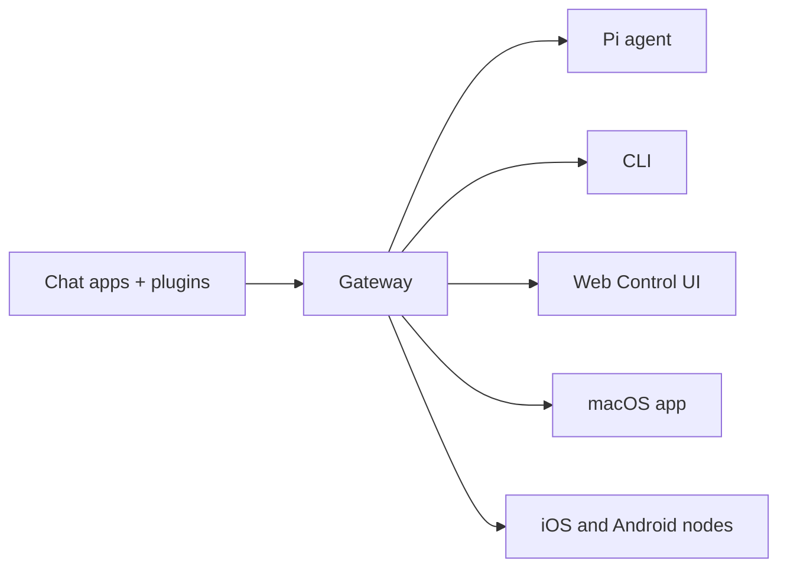

---
read_when:
    - تقديم OpenClaw إلى المستخدمين الجدد
summary: OpenClaw هو Gateway متعدد القنوات لوكلاء الذكاء الاصطناعي ويعمل على أي نظام تشغيل.
title: OpenClaw
x-i18n:
  refreshed_at: '2026-04-28T04:45:00Z'
    generated_at: "2026-04-22T04:23:57Z"
    model: gpt-5.4
    provider: openai
    source_hash: 923d34fa604051d502e4bc902802d6921a4b89a9447f76123aa8d2ff085f0b99
    source_path: index.md
    workflow: 15
---

# OpenClaw 🦞

<p align="center">
    
    
</p>

> _"قشِّر! قشِّر!"_ — جراد بحر فضائي، على الأرجح

<p align="center">
  <strong>Gateway لأي نظام تشغيل لوكلاء الذكاء الاصطناعي عبر Discord وGoogle Chat وiMessage وMatrix وMicrosoft Teams وSignal وSlack وTelegram وWhatsApp وZalo والمزيد.</strong><br />
  أرسل رسالة، واحصل على استجابة من وكيل من جيبك. شغّل Gateway واحدًا عبر القنوات المضمنة وPlugin القنوات المجمعة وWebChat وNodes الأجهزة المحمولة.
</p>

<Columns>
  <Card title="ابدأ" href="/ar/start/getting-started" icon="rocket">
    ثبّت OpenClaw وشغّل Gateway خلال دقائق.
  </Card>
  <Card title="شغّل الإعداد الأولي" href="/ar/start/wizard" icon="sparkles">
    إعداد موجّه باستخدام `openclaw onboard` وتدفقات الاقتران.
  </Card>
  <Card title="افتح واجهة التحكم" href="/web/control-ui" icon="layout-dashboard">
    شغّل لوحة المتصفح للدردشة والإعدادات والجلسات.
  </Card>
</Columns>

## ما هو OpenClaw؟

OpenClaw هو **Gateway مستضاف ذاتيًا** يربط تطبيقات الدردشة المفضلة لديك وأسطح القنوات — القنوات المضمنة بالإضافة إلى Plugin القنوات المجمعة أو الخارجية مثل Discord وGoogle Chat وiMessage وMatrix وMicrosoft Teams وSignal وSlack وTelegram وWhatsApp وZalo والمزيد — بوكلاء البرمجة بالذكاء الاصطناعي مثل Pi. تقوم بتشغيل عملية Gateway واحدة على جهازك الخاص (أو على خادم)، وتصبح هذه العملية الجسر بين تطبيقات المراسلة لديك ومساعد ذكاء اصطناعي متاح دائمًا.

**لمن هو؟** للمطورين والمستخدمين المتقدمين الذين يريدون مساعد ذكاء اصطناعي شخصيًا يمكنهم مراسلته من أي مكان — من دون التخلي عن التحكم في بياناتهم أو الاعتماد على خدمة مستضافة.

**ما الذي يميّزه؟**

- **مستضاف ذاتيًا**: يعمل على أجهزتك، ووفق قواعدك
- **متعدد القنوات**: يخدم Gateway واحد القنوات المضمنة بالإضافة إلى Plugin القنوات المجمعة أو الخارجية في الوقت نفسه
- **أصيل للوكلاء**: مصمم لوكلاء البرمجة مع استخدام الأدوات والجلسات والذاكرة والتوجيه متعدد الوكلاء
- **مفتوح المصدر**: بترخيص MIT ويقوده المجتمع

**ماذا تحتاج؟** Node 24 (موصى به)، أو Node 22 LTS ‏(`22.14+`) للتوافق، ومفتاح API من المزود الذي تختاره، و5 دقائق. للحصول على أفضل جودة وأمان، استخدم أقوى نموذج متاح من الجيل الأحدث.

## كيف يعمل



يُعد Gateway المصدر الوحيد للحقيقة فيما يتعلق بالجلسات والتوجيه واتصالات القنوات.

## الإمكانات الأساسية

<Columns>
  <Card title="Gateway متعدد القنوات" icon="network" href="/ar/channels">
    Discord وiMessage وSignal وSlack وTelegram وWhatsApp وWebChat والمزيد عبر عملية Gateway واحدة.
  </Card>
  <Card title="قنوات Plugin" icon="plug" href="/ar/tools/plugin">
    تضيف Plugins المجمعة Matrix وNostr وTwitch وZalo والمزيد في الإصدارات الحالية العادية.
  </Card>
  <Card title="توجيه متعدد الوكلاء" icon="route" href="/ar/concepts/multi-agent">
    جلسات معزولة لكل وكيل أو مساحة عمل أو مرسل.
  </Card>
  <Card title="دعم الوسائط" icon="image" href="/ar/nodes/images">
    أرسل واستقبل الصور والصوتيات والمستندات.
  </Card>
  <Card title="واجهة التحكم على الويب" icon="monitor" href="/web/control-ui">
    لوحة متصفح للدردشة والإعدادات والجلسات وNodes.
  </Card>
  <Card title="Nodes الأجهزة المحمولة" icon="smartphone" href="/ar/nodes">
    اقتران Nodes iOS وAndroid لسير العمل الممكّن بـ Canvas والكاميرا والصوت.
  </Card>
</Columns>

## البدء السريع

<Steps>
  <Step title="ثبّت OpenClaw">
    ```bash
    npm install -g openclaw@latest
    ```
  </Step>
  <Step title="نفّذ الإعداد الأولي وثبّت الخدمة">
    ```bash
    openclaw onboard --install-daemon
    ```
  </Step>
  <Step title="ابدأ الدردشة">
    افتح واجهة التحكم في متصفحك وأرسل رسالة:

    ```bash
    openclaw dashboard
    ```

    أو صِل قناة ([Telegram](/ar/channels/telegram) هو الأسرع) وابدأ الدردشة من هاتفك.

  </Step>
</Steps>

هل تحتاج إلى الإعداد الكامل للتثبيت والتطوير؟ راجع [البدء](/ar/start/getting-started).

## لوحة التحكم

افتح واجهة التحكم في المتصفح بعد بدء Gateway.

- الافتراضي المحلي: [http://127.0.0.1:18789/](http://127.0.0.1:18789/)
- الوصول البعيد: [أسطح الويب](/web) و[Tailscale](/ar/gateway/tailscale)

<p align="center">
  
</p>

## الإعدادات (اختياري)

توجد الإعدادات في `~/.openclaw/openclaw.json`.

- إذا **لم تفعل شيئًا**، فسيستخدم OpenClaw ملف Pi التنفيذي المجمّع في وضع RPC مع جلسات لكل مرسل.
- إذا أردت تشديده، فابدأ بـ `channels.whatsapp.allowFrom` و(بالنسبة إلى المجموعات) قواعد الإشارات.

مثال:

```json5
{
  channels: {
    whatsapp: {
      allowFrom: ["+15555550123"],
      groups: { "*": { requireMention: true } },
    },
  },
  messages: { groupChat: { mentionPatterns: ["@openclaw"] } },
}
```

## ابدأ من هنا

<Columns>
  <Card title="محاور التوثيق" href="/ar/start/hubs" icon="book-open">
    جميع المستندات والأدلة، منظمة حسب حالة الاستخدام.
  </Card>
  <Card title="الإعدادات" href="/ar/gateway/configuration" icon="settings">
    إعدادات Gateway الأساسية والرموز المميزة وإعدادات المزود.
  </Card>
  <Card title="الوصول البعيد" href="/ar/gateway/remote" icon="globe">
    أنماط الوصول عبر SSH وtailnet.
  </Card>
  <Card title="القنوات" href="/ar/channels/telegram" icon="message-square">
    إعدادات خاصة بالقنوات لـ Feishu وMicrosoft Teams وWhatsApp وTelegram وDiscord والمزيد.
  </Card>
  <Card title="Nodes" href="/ar/nodes" icon="smartphone">
    Nodes iOS وAndroid مع الاقتران وCanvas والكاميرا وإجراءات الجهاز.
  </Card>
  <Card title="المساعدة" href="/ar/help" icon="life-buoy">
    الإصلاحات الشائعة ونقطة الدخول إلى استكشاف الأخطاء وإصلاحها.
  </Card>
</Columns>

## تعرّف على المزيد

<Columns>
  <Card title="قائمة الميزات الكاملة" href="/ar/concepts/features" icon="list">
    الإمكانات الكاملة للقنوات والتوجيه والوسائط.
  </Card>
  <Card title="توجيه متعدد الوكلاء" href="/ar/concepts/multi-agent" icon="route">
    عزل مساحة العمل والجلسات لكل وكيل.
  </Card>
  <Card title="الأمان" href="/ar/gateway/security" icon="shield">
    الرموز المميزة وقوائم السماح وعناصر التحكم في الأمان.
  </Card>
  <Card title="استكشاف الأخطاء وإصلاحها" href="/ar/gateway/troubleshooting" icon="wrench">
    تشخيصات Gateway والأخطاء الشائعة.
  </Card>
  <Card title="حول المشروع والشكر" href="/ar/reference/credits" icon="info">
    أصول المشروع والمساهمون والترخيص.
  </Card>
</Columns>
